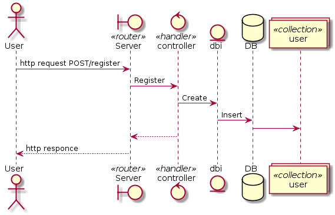
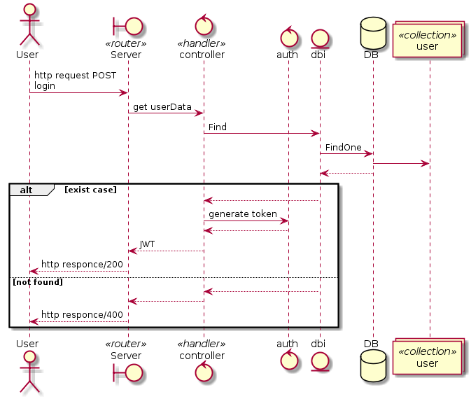
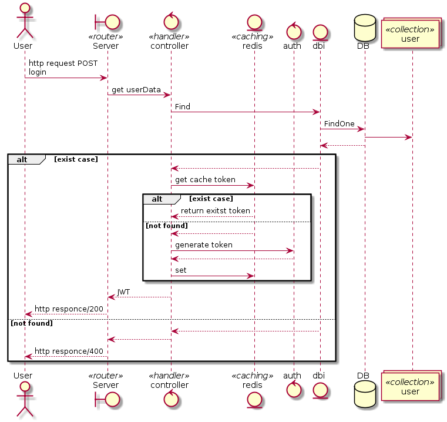

很高興有個機會製作面試前的測試作業，也就趁這個機會做個筆記以及學習紀錄。

## 前置作業

先點列一下項目需求：

### 基本需求

* based on golnag
* The API interface you provide can be any of the following：RESTful、json rpc、gRPC
* At least two sources
* When a source is unavailable, the result of its last successful ask is returned
* Use git to manage source code
* Write readme.md and describe what features, features, and TODO which have been implemented

### 額外可選

* Traffic limits, including the number of times your server queries the source, and the number of times the user queries you
* Good testing, annotations, and git commit
* An additional websocket interface is provided to automatically send the latest information whenever the market changes
* Users can choose to use an automatic source determination, the latest data source, or manually specify the source of the data
* Package it as a Dockerfile, docker-compose file, or kubernetes yaml
* There is a simple front-end or cli program that displays the results
* The API you provide has a corresponding file, such as a swagger, or simply a markdown file
* Other features not listed but that you thought would be cool to implement

這邊就必須要先打預防針了，**這篇僅為學習筆記**，並非正式教學。且，我只是 Golang 初學者，所以這篇內也不會出現什麼高等級的解法，甚至也是第一次實作介接 API 呢 (笑)。而 DB 以及 redis 都是直接以方便使用去寫 dbi 而已並無用抽象曾去封裝，也進而導致 unit test 十分困難先擱置了，有空才會再針對性重構，而此次就先將目標專注在 API 介接。

根據以上幾點，除了基本需求選擇使用 RESTful 的方式編寫之外，加分項目基本都在藍圖內，不過仍先選擇扣除 websocket 的額外項目。~~因為只有用過 python 寫過 websocket 的 client，深怕藍圖開太大影響排程。~~

### UML

所以首先需要做的就是畫圖 XD。身為一個社會新鮮人真的不知道業界有多少公司仍然還有畫圖的好習慣，總之先畫再說 (如過有誤可以在下方透過 github 登入後發 issue 給我)。

#### usecase


#### sequence

##### register



##### login



##### user get latest price


##### server get remote price


#### sequence diagram with caching mechanism

而視情況允許，最終希望能透過 redis 作為快取機制以減少 server 可能瘋狂存取 DB 的情況。

##### login with redis



##### user get latest price with redis


##### object diagram

以我目前對 golang 的所學，大部分時間不會用到甚至也沒有刻意去編寫成「這很 OO」的感覺，這次也因為部分需要才去嘗試 golang 中的 design pattern，故物件圖就沒開了，後續也要再視情況補上。

## 開發過程

### http server

首先當然是建立最基本可以提供前端/外部來打的 http server，使用 [ `gorilla/mux` ](https://github.com/gorilla/mux) 作為 router。也可以建立一個便於註冊 handler 的結構。

``` go
type route struct {
	Method     string
	Pattern    string
	Handler    http.HandlerFunc
	Middleware mux.MiddlewareFunc
}

var routes []route
```

接著透過 `init()` 讓外部在 import 時加載這些 handler 到全域變數上。

``` go
func init() {
  register("GET", "/", handler, nil)
  ...
}

func register(method, pattern string, handler http.HandlerFunc, middleware mux.MiddlewareFunc) {
	routes = append(routes, route{method, pattern, handler, middleware})
}
```

最後建立一個初始化函數來取得 router。這邊可以預先為後續 http middleware 做空間。

``` go
func NewRouter() *mux.Router {
	r := mux.NewRouter()
	for _, route := range routes {
		if route.Middleware == nil {
			r.HandleFunc(route.Pattern, route.Handler).Methods(route.Method)
		} else {
			r.Handle(route.Pattern, route.Middleware(route.Handler)).Methods(route.Method)
		}
	}
	return r
}
```

### database

所有取得的結果並不會直接傳給 client，而是會儲存在資料庫，方便做後續新增的服務，好比可以根據時戳做歷史紀錄等等。而這次挑選 mongo 而不是 ORM 主要是因為這些 service 都是很小的，物件之間彼此沒有關聯，僅需針對 key-value 去做儲存就好。所以選擇了 NoSQL 中的　mongoDB，套件則是採用官方支持的 [ `mongo-go-driver` ](https://github.com/mongodb/mongo-go-driver)。

而此次也有發現在最新版的 mongo 及 redis 都有用 context 來對 db 讀寫時對 go routine 的觸發超時，透過 `WithTimeOut` 可以進而確保不會超時，相關知識可以參考[這裡](https://draveness.me/golang/docs/part3-runtime/ch06-concurrency/golang-context/)。

``` go
ctx, cancle := context.WithTimeout(context.Background(), 10*time.Second)
// ensure cancle function will be executed
defer cancle()
client, err := mongo.Connect(ctx, clientOptions())
if err != nil {
	l.Fatal(err) // l for logrus
}
db.SetClint(client)
```

而這個 `clientOptions` 是用於 `docker-compose` 用的，可以 link 住另一個 container 的網路位置。

``` go
func clientOptions() *options.ClientOptions {
	host := "db"
	if os.Getenv("profile") != "prod" {
		host = "localhost"
	}
	return options.Client().ApplyURI(
		"mongodb://" + host + ":27017",
	)
}
```

### Register & Login

使用 [ `crypto/bcrypt` ](https://godoc.org/golang.org/x/crypto/bcrypt) 來編碼/解碼使用者的密碼在來存放到 DB 中，可以減緩發生[這個影片](https://youtu.be/kKti4SjMg3Q?t=145)中提到的 Drag 造成的後續問題。而當使用者登入後也可以透過 [ `dgrijalva/jwt-go` ](https://github.com/dgrijalva/jwt-go) 庫來返回一個 `JSON-Web-Token` ，後續使用這個 JWT 來存取服務。

``` go
func GenerateToken(user *models.User) (string, error) {
	token := jwt.NewWithClaims(jwt.SigningMethodHS256, jwt.MapClaims{
		"user_name": user.UserName,
	})
	return token.SignedString(secret)
}
```

### 取的遠端的 API

#### 解碼方案選擇

在實際編寫時，思考了一下拿回來的 JSON 要用何種方式來解碼比較有效率，首先針對 coinmarketcap 的[資料](https://coinmarketcap.com/api/documentation/v1/) 進行嘗試，該資料結構中很明顯是多層的 JSON。

``` json
{
    "status": {
		...
    },
    "data": [
        {
			...
            "quote": {
                "USD": {
					"price": 5050.98607739,
					...
                }
            }
        }
    ]
}
```

##### 方案一 JSON to struct

``` go
type coinmarketcapStatus struct {
	Timestamp string `json:"timestamp"`
}

type coinmarketcapUSD struct {
	Price float64 `json:"price"`
}

type coinmarketcapQuote struct {
	USD coinmarketcapUSD `json:"USD"`
}

type coinmarketcapData struct {
	Quote coinmarketcapQuote `json:"quote"`
}

type coinmarketcap struct {
	Status coinmarketcapStatus `json:"status"`
	Data   []coinmarketcapData `json:"data"`
}

func byUnmarshal(str string) float64 {
	var coin coinmarketcap
	err := json.Unmarshal([]byte(str), &coin)
	if err != nil {
		fmt.Errorf("Can not decode data: %v\n", err)
	}
	return coin.Data[0].Quote.USD.Price
}
```

##### 方案一 JSON to map

``` go
func byJSONToMap(str string) float64 {
	var mapResult map[string]interface{}
	err := json.Unmarshal([]byte(str), &mapResult)
	if err != nil {
		panic(err)
	}
	USD, _ := mapResult["data"].([]interface{})[0].(map[string]interface{})["quote"].(map[string]interface{})["USD"].(map[string]interface{})["price"]
	return USD.(float64)
}
```

然後構過 golang 內建的 benchmark `go test -bench=.`

``` go
func BenchmarkByUnmarshal(b *testing.B) {
	for i := 0; i < b.N; i++ {
		byUnmarshal(jsonStr)
	}
}

func BenchmarkByJSONToMap(b *testing.B) {
	for i := 0; i < b.N; i++ {
		byJSONToMap(jsonStr)
	}
}
BenchmarkByUnmarshal-4            141256             10535 ns/op
BenchmarkByJSONToMap-4            100056             20537 ns/op
PASS
ok      mondb_practice  4.076s
```

比較後發現轉換成結構用的時間少很多，儘管他需要用較多的 code 去定義結構。

#### 很多 API 要 call

這邊我採用工廠方法模式來解決多處要 call 的問題，詳細可以到[這邊](https://github.com/omegaatt36/btc-price-restful/tree/master/remote)來看源代碼，下面僅稍微舉例做法。

先寫一層抽象層來定義必須實作的方法(抽象的工廠)

``` go
type Response interface {
	GetUSD() float64
}

type responseAttribute struct {
	usd float64
}

type responseFactory interface {
	Create(string) (Response, error)
}
```

接著實作一個實際要產出產品的繼承類 (陸譯派生類?)

``` go
type CoinMarketCapFactory struct{}

func (CoinMarketCapFactory) Create(str string) (Response, error) {
	var cmc coinmarketcapResponse
	err := json.Unmarshal([]byte(str), &cmc)
	if err != nil {
		return nil, err
	}
	return &coinMarketCap{
		responseAttribute: &responseAttribute{
			usd: cmc.Data[0].Quote.USD.Price,
		},
	}, nil
}

type coinMarketCap struct {
	*responseAttribute
}
func (cmc coinMarketCap) GetUSD() float64 {
	return cmc.usd
}
```

接著就可以根據要分門別類以及要被共用的方法分開撰寫，就可以得到一個非常簡單的 APU 工廠了，往後有新的來源也僅需再加一個繼承類後，實作必要方法即可。

``` go
type API interface {
	GetUSD() float64
	GetSourceName() string
	GetLastestID() (primitive.ObjectID, error)
	CallRemote() error
	InsertDB() error
}

type responseAttribute struct {
	sourceName string
	usd        float64
	timestamp  string
	latestID   primitive.ObjectID
	authKey    string
}
```

### ticker

然而剛文中有提到，取得的資料不會回傳，使用者是拿取資料庫中的資料，那要如何觸發取得遠端 API 呢，可以使用  ticker，再把每個 API 要延遲的時間寫進 `config` 內，我選擇的是寫進自訂檔案 `APIconf.json` 內而沒有寫進 code 裡，也方便私人的 auth 不暴露在 github 上。

``` json
{
    "sourceName": {
        "auth":"auth token",
        "delay" : 300
    }
}
```

``` go
func InitAPIs() {
	for _, v := range apis {
		go runTicker(v)
    }
}

func runTicker(api API) {
	name := api.GetSourceName()
	d := time.Duration(time.Second * time.Duration(apiConfigs[name].Delay))
	ticker := time.NewTicker(d)
	defer ticker.Stop()
	for {
		<-ticker.C
		err := api.CallRemote()
		if err != nil {
			logrus.Info(err.Error())
			continue
		}
		err = api.InsertDB()
		if err != nil {
			logrus.Info(err.Error())
			continue
		}
		logrus.Debug("%s get new data", name)
	}
}
```

### 最重要的 service

緊接著把核心的，要讓外部 call 的服務迅速完成後綁到 router 上

``` go
func GetServiceMap(w http.ResponseWriter, r *http.Request) {
	keys, _ := db.RedisKeysByNameSpace(db.NSLatestAPI)
	utility.ResponseWithJSON(w, http.StatusOK, utility.Response{Result: utility.ResSuccess, Data: keys})
}
func GetLatestPrice(w http.ResponseWriter, r *http.Request) {
	result := make(map[string]models.Price)
	services := strings.Split(mux.Vars(r)["service"], ",")
	for _, service := range services {
		var price models.Price
		result[service] = price

	}
	utility.ResponseWithJSON(w, http.StatusOK, utility.Response{Result: utility.ResSuccess, Data: result})
}
```

### auth middleware

再透過上文中提到的 JWT 搭配 middleware 來驗證使用者，
也可以擴充來達到流量控制。

``` go
register("GET", "/getServiceMap", controllers.GetServiceMap, auth.TokenMiddleware)
register("GET", "/getLatestPrice/{service}", controllers.GetLatestPrice, auth.TokenMiddleware)

if route.Middleware == nil {
	r.HandleFunc(route.Pattern, route.Handler).Methods(route.Method)
} else {
	r.Handle(route.Pattern, route.Middleware(route.Handler)).Methods(route.Method)
}
```

### CORS

最後設定完跨網域就完成了

``` go
allowedHeaders := handlers.AllowedHeaders([]string{"Content-Type", "Authorization"})
allowedOrigins := handlers.AllowedOrigins([]string{"*"})
allowedMethods := handlers.AllowedMethods([]string{"GET", "POST", "OPTIONS"})
n.UseHandler(handlers.CORS(allowedHeaders, allowedOrigins, allowedMethods)(mux))
```
