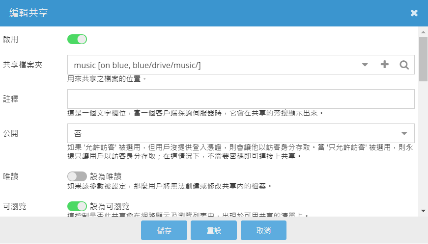
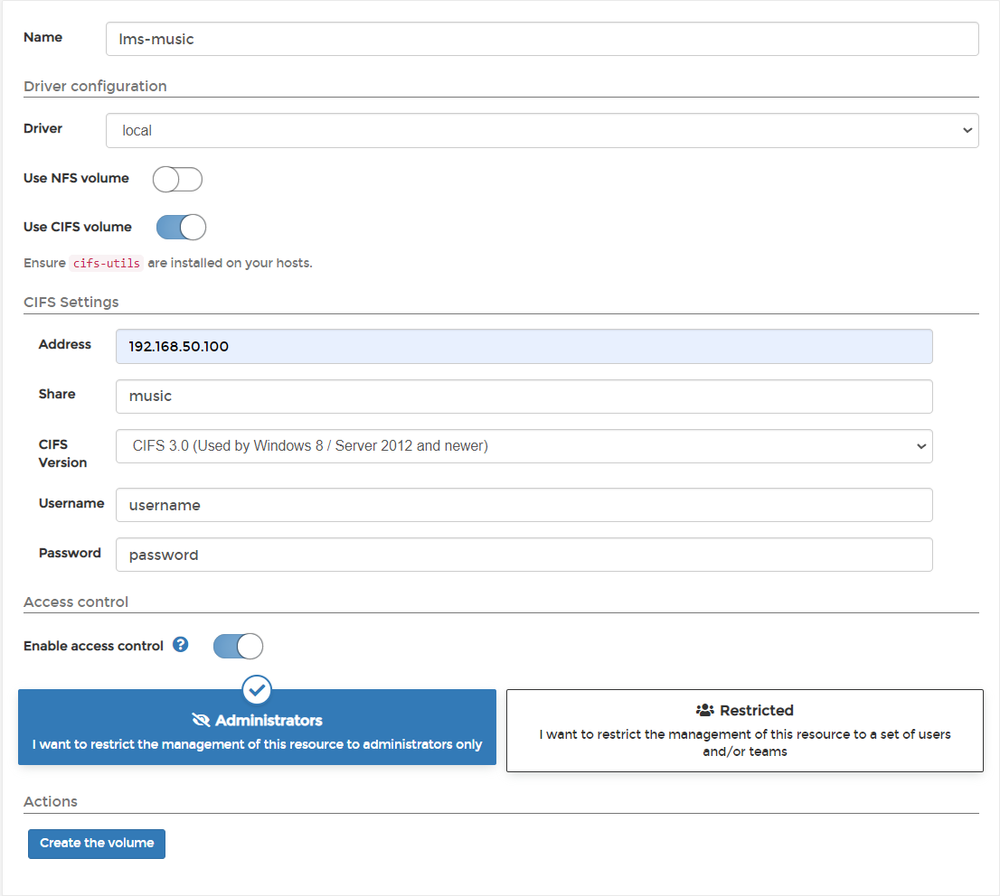
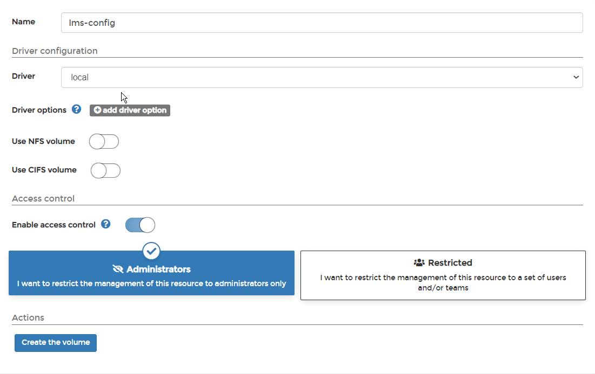
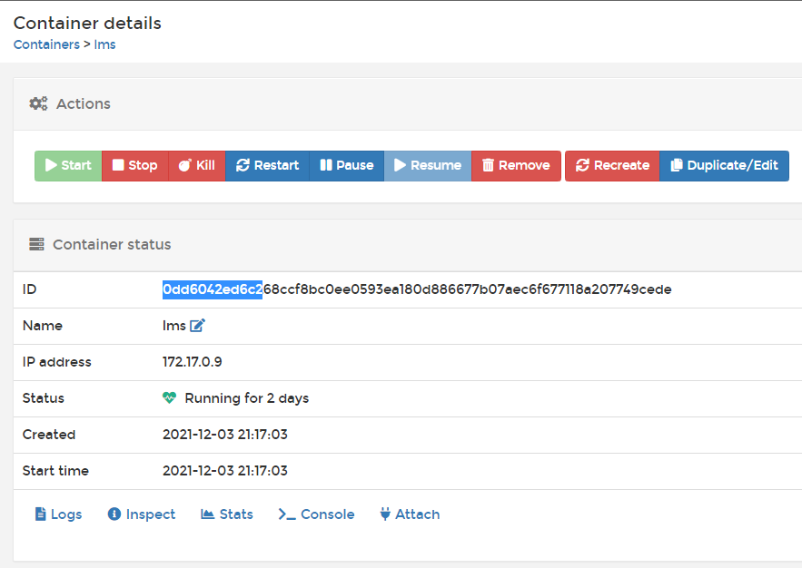
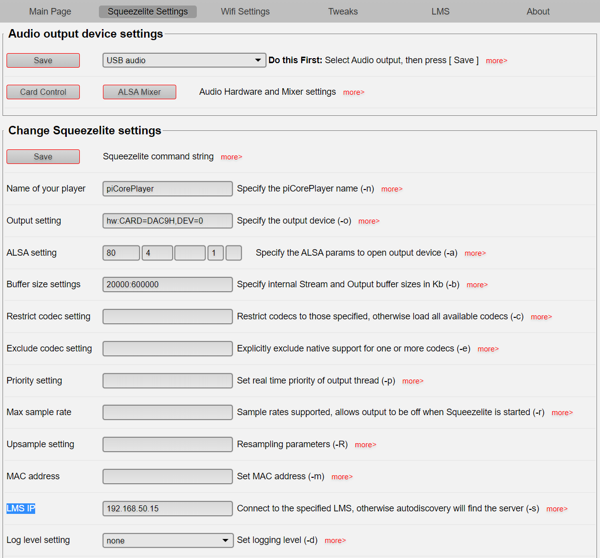
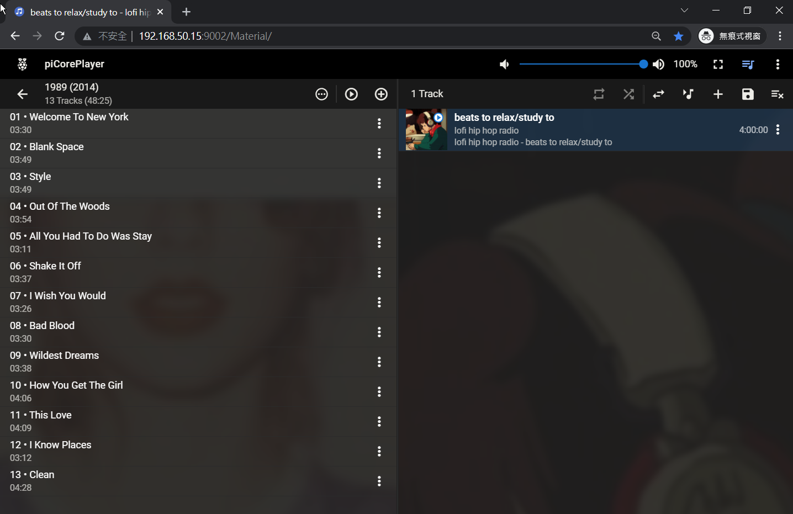
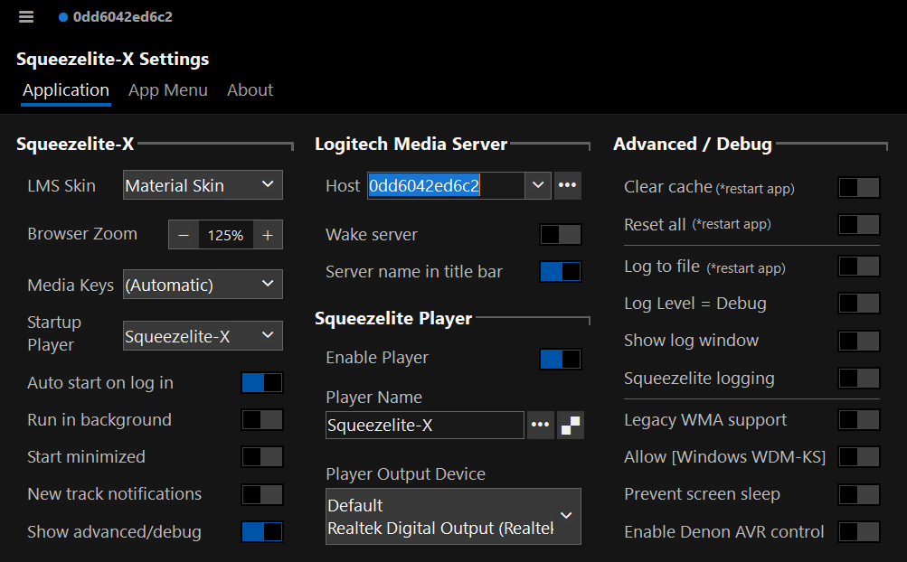

# 前言

雖然[官方 releases 頁面](https://docs.picoreplayer.org/releases/)似乎還沒發布，不過前一陣子把 piCorePlayer 升級到 8.1.0，看起來似乎還是 [unstable](https://forums.slimdevices.com/showthread.php?113353-Players-don-t-play-!-After-upgrading-8-0-1-to-8-1-0)，懶得倒版回去 8.0.0，趁這個機會把一直想玩的雙機留兜起來。

雙機顧名思義為 client 與 server 分開在兩台機器上，piCorePlayer 的 client 為 Squeezelite，server 則為 Logitech Media Server，事實上在 windows 上也有 client [Squeezelite-X](https://www.microsoft.com/zh-tw/p/squeezelite-x/9pbhmtnp9037)可以玩，預期中的最終成品將會是「三機流」吧 XD

# LMS 解決方案

採用 [lms community](https://hub.docker.com/u/lmscommunity) 的 docker image [lmscommunity/logitechmediaserver](https://hub.docker.com/r/lmscommunity/logitechmediaserver) 作為這次 server 端的 service。

# 安裝流程

此篇文章使用 portainer 作為 GUI 方便演示，若熟悉 docker 與 k8s 的可以自行下指令安裝。

1. 首先我把我的音樂都存放在 NAS 上，先將 music 資料夾給共享出來

2. 接著到 portainer 中建立三個 volume
  a. lms-music
    輸入在 NAS 分享出來的目錄與使用者、密碼，建立一個 cifs mounted volume
    
  b. lms-config
    
  c. lms-playlist
    
3. 接著到 stack 中，複製貼上官方的 [docker-compose](https://hub.docker.com/r/lmscommunity/logitechmediaserver)，若 portainer 已經佔用了 port `9000`，則需要更改暴露的 port `port:port/tcp` 並追加環境變數 `HTTP_PORT=port`，我最終的 stack 設定為:
  ```
  lms:
      image: lmscommunity/logitechmediaserver
      volumes:
        - lms-config:/config:rw
        - lms-music:/music:ro
        - lms-playlist:/playlist:rw
        - /etc/localtime:/etc/localtime:ro
        - /etc/timezone:/etc/timezone:ro
      ports:
        - 9002:9002/tcp
        - 9090:9090/tcp
        - 3483:3483/tcp
        - 3483:3483/udp
      environment:
        - HTTP_PORT=9002
      restart: always
  ```
4. 點下 `Deploy the stack 後就完成了`
5. 可以到 container 下看是否已經啟動完成了，並稍微記一下 container 的 hash，在稍後 windows 的設定中會出現。
  

# piCorePlayer 設定

進入到 piCorePlayer web 中的 `Squeezelite Settings` 設定頁面，並在 `LMS IP` 中輸入 portainer 的 ip 位置後點擊 Save，大功告成。



接著到 `portainer_id:9002` 中就可以看到 lms 的畫面了


# Squeezelite-X 設定

windows 中的 Squeezelite 設定更為簡單，到 Microsoft Store 取得並安裝 [Squeezelite-X](https://www.microsoft.com/zh-tw/p/squeezelite-x/9pbhmtnp9037)後打開，整個 logitech media service 似乎已經整合好 service discovery 了，直接在設定頁中的 `Host` 中看到剛剛起好的 docker container name


# 結語

lms 社群看起來還是有很多人在維護，設定起來十分簡單，數位流追求的就是方便
- 音樂存放在 NAS，透過 SMABA/CIFS 或 NFS 分享出來
- 單一 server 支援多平台 client
- 在 server 上甚至支援串流服務(youtuber)聽一些 unsourced music，
- 想享受乾淨音樂用樹莓派搭配 piCorePlayer
- 圖個方便可以在 windows 中透過 Squeezelite-X 連接
- 有 web 介面可以躺在沙方上透過手機選曲

玩起來還是挺好玩的
