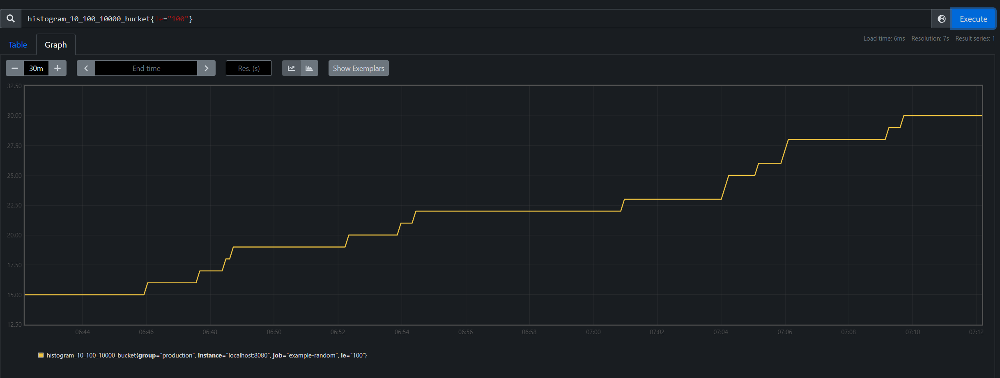
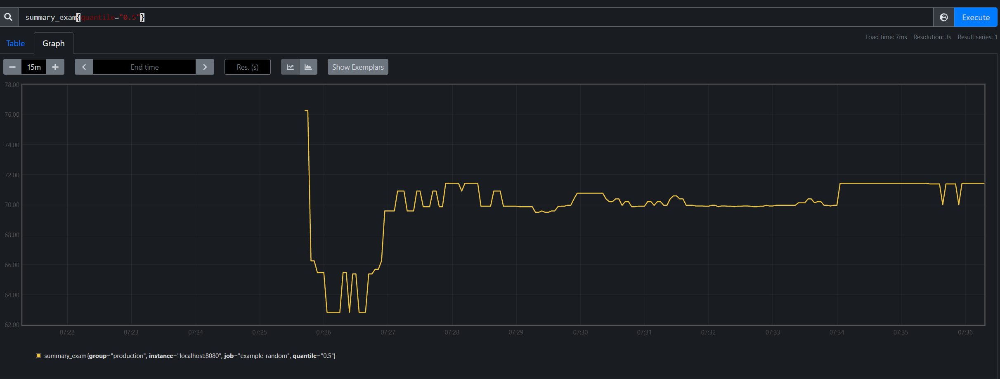

# Prometheus Overview

<iframe width="100%" height="512" src="https://www.youtube.com/embed/h4Sl21AKiDg" title="YouTube video player" frameborder="0" allow="accelerometer; autoplay; clipboard-write; encrypted-media; gyroscope; picture-in-picture" allowfullscreen></iframe>

## 架構


0. Exporter: 要被採集的目標 job 中曝露 metrics 的組件，負責轉換資訊成 prometheus 可解讀的格式。由於某些早於 prometheus 的 service 因為某些原因，不想主動在服務中曝露 metrics，故可以用一些額外的 exporter 將這些 service 中的 metrics 轉成 prometheus 格式，並曝露埠。
    - node exporter
    - mysql exporter
2. Push Gateway: 由於有些任務時間太短，可能不到 prometheus pull 的週期，可讓這些 jobs 主動把 metrics push 到這個 push gateway，好讓 premetheus server 可以 pull。
3. Prometheus Server
    - Retrieval(retrieval system): 主要負責 pull 指定的 target
        ```yaml
        # /etc/prometheus/prometheus.yml
        scrape_configs:
        - job_name: "prometheus"
          static_configs:
            - targets: ["localhost:9090"]
        - job_name: "node_exporter"
          static_configs:
            - targets: ["localhost:9100"]
        ```
    - TSDB: 時間序列資料庫，存放 pull 到的 metrics
    - HTTP Server: 為 PromeQL 查詢提供接口
4. Service Discovery:
    - kubernetes: 自動發現 k8s 中 pod 增加減少以及 probe 異動等等
    - file_sd: 通過 config 實現服務的自動發現
5. Alert Manager: 當 prometheus server 發現某某某 job 已經達到設定好的通知閾值進行通知的 service。
6. PromeQL: 無論是自帶 web UI 或是串接 Grafana，都是通過 http 進行 PromeQL 查詢後做視覺化處理 TSDB 中的時間序列資料。

## 資料結構

下面範例中會有更詳細說明

- Counter: 累加器，只會增加，例如 endpoint 請求次數
- Gauge: 數字，沒有變化限制，例如 cpu 使用率、溫度
- Histogram
- Summary

## Prometheus-Operator

Prometheus 作為一個核心的控制器，它會創建 Prometheus(Prometheus Server)、ServiceMonitor（抽象 Exporter）、AlertManager、prometheus-rule(監控規則)這四個資源(CRD)物件，Operator 會一直監控並維持這四個資源物件的狀態。監控 Prometheus 不需要每個服務單獨創建修改規則而是通過直接管理 Operator 來進行集群的監控。

Operator 是集群中的 deployment，相當於 Kubernetes 直接去監控資源物件。

- promcat
    - https://promcat.io/
    - https://sysdig.com/blog/promcat-prometheus-catalog/

1. exporter
    https://zhuanlan.zhihu.com/p/273229856

## Exporter Sample

使用 [client_golang](https://pkg.go.dev/github.com/prometheus/client_golang/prometheus) 作為範例。

### prometheus & promauto

```go
var (
	opsProcessed = prometheus.NewCounter(prometheus.CounterOpts{
		Name: "processed_ops_total",
		Help: "The total number of processed events by using prometheus.NewCounter()",
	})

	opsProcessedAuto = promauto.NewCounter(prometheus.CounterOpts{
		Name: "processed_ops_total_auto",
		Help: "The total number of processed events by using promauto.NewCounter()",
	})
)

func init() {
	prometheus.MustRegister(opsProcessed)
}

func main() {
	flag.Parse()

	go func() {
		for {
			opsProcessed.Inc()
			opsProcessedAuto.Inc()
			time.Sleep(1 * time.Second)
		}
	}()

	// Expose the registered metrics via HTTP.
	http.Handle("/metrics", promhttp.Handler())
	log.Fatal(http.ListenAndServe(*addr, nil))
}
```

可以看出，promauto 會直接進行 `MustRegister` 的動作，反而若是重複在 init() 中宣告 `prometheus.MustRegister(opsProcessed)` 的話會 runtime 錯誤: 重複註冊。

```go
func (f Factory) NewCounterVec(opts prometheus.CounterOpts, labelNames []string) *prometheus.CounterVec {
	c := prometheus.NewCounterVec(opts, labelNames)
	if f.r != nil {
		f.r.MustRegister(c)
	}
	return c
}
```

### Counter

累加器，可以提供一些諸如 response `2xx` 的計數。
```go
type Counter interface {
	Metric
	Collector

	// Inc increments the counter by 1. Use Add to increment it by arbitrary
	// non-negative values.
	Inc()
	// Add adds the given value to the counter. It panics if the value is <
	// 0.
	Add(float64)
}
```

### Gauge

可增減的數值型態，與 Counter 不同的是，可以透過 `Set(float64)` 直接設定程某個特定的數值，以及可以減少數值(Counter 只能增加)

```go
type Gauge interface {
	Metric
	Collector

	// Set sets the Gauge to an arbitrary value.
	Set(float64)
	// Inc increments the Gauge by 1. Use Add to increment it by arbitrary
	// values.
	Inc()
	// Dec decrements the Gauge by 1. Use Sub to decrement it by arbitrary
	// values.
	Dec()
	// Add adds the given value to the Gauge. (The value can be negative,
	// resulting in a decrease of the Gauge.)
	Add(float64)
	// Sub subtracts the given value from the Gauge. (The value can be
	// negative, resulting in an increase of the Gauge.)
	Sub(float64)

	// SetToCurrentTime sets the Gauge to the current Unix time in seconds.
	SetToCurrentTime()
}
```

### Histogram

```go
type Histogram interface {
	Metric
	Collector

	Observe(float64)
}
```

會同時產生下面三種指標
- 在每個採樣點進行統計，棒將數值存在放最初宣告的 bucket 中
- 採樣點加總(sum)
- 採樣次數加總(count)

需注意的是採集點區間未必是固定時間，可以由 timer 觸發也可以是某個事件觸發採集(`Histogram.Observe(float64)`)

```go
var (
	randHistogram = promauto.NewHistogram(prometheus.HistogramOpts{
		Name:    "histogram_10_100_10000",
		Help:    "test for histogram",
		Buckets: []float64{10, 100, 10000},
	})
)
```

宣告了一個 histogram `histogram_10_100_10000`，buckets 為 `[]float64{10, 100, 10000}`

若是線性的話也可以用 `prometheus.LinearBuckets(min, step, max)`

即是他會協助統計 [-,10] [-,100] [-,10000] [-,-] 這幾種數據並分別存放進對應的 bucket 中

執行後可以看到
```
# HELP histogram_10_100_10000 test for histogram
# TYPE histogram_10_100_10000 histogram
histogram_10_100_10000_bucket{le="10"} 1
histogram_10_100_10000_bucket{le="100"} 6
histogram_10_100_10000_bucket{le="10000"} 408
histogram_10_100_10000_bucket{le="+Inf"} 408
histogram_10_100_10000_sum 2.0347491572582524e+06
histogram_10_100_10000_count 408
```

意思為，針對 408 個採集點，其中有 1 次小於等於 10、6 小於等於 100、408 次小於等於 10000，
若想知道大於10小於等於100的只要將 `histogram_10_100_10000_bucket{le="100"}` 減去 `histogram_10_100_10000_bucket{le="10"}` 就可以知道是 5。




也可以更進一步透過 `rate(histogram_10_100_10000_bucket{le="100"}[1m])` 去查詢每分鐘平均小於100的出現次數。


### Summary


更改了 metric 為 summary

```go
var (
	examResutSummary = promauto.NewSummary(prometheus.SummaryOpts{
		Name:       "summary_exam",
		Help:       "test for summary",
		Objectives: map[float64]float64{0.5: 0.05, 0.9: 0.01, 0.99: 0.001},
		MaxAge:     time.Minute * 30,
	})
)
```

`0.5: 0.05` 的意思為，50% +- 5%，

定義了 quantile(原指四分位數，在 prometheus 中指的是百分位數 percentage)，

### Histogram vs Summary

- Histogram 每次 Observe 均指將數值放進對應的 bucket，而 Summary 會存放完整數據，在每一次 Observe 時都會抓出來全部重算一次百分位距。
- Summary 的百分位是提前在 client 指定的，在 server 不能直接查詢未指定的分位數。而 Histogram 可以透過 promql 随便指定，雖然在計算上不如 Summary 精確，卻降低 client loading 以及提升查詢靈活性。


零個標準差: summary_exam{quantile="0.5"}


近於三個標準差: summary_exam{quantile="0.99"}


### Vector

vector 並不是一個資料結構，僅僅是方便針對單一 metric name，用不同 lable 的方式記錄不同採樣數值。

```go
vector = promauto.NewGaugeVec(
    prometheus.GaugeOpts{
        Name: "guage_vector",
        Help: "test for gauge vector",
    },
    []string{"service"},
)

go func() {
    for {
        vector.WithLabelValues("add_1").Add(1)
        vector.WithLabelValues("add_2").Add(2)
        time.Sleep(1 * time.Second)
    }
}()
```

```
# HELP guage_vector test for gauge vector
# TYPE guage_vector gauge
guage_vector{service="add_1"} 9
guage_vector{service="add_2"} 18
```
