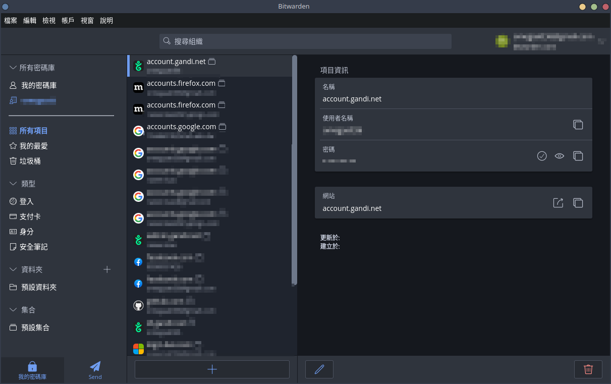
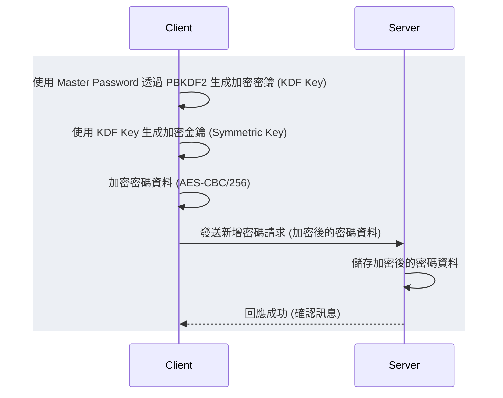
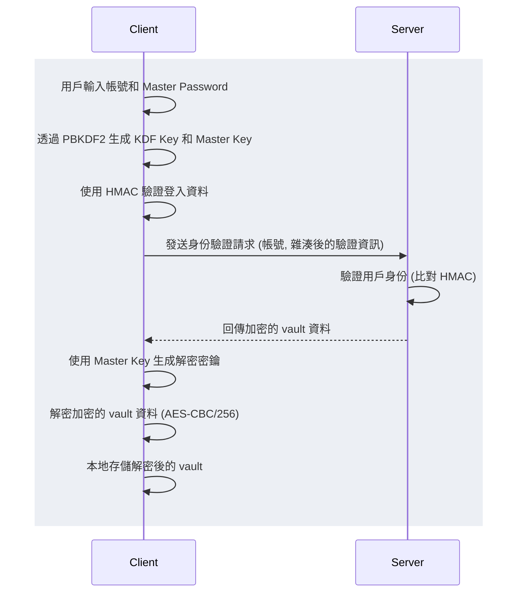
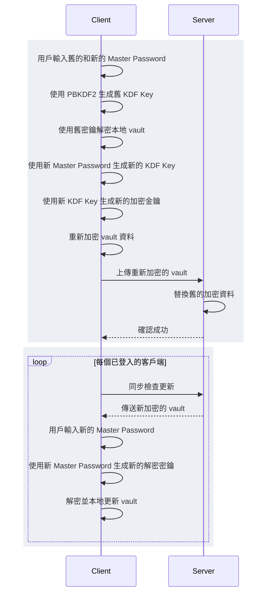
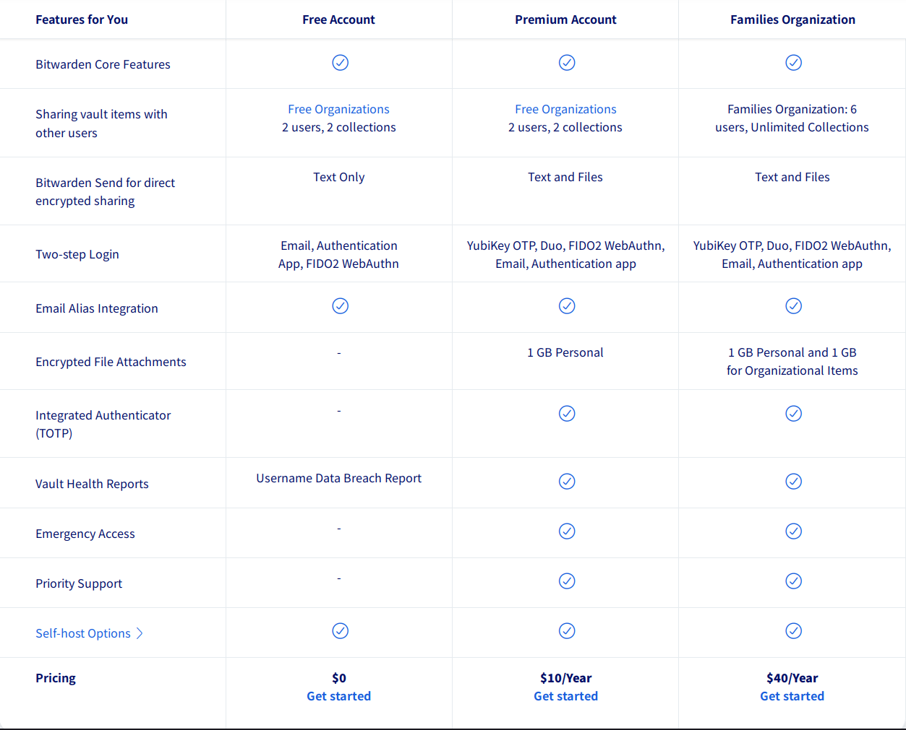
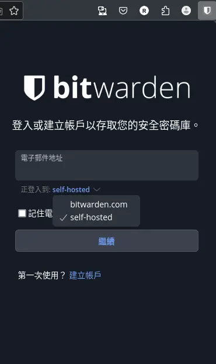
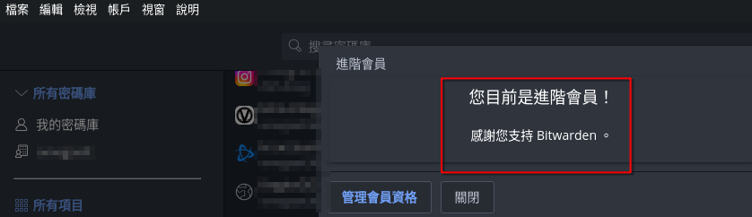
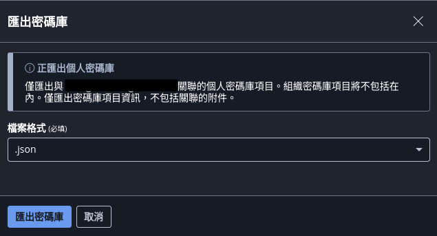

在尋覓有哪些 self-hosted 專案好玩時，偶然發現了 1password、LastPass 的開源替代方案，甚至後端資料庫能自架，決定架來用用看。

為什麼要自架？完全控制資料、隱私考量、或者純粹是學習和折騰 (符合 self-hosted 精神)。但控制權也意味著責任，特別是安全和備份。

這篇會專注在使用 Bitwarden 客戶端搭配輕量級的 Vaultwarden 後端。

# 使用 Bitwarden 來管理密碼

[](https://bitwarden.com/products/personal/)

Bitwarden 是一款流行且功能強大的密碼管理工具，它提供了一個安全的方法來存儲和管理所有密碼。作為一個開源產品，Bitwarden 允許用戶選擇自行托管其服務，這意味著用戶可以在自己的服務器上運行 Bitwarden，從而更好地控制自己的數據安全。

## Bitwarden 的特點



- **安全性**: Bitwarden 使用端到端加密，確保只有您可以訪問您的密碼。
- **跨平台支持**: 支持 Windows、macOS、Linux、Android 和 iOS。
- **易於使用**: 提供直觀的用戶界面和簡單的操作流程。
- **開源**: 開源，增加了透明度和安全性。

Bitwarden 同時[支援基於時間的一次性密碼](https://bitwarden.com/help/authenticator-keys/)，讓 TOTP 也能自動填入。也能透過 [github.com/scito/extract_otp_secrets](https://github.com/scito/extract_otp_secrets) 來提取 Google Authenticator 內的 2FA 資訊，儲存進 Bitwarden 中。

[Bitwarden 開源了 client 與 server](https://github.com/bitwarden)，在 server 端的選擇有以下：

1. 使用 Bitwarden 提供的官方服務，又分為免費跟付費，但這個選擇就跟 1p 沒太多區別。
2. 自架 Bitwarden 提供的 [open source server](https://github.com/bitwarden/server)，由於是使用 C# 與 mssql，吃的記憶體著實太多。
3. 自架 Bitwarden 相容的後端，我採用的是 rust 實做的 [Vaultwarden](https://github.com/dani-garcia/vaultwarden)，搭配 sqlite，記憶體使用量與官方的 C# 不是一個量級的。

## Bitwarden 架構

bitwarden 的 local storage 都是儲存加密後的密碼資料，不會使用明碼儲存，故上傳到 server 上的也僅僅是加密後的密碼資料。

### master password

master password 是 bitwarden 的基礎密碼，可以用來加密其他密碼資料，也可以用來登入 bitwarden 的 web 介面。每一個密碼加密均會有 master password 的參與，故 master password 必須選用容易記住、難以攻剋的密碼。可以使用官方的[密碼強度檢查工具](https://bitwarden.com/password-strength/)。

### 儲存密碼



### 新的 client 登入

在 bitwarden 內，可以由多個 client 登入，使用同一個 master password 即可登入。



### 更改 master password



## Pricing

個人使用的話，若僅需儲存個人密碼與信用卡、身份等純文字資訊，則免費版本已經夠用了，不需要付費。若需要額外的檔案加密、硬體加密、多個組織等等，則需要支付一定的費用。

但如此佛心的開源項目，也鼓勵大家即便自架後端，也仍可以付費訂閱以已支持團隊持續開發與維運，Premium Account 一年 10USD，也並不是一個很大的費用。



## 使用 Vaultwarden 作為自托管後端

官方的 Bitwarden Server 是用 C# 和 MSSQL 寫的，資源消耗較大，設定也相對複雜。

[Vaultwarden](https://github.com/dani-garcia/vaultwarden) (以前叫 bitwarden_rs) 是社群用 Rust 寫的相容後端，極度輕量，通常搭配 SQLite (也支援 MySQL/PostgreSQL)，資源佔用非常小，跑在 Raspberry Pi 上都沒問題。它還順便解鎖了官方需要付費才能用的功能，像是 TOTP、組織功能等 (雖然個人用可能不太需要組織)。對於 self-hoster 來說，Vaultwarden 幾乎是首選。

### 步驟一：Vaultwarden 服務器

可以參考 [Vaultwarden 的 wiki](https://github.com/dani-garcia/vaultwarden/wiki/Deployment-examples)，官方有現成的 docker image。
愛折騰的我還是選擇將他包進 [helm chart](https://github.com/omegaatt36/lab/tree/main/k8s/vaultwarden) 內部署到 k8s cluster 內方便管理。
vaultwarden 的 wiki 頁十分完整，smtp 等設定都是透過環境變數控制。

### 步驟二：Bitwarden 客戶端

到 Bitwarden 上查看所有[客戶端](https://bitwarden.com/download/)

我自己是只在瀏覽器、手機上安裝 Bitwarden 客戶端：

- [chrome extension](https://chromewebstore.google.com/detail/bitwarden-free-password-m/nngceckbapebfimnlniiiahkandclblb)
- [firefox addon](https://addons.mozilla.org/zh-TW/firefox/addon/bitwarden-password-manager/)
- [Android](https://play.google.com/store/apps/details?id=com.x8bit.bitwarden)
- [iOS](https://apps.apple.com/us/app/bitwarden-password-manager/id1137397744)
- [Linux Flatpak](https://flathub.org/apps/com.bitwarden.desktop)

需要設定它連接到自己的 Vaultwarden 服務器。

1. 在 Bitwarden 客戶端中，這邊以 firefox extension 為例，點擊「正在登入到」，並選擇 self-hosted。
   
2. 在 "服務器 URL" 中輸入 Vaultwarden 服務器地址。
3. 登錄或創建一個新的帳戶。

### 步驟三：開始使用

設定完成後，就可以開始使用來管理密碼了，所有的密碼都會儲存在自己的服務器上。在 bitwarden 內唯一可以用來辨識是否已經套用 vaultwarden 的方式，是打開帳戶->進階會員，若是看到已經是升級帳戶，則表達已經套用。



也可以使用 bitwarden 的 cli 來在 linux 上管理密碼，可以參考 [bitwarden-cli](https://github.com/dani-garcia/bitwarden-cli)。

例如可以用來 mount nas：

```bash
❯ sudo mount.cifs -o \
  $(bw get item xxxxxxxx-xxxx-4xxx-xxxx-xxxxxxxxxxxx | \
  jq -r '.login | "username=\(.username),password=\(.password)"') \
  //IP/nas /mnt/nas
? Master password: [hidden]
[sudo] password for root:
```

### 步驟四：備份

#### 通用備份

無論是使用 bitwarden 官方 server 還是自架的 vaultwarden，都可以在應用程式內匯出「明碼」或「加密後」的密碼備份檔案，從檔案->會出密碼庫，並輸入 master password 來解密，即可將備份檔案匯出至硬碟。



```json
{
  "encrypted": false,
  "folders": [],
  "items": [
    {
      "passwordHistory": null,
      "revisionDate": "2023-11-11T07:52:23.560Z",
      "creationDate": "2023-11-11T07:52:23.560Z",
      "deletedDate": null,
      "id": "xxxxxxxx-xxxx-4xxx-xxxx-xxxxxxxxxxxx", // UUID v4
      "organizationId": null,
      "folderId": null,
      "type": 1,
      "reprompt": 0,
      "name": "Google Raiven 55688",
      "notes": null,
      "favorite": false,
      "login": {
        "fido2Credentials": [],
        "uris": [
          {
            "match": null,
            "uri": "https://www.google.com"
          }
        ],
        "username": "raiven55688",
        "password": "raiven55688", // 明碼
        "totp": null
      },
      "collectionIds": null
    }
  ]
}
```

#### vaultwarden backup

Valutwarden 會將密碼儲存在 sqlite 資料庫中，可以使用 sqlite 工具來匯出備份。或是使用 [github.com/ttionya/vaultwarden-backup](https://github.com/ttionya/vaultwarden-backup) 來協助我們自動備份密碼。

會使用 Rclone 來備份，也可以直接使用 docker 來 mount vaultwarden 的資料庫上，可以參考[文件](https://github.com/ttionya/vaultwarden-backup?tab=readme-ov-file#automatic-backups)：

```bash
docker run -d \
  --restart=always \
  --name vaultwarden_backup \
  --volumes-from=vaultwarden \
  --mount type=volume,source=vaultwarden-rclone-data,target=/config/ \
  -e DATA_DIR="/data" \
  ttionya/vaultwarden-backup:latest
```

## 自架的負擔：安全與備份


*   HTTPS 是基本要求，必備。
*   保持 Vaultwarden 和反向代理更新到最新版本。
*   考慮使用 Fail2ban 監控反向代理的 log，防止暴力破解 `/admin` 或登入頁面。
*   定期檢查 Vaultwarden admin 頁面的診斷訊息。
*   備份：極度重要！Master Password 丟了神仙難救，在 reddit 上也不乏出現類似議題，同樣的伺服器掛了、資料丟了也很慘。

自架 Vaultwarden 提供了對密碼管理的完全控制，同時享受 Bitwarden 優異的客戶端體驗和幾乎全部的「付費」功能。代價是你需要自己負責伺服器的安全、維護和備份。對於喜歡掌控自己數據、有能力維護服務的人來說，這是個絕佳方案。如果對維護沒信心，或者 Master Password 丟了會崩潰，那可能官方的付費服務或 1Password 等商業方案更適合。
