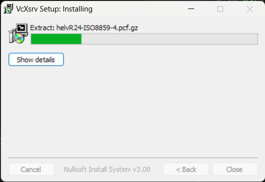
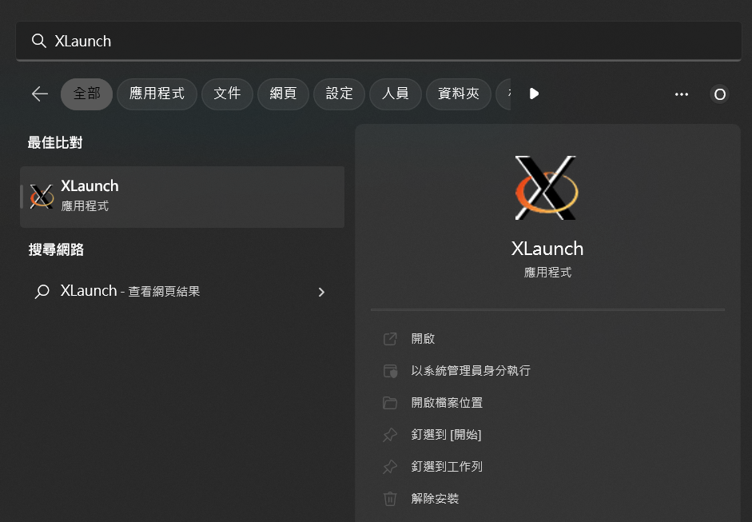
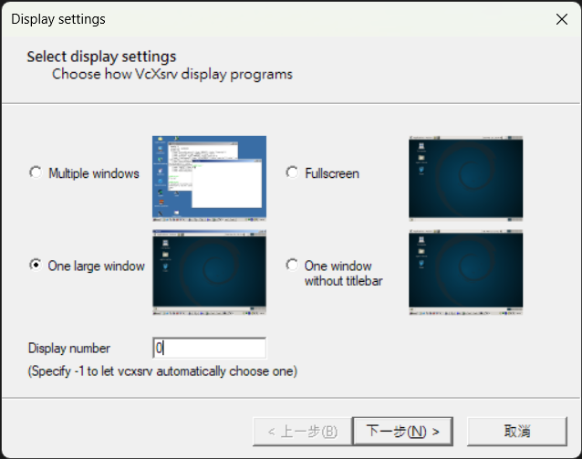
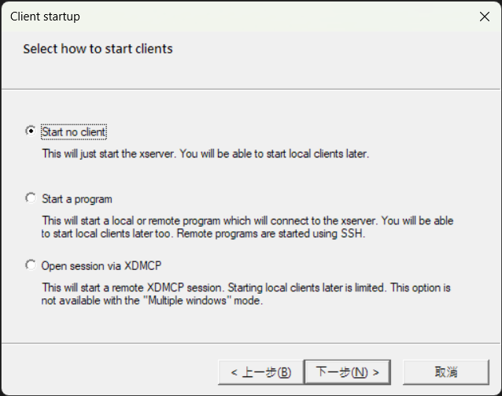
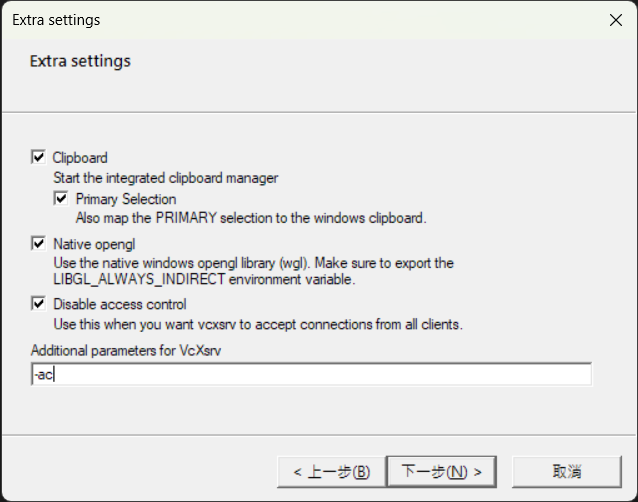
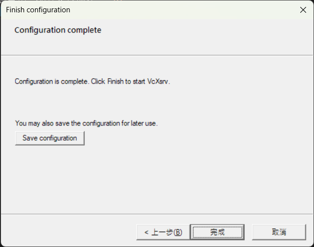
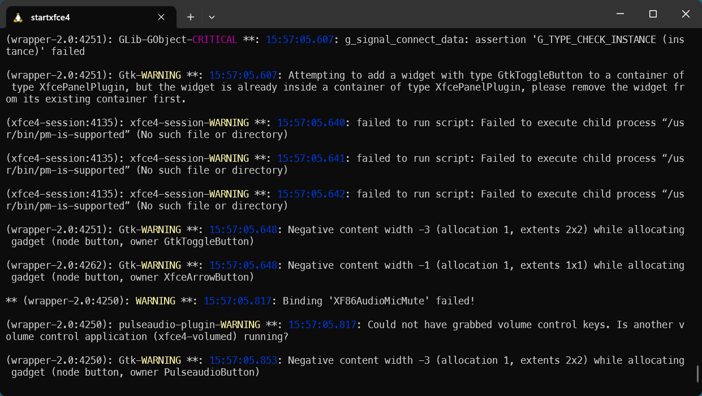
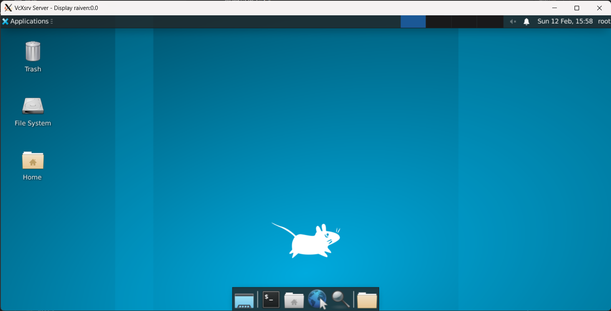

由於先前將 raspberry pi 4b 給賣掉了，[bmx280](https://github.com/omegaatt36/bmx280/tree/main/raspberrypi) 中基於 bme280 而產生的 exporter 因此失去戰鬥能力，藉此玩玩 [tinygo](https://tinygo.org/)，透過 serial port 透過 raspberry pi pico 對 bme280 讀取溫溼度。在開發過程中發現，WSL 中，command line 輸入:
```shell
GOOS=windows go run main.go
```
這樣會吃 windows 的環境，比如讀 serial port 需要 COM port，這樣就不是去讀 /dev/ttyS4 而是讀 COM4，這 cross compile 也太方便了吧...。

後續在工作上接收了需要寫一個 websocket server/client，而 client 需要:
- 有圖形化最好 (TUI or GUI)
- 跑在 windows 桌面上

，開發過程中再次感受到 cross compile 的方便，有點慶幸是在這個一個方便的時代學習敲鍵盤(?

## Requirement

- Golang 1.16+ ()
- Docker or Podman

## 在 WSL 中建立 X Window System 環境

因為我的 Golang 環境是基於 WSL，於是我需要先準備在 WSL 中能跑的 GUI 環境。
在 Unix like 使用的 GUI 被稱之為 [X Window System 或 X11 或 X](https://en.wikipedia.org/wiki/X_Window_System)，以所需的情形來說即是需要在 Windows 中啟動 X server，來與 WSL 中的 X client 連線。

1. 安裝 X11 測試套件以及 xfce4 桌面
    ```bash
    sudo apt install x11-apps xfce4-terminal xfce4
    ```
    如果有些套件找不到，可以加上 `--fix-missing`
    ```bash
    sudo apt install x11-apps xfce4-terminal xfce4 --fix-missing
    ```
2. 根據不同的 shell 寫入不同的 rc file e.g. `.zshrc`
    ```bash
    vim ~/.zshrc

    # set DISPLAY to use X terminal in WSL
    # in WSL2 the localhost and network interfaces are not the same than windows
    if grep -q WSL2 /proc/version; then
        # execute route.exe in the windows to determine its IP address
        # DISPLAY=$(route.exe print | grep 0.0.0.0 | head -1 | awk '{print $4}'):0.0
        DISPLAY=$(cat /etc/resolv.conf | grep nameserver | awk '{print $2}'):0.0
        LIBGL_ALWAYS_INDIRECT=1
    else
        # In WSL1 the DISPLAY can be the localhost address
        if grep -q icrosoft /proc/version; then
            DISPLAY=127.0.0.1:0.0
        fi
    fi
    ```
3. 記得重新讀取 rc file
    ```bash
    source ~/.zshrc
    ```
4. 下載並安裝 [VcXsrv Windows X Server](https://sourceforge.net/projects/vcxsrv/)
    
5. 在 Windows 中啟動 X server。
    1. 啟動 XLaunch
    
    2. 選擇 One large window，以及 Display Number: 0
        
    3. 選擇 Start no client
        
    4. 三個全勾，額外參數輸入 `-ac`
        
    5. 接著點選完成會跳出一個全黑的畫面，這樣就完成 X server 啟動了。
        
6. 回到 WSL 中輸入 `startxfce4` 啟動 xfce4 桌面
    ```bash
    startxfce4
    ```
    若噴錯 `cannot open display: wayland-0`，可以嘗試
    ```bash
    sudo startxfce4
    ```
    
    
7. 看到桌面環境其實已經代表連線成功了，我們可以執行 `xeyes` 來跑跑看桌面軟體。
    ```bash
    xeyes
    ```
    若找不到 xeyes，則是 x11-apps 沒有安裝完成
    ```bash
    sudo apt install x11-apps
    ```

## Docker

在 Windows 中習慣使用 [Docker Desktop](https://www.docker.com/products/docker-desktop/)，直接都照著官方下載就可以了。

## fyne

這篇僅測試 fyne 的安裝、執行，詳細實作可以看下一篇《實作篇》

安裝編譯需要的模組
```bash
sudo apt install gcc libgl1-mesa-dev xorg-dev
```

使用官方的 demo 來測試:
```bash
git clone https://github.com/fyne-io/fyne.git
cd fyne
go mod tidy
GOOS=windows go run cmd/fyne_demo/main.go
```
