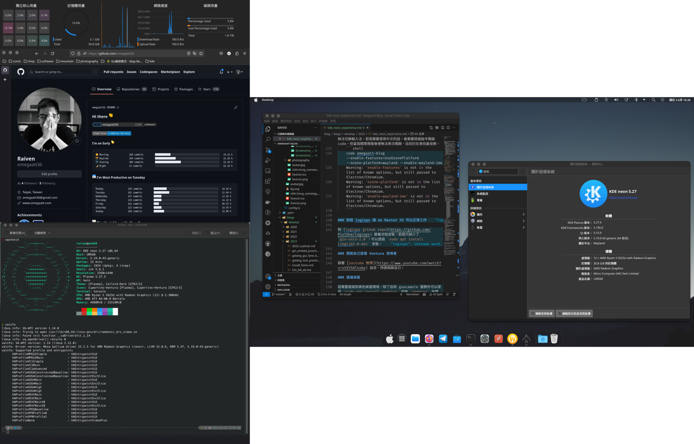

## 前言

年初為了 [arc browser](https://arc.net/) 裝了一台 Hackintosh，因為原因又花了點時間裝了 [KDE Neon](https://neon.kde.org/)，這邊紀錄一下使用心得與踩雷紀錄。時間線大概是
- 快快樂樂使用 wsl2
- wsl 中踩了不少坑，想要嘗試 unix liked 的系統
- 好心人提供 arc browser 的邀請，萌生了裝 Hackintosh 的念頭
    - 在 HP Z2 G4 上裝了 Hackintosh，但是沒有事前做足功課，內顯圖形記憶體(P630)始終是 7mb
    - 買了張 amd WX4100 督上去，大幅提昇圖形性能，卻也沒再花時間繼續深入
- 嘗試在 windows 主機上雙系統 (windows + linux):
    - 一開始直接選擇熟悉的 ubuntu，安裝了 ubuntu desktop 版本，由於是 nvidia 顯示卡，很快的遇到了硬體解碼問題
    - 開始嘗試 [nvidia-vaapi-driver](https://github.com/elFarto/nvidia-vaapi-driver)，但是遇到了很多問題，最後放棄
    - 想換到 amd 顯示卡，但是又不想花錢，於是想說看看其他發布版是否能解決
    - 從 Linux Mint, Manjaro, KEO Neon 中選擇了同樣是 ubuntu 底，卻是 KDE 團隊維護團隊的 KDE Neon
    - 不出意外的一樣遇到了 nvidia 驅動問題，雖然 firefox 已經可以順利硬體加速，但是 chromium 等仍然無法硬體加速
    - 這時候已經花了不少時間在這個問題上，於是決定換到 amd 顯示卡(內顯)
    - 在 Minisforum UM560 上安裝了 KDE Neon，一切順利，驅動毫無問題，硬體加速也正常
    - 嘗試裝了 ventura theme，讓他稍微好看一點
- 持續與 wayland 相處，走一步是一步...

```shell
❯ neofetch
             `..---+/---..`                raiven@um560
         `---.``   ``   `.---.`            ------------
      .--.`        ``        `-:-.         OS: KDE neon 5.27 x86_64
    `:/:     `.----//----.`     :/-        Host: UM560
   .:.    `---`          `--.`    .:`      Kernel: 5.19.0-43-generic
  .:`   `--`                .:-    `:.     Uptime: 1 hour, 2 mins
 `/    `:.      `.-::-.`      -:`   `/`    Packages: 1924 (dpkg), 4 (snap)
 /.    /.     `:++++++++:`     .:    .:    Shell: zsh 5.8.1
`/    .:     `+++++++++++/      /`   `+`   Resolution: 2560x1440
/+`   --     .++++++++++++`     :.   .+:   DE: Plasma 5.27.5
`/    .:     `+++++++++++/      /`   `+`   WM: kwin
 /`    /.     `:++++++++:`     .:    .:    Theme: [Plasma], Colloid-Dark [GTK2/3]
 ./    `:.      `.:::-.`      -:`   `/`    Icons: Cupertino-Ventura [Plasma], Cupertino-Ventura [GTK2/3]
  .:`   `--`                .:-    `:.     Terminal: konsole
   .:.    `---`          `--.`    .:`      CPU: AMD Ryzen 5 5625U with Radeon Graphics (12) @ 2.300GHz
    `:/:     `.----//----.`     :/-        GPU: AMD ATI 04:00.0 Barcelo
      .-:.`        ``        `-:-.         Memory: 6265MiB / 31519MiB
         `---.``   ``   `.---.`
             `..---+/---..`
```

## Post Install KDE Neon

### 解決 key 過舊
當使用 `sudo apt update` 時可能會發生
```shell
W: https://xxxxxxxxxxxxxx/InRelease: Key is stored in legacy trusted.gpg keyring (/etc/apt/trusted.gpg), see the DEPRECATION section in apt-key(8) for details.
```
我們可以使用下面的指令[一次行解決](https://askubuntu.com/a/1415702)
```shell
for KEY in $(apt-key --keyring /etc/apt/trusted.gpg list | grep -E "(([ ]{1,2}(([0-9A-F]{4}))){10})" | tr -d " " | grep -E "([0-9A-F]){8}\b" ); do K=${KEY:(-8)}; apt-key export $K | sudo gpg --dearmour -o /etc/apt/trusted.gpg.d/imported-from-trusted-gpg-$K.gpg; done
```
### 切換成 wayland
- 開啟設定 => 啟動與關閉 => 點擊下方行為
    
- 更改使用工作階段為 Plasma (Wayland)
    
- 重新登入即可

### nvidia 硬體加速設定(amd 用戶可以跳過)

先看[官方說明](https://community.kde.org/Plasma/Wayland/Nvidia#Prerequisites)，安裝依賴

- 跟著 [NVIDIA Firefox hardware video decoding on Linux Mint 21 / Ubuntu 22.04 (jammy) VA-API](https://electro-dan.co.uk/blog/26/nvidia-firefox-hardware-video-decoding-on-linux-mint-21-%2F-ubuntu-22.04-(jammy)-va-api) 安裝 `nvidia-vaapi-driver`
- 透過 [Enable FireFox Hardware Video Acceleration on Ubuntu](https://amigotechnotes.wordpress.com/2022/07/20/enable-firefox-hardware-video-acceleration-on-ubuntu/) 進行 firefox 設定。

### 檢查硬體加速是否正常

- 通用先查看 `vainfo` 檢查是否有硬體加速
    ```shell
    ❯ vainfo
    libva info: VA-API version 1.14.0
    libva info: Trying to open /usr/lib/x86_64-linux-gnu/dri/radeonsi_drv_video.so
    libva info: Found init function __vaDriverInit_1_14
    libva info: va_openDriver() returns 0
    vainfo: VA-API version: 1.14 (libva 2.12.0)
    vainfo: Driver version: Mesa Gallium driver 22.2.5 for AMD Radeon Graphics (renoir, LLVM 15.0.6, DRM 3.47, 5.19.0-43-generic)
    vainfo: Supported profile and entrypoints
          VAProfileMPEG2Simple            : VAEntrypointVLD
          VAProfileMPEG2Main              : VAEntrypointVLD
          VAProfileVC1Simple              : VAEntrypointVLD
          VAProfileVC1Main                : VAEntrypointVLD
          VAProfileVC1Advanced            : VAEntrypointVLD
          VAProfileH264ConstrainedBaseline: VAEntrypointVLD
          VAProfileH264ConstrainedBaseline: VAEntrypointEncSlice
          VAProfileH264Main               : VAEntrypointVLD
          VAProfileH264Main               : VAEntrypointEncSlice
          VAProfileH264High               : VAEntrypointVLD
          VAProfileH264High               : VAEntrypointEncSlice
          VAProfileHEVCMain               : VAEntrypointVLD
          VAProfileHEVCMain               : VAEntrypointEncSlice
          VAProfileHEVCMain10             : VAEntrypointVLD
          VAProfileHEVCMain10             : VAEntrypointEncSlice
          VAProfileJPEGBaseline           : VAEntrypointVLD
          VAProfileVP9Profile0            : VAEntrypointVLD
          VAProfileVP9Profile2            : VAEntrypointVLD
          VAProfileNone                   : VAEntrypointVideoProc
    ```
- 觀察 gpu 使用率
    - nvidia 透過 `nvtop`
    - amd 透過 `radeontop` 觀察 gpu 使用率

### 安裝輸入法
我習慣用正體中文，選擇使用新酷音，詳細流程可以到[官方文件](https://fcitx-im.org/wiki/Using_Fcitx_5_on_Wayland)上查看


- 先安裝字形框架
    ```shell
    sudo apt install fcitx5 -y # also im-config
    sudo apt install fcitx5-frontend-gtk2 fcitx5-frontend-gtk3 fcitx5-frontend-qt5 kde-config-fcitx5 -y
    im-config -n fcitx5
    ```
- 安裝新酷音
    ```shell
    sudo apt-get install fcitx5-chewing -y
    ```
- 設定輸入法
    
- 由於我們的 x server 是使用 wayland，可以透過[虛擬鍵盤來切換輸入法](https://www.csslayer.info/wordpress/linux/use-plasma-5-24-to-type-in-alacritty-or-any-other-text-input-v3-client-with-fcitx-5-on-wayland/)，設定 => 輸入裝置 => 虛擬鍵盤
    
- 嘗試與 wayland 和平共處。
    > 舉例來說，當我使用 vscode 會無法切換輸入法，若我需要使用中文的話，會需要透過指令開啟 code，但當我關閉視窗後便無法再次開啟，目前仍在尋找最佳解。
        ```shell
        code omegaatt-blog --enable-features=UseOzonePlatform --ozone-platform=wayland --enable-wayland-ime
        Warning: 'enable-features' is not in the list of known options, but still passed to Electron/Chromium.
        Warning: 'ozone-platform' is not in the list of known options, but still passed to Electron/Chromium.
        Warning: 'enable-wayland-ime' is not in the list of known options, but still passed to Electron/Chromium.
        ```
    > 目前已經找到一個和平共處的方式：僅設定環境變數。
        網路上查到許多方法，實驗的結果是某些會讓 slack 無法切換，某些又會讓 firefox 無法切換，目前僅使用 `XMODIFIERS`，讓 slack 與 firefox 與 vscode 均能輸入中文了。
        ```bash
        sudo vim /etc/environment
        export XMODIFIERS=@im=fcitx5
        ```

### 安裝 logiops 讓 mx Master 3S 可以正常工作

到 [logiops github repo](https://github.com/PixlOne/logiops) 跟著流程安裝，若提示缺少了 `gio-unix-2.0`，可以透過 `sudo apt install libglib2.0-dev` 安裝。

### 假裝自己是個 Ventura 使用者

跟著 [youtube 教學](https://www.youtube.com/watch?v=vtEV5ATssbo) 設定，快速偽裝自己。

### 遠端桌面

若需要遠端到其他桌面環境，除了自架 guacamole 服務外可以使用 `sudo apt install remmina` 安裝 `remmina` 來懷念 windows 桌面環境。

### apt update

遇到 `apt-key is deprecated Key is stored in legacy trusted.gpg keyring`
採取 [解決方案](https://askubuntu.com/a/1415702)
```bash
for KEY in $(apt-key --keyring /etc/apt/trusted.gpg list | grep -E "(([ ]{1,2}(([0-9A-F]{4}))){10})" | tr -d " " | grep -E "([0-9A-F]){8}\b" ); do K=${KEY:(-8)}; apt-key export $K | sudo gpg --dearmour -o /etc/apt/trusted.gpg.d/imported-from-trusted-gpg-$K.gpg; done
```

### chromecast 進行螢幕投放

直接安裝 `google-chrome-stable` 並從漢堡中點擊投放，目前這個方法最高效/方便。

## 結語

持續踩坑持續更新，過去都是使用 linux server(headless)，這次是第一次使用 linux desktop，過程中遇到了很多問題，這篇文章的目的是也希望拋磚引玉，看有沒有大神能解決這些問題 QAQ

雖不到不能用，但實際上還是會碰到許多問題，特別是插了 nvidia 顯示卡的 PC 直接放旁邊長灰塵了。

wsl2 cross env 持續進化中，相信在兩個桌面系統中反覆橫跳遲早還是會知道自己真正要哪種。

## 成果

