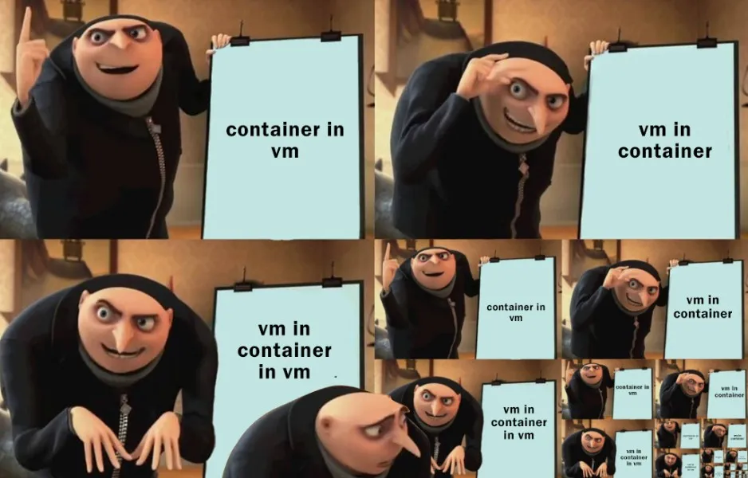

## 概述

在家裡面架著一台 lab，使用 proxmox ve 作為 vm server
透過 qemu 虛擬化一台 ubuntu server vm
在這個 vm 上使用 k3s，啟動 kubernetes 的服務
在 kubernetes 內跑著眾多 dockerize 的 containers。

雖然我不是資深維運專家，但我知道這可能很搞笑。

[](https://www.linkedin.com/pulse/running-vm-container-ramesh-kumar)

會需要這麼麻煩還不是為了省一點點 GKE 的成本（即便可能沒省到），但在自家建一個 lab 環境而不用計算由時間計價的 infra 成本，還是挺省腦袋的。

過去僅是將 service 使用 nodePort 來讓家裡面的其他裝置可以連線，或是使用 [wireguard 作為 VPN](/blogs/develop/2023/wireguard_easy) 來從遠端連線，就是沒有動力處理好 http service 與 TLS，趁這個假日剛好需要把 [自架 vaultwarden 後端](/blogs/develop/2023/bitwarden_with_self_hosted_password_backend) 給 expose 出來，便誕生了這篇。

在當前的雲端運算時代，許多開發者和 IT 專業人員都面臨著一個共同的挑戰：如何有效地將位於不同網絡環境中的服務整合並暴露給公眾。特別是對於那些希望將家用網絡中的服務有效連接到公共雲端（如 GCP,AWS,Azure,OCI）的用戶來說，這一挑戰尤為突出。文內主要講述通過在 GCP VM 上部署 FRP（Fast Reverse Proxy）服務器，結合家中的 kubernetes cluster 上配置的 FRP 客戶端，來實現一個高效且安全的服務部署流程。

透過此方式，我們不僅可以利用 GCP VM 作為公共 IP 的代理，實現從互聯網到家庭網絡的無縫連接，還能藉助 kubernetes 的強大功能進行快速的服務部署和管理。同時，利用 ingress-nginx 作為 ingress 控制器和 cert-manager 進行 TLS 設定，我們能夠確保服務的安全性和可靠性。

## FRP 介紹與設置

### FRP

[FRP（Fast Reverse Proxy）](https://github.com/fatedier/frp)是一個高性能的反向代理應用，主要用於內網穿透。它允許位於 NAT 或防火牆後的內網服務能夠安全、方便地暴露於公共網絡。FRP 以其簡潔的配置和高效的性能而受到許多開發者的青睞。FRP 主要包括兩個部分：frps（服務器端）和 frpc（客戶端）。通過這兩部分的配合，可以實現從公網到內網的流量轉發。許多後端從業人員應該都用過同樣也是用 go 寫的 [ngrok](https://github.com/inconshreveable/ngrok)，會用 ngrok 就會用 frp，同樣的簡單易用。

### 在 GCP VM 上設置 FRP 服務器

1. **創建 GCP VM 實例**：
   在 Google Cloud Platform 上創建一個新的虛擬機實例。選擇適合的操作系統（如 Ubuntu）並確保網絡配置允許對外的連接。為了預算考量，我選用的是 e2-micro。
1. **安裝 FRP 服務器**：
   1. 連接到您的 GCP VM。
   1. 從 [FRP GitHub 頁面](https://github.com/fatedier/frp) 下載最新版本的 FRP 服務器端（frps）。
   1. 解壓縮並移動 frps 到 `/etc/frp`。
1. **配置 FRP 服務器**：

   1. 在 VM 上創建一個名為 `/etc/frp/frps.ini` 的配置文件。
   1. 在配置文件中設定 `vhost_http_port` 和 `vhost_https_port`，以便 FRP 服務器監聽來自 HTTP 和 HTTPS 的請求。
   1. 配置其他必要的設置，

   ```bash
   ❯ cat /etc/frp/frps.ini
   [common]
   bind_port = 7000
   vhost_http_port = 80
   vhost_https_port = 443

   token=YOUR_TOKEN_UP_TO_YOU
   ```

1. **啟動 FRP 服務器**：
   使用命令 `/etc/frp/frps -c /etc/frp/frps.ini` 啟動 FRP 服務器，並確保它在後台持續運行
   可以考慮使用 systemd 來管理服務）。

   ```bash
   [Unit]
   Description=FRP Server Daemon

   [Service]
   Type=simple
   AmbientCapabilities=CAP_NET_BIND_SERVICE
   ExecStart=/etc/frp/frps -c /etc/frp/frps.ini
   Restart=always
   RestartSec=2s
   User=nobody
   LimitNOFILE=infinity

   [Install]
   WantedBy=multi-user.target
   ```

## 在 kubernetes cluster 上設置 FRP 客戶端

### 安裝 k3s on Ubuntu Server

要選擇 k3s 或 microk8s 或 minikube 或使用 kubeadm 來建立 k8s cluster 都沒問題，這邊以 k3s 舉例：

[k3s](https://k3s.io/) 是一個輕量級的 kubernetes 發行版，特別適合用於邊緣計算或資源有限的環境。使用 Rancher 維護提供更加方便的集群管理和操作界面。

1. **安裝 K3s**：
   1. 通過執行以下命令來安裝 K3s：
      ```bash
      curl -sfL https://get.k3s.io | sudo sh -
      ```
   1. 安裝完成後，檢查 K3s 是否成功運行：
      ```bash
      sudo systemctl status k3s
      ```
1. **配置 Kubeconfig**：
   為了方便後續的管理，配置 `kubeconfig` 文件。這可以通過將 `/etc/rancher/k3s/k3s.yaml` 文件複製到您的家目錄並重命名為 `.kube/config` 來完成。
   ```bash
   scp username@192.168.x.x:/etc/rancher/k3s/k3s.yaml ~/.kube/config
   ```

### 配置 FRP 客戶端

在 K3s cluster 上配置 FRP 客戶端，使其能夠與在 GCP VM 上設置的 FRP 服務器進行溝通：

1. **下載並配置 FRP 客戶端**：
   1. 從 [FRP GitHub 頁面](https://github.com/fatedier/frp) 下載 FRP 客戶端（frpc）。
   1. 解壓縮並將 `frpc` 移動到 `/etc/frp`。
1. **創建 FRP 客戶端配置文件**：

   1. 在 K3s 服務器上創建一個名為 `/etc/frp/frpc.ini` 的配置文件。
   1. 在配置文件中填寫必要的資訊，如服務器地址、端口、以及用於溝通的密鑰等。

   ```bash
   ❯ cat /etc/frp/frpc.ini
   [common]
   server_addr = your public ip or domain
   server_port = 7000
   token=YOUR_TOKEN_UP_TO_YOU
   privilege_token=YOUR_TOKEN_UP_TO_YOU

   [k8s-ingress-http]
   type = http
   local_port=32080
   local_ip = 127.0.0.1
   # custom_domains = *.demo.app
   proxy_protocal_version = v2

   [k8s-ingress-https]
   type = https
   local_port = 32443
   local_ip = 127.0.0.1
   # custom_domains = *.demo.app
   proxy_protocal_version = v2
   ```

1. **啟動 FRP 客戶端**：
   1. 使用命令 `/etc/frp/frpc -c /etc/frp/frpc.ini` 啟動 FRP 客戶端。
   1. 確認 FRP 客戶端成功連接到 FRP 服務器。

## 使用 helm 安裝 ingress-nginx 作為 ingress controller

[ingress-nginx](https://github.com/kubernetes/ingress-nginx) 是一種在 kubernetes cluster 中管理外部訪問 cluster 內服務的方法，它作為一個反向代理和負載平衡器。使用 helm 來安裝 ingress-nginx 可以大大簡化部署和管理過程。

### 前置條件

確保 helm 已經在您的系統上安裝。如果還未安裝，可以參考 [helm 安裝指南](https://helm.sh/docs/intro/install/)。
較常用 ubuntu 於是貼上 ubuntu 的安裝方式：

```bash
curl https://baltocdn.com/helm/signing.asc | gpg --dearmor | sudo tee /usr/share/keyrings/helm.gpg > /dev/null
sudo apt-get install apt-transport-https --yes
echo "deb [arch=$(dpkg --print-architecture) signed-by=/usr/share/keyrings/helm.gpg] https://baltocdn.com/helm/stable/debian/ all main" | sudo tee /etc/apt/sources.list.d/helm-stable-debian.list
sudo apt-get update
sudo apt-get install helm
```

### 安裝步驟

1. **添加 helm 儲存庫**：
   首先，添加 ingress-nginx 的 helm 儲存庫：
   ```bash
   helm repo add ingress-nginx https://kubernetes.github.io/ingress-nginx
   helm repo update
   ```
1. **獲取並修改 helm chart 的 values**
   目的在使 ingress-nginx 的 service 使用 nodePort 並曝露在方才設定的 32080(http) 與 32443(https)。
   ```bash
   helm show values ingress-nginx --repo https://kubernetes.github.io/ingress-nginx > values.yaml
   ```
   由：
   ```yaml
   type: LoadBalancer
   ## type: NodePort
   ## nodePorts:
   ##   http: 32080
   ##   https: 32443
   ##   tcp:
   ##     8080: 32808
   nodePorts:
     http: ""
     https: ""
     tcp: {}
     udp: {}
   ```
   修改為：
   ```yaml
   # type: LoadBalancer
   type: NodePort
   nodePorts:
     http: 32080
     https: 32443
     tcp: {}
     udp: {}
   ```
1. **安裝 ingress-nginx controller**：
   使用 helm 安裝 ingress-nginx，並附帶剛才修改的 values.yaml：

   ```bash
   helm upgrade --install ingress-nginx ingress-nginx \
     --repo https://kubernetes.github.io/ingress-nginx \
     --namespace ingress-nginx \
     --create-namespace \
     --values values.yaml

   ```

   這將在 `ingress-nginx` 命名空間內安裝 ingress-nginx。您可以根據需要更改命名空間名稱。

1. **確認安裝**：
   安裝完成後，檢查 ingress-nginx 是否正常運行：
   ```bash
   kubectl get pods -n ingress-nginx
   ```
   您應該會看到 ingress-nginx Controller 的 pod 正在運行狀態。

## 透過 helm 安裝 cert-manager 並配置 cluster issuer

### 安裝 cert-manager

cert-manager 管理 kubernetes 內的證書，自動為應用提供 HTTPS 支持。透過 helm 的安裝過程簡單快捷。詳細安裝可以參考 [cert-manager 官方說明](https://cert-manager.io/docs/installation/helm/)

1. **添加 cert-manager helm 儲存庫**：
   ```bash
   helm repo add jetstack https://charts.jetstack.io
   helm repo update
   ```
1. **安裝 cert-manager**：
   使用 helm 安裝 cert-manager 到您的 cluster：
   ```bash
   helm install cert-manager jetstack/cert-manager \
     --namespace cert-manager \
     --create-namespace --set installCRDs=true
   ```
   這會在 `cert-manager` 命名空間下安裝 cert-manager，並確保所需的 CRD(CustomResourceDefinitions) 被安裝。
1. **檢查 cert-manager 安裝狀態**：
   ```bash
   kubectl get pods -n cert-manager
   ```
   檢查 cert-manager 的各個組件是否已正常運行。

### 配置 cluster issuer

cluster issuer 是 cert-manager 的一個組件，用於發行證書。我們會建立一個 cluster issuer，以便在整個 cluster 中使用。

1. **創建 cluster issuer 資源定義**：
   創建一個 YAML 文件（例如 `cluster-issuer.yaml`），並添加以下內容：

   ```yaml
   apiVersion: cert-manager.io/v1
   kind: clusterissuer
   metadata:
   name: letsencrypt-issuer
   spec:
   acme:
     server: https://acme-v02.api.letsencrypt.org/directory
     email: your-email@example.com
     privateKeySecretRef:
     name: letsencrypt-issuer-account-key
     solvers:
       - http01:
           ingress:
             class: nginx
   ```

   替換 `your-email@example.com` 為您的真實電子郵件地址。

1. **應用 cluster issuer 配置**：
   使用 kubectl 應用創建的 cluster issuer：
   `bash
    kubectl apply -f cluster-issuer.yaml
    `
   透過以上步驟，cert-manager 已成功安裝且配置了一個 cluster issuer。現在您的 kubernetes cluster 可以自動發行和管理 SSL/TLS 證書，並將其與 Nginx-Ingress 結合使用，實現安全的 HTTPS 連接。

## 演示一個簡單的 App 使用 helm chart

這個示例將展示如何部署一個簡單的應用程序（例如一個基本的網頁服務器），使用 helm chart 來管理其部署、服務和 Ingress 設定。

### 準備 helm chart

1. **創建一個新的 helm chart**：
   使用 helm 創建一個新的 chart：
   ```bash
   helm create demo-app
   ```
   這將在目錄 `demo-app` 中創建一個新的 helm chart。
1. **配置 Deployment 和 Service**：
   1. 編輯 `demo-app/templates/deployment.yaml` 文件，定義應用的部署設置。
   1. 編輯 `demo-app/templates/service.yaml` 文件，設置服務以暴露應用。
1. **配置 Ingress**：
   在 `demo-app/templates/ingress.yaml` 文件中，添加 Ingress 資源定義，確保指定 `kubernetes.io/ingress.class: nginx`，並設置對應的 host 為 `demo.app`。

   同時，為了啟用 TLS，您需要在 Ingress 資源中引用先前創建的 cluster issuer，並定義相應的 TLS 段落，指定您的域名和證書。

   例如：

   ```yaml
   apiVersion: networking.k8s.io/v1
   kind: Ingress
   metadata:
     name: demo-app
     annotations:
       kubernetes.io/ingress.class: "nginx"
       cert-manager.io/cluster-issuer: "letsencrypt-issuer"
   spec:
     rules:
       - host: "xxx.demo.app"
         http:
           paths:
             - path: /
               pathType: Prefix
               backend:
                 service:
                   name: demo-app
                   port:
                     number: 80
     tls:
       - hosts:
           - "xxx.demo.app"
         secretName: xxx-demo-app-tls
   ```

1. **部署應用**：
   使用 helm 部署應用到您的 kubernetes cluster：
   ```bash
   helm install demo-app ./demo-app
   ```

### 檢查 FRP 隧道

確保 FRP 隧道正常工作，可以通過以下步驟進行檢查：

1. **檢查 FRP 客戶端和服務器的連接狀態**：
   確認 FRP 客戶端（在您的家庭 kubernetes cluster上）和服務器（在 GCP VM 上）之間的連接是正常的。
1. **檢查域名解析**：
   確保 `xxx.demo.app` 域名正確解析到 GCP VM 的公共 IP。
1. **訪問應用**：
   在瀏覽器中輸入 `https://xxx.demo.app`，檢查是否能成功訪問應用。如果一切配置正確，您應該能看到您的應用首頁，且地址欄顯示安全的 HTTPS 連接。

完整架構如下：


## 結論

在本文中，我們詳細介紹了如何在 Google Cloud Platform (GCP) 的虛擬機器 (VM) 上建立 FRP（Fast Reverse Proxy）服務器，以及如何在家中的 kubernetes cluster 上配置 FRP 客戶端。此設置使得家用 kubernetes cluster 可以作為一個高效且安全的服務部署環境，同時利用 GCP VM 的公共 IP 作為連接點。

重要步驟概述：

1. **FRP 服務器與客戶端的設置**：在 GCP VM 上設置 FRP 服務器，並在家用 Kubernetes cluster （由 Rancher 維護的 k3s 提供支持）上設置 FRP 客戶端，實現兩者之間的連接。
1. **nginx-ingress 和 cert-manager**：透過 helm 安裝 nginx-ingress 作為 ingress controller，並使用 cert-manager 自動管理 TLS 證書，確保通過 HTTPS 提供的服務既安全又可靠。
1. **演示應用的部署**：使用 helm chart 部署一個簡單的 Web 應用程序，配置其 Deployment、Service 和帶有 TLS 的 ingress（Nginx 作為類別），驗證整個設置的有效性。

透過這個過程，我們不僅展示了如何在雲端和家庭環境之間搭建一個有效的服務部署和管理橋樑，還提供了一個實際的示例來驗證整個架構的工作流程。此外，這種方法的靈活性和擴展性意味著它可以適用於更多的用例和複雜應用，為家用和小型企業用戶提供了一個強大的工具，用於高效地管理和部署服務。

## 可以更好

雖然在 GCP VM 上設置 FRP 服務器與在家用 kubernetes 集群上配置 FRP 客戶端的方法提供了強大的靈活性和便利性，但它也存在一些潛在的缺點和改進空間：

1. **依賴單點**：此架構高度依賴於在 GCP VM 上運行的 FRP 服務器，這可能成為系統的單點故障。若此服務器發生故障，整個系統的外網訪問能力將受到影響。
1. **網絡延遲和帶寬限制**：由於所有的數據流量都需要通過公共雲（GCP VM），這可能導致網絡延遲增加，並受到家用網絡的帶寬限制。
1. **安全性考量**：雖然 FRP 提供了安全的通道，但將家用 kubernetes cluster 暴露於公網始終存在安全風險。
1. **管理複雜性**：此方案涉及多個組件和配置，對於初學者來說可能較為複雜。

綜上所述，儘管這個方案提供了在家用環境中部署高效服務的有效途徑，但仍有改進的空間，特別是在可靠性、性能、安全性和易用性方面。
