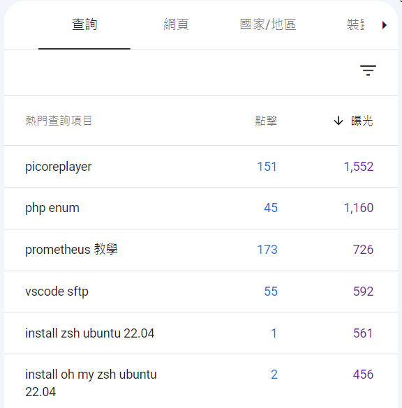

2021 年公司開始實施 322 WFH，少了通勤的時間，在家的時間也多了，就想在上班時也能好好對待自己，雖然是木耳但始終會想知道，網路上說的獨立訊源減少雜訊是有多重要，亦或只是玄學?於是誕生了[Raspberry pi 4 + piCorePlayer 7.0.0 折騰筆記](/blogs/develop/2021/piCorePlayer)這篇筆記，到現在這個部落格的累積曝光最高的也是因為這篇吧。


雖然說現在已經出到 [8.2.0](https://docs.picoreplayer.org/downloads/)，但也已經是 2022 年六月的版本了，起初因為 raspberry pi 4b 便宜而使用 piCorePlayer，後來也因 raspberry pi 4b 漲價(漲幅超過 100%)進而不使用 piCorePlayer，不知道官方後來沒更新了是因為樹莓派太穩定，還是真的太貴了...。

## 從 Bare Metal 到 Docker

當時在學習 HomeLab，首先是從 [portainer](https://www.portainer.io/) 開始玩，也因此誕生了 [logitech media server 搭配 docker 實現雙機分離](/blogs/develop/2021/logitech_media_server_with_docker)。後來也用著同樣的 [image](https://hub.docker.com/r/lmscommunity/logitechmediaserver) 將 lms 建在 k8s cluster 內，遇到的比較髒的問題是 nginx 的 port [用非正式的方式解決](https://github.com/omegaatt36/lab/blob/main/k8s/ingress-nginx/tcp-services-config-map.yaml)。

這時候其實已經不在乎 logitech media server 是否帶來更好的音質了，也沒有連動 NAS 的音樂，主要是使用 [Youtube Plugin](https://github.com/philippe44/LMS-YouTube) 播放 Youtube 上的內容(即便有訂閱 Youtube Premium)。以及使用 [Podcast Plugin](https://mysqueezebox.com/appgallery/Podcasts) 收聽 podcast。

使用 docker 的好處不外乎一個字，省，於是我把 raspberry pi 4b 也給賣了。

## 從 Docker 到 Podman 與 LXC

2022 年台灣疫情大爆發，公司也從 322 變成全遠端，但也在 2022 下半年恢復 322，於 2023 年正式恢復正常進辦公室。在這期間發現 logitech media server 使用 docker 做為執行環境，除了省物理機的錢(相較 bare metal)，更省顯示卡資源。

公司電腦是內顯，若是常駐 youtube 視窗，十分浪費顯示卡資源，甚至會影響到頁面切換效能，這時候起一個 container 來跑 lms，再用 [Squeezelite-X](https://apps.microsoft.com/store/detail/9PBHMTNP9037) 來做為撥放器，算是十分清量的解決方案了。再更後來將 docker desktop 移除了，詳細可以參閱 [WSL2 中使用 systemd 管理 podman 的 container](/blogs/develop/2023/wsl2_systemd_podman)。

在公司，就用 podman 起一個 container:
```bash
mkdir -p ~/.config/systemd/user
mkdir -p ~/podman/lms/config ~/podman/lms/playlist ~/podman/lms/music
podman create \
      --name=lms \
      -e PUID=1000 \
      -e PGID=1000 \
      -e TZ=Asia/Taipei \
      -p 9000:9000/tcp \
      -p 9090:9090/tcp \
      -p 3483:3483/tcp \
      -p 3483:3483/udp \
      -v /home/raiven/lms/config:/config:rw \
      -v /home/raiven/lms/music:/music:ro \
      -v /home/raiven/lms/playlist:/playlist:rw \
      --restart always \
      lmscommunity/logitechmediaserver:latest
podman generate systemd --new --files --name lms
cp -Z container-lms.service ~/.config/systemd/user
systemctl --user enable container-lms.service
systemctl --user start container-lms.service
systemctl --user status container-lms.service
```

在家裡，也將 lms 從 k8s cluster 中移到 proxmox ve LXC ，基於 debian 11，作為更「顯眼」的 container。
```bash
# http://downloads.slimdevices.com/
sudo apt install perl libssl-dev
wget http://downloads.slimdevices.com/LogitechMediaServer_v8.3.1/logitechmediaserver_8.3.1_amd64.deb
sudo dpkg -i logitechmediaserver_8.3.1_amd64.deb
sudo apt --fix-broken install
```

## 總結

這次遷移是一個很好的經歷。不僅讓我更好地理解了容器技術，還讓我的 logitech media server 更加穩定和可靠。在這個過程中，我學到了很多關於 docker 和 podman 的知識。我希望這個遷移紀錄可以幫助到其他人，並且鼓勵大家去嘗試使用容器技術。容器技術已經成為現代應用程序開發和部署的核心技術之一，並且它在未來也會繼續發揮重要作用。
