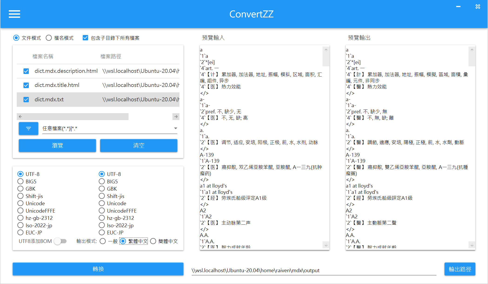

由於最近讀原文書讀得挺辛苦，邊用電子閱讀器看書，騰不出手用手機查字典，內建的辭典又只有英文翻譯簡體中文，在網上衝浪也找不到繁體中文的 mdx 英漢辭典可以直接使用。

## 所需依賴
- 任何英漢辭典
    > 文內以 BOOX 內下載的英漢辭典，參考[教學](https://mul.iqrator.com/2021/07/19/boox%E6%99%BA%E6%85%A7%E6%82%85%E8%AE%80-%E5%85%A7%E5%BB%BA%E5%AD%97%E5%85%B8%E6%87%89%E7%94%A8/)。
- python 環境，用以安裝 [mdict-utils](https://github.com/liuyug/mdict-utils)
    > 經測試後 windows 與 wsl 中均能完成，文內 python 環境以 wsl 為主。
- 任何繁簡轉換軟體
    > 文內以新發現的 [ConvertZZ](https://github.com/flier268/ConvertZZ) 最為 GUI 簡轉繁示例。
    > 文末有使用 [OpenCC](https://github.com/BYVoid/OpenCC) 作為 CLI 示例。

## 主要流程
- 將 mdx 拆成 txt
- 簡轉繁
- 將 txt 包成 mdx

### 安裝

安裝 mdict-utils
```shell
❯ pip install mdict-utils
Defaulting to user installation because normal site-packages is not writeable
Collecting mdict-utils
  Downloading mdict_utils-1.3.12-py3-none-any.whl (36 kB)
Collecting xxhash
  Downloading xxhash-3.2.0-cp310-cp310-manylinux_2_17_x86_64.manylinux2014_x86_64.whl (212 kB)
     ━━━━━━━━━━━━━━━━━━━━━━━━━━━━━━━━━━━━━━━━ 212.5/212.5 KB 1.6 MB/s eta 0:00:00
Collecting tqdm
  Downloading tqdm-4.65.0-py3-none-any.whl (77 kB)
     ━━━━━━━━━━━━━━━━━━━━━━━━━━━━━━━━━━━━━━━━ 77.1/77.1 KB 7.4 MB/s eta 0:00:00
Installing collected packages: xxhash, tqdm, mdict-utils
Successfully installed mdict-utils-1.3.12 tqdm-4.65.0 xxhash-3.2.0
```

### unpack

將英漢辭典重新命名為 `dict.mdx`

先看一下該 mdx 的編碼為 `UTF-8`，這將作為後續簡轉繁的編碼依據。
```shell
❯ /home/raiven/.local/bin/mdict -m dict.mdx | grep Encoding
Encoding: "UTF-8"
```

接著我們 unpack `dict.mdx`，透過參數 `-x` 指定文件，透過參數 `-d` 輸出到暫存資料夾 `output`
```shell
❯ mdict -x dict.mdx -d ./output
100%|███████████████████████████████████████████████████████████| 435468/435468 [00:01<00:00, 383585.55rec/s]
                     --- Elapsed time: 2.614119 seconds ---
```

可以看到暫存資料夾內有三個文件，分別是描述、標題、本文
```shell
❯ ls output
dict.mdx.description.html  dict.mdx.title.html  dict.mdx.txt
```

### convert

開啟 ConvertZZ，如圖設定好轉換方式，預覽沒問題後可以點選轉換，發生檔名衝同時點選全部取代，辭典有點大需稍候。


轉換完成後我們可以看看文件是否已經被轉成繁體

```shell
❯ head output/dict.mdx.txt
a
`1`a
`2`*[ei]
`4`art. 一
`4`【計】 累加器, 加法器, 地址, 振幅, 模擬, 區域, 面積, 彙編, 元件, 非同步
`4`【醫】 熱力效能
</>
a-
`1`a-
`2`pref. 不, 缺少, 無
```

### pack

指定方才解出來的描述、標題，加上轉換為繁體中文的本文，標成 mdx
```shell
❯ mdict --title output/dict.mdx.title.html \
  --description output/dict.mdx.description.html \
  -a output/dict.mdx.txt \
  output/dict.mdx
Scan "output/dict.mdx.txt": 435468

Pack to "output/dict.mdx"
100%|███████████████████████████████████████████████████████████| 435468/435468 [00:01<00:00, 410400.64rec/s]                    --- Elapsed time: 13.957099 seconds ---
```

### 完成

把 `output/dict.mdx` 放進 BOOX 裝置中的 `/dicts` 資料夾。

ConvertZ 或是 ConvertZZ 將簡體中文轉換成正體中文/繁體中文，詞彙使用上並無轉換，可以改進的點為使用 [OpenCC](https://github.com/BYVoid/OpenCC) 來進行繁簡轉換。

```shell
sudo apt install opencc -y
wget https://raw.githubusercontent.com/BYVoid/OpenCC/master/data/config/s2tw.json
opencc -c s2tw.json -i output/dict.mdx.txt -o output/dict.mdx.tc.txt
mdict --title output/dict.mdx.title.html \
  --description output/dict.mdx.description.html \
  -a output/dict.mdx.tc.txt \
  output/dict.mdx
```
