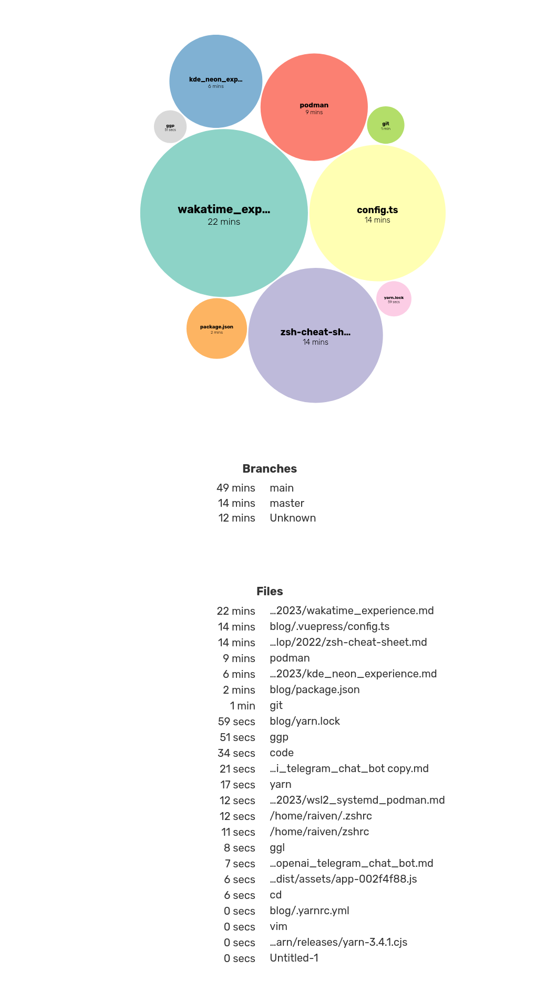

## WakaTime 介紹

[WakaTime](https://wakatime.com) 是一款紀錄自己生產力的工具，透過客戶端插件、集成工具紀錄「行徑」並發送到官方｜非官方伺服器，可以分析花了多久時間在哪個專案、哪個程式語言、會議、code review。


記憶力不佳，過去常常無法想起某段時間做了哪些專案，甚至 daily standup 前忘記昨天做了什麼，發現了 wakatime 可以透過 vscode 插件、terminal 插件來查看自己在哪些時間變更了哪些專案、檔案，甚至可以紀錄下過得指令（僅 binary 的部份，不含參數不會洩漏資料）。

在使用 WakaTime 前，先到 [WakaTime 官網](https://wakatime.com)上註冊並登入，取得最重要的 API Key(API Token)：


安裝相應的客戶端插件。[wakatime 支援的插件、編輯器](https://wakatime.com/plugins)包括但不限於：
- Visual Studio Code
- Vim
- Excel
- Terminal
    - zsh
    - bash
    - fish
    - iTerm2

舉例來說我們可以安裝 [vscode 插件](https://marketplace.visualstudio.com/items?itemName=WakaTime.vscode-wakatime)，並跟著 Installation 輸入完 API Key 就可以開始寫點東西了。

## 查看報告

使用了一段時間後，可以回到官網查看 [dashboard](https://wakatime.com/dashboard)

查看自己上週、前兩週、前一個月每天花了（浪費）了多少時間，以前三十天的圖為例：


或是 YoY 的活動圖


以此 blog 的 repo 來作為舉例，可以查看某個 project 的細節

在該專案花了多少時間、什麼語言：


檔案、分支的時間分配：


## 費用

免費版本的功能已經十分完整了，[完整費用方案在此](https://wakatime.com/pricing?utm_source=magic-panda-engineer)。
透過學生帳號可以申請教育折扣，年度付費 Premium 方案的話一年只要 59 美元，就可以享有完整的 WakaTime 服務。
雖然付費方案的功能幾乎都可以透過免費版本就有的 API 來完成，但仍可以花點小錢支持團隊，或是開啟公司計畫。

## 更新你的 GitHub Profile

[GitHub Profile](https://docs.github.com/en/account-and-profile/setting-up-and-managing-your-github-profile/customizing-your-profile/about-your-profile) 定義如下：
> If you add a README file to the root of a public repository with the same name as your username, that README will automatically appear on your profile page.

舉例來說，我的 github 使用者名稱為 omegaatt36，放在 `github.com/omegaatt36/omegaatt36` 這個 repo 中的 `README.md` 就會顯示在我的 Overview 上。

有許多工具可幫我們產生精美的 Profile，諸如 [anuraghazra/github-readme-stats](https://github.com/anuraghazra/github-readme-stats) 等等。而我們可以透過 [anmol098/waka-readme-stats](https://github.com/anmol098/waka-readme-stats) 來幫我們自動把 WakaTime 的統計資料自動更新至 README.md 上。

### 設定 waka-readme-stats

我們可以透過 [waka-readme-stats](https://github.com/marketplace/actions/profile-readme-development-stats#prep-work) 的設定教學一步一步來操作。

1. 建立與自己使用者名稱同名的 repo，舉例來說我的使用者名稱是 omegaatt36，就建立一個名為 omegaatt36 的 repo。
2. 新增 `README.md` 並在檔案內增加兩條註解，將統計資料的顯示區域提供給 `waka-readme-stats` 辨識：
    ```markdown
    <!--START_SECTION:waka-->
    <!--END_SECTION:waka-->
    ```
3. 新增 GitHub Action Workflow file，在專案目錄中的 `.github/workflows` 內新增 `waka-readme.yml`:
    ```yaml
    name: Waka Readme

    on:
    schedule:
        - cron: '0 0 * * *'
    workflow_dispatch:
    jobs:
    update-readme:
        name: Update Readme with Metrics
        runs-on: ubuntu-latest
        steps:
        - uses: anmol098/waka-readme-stats@master
            with:
            WAKATIME_API_KEY: ${{ secrets.WAKATIME_API_KEY }}
            GH_TOKEN: ${{ secrets.GH_TOKEN }}
            SHOW_PROFILE_VIEWS: False
            SHOW_SHORT_INFO: False
            SHOW_LOC_CHART: False
    ```
4. 其中[參數](https://github.com/anmol098/waka-readme-stats#flags-available)可以設定可以參考官方文件，某些參數需要額外的授權。
5. commit 並 push 到 GitHub 上。
6. 在 GitHub repo 內設定 secrets:
    1. 點擊 repo 中的 Settings 頁籤
        
    2. 點擊左側 Secrets and variables 中的 Actions
        
    3. 點擊 New repository secret
        
    4. 到 [WakaTime 的設定頁面](https://wakatime.com/settings/account)複製 Secret API Key
        
    5. 建立一個 secret，名稱為 `WAKATIME_API_KEY`，secret 為剛剛複製的 Secret API Key
        
    6. 到 [GitHub token 頁面](https://github.com/settings/tokens)設定一個擁有 repo, user 權限的 Token
        
    7. 複製 Token（這個 token 不會再顯示，忘記的話請註銷再重新建立）
        
    8. 回到 repo 中再建立一個 secret，名稱為 `GH_TOKEN`，secret 為剛剛複製的 GitHub Token
7. 手動執行工作流，點擊 Actions 頁籤，手動執行 Waka Readme 工作流。
    
8. 待工作流執行完後，回到 Code 頁籤，就能看到我們在 WakaTime 上的統計數據了，同樣的數據也會呈現在個人首頁上。
    

### 透過 gist 保留每一天的數據

WakaTime 免費版的 dashboard 僅能顯示最多 14 天的資料，若是想進一步統計，除了打 API 獲取數據外，可以使用大神寫好的方案。

透過 [https://github.com/marketplace/actions/wakatime-sync](wakatime-sync) 我們可以將 WakaTime 的數據紀錄至 gist 內，並透過 [superman66/wakatime-dashboard](https://wakatime.chenhuichao.com/dashboard) 或是 [zzwtsy/wakatime-dashboard-vue](https://wakavue.yumdeb.top/) 來顯示。

下圖即為三個工作天與一個假日的 WakeTime 數據，使用 [zzwtsy/wakatime-dashboard-vue](https://wakavue.yumdeb.top/) 來呈現的結果
    

## 結語

WakaTime 足以勝任作為自我監督的工具，甚至可以針對不同專案出 Invoice，對接案工作者挺友善的，但一個工程師的效能不僅僅只是在程式碼的撰寫上，開會、構思、討論等等都佔據了不少時間，工具幫助自己做數據的統計，但千萬不要被數據給綁架了。
