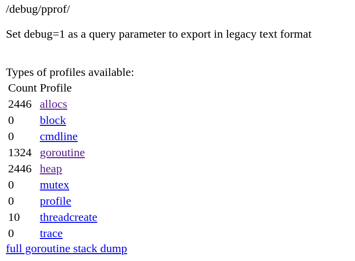
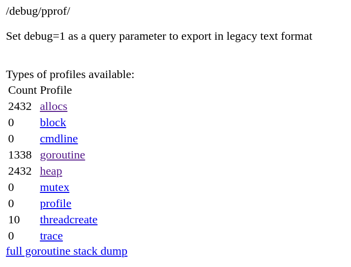
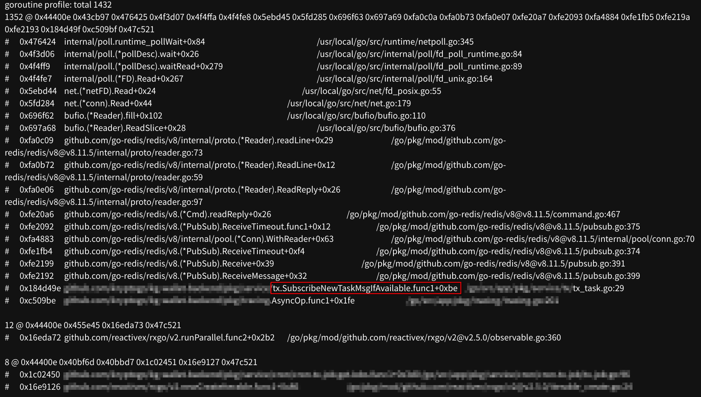

## 前言

某天下午，公司的 cronjob daemon 無預警的被 GCP OOM Kill 了，且程式碼沒有看出明顯的原因。

根據過去的經驗，local 開發時會使用 `go tool pprof` 來分析 CPU profile 或是 memory 與 trace 的問題，詳細可以參考 [Go 官方文件](https://go.dev/blog/pprof)。

由於我們的程式碼是一個基於 gin 的 http service，因此可以使用 [gin 提供的 pprof](https://github.com/gin-contrib/pprof) 來快速建立 endpoint。

## gin pprof

gin 的 pprof package 提供了數個基於 `net/http/pprof` 的 endpoint，可以分別為：

- `/`: 基本的 pprof 的 static page，可以分析 CPU 與 memory 的問題。
- `/cmdline`: 分析 command line 的問題。
- `/profile`: 分析 CPU profile 的問題，可以透過 query string 來指定 CPU profile 的 duration。
- `/symbol`: 分析 symbol table 的問題。
- `/trace`: 分析 trace 的問題。
- `/goroutine`: 分析 goroutine 的問題，這也是本文中重點查看的 endpoint。
- `/heap`: 分析 heap 的問題。


可以在 http server 中加入以下程式碼來啟用 pprof：

- 使用 gin-contrib/pprof 設定好的 route

    ```go
    r := gin.Default()
    // ... other handlers
    r.GET("", indexHandler)

    // pprof handlers
    pprof.Register(r)
    ```

- 自訂 pprof 的 route

    ```go
    r := gin.Default()

    // ... other handlers
    r.GET("", indexHandler)

    // pprof handlers
    pprof.RouteRegister(r, "pprof")
    ```

將程式跑起來後，就會看到 pprof 的 endpoint 已經註冊在 http server 中了。

## 查看 pprof

1. 直接在網頁上查看

    根據 server 與 route 的設定，假如是預設的 gin-contrib/pprof 的 route，使用瀏覽器開啟 `http://{{ HOST }}:{{ PORT }}/debug/pprof/` 就會顯示出 pprof 的頁面。

2. 下載 pprof 的 profile 後使用 `go tool pprof` 分析

    只想要針對某個項目進行排查，也可以使用 `curl` 來下載 output:

    ```bash
    curl -o output.pprof http://{{ HOST }}:{{ PORT }}/debug/pprof/goroutine
    go tool pprof -http=:8080 output.pprof
    ```

## 實際案例分析

在這次的案例中，當我首次打開 cronjob daemon 的 pprof 頁面為：



接著過一段時間重新整理後，頁面變成了：



透過這兩次的比較，我們可以看到 `goroutine` 的數量有點過高，並且在增長。於是當我們點進去 goroutine 的 profile 時，可以看到其中有一些很多的 stack trace 出現，這些 stack trace 就是我們的程式碼在運行時發生的問題。



我們可以發現排序第一的 goroutine 佔了超過九成的使用，並且持續增長，於是我們可以分析其中的 stack trace 去找出問題。

會發現是卡在 `netpoll.go:345`，而 call stack 回到我們的程式碼內：

```go
func SubscribeNewTaskMsgIfAvailable(client *redis.Client, newTask chan<- bool) {
    if client == nil {
        return
    }

    ctx := context.Background()
    go func () {
        pubsub := client.Subscribe(ctx, newTaskChannel)
        for {
            _, err := pubsub.ReceiveMessage(ctx)
            if err != nil {
                log.Println("[WARNING]", err.Error())
                continue
            }
            if len(newTask) == 0 {
                newTask <- true
            }
        }
    }
}
```

由於設計問題，我們在每做一次 cronjob 時，都會再次呼叫到 `SubscribeNewTaskMsgIfAvailable` 這個 function，但是這個向 redis 發送訂閱請求的 goroutine 卻沒有始終沒有 return 的情況，導致 goroutine 一直在等待 redis 的回應。隨著時間的流逝，goroutine 就會愈積愈多的增長，直到我們的程式因為 memory leak 而被 OOM Kill。

改善的方法也很簡單，只要將 context 由 function 外部傳遞即可，並且在 goroutine 中呼叫 `client.Subscribe` 後，再將 context 傳遞給 `pubsub.ReceiveMessage` 即可，當然前提還是外部的 context 是有正確的 deadline 或是 cancel 設定的。

```go
func SubscribeNewTaskMsgIfAvailable(ctx context.Context, client *redis.Client, newTask chan<- bool) {
    if client == nil {
        return
    }

    go func () {
        pubsub := client.Subscribe(ctx, newTaskChannel)
        for {
            select {
            case <-ctx.Done(): // exit the loop if the context is canceled
                return
            default:
                _, err := pubsub.ReceiveMessage(ctx)
                if err != nil {
                    log.Println("[WARNING]", err.Error())
                    continue
                }
                if len(newTask) == 0 {
                    newTask <- true
                }
            }

        }
    }
}
```

經過觀察，cronjob 的 daemon 已經不再有無限增長的 goroutine 了，並且可以正常運作了。

## 後話

當自己還是 Junior 工程師時，時常看到「壞味道」的程式碼時，就會滿頭問號：這邊為什麼要這樣寫...? :thinking:

現在會學著感謝前人寫下的 bug，才能讓我們有機會學習到該如何進行 memory leak 的檢查。

## 錯誤處理

我們可能會將 pprof 的 endpoint 掛在 auth middleware 後，在開啟 pprof 的網頁時，可以使用 [ModHeader](https://modheader.com/) 這個 extension 塞入 auth token 進行訪問，或是使用 `curl` 配合 `--header "AUTHORIZATION: Bearer XXX"` 來獲取單獨的 profile。

## References

- [pprof](https://pkg.go.dev/net/http/pprof)
- [记一次使用 pprof 检查 Go 内存和协程泄漏](https://jackyu.cn/tech/go-pprof-memory-and-goroutine-leak/)
- [10 Golang Memory Leak Prevention Tips](https://daily.dev/blog/10-golang-memory-leak-prevention-tips)
- [Analyzing Go Heap Escapes](https://landontclipp.github.io/blog/2023/07/15/analyzing-go-heap-escapes/)
- [Deep Dive into The Escape Analysis in Go](https://slides.com/jalex-chang/go-esc)
