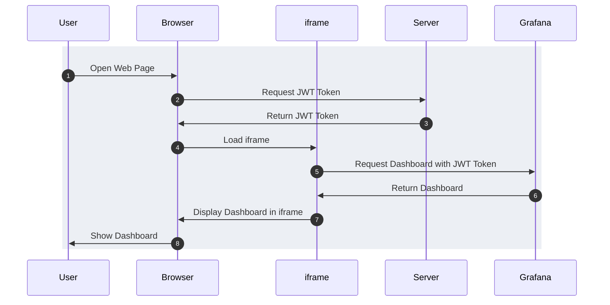
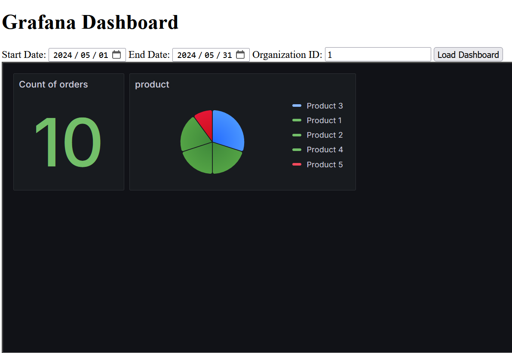

在工作上有一個需求是需要做一些 [OLAP](https://aws.amazon.com/tw/what-is/olap/)，原訂計畫是使用 Google Looker(ver. Google Cloud Core)，礙於量小不符合經濟效益，決定用 Grafana 這個較熟悉的開源套件來幫助我們做視覺化的處理。

這篇文章的範例可以在 [omegaatt36/grafana-embed-example](https://github.com/omegaatt36/grafana-embed-example) 中找到所有的 source code

我的 Use Case 為已經有一組 SHA512 產生的 Key，以下的內容為使用 HS512 進行簽名與認證。

## 流程



## Grafana

### 配置

主要是針對 `grafana.ini` 做修改

#### [security]

- `allow_embedding = true`：允許將 Grafana 儀表板嵌入到其他網頁中，這對於我們需要將儀表板嵌入到自定義前端頁面是必要的。
- `cookie_samesite = disabled`：允許跨站點請求攜帶 cookie，這在嵌入的情況下特別有用，因為瀏覽器會阻止跨站點的 cookie 請求。

#### [auth]

- `whitelisted_domains = localhost`：允許來自這些域名的請求繞過某些安全檢查。在開發和測試環境中，這有助於簡化流程。

#### [auth.jwt]

- `enabled = true`：啟用 JWT 認證。
- `header_name = X-JWT-Assertion`：指定用於攜帶 JWT 的 HTTP 標頭名稱。
- `enable_login_token = true`：允許使用 JWT 進行登入。
- `email_claim = sub`：指定 JWT 中對應電子郵件的字段。
- `jwk_set_file = /etc/grafana/jwks.json`：指定用於驗證 JWT 簽名的 JWKs 路徑。
- `expect_claims = {}`：設定期望的 JWT 權限。
- `role_attribute_path = role`：指定 JWT 中對應角色的字段。
- `role_attribute_strict = false`：是否嚴格匹配角色屬性。
- `username_attribute_path = user.name`：指定 JWT 中對應使用者名稱的字段（非用於驗證）。
- `email_attribute_path = user.email`：指定 JWT 中對應電子郵件的字段（非用於驗證）。
- `auto_sign_up = true`：允許自動註冊新用戶，搭配 `username_attribute_path` 與 `email_attribute_path` 可以實現自動註冊。
- `url_login = true`：允許通過 URL 進行登入。
- `allow_assign_grafana_admin = false`：不允許自動分配 Grafana 管理員角色。
- `skip_org_role_sync = false`：不跳過組織角色同步。

#### [auth.anonymous]

- `enabled = false`：禁用匿名訪問，確保所有訪問都需要經過認證。這點對於後續驗證十分重要，有很多其他部落格的這個區域都是設成 `true`，根本沒有經過 auth，相對的就是沒有安全性可言。



```ini
[security]
allow_embedding = true
cookie_samesite = disabled

[auth]
whitelisted_domains = localhost

#################################### Auth JWT ##########################
[auth.jwt]
enabled = true
header_name = X-JWT-Assertion
enable_login_token = true
email_claim = sub
jwk_set_file = /etc/grafana/jwks.json
key_id = grafana-embed-example
expect_claims = {}
role_attribute_path = role
role_attribute_strict = false
username_attribute_path = user.name
email_attribute_path = user.email
auto_sign_up = true
url_login = true
allow_assign_grafana_admin = false
skip_org_role_sync = false

[auth.anonymous]
enabled = false

[log.console]
level = info
```



### JWT

JWT (JSON Web Token) 是一種開放標準，用於在不同系統之間安全地傳輸訊息。在這個實作中，我們使用 JWT 來認證和授權使用者訪問嵌入的 Grafana 儀表板。

後端會生成 JWT，前端（由於是 iframe）透過 URL query string 將其傳遞給 Grafana，Grafana 會使用公鑰驗證 JWT 的有效性。

### 資料來源

資料來源定義了 Grafana 如何連接到數據庫或其他數據來源，以便從中提取數據進行可視化。這些設置可以在 Grafana 的 UI 中配置，並且需要確保數據源的連接憑證和訪問權限正確配置。在這個 Example 中我們會連接到 MySQL 資料庫中，並且存取 `users` & `orders` 等等資料表。

### User

使用者配置包括創建和管理 Grafana 使用者帳號，設定其訪問權限和角色。JWT 認證允許自動創建和分配使用者角色，這使得管理大量使用者更加便捷。我們會在 Grafana 中新增一個 Role 為 Viewer 的使用者，並且後端會使用這組帳號來簽署 JWT。

### Dashboard

儀表板是 Grafana 的核心組件，用於可視化數據。儀表板可以包括多個面板，每個面板展示特定數據源的數據。可以通過 JSON 定義儀表板的結構和內容。我們是直接使用剛才建立的 MySQL Datasource 作為資料源。

### Dashboard Varable

儀表板變數允許使用者動態更改儀表板的內容，例如選擇不同的數據範圍或過濾條件。這些變數可以在儀表板設計時定義，並通過 URL 參數或 UI 控件進行設置。

### Dashboard Permission

儀表板許可權控制哪些使用者或角色可以訪問或編輯儀表板。可以在 Grafana 的 UI 中配置許可權，以確保只有授權的使用者可以查看或修改敏感數據。我們將設定僅有剛才建立的 Viewer 能夠查看這個 Dashboard。

### Dashboard Embed link

嵌入鏈接允許將 Grafana 儀表板嵌入到其他網頁或應用中。配置嵌入鏈接時，需要確保允許嵌入並使用合適的 JWT 進行認證，以確保安全性和數據隱私。

## 簽署 JWKs

由於我是使用對稱加密的 SHA512，於是使用 `gopkg.in/square/go-jose.v2` 來協助產生用於 HS512 簽名的 JWKs。

需要注意，由於是對稱加密，JWKs 中的 `k` 僅僅是 secret 做 base64url without padding，若是需要將 JWKs 公開，請使用非對稱式加密。



```go
var secretKey *string = flag.String("secret-key", "", "secret key")
var keyID *string = flag.String("key-id", "", "key-id")

func main() {
    flag.Parse()
    if secretKey == nil || *secretKey == "" {
        log.Fatal("secret-key is required")
    }

    if keyID == nil || *keyID == "" {
        log.Fatal("key-id is required")
    }

    rawKey := []byte(*secretKey)

    symKey := jose.JSONWebKey{
        Key:       rawKey,
        KeyID:     *keyID,
        Algorithm: string(jose.HS512),
        Use:       "sig",
    }

    jwkJSON, err := json.MarshalIndent(jose.JSONWebKeySet{Keys: []jose.JSONWebKey{symKey}}, "", "  ")
    if err != nil {
        fmt.Printf("Failed to marshal JWK: %s\n", err)
        return
    }

    file, err := os.Create("jwks.json")
    if err != nil {
        fmt.Printf("Failed to create file: %s\n", err)
        return
    }
    defer file.Close()

    if _, err := file.Write(jwkJSON); err != nil {
        fmt.Printf("Failed to write JWK to file: %s\n", err)
        return
    }

    fmt.Println("JWK successfully written to jwks.json")
}
```



## 前端

由於我的前端技術非常薄弱，這段程式碼是請 ChatGPT 產生的，實現了一個簡單的前端介面，允許用戶輸入起始日期、結束日期和組織 ID，主要包括以下幾個部分：

### HTML 部分



```html
<!doctype html>
<html lang="en">
  <head>
    <meta charset="UTF-8" />
    <meta name="viewport" content="width=device-width, initial-scale=1.0" />
    <title>Embed Grafana Dashboard</title>
  </head>
  <body>
    <h1>Grafana Dashboard</h1>
    <label for="start">Start Date:</label>
    <input type="date" id="start" name="start" value="2024-05-01" />
    <label for="end">End Date:</label>
    <input type="date" id="end" name="end" value="2024-05-31" />
    <label for="organization_id">Organization ID:</label>
    <input type="text" id="organization_id" name="organization_id" value="1" />
    <button onclick="loadGrafanaDashboard()">Load Dashboard</button>
    <iframe id="grafanaFrame" src="" width="100%" height="450px"></iframe>

    <script>
      async function fetchToken() {
        try {
          const response = await fetch(`/token`);
          if (!response.ok) {
            throw new Error("Network response was not ok");
          }
          const token = await response.text();
          return token;
        } catch (error) {
          document.getElementById("error").style.display = "block";
          console.error("Error fetching token:", error);
        }
      }

      async function loadGrafanaDashboard() {
        const token = await fetchToken();
        if (token) {
          const startDate = document.getElementById("start").value;
          const endDate = document.getElementById("end").value;
          const organizationId =
            document.getElementById("organization_id").value;

          if (!startDate || !endDate || !organizationId) {
            document.getElementById("error").innerText =
              "Please select start date, end date, and enter organization ID.";
            document.getElementById("error").style.display = "block";
            return;
          }

          const from = new Date(`${startDate}T00:00:00`).getTime();
          const to = new Date(`${endDate}T23:59:59`).getTime();

          const grafana1BaseURL = `{{ .DashboardURL }}`;
          const grafana1URL = `${grafana1BaseURL}?auth_token=${token}&kiosk&from=${from}&to=${to}&var-org_id=${organizationId}`;
          document.getElementById("grafanaFrame").src = grafana1URL;
        }
      }
    </script>
  </body>
</html>
```



- `input` 用於選擇起始和結束日期，以及輸入組織 ID。
- `button` 用於觸發加載儀表板的操作。
- `iframe` 用於嵌入並顯示 Grafana 儀表板。
- `kiosk` 詳細差異可以參考[官方部落格](https://grafana.com/blog/2019/05/02/grafana-tutorial-how-to-create-kiosks-to-display-dashboards-on-a-tv/)，由於我僅需要查看 Dashboard 所以採用什麼參數都沒有攜帶的 `kiosk`。

### JavaScript 部分

- `fetchToken` 函數從後端獲取 JWT token。
- `loadGrafanaDashboard` 函數使用獲取的 token 和用戶輸入的參數生成 Grafana 儀表板的 URL，並將其設置到 iframe 中以加載儀表板。需要特別提到的是 `const grafana1BaseURL = {{ .DashboardURL }};` 為模板語言，目的是在 example 中透過 golang 的 `html/template` 來動態產生 URL。

這樣的設計確保了前端介面簡潔且易於使用，同時利用 JWT 認證確保了安全性。

## 後端

### HTTP server

啟動一個 http server，主要是 handle `/` 與 `/token`

```go
func main() {
    flag.Parse()
    if grafanaDashboardURL == nil || *grafanaDashboardURL == "" {
        log.Fatal("grafana-dashboard-url is required")
    }

    router := http.NewServeMux()
    router.HandleFunc("GET /token", generateJWT)
    router.HandleFunc("GET /", serveIndex)

    fmt.Println("Server is running on port 8000")
    if err := http.ListenAndServe(":8000", router); err != nil {
        fmt.Println(err)
    }

    fmt.Println("exiting...")
}
```

### Serve index

使用 embed 嵌入 index.html，並且動態地將 DashboardURL 交給 `html/template` 渲染

```go
//go:embed index.html
var indexHTML string

var grafanaDashboardURL *string = flag.String("grafana-dashboard-url", "", "grafana dashboard url")

func getIndexHtml() (*template.Template, error) {
    index, err := template.New("index").Parse(indexHTML)
    if err != nil {
        return nil, fmt.Errorf("failed to parse index.html: %w", err)
    }

    return index, nil
}

func serveIndex(w http.ResponseWriter, r *http.Request) {
    index, err := getIndexHtml()
    if err != nil {
        log.Println(err)
        http.Error(w, err.Error(), http.StatusInternalServerError)
        return
    }

    if err := index.Execute(w, map[string]any{
        "DashboardURL": *grafanaDashboardURL,
    }); err != nil {
        log.Println(err)
    }
}

```

### 簽署 JWT

一樣透過 embed 的方式讀取私鑰，並且在每個請求都能夠使用我們設計好的 claim 來將 user 與 email 給簽進 JWT 內。

```go
var secretKey *string = flag.String("secret-key", "", "secret key")

func generateJWT(w http.ResponseWriter, r *http.Request) {
    token := jwt.NewWithClaims(jwt.SigningMethodHS512, jwt.MapClaims{
        "user": jwt.MapClaims{
            "email": "viewer@kryptogo.com",
            "name":  "viewer",
        },
        "sub":  "viewer@kryptogo.com",
        "role": "Viewer",
        "iat":  time.Now().Unix(),
        "exp":  time.Now().Add(time.Hour * 1).Unix(),
    })

    token.Header["kid"] = *keyID

    tokenString, err := token.SignedString([]byte(*secretKey))
    if err != nil {
        http.Error(w, err.Error(), http.StatusInternalServerError)
        return
    }

    if _, err := w.Write([]byte(tokenString)); err != nil {
        log.Println(err)
    }
}
```

## 驗證

這邊需要強調的是**務必使用無痕模式來驗證**，否則 iframe 會使用已經登入的 session 來開啟，故可能無法驗證嵌入的效果。

照著 [How to use](https://github.com/omegaatt36/grafana-embed-example?tab=readme-ov-file#how-to-use) 段落一步一步往下做，就能夠在 iframe 內看到透過 JWT 進行登入的 Grafana Dashboard。



## Trouble shooting

任何驗證失敗的發生，都可以直接查看 grafana 的 log，例如：

- JWT 的 `kid` 是寫在 Header 而非 Body
- JWKs 有一個固定的格式，為一個 `{"keys":[]}`。
