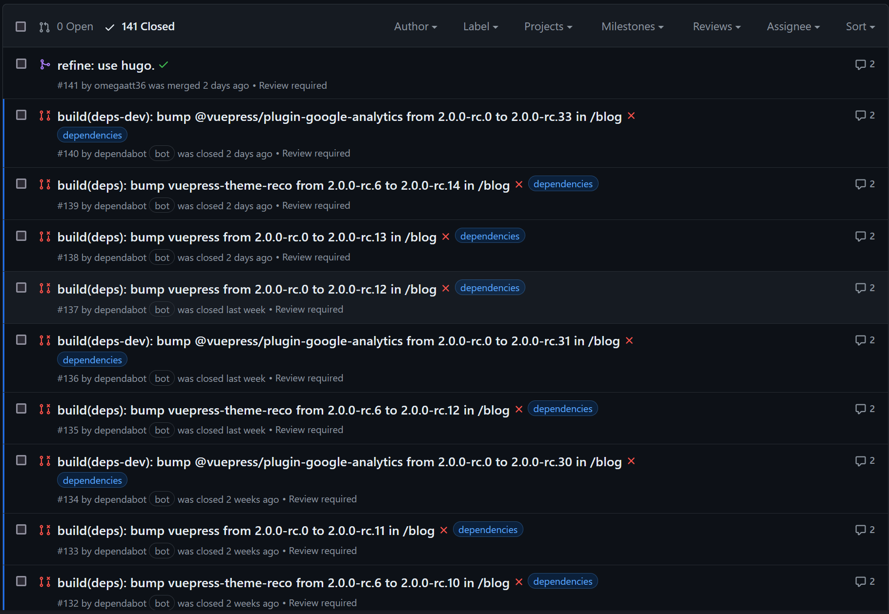

## 前言

在網頁開發中，選擇合適的靜態網站生成器非常重要。過去我們使用 VuePress 來建立部落格網站，但在使用過程中遇到了一些痛點，最終決定遷移到 Hugo。本篇文章分享遷移過程中的一些心得。

## 當初選擇 VuePress 而非 Hugo 的原因

最初想要撰寫部落格時，已經有再 hugo 與 vuepress 間做選擇，當時覺得 hexo 與 hugo 實在是爛大街了，想要一些與眾不同的體驗。

選擇 VuePress 是基於以下幾點考量：

- 朋友推薦，他是一名[資深前端工程師](https://www.linkedin.com/in/billy-chin/)，是 vuepress core-team 成員。
- 僅需要撰寫 markdown，便能產生靜態的部落格。
- 使用 theme plugin，可以方便的美化部落格，僅需要專注在內容的撰寫，不需要操心部落格是不是白底黑字而已。

## 使用 VuePress 的痛點

起初我所使用的 theme plugin 為 [vuepress-theme-reco(1.x)](https://github.com/vuepress-reco/vuepress-theme-reco-1.x)，並且搭配 vuepress 1.x 來進行建構。或是 vitepress，然而，在使用 VuePress 的過程中，我們也遇到了一些問題：

### 構建速度

我的部落格是無付費的使用 Netlify 進行託管，使用 vuepress 進行建構總是會花超過三分鐘，當進行 pr 的 preview build 時將會耗費大量的執行時間。

### 版本更新

過了一兩年，vuepress 官方開始推動 vuepress next(2.x)，vuepress-theme-reco 的作者也著手更新 [next(2.x)](https://github.com/vuepress-reco/vuepress-theme-reco) 版本。期間從 alpha 版本到 beta 版本，當 vuepress 與 theme plugin 有 API 不同不的問題，就容易導致 build failed，這個情況到了 rc 版本也沒有改善。

### 安全性

接著說，當版本無法隨時更新時，github 就會通知 security alert 或是 dependency bot 的 PR 不斷提醒。



### 配置複雜

再接著說，使用了 GA plugin 與 sitemap plguin 後，某種程度上需要去理解 `config.js` 或是 `config.ts` 的結構，但最初我的目的是希望僅須設定 `*.yaml` 或是 `*.toml` 就好。

甚至到了 vuepress 2.x 版本，可能因為 node 版本升級或是專案架構的升級，export config 的方式不同了，有過重新撰寫 config 的步驟，還因此需要重新熟悉整格文件，對於不熟悉 js 與前端生態的我來說極為困擾。

## 遷移到 Hugo 的好處

Hugo 以其快速、簡單和靈活的特性吸引了我們。遷移到 Hugo 之後，我們體會到了以下好處：

### 極速構建

Hugo 是用 Go 語言編寫的，其構建速度遠超 VuePress，對於大型網站尤為明顯，即便我的需求僅僅是小小的部落格仍有顯著差異。

### 簡單配置

Hugo 的配置文件簡單明瞭，配置已經足夠應對大部分需求，減少了手動配置的工作量。theme 採用 submodule 管理，隱性的成為文件目錄內的一份子。

### 強大的內容管理

Hugo 支持多種內容類型和分類方法，對於內容多樣化的部落格網站非常友好。

要維持 path，也可以不用管目錄，將所有 md 檔案放到 content 資料夾內，使用 permalinks 來讓 hugo 幫你管理目錄結構。

```yaml
permalinks:
  page:
    blogs: /blogs/develop/:year/:filename
```

## 遷移時的小技巧

### 如何維持 SEO

在網站遷移過程中，SEO 是我們最關注的部分之一。為了確保搜尋引擎對我們的網站友好，我們需要確保以下幾點：

- 保持 URL 結構：Hugo 允許我們自訂 URL 結構，確保與 VuePress 時期一致。這樣可以避免因 URL 變動導致的流量損失。
- 設定 301 Redirect：如果無法完全保持 URL 一致，可以使用 301 Redirect 將舊網址導向新網址，告訴搜尋引擎內容已永久移動。

這點透過 ChatGPT 撰寫 shell script，能快速幫我們實現。或如上方提到的，使用 [permalinks](https://gohugo.io/content-management/urls/#permalinks) 來協助我們專注在內容上。

### 無痛遷移

這邊是指上線前的準備，[PR 可以到 github 上查看](https://github.com/omegaatt36/omegaatt-blog/pull/141)：

1. 建立一個新的 branch，並在這個 branch 研究 netlify 上 hugo 的 deploy 流程
1. 研究完畢，確保 staging deploy 的網站各方面都沒有問題
1. 修改 prod 的 build config，從 `yarn`(我原本採取的方式) 改成 `hugo`
1. 在 github 上發一個 pr，讓 netlify 進行 preview building
1. 確認 preview building 無誤，大膽的按下 merge
1. 等待 hugo 高速的建構，並開始享受新的部落格

## 心得

遷移過程中，最大的挑戰是將原有的 VuePress 配置和自訂功能轉換為 Hugo 格式。然而，一旦掌握了 Hugo 的基本用法，遷移過程便順利許多。Hugo 的文檔和社群資源豐富，能夠快速找到解決問題的方法。

在不破壞已經培養好的 SEO 下（[甚至會更好？](https://www.facebook.com/Raiven.Kao/posts/pfbid0375aAhvKUAcCk2w8fQmfFE8ScE83zk5jJpn1V7Q9BWSFPFLPFshhN3ZgHkMzE5kEUl)）大幅度的減少寫文章的痛處，回歸內容撰寫的本質。
