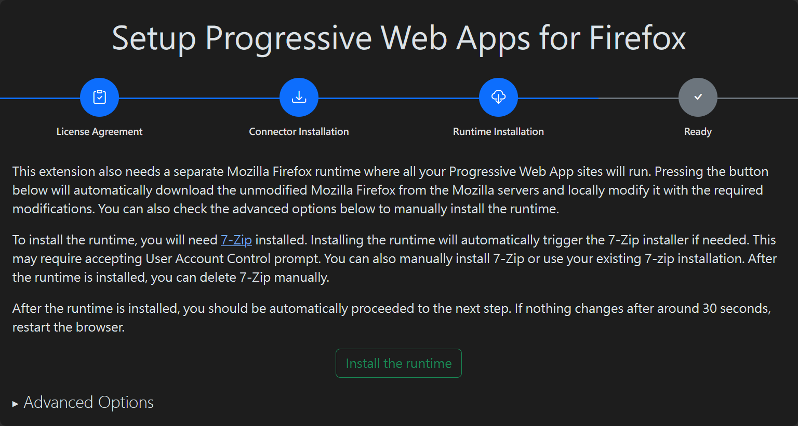
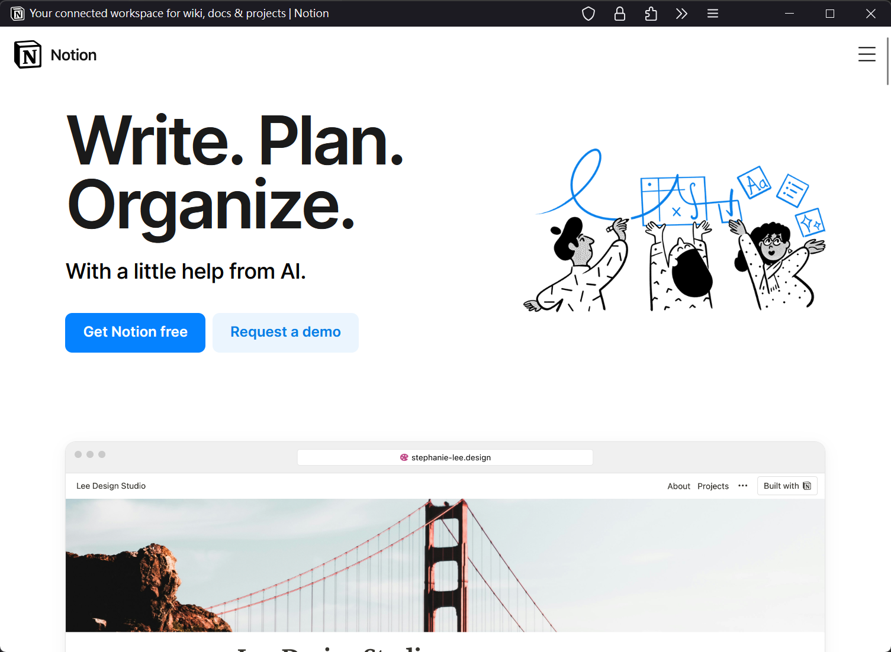

## 前言

開應用時，跨平台的桌面解決方案時常困擾開發者，在 Linux Desktop 上要支援多種桌面協議與桌面管理系統，更是複雜許多。時常會看到 Electron 等等基於 chromium 的技術。

當然也可以像是 zed.dev 這樣的 geek 精神，自己寫了一套跨平台的 GUI 框架，但多數新創公司可能沒有這些資源來實現。例如已經非常成熟的 Notion.so、Obsidian 等等都是基於 Electron 實現的。

我並非一個 [anti-Electron](https://github.com/sudhakar3697/awesome-electron-alternatives) 或是 [deGoogle](https://www.reddit.com/r/degoogle/) 的人，但試圖找到其他解決方案正式樂趣之所在。

## PWA(Progressive Web App）

詳盡的 PWA 技術可以到 mozilla 的[文件](https://developer.mozilla.org/zh-TW/docs/Web/Progressive_web_apps)中查看，對我來說只要可以達到目的：可以在 Windows、Mac、Linux 上封裝成 Desktop Aplication 即可。

## 官方支援

mozilla 官方有一個文件針對「安裝網頁應用到桌面環境」的歷史講解，可以參考[官方文件](https://developer.mozilla.org/en-US/docs/Web/Progressive_web_apps/Guides/Installing)。

文中提到過去將網址「儲存」在桌面上的類似「書籤」的方法(SSB)，以及與 PWA 的不同之處：PWA 的使用者資料是儲存在桌面環境中。

## PWA Add-on

上述文件內有提到需要使用 Fan-maded 的 PWA Add-on 來安裝 PWA：[Progressive Web Apps for Firefox by Filip Štamcar](https://addons.mozilla.org/en-US/firefox/addon/pwas-for-firefox/)。

他是一個開源的 Firefox 擴充套件([filips123/PWAsForFirefox](https://github.com/filips123/PWAsForFirefox))，具有[完整的文件](https://pwasforfirefox.filips.si/)。

### 安裝過程

1. 在 Firefox 瀏覽氣上安裝 [PWA Add-on](https://addons.mozilla.org/en-US/firefox/addon/pwas-for-firefox/)
1. 瀏覽器會自動跳到設定頁面，首先會需要同意 EULA
  
1. 接著會需要安裝 connector，需要透過該 connector 才能連結瀏覽器本身與 extension。
  connector 由 Rust 編寫，使該 extension 可以在跨平台的桌面環境中管理 firefox 設定檔、runtime 等等未開放給 extension 存取的資源。
  - Windows:
    Windows 的 connector 除了手動安裝外，也推薦使用 [winget](https://github.com/microsoft/winget-cli) 來安裝，類似於 apt/yum 的套件管理工具。
    
  - Linux
    Linux 的 connector 可以到 [github release](https://github.com/filips123/PWAsForFirefox/releases) 上找到，例如我的作業系統是 OpenSUSE Tumbleweed，則可以下載 .rpm 檔案。
    ```bash
    sudo zypper in ./firefoxpwa-2.12.1-1.x86_64.rpm
    ```
    - Debian/Ubuntu(DEB):
    
    - Redhat/Fedora/OpenSUSE(RPM):
    
1. 接著會需要安裝不同於原生 Firefox 的 runtime，根據描述，會下載並由 connector 自動修改成支援 PWA 的 runtime。
  
1. 到這邊已經完成 PWA extension 的安裝，可以嘗試使用 PWA 的方式來安裝 web app to desktop app。
1. 首先需要打開你想要安裝成 Desktop App 的網頁，如果在不同的網頁嘗試設定，extension 會自動判斷該網頁 CORS Error，即便是 `https://www.notion.so` 與 `https://notion.so` 也屬於不同的 Origin。
  接著點擊 PWAForFirefox 的圖示，可以看到已經安裝好的 extension。
  
1. 接著一步一步的跟著指引設定好該 PWA 的設定。
  
  
  
  
1. 完成，可以在應用程式選單內找到剛剛建立的 PWA 應用程式。
  
1. 開啟後可以自動開啟網頁應用程式，並具有獨立的設定檔。
  


## 使用感受

三四年前在 Windows 上習慣使用 Notion Desktop 版本，在 Linux 上反而已經習慣要用網頁來打開，這次嘗試使用 PWA 後倒是經常忘記有將它安裝成 Desktop Application。

如果不想安裝成 Desktop Application，可以使用 [Profile Switcher For Firefox](https://addons.mozilla.org/zh-TW/firefox/addon/profile-switcher/)，具有快速切換 profile 的功能。

### 優點

由於每個應用都有自己的 profile，可以針對不同 Notion 的 workspace 分開設定，可以更快速地打開不同 workspace 的 notion。

### 缺點

他不像是 Chromium-based 與 Electron 的應用程式般共用同一個 Chromium 內核，而是每一個 Application 單獨執行一個 Firefox 實體，因此多個 Application 會耗費大量的記憶體資源。

## 寫在最後

[](https://www.quippd.com/writing/2023/08/02/how-firefox-loses-when-it-tries-to-copy-chrome.html)

Firefox 的市佔率已經非常低，[在 Google 反壟斷被告成功後，Firefox 的收入可能會更加嚴峻](https://www.techbang.com/posts/117407-the-antitrust-lawsuit-against-google-is-likely-to-hurt)，效能早已不如 Chromium-based 的瀏覽器，這應該是不爭的事實了，但我相信有競爭者，對終端消費者才是好的，還是希望 Firefox 能保有活力與持續創造價值。

我並非是一個 Firefox 的死忠擁護者，單單是因為喜歡把 Tabs 放在側邊欄，而 Firefox 的 custome css 配合 [KiKaraage/ArcWTF](https://github.com/KiKaraage/ArcWTF) 等一眾開源美化方案，已經可以很好的完成我的需求。
