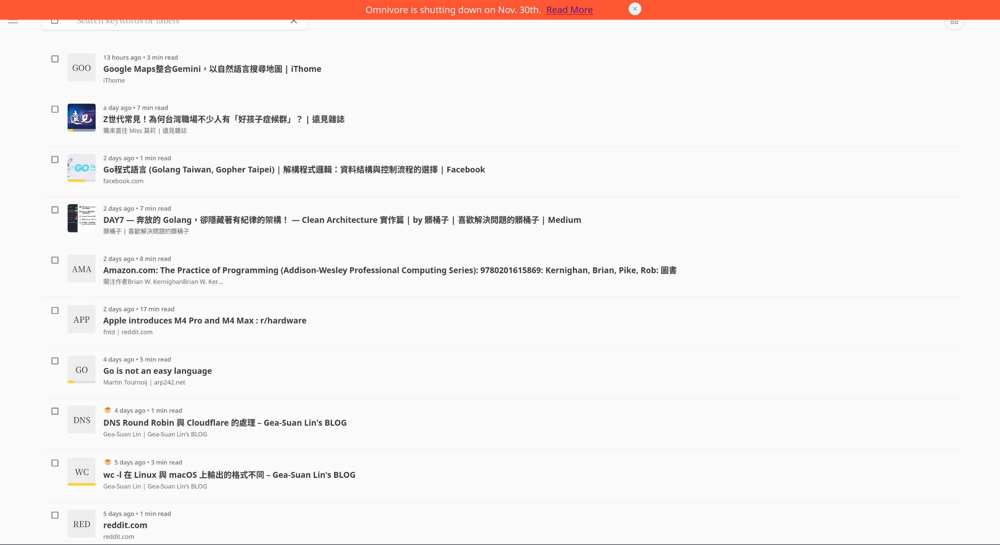

每日例行地開啟最愛的 Save for later，準備觀看有哪些部落格更新、產品釋出新版本時，一行醒目的提示告訴你「[我們即將關閉伺服器](https://blog.omnivore.app/p/details-on-omnivore-shutting-down)」。

錯愕，這是 2024 年十月底每一位 Omnivore App 難民的心情。

## 一、開源軟體的普及與迷思

說到開源軟體，不外乎就是 free 或是 freedom 的軟體，可以說是免費的軟體，也可以說是自由的軟體。

早期的 [LAMP Stack](<https://en.wikipedia.org/wiki/LAMP_(software_bundle)>) 相較於 Microsoft 的 Windows Server、IBM 或是 Oracle 付費的服務，每個組件都是免費的，廣泛受到 Geek 到大中小型企業的使用

同時，開源軟體顧名思義是開放原始碼，在授權許可下可以自由使用、修改、分享，許多人將開源與安全劃上等號。

## 二、開源軟體的安全現況

### 多雙眼睛的侷限

即便開放原始碼，所有人都能查看開放原始碼，如果有任何 bug 或是安全漏洞，都「應該」會被發現。
我使用「應該」一詞，正因為許多人（包含我）在安裝開源軟體時，就如同安裝閉源軟體一樣，並不會查看全部的程式碼，確認安全後才進行安裝。而是做一個「大家都看過了，應該很安全」的假設。
例如當你想用 Nginx 取代 Apache 時，可能僅會比較兩者的 feature 與 benchmark，並不會查看內部 tcp socket 是如何管理等等，或是 buffer overflow 時的錯誤處理機制。

### 開源是否暴露更多漏洞？

####安全問題的挑戰

當我們將軟體開源，等於是將所有安全問題也給暴露了出來。

舉例來說，假如我們 self-hosted 一個 NAS 服務，這個 NAS 使用指定的 port 進行 web 與 API 的存取，例如 `:8787`。
當一個 Hacker 看到該 NAS 的 Auth 並沒有任何 rate limit，就可以直接在 NAS 內進行 port scan 或是 brute force 攻擊，取得這個 NAS 服務的控制權。

當我們使用開源軟體，卻又因為該軟體本身的問題導致時間與財產的損失，又該找誰索賠呢？

### 誰來審核代碼？

一間正經的 SaaS 公司，可能會將軟體交由審計公司進行審計（audit），並且釋出安全報告。但當我們選擇使用開源軟體，又是誰應該來負擔這筆費用呢？

#### 潛在的惡意貢獻者

即便我們設定權限來保護自己開源出去的軟體，也可能因為潛伏的惡意貢獻者，在某次的 commit 紀錄中被添加了惡意的程式碼。

#### 案例分析：xz 漏洞事件

已經有許多文章分析過 2024 年 Q2 的 [xz 漏洞](https://www.ithome.com.tw/news/162130)，要不是有人如此敏感地察覺解壓縮變慢，這種廣泛應用在任何系統的套件的安全漏洞，其實很難被發現。

### 歷史過於悠久

舉個例子就是 X.org 這個廣泛應用在 Linux 桌面的協議，隨著 Fedora 慢慢的轉移到 Wayland 這個較新的通訊協議後，既有的開發者改不動、新的開發者也被這龐大的程式碼給勸退，X.org 進入了[僅維護模式](https://www.phoronix.com/news/XServer-Abandonware)。

### 歷史過於短暫

開源的軟體可能由於商業公司不想讓市場存在免費的競爭對手，而被「收編」。

如同開篇提到的 Omnivore App，當一個開源 SaaS 提供官方的 Hosting 服務，人人去使用就會造成更高的維護成本（實質意義上的金錢成本）。當使用者收到軟體開發者找到金流的通知時，是透過「我被收購了」的方式，以及「我們將無法繼續提供官方 Hosting 服務」，又得惹得怨聲載道。

縱觀 Omnivore App 的歷史，是從 2022-02 開始，實際上也只有/已經有兩年，可能開發者本身也沒有預料到會有這麼多使用者。

## 三、開源軟體的商業化手法

商業化一直是任何產品難以避開的權衡點，開發者需要吃飯，使用者卻只想用免費的。也會因為方向上的不同而被貼上不同的標籤：

### 開源軟體被商業公司收購：

例如開篇提到的 Omnivore App -> Omnivore App 的使用者將自己包裝成難民，即便可能一毛錢都沒付過。

### 商業公司開源自己的商業軟體：

使用者高喊「佛心公司」

### 開源軟體改成商業授權：

例如 Hashicorp 的 Terraform 改成 BSL 授權，讓人受不了直接 fork 出了 [OpenTofu](https://opentofu.org/) 等等。

## 免費並非全功能：開源版的限制

就像許多新創公司需要找到 to B 的銷售模式一樣，許多開源軟體也提供了企業版本（需要提供 lisence）與 OOS 版本，差異在一些商業功能與 7/24 的專員支援。

例如 Proxmox VE、Ubuntu Pro、InfluxDB、Grafana Labs 等等。

### 案例分析：PhotoPrism

PhotoPrism 是一個免費的圖庫管理，後來也區分了付費版本（Essentials or Plus）與免費版本（Community）的差異

舉例來說，當你是要自架自己使用的 PhotoPrism 時，「僅有一個 admin 帳號」的這個 Community 版本就比較無所謂。但當你想要新增其他使用者時，不好意思請你付費解鎖功能 :)。

## 開源 SaaS 的 self-hosting 成本

即便 LLM 時代，我們也有 [ollama](https://github.com/ollama/ollama)、[jan](https://github.com/janhq/jan) 與許多開源大模型可以自己使用。相對的問題則是忍受電費與初次建構硬體的成本。

同時當 Hosting 了任何服務，也需要自己考慮可用性、資料備份、資安、網路等等一系列問題。

## 四、開源軟體的化學作用

### 軟體組合的力量

開源與開源也有些化學作用， 例如 droneCI 若是搭配 gitea 或 gogs 來使用，則不會受到[5000 次 build 的限制](https://github.com/harness/harness/blob/4b7f52ad8a96e8e447f813d4b3de19ca30ff4b0d/service/license/load.go#L37-L56)

## 五、結論

**若為自由故**

### 重新思考開源的價值與風險

過去當我在使用軟體需要付費時，總是會查看 github 上是否有開源替代版本，例如當我需要密碼管理時，我找到了 [Bitwarden](https://bitwarden.com/)。同時自行架設了 vaultwarden 作為後端，詳細可以參考 [bitwarden_with_self_hosted_password_backend](/blogs/develop/2023/bitwarden_with_self_hosted_password_backend)。

此時我會需要承擔：

- lab 網路掛掉，當我要同步密碼時發生問題
- lab 硬碟掛掉，如果備份機制也掛掉，我的所有密碼就消失了
- vaultwarden 被攻破，同時有人發現了我 self-hosted 的 instance 在哪，導致我的密碼全部 leak

好在 bitwarden 的官方提供了免費的版本，如果我願意「分享」我的密碼，則可以將 bitwarden 的 instance 當作備份。或是順便[每年繳 10USD](https://bitwarden.com/pricing/) 給 bitwarden 來支持這個開源項目並獲得安全報告。

### 對使用者的建議

這篇文章並不是在告訴大家不要使用開源軟體，而是對自己做一個警惕，不要凡事都想著免費使用，下一個被收購或是因為維護而本過高而停止官方 instance 的 XXX App 可能會是任何軟體。

同時也要警惕所有 Self-Hosted 的玩家，即便軟體看似安全，但仍需要做好:

- 備份
- fail2ban 的機制
- 異地備份
- 不要隨便將 port 暴露
- 更多更多的備份

共勉之
