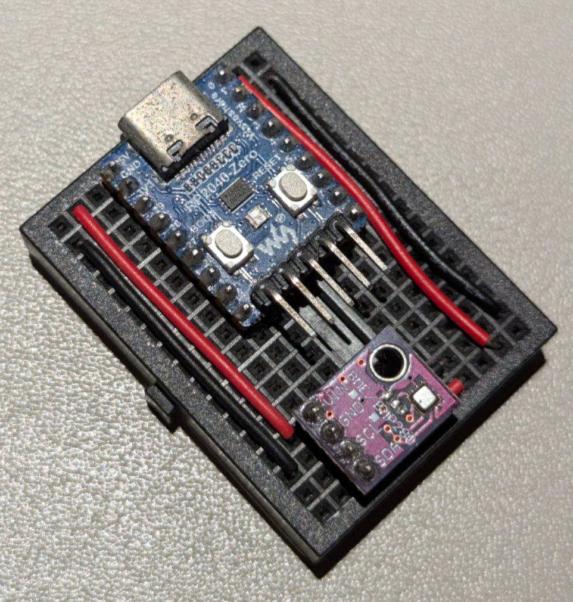

## 前言

作為嵌入式系統學習的微小專案，我決定使用 [TinyGo](https://tinygo.org/) 來實現一個簡單的溫濕度感測器。過去我大多使用 Arduino 作為微控制器（MCU）開發平台，但這次想嘗試使用 TinyGo 來進行單片機的學習。
TinyGo 是 Go 語言的一個子集，專門針對小型設備和微控制器進行了優化，使得我們可以在資源受限的硬體上運行 Go 程式。

全部的程式碼都可以到 [omegaatt36/pico-bme280](https://github.com/omegaatt36/pico-bme280) 中找到。

## 硬體選擇

### Raspberry Pi Pico

我選擇了 Raspberry Pi Pico 作為本專案的主控板。Pico 是一款基於 RP2040 晶片的微控制器開發板，具有以下特點：

- 雙核 ARM Cortex-M0+ 處理器，時脈可達 133 MHz
- 264KB 的 SRAM 和 2MB 的板載閃存
- 支援 USB 1.1 主機和設備功能
- 低功耗睡眠和休眠模式
- 可編程 I/O（PIO）狀態機
- 30 個 GPIO 引腳
- 便宜

價格僅需要 5 美元，後繼款的 [Pico 2](https://makerpro.cc/2024/08/the-second-generation-raspberry-pi-pico-is-here/) 仍然維持 5 美元，還額外增加了 RISC-V 架構的支援，可以一次玩到兩種處理器架構。
Pico 的這些特性使其非常適合用於各種嵌入式專案，包括我們的溫濕度感測器。

### BME280 感測器

最初我購買了 [BMP280](https://www.bosch-sensortec.com/products/environmental-sensors/pressure-sensors/bmp280/) 感測器，但後來發現它只能測量溫度和氣壓，無法測量濕度。因此，我轉而選擇了 [BME280](https://www.bosch-sensortec.com/products/environmental-sensors/humidity-sensors-bme280/) 感測器，它可以同時測量溫度、濕度和氣壓。

BME280 是一款精確度高、體積小、待機功耗低的環境感測器。但當連續偵測時，通過的電流會導致 sensor 功耗上升，進而導致測量到過高的溫度。



## 軟體實現

### TinyGo 程式

TinyGo 在 Raspberry Pi Pico 上編寫了控制 BME280 的程式。簡化版的 example：

```go
package main
/
import (
    "machine"
    "time"

    "tinygo.org/x/drivers/bme280"
)

func main() {
    i2c := machine.I2C0
    err := i2c.Configure(machine.I2CConfig{
        Frequency: machine.TWI_FREQ_400KHZ,
    })
    if err != nil {
        println("could not configure I2C:", err)
        return
    }

    sensor := bme280.New(i2c)
    sensor.Configure()

    for {
        temp, _ := sensor.ReadTemperature()
        humidity, _ := sensor.ReadHumidity()
        pressure, _ := sensor.ReadPressure()

        println("Temperature:", float32(temp)/1000, "°C")
        println("Humidity:", float32(humidity)/100, "%")
        println("Pressure:", float32(pressure)/100000, "hPa")

        time.Sleep(time.Second * 5)
    }
}
```

每 5 秒讀取一次 BME280 的溫度、濕度和氣壓數據，並通過串口輸出。

### 使用 Prometheus 收集數據

為了更好地監控和分析感測器數據，寫了一個簡單的 Go 程式，用於讀取 Pico 的串口輸出，並將數據暴露為 Prometheus 格式的指標：

```go
package main

import (
    "bufio"
    "log"
    "net/http"
    "strconv"
    "strings"

    "github.com/tarm/serial"
    "github.com/prometheus/client_golang/prometheus"
    "github.com/prometheus/client_golang/prometheus/promhttp"
)

var (
    temperature = prometheus.NewGauge(prometheus.GaugeOpts{
        Name: "bme280_temperature_celsius",
        Help: "Current temperature in Celsius",
    })
    humidity = prometheus.NewGauge(prometheus.GaugeOpts{
        Name: "bme280_humidity_percent",
        Help: "Current humidity in percent",
    })
    pressure = prometheus.NewGauge(prometheus.GaugeOpts{
        Name: "bme280_pressure_hpa",
        Help: "Current pressure in hPa",
    })
)

func init() {
    prometheus.MustRegister(temperature)
    prometheus.MustRegister(humidity)
    prometheus.MustRegister(pressure)
}

func main() {
    c := &serial.Config{Name: "/dev/ttyACM0", Baud: 115200}
    s, err := serial.OpenPort(c)
    if err != nil {
        log.Fatal(err)
    }

    go func() {
        scanner := bufio.NewScanner(s)
        for scanner.Scan() {
            line := scanner.Text()
            parts := strings.Split(line, ":")
            if len(parts) == 2 {
                value, err := strconv.ParseFloat(strings.TrimSpace(parts[1]), 64)
                if err != nil {
                    continue
                }
                switch strings.TrimSpace(parts[0]) {
                case "Temperature":
                    temperature.Set(value)
                case "Humidity":
                    humidity.Set(value)
                case "Pressure":
                    pressure.Set(value)
                }
            }
        }
    }()

    http.Handle("/metrics", promhttp.Handler())
    log.Fatal(http.ListenAndServe(":8080", nil))
}
```

會讀取串口數據，解析溫度、濕度和氣壓值，並將它們作為 Prometheus 指標暴露在 `/metrics` 端點上。


## 結果與應用

經過這次實作，成功地使用 TinyGo 來學習一些嵌入式系統開發。這個系統目前可以：

1. 即時監測環境的溫度、濕度和氣壓
2. 透過 Prometheus 收集長期數據
3. 搭配 Grafana 實現數據可視化和告警功能

## 寫在最後

使用 TinyGo 和 Raspberry Pi Pico 開發這個溫濕度感測器的過程還算順利。TinyGo 的語法相對直觀，對硬體的支援也算齊全，省去了不少麻煩。Raspberry Pi Pico 的性能和彈性則為這個專案提供了不錯的硬體基礎。

透過這個專案，稍微學習嵌入式開發的技能，也對 IoT 設備的數據收集和分析有了更深入的認識。

不過，在使用 TinyGo 的過程中也發現了一些限制，比如對某些 Go 標準庫的支援還不夠完善，在開發過程中需要注意這些細節。儘管如此，整體來說 TinyGo 還是為嵌入式開發提供了一個有趣的選擇。

接下來，我可能會嘗試將這個系統擴展到更多的應用場景，或是探索其他有趣的嵌入式項目。
