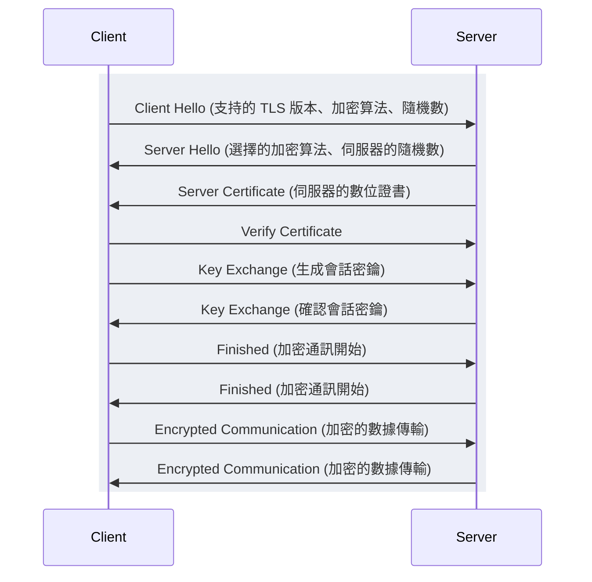
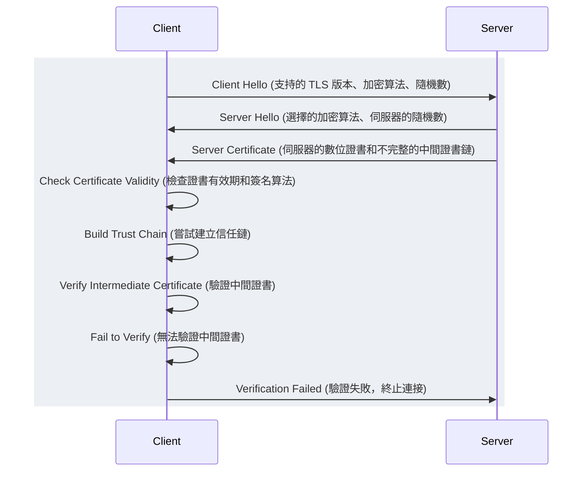
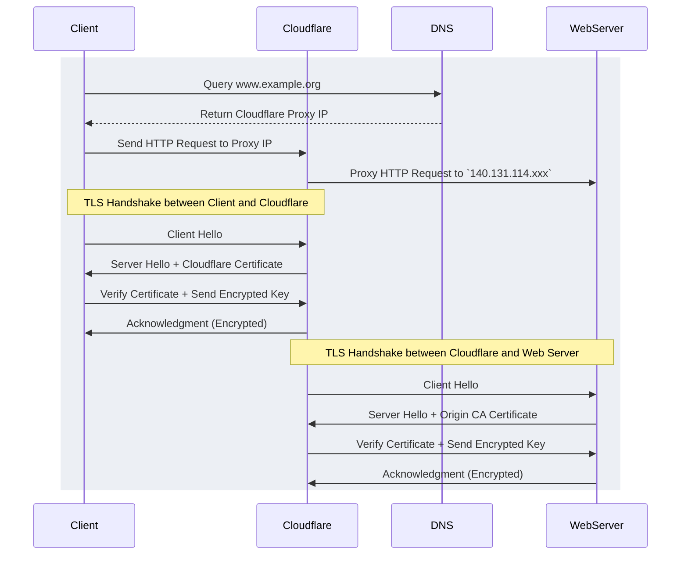
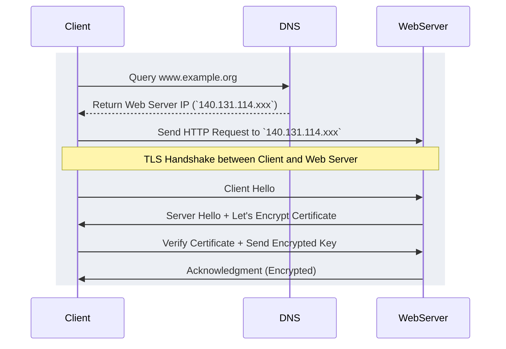
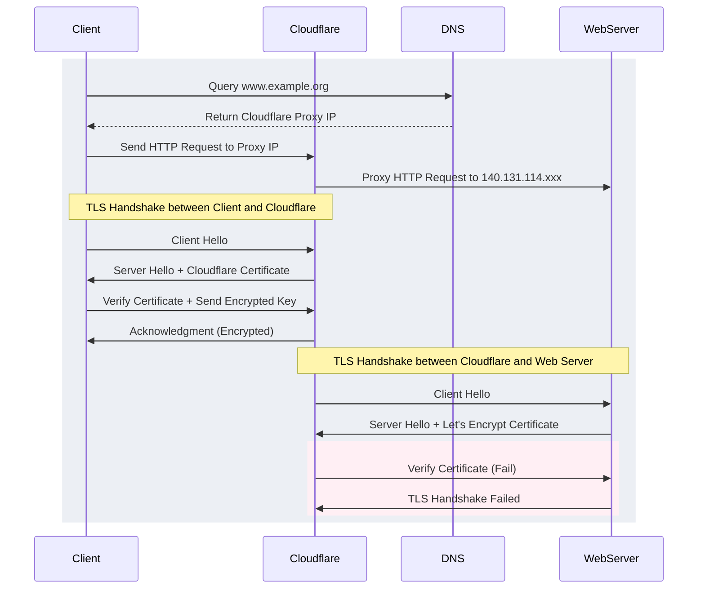

因為[工作需要部署 grafana](./../grafana_embed_example)，重新認識了 TLS 的流程，藉此機會把學習過程紀錄下來。

主要分為理論與案例分享兩個大章節，[理論章節](#理論)主要是在講「應該要知道但學過就會忘」的內行，[案例分享](#案例分享)則為這一次部署 grafana 時的經驗分享。

## 理論

### 介紹

#### TLS 是什麼

TLS（Transport Layer Security，傳輸層安全協議）是用來保護互聯網通訊安全的協議。它能夠確保數據在互聯網上傳輸過程中的機密性、完整性和真實性。TLS 是從 SSL（Secure Sockets Layer）發展而來的，因此我們可能也可以把它稱為 SSL/TLS。

#### 為什麼需要 TLS

在現代互聯網環境中，數據安全性變得至關重要。無論是電商、網路銀行或是社交平台，都需要確保用戶的機敏資訊不會被攔截或篡改。TLS 可以加密通訊內容，防止第三方竊聽，並且能驗證通訊雙方的身份，防止中間人攻擊（MITM）。

#### TLS 的應用場景

TLS 被廣泛應用於各種需要保護數據傳輸的場景，包括但不限於：

- 網站和應用程式的 HTTPS 通訊
- 電子郵件的加密傳輸（如 SMTPS、IMAPS、POP3S）
- VPN 通訊
- 即時消息應用程式
- 各類雲服務和 API

### TLS 基本概念

#### 公鑰加密和私鑰加密

公鑰加密和私鑰加密是 TLS 的基礎。每個參與通訊的實體都擁有一對密鑰：公鑰和私鑰。公鑰是公開的，任何人都可以用來加密信息，而私鑰是保密的，只有擁有者可以用來解密信息。這樣的機制確保了即使加密信息被攔截，也只有擁有私鑰的人能夠解密，細節可以回顧密碼學或計算機概論。

#### 對稱加密和非對稱加密

對稱加密使用相同的密鑰來加密和解密數據，而非對稱加密則使用一對密鑰（公鑰和私鑰）。TLS 結合了這兩種加密方式：在握手階段使用非對稱加密來安全地交換對稱加密的密鑰，之後的通訊則使用對稱加密來提高效率。

#### 數位證書和證書授權機構（CA）

數位證書是用來證明公鑰擁有者身份的電子文件，通常由證書授權機構（CA）簽發。證書包含公鑰、擁有者信息以及 CA 的數字簽名。瀏覽器和其他應用程式可以驗證證書的真實性，確保通訊對象的身份。

數位證書的主要類型有：

1. **域名驗證（DV）證書**：僅驗證域名的所有權。
1. **組織驗證（OV）證書**：除了驗證域名，還驗證組織的合法性。
1. **擴展驗證（EV）證書**：提供最高級別的驗證，包括嚴格的身份檢查，瀏覽器地址欄顯示綠色的公司名稱。

### TLS 的工作原理

#### 握手過程（Handshake Process）

TLS 握手過程是建立安全連接的第一步，確保通訊雙方能夠安全地交換加密信息。握手過程大致分為以下幾個步驟：

1. **客戶端問候（Client Hello）**：客戶端發送一個問候消息給伺服器，包含支持的 TLS 版本、加密算法、隨機數和其他必要信息。
1. **伺服器問候（Server Hello）**：伺服器回應客戶端的問候消息，選擇一個加密算法，並發送伺服器的隨機數。
1. **伺服器證書（Server Certificate）**：伺服器發送其數位證書給客戶端，用於驗證伺服器的身份。證書包含伺服器的公鑰和由 CA 簽名的證書。
1. **密鑰交換（Key Exchange）**：伺服器和客戶端交換密鑰信息，使用非對稱加密算法（如 RSA、ECDHE）安全地生成會話密鑰。這個會話密鑰將用於之後的對稱加密通訊。
1. **加密通訊（Encrypted Communication）**：客戶端和伺服器使用協商好的會話密鑰進行加密通訊。這確保了後續的數據傳輸是安全的。



#### 加密協議和加密算法

TLS 支持多種加密協議和算法，包括：

- **對稱加密算法**：如 AES、ChaCha20，用於加密通訊內容。
- **非對稱加密算法**：如 RSA、ECDHE，用於密鑰交換和數位簽名。
- **雜湊算法**：如 SHA-256、SHA-3，用於數據完整性檢查。

不同的加密算法具有不同的性能和安全性特徵，TLS 會根據具體情況選擇最合適的算法組合。

### 認證和驗證過程

在 TLS 握手過程中，客戶端會驗證伺服器的數位證書，以確保其身份的真實性。這個過程包括檢查證書的有效性、確認 CA 的信任鏈以及驗證伺服器的公鑰。

至於伺服器是如何驗證 TLS 的有效性，雖然不常直接建立一個 https server，較常使用 TLS Termination（或稱 SSL Termination），我們仍可以透過這個案例來理解伺服器端的 TLS 流程。

- 當我們呼叫 [`http.ListenAndServeTLS(xxx, xxx)`]((https://pkg.go.dev/net/http#Server.ServeTLS))

   ```go
   func (srv *Server) ServeTLS(l net.Listener, certFile, keyFile string) error {
      // Setup HTTP/2 before srv.Serve, to initialize srv.TLSConfig
      // before we clone it and create the TLS Listener.
      if err := srv.setupHTTP2_ServeTLS(); err != nil {
         return err
      }

      config := cloneTLSConfig(srv.TLSConfig)
      if !strSliceContains(config.NextProtos, "http/1.1") {
         config.NextProtos = append(config.NextProtos, "http/1.1")
      }

      configHasCert := len(config.Certificates) > 0 || config.GetCertificate != nil
      if !configHasCert || certFile != "" || keyFile != "" {
         var err error
         config.Certificates = make([]tls.Certificate, 1)
         config.Certificates[0], err = tls.LoadX509KeyPair(certFile, keyFile)
         if err != nil {
            return err
         }
      }

      tlsListener := tls.NewListener(l, config)
      return srv.Serve(tlsListener)
   }
   ```

- 會建立一個 [`tls.Listener`](https://pkg.go.dev/crypto/tls#Server)

   ```go
   func NewListener(inner net.Listener, config *Config) net.Listener {
      l := new(listener)
      l.Listener = inner
      l.config = config
      return l
   }
   ```

- 由這個 Listener 實做的 `Accept()` 會呼叫 `Serve()` 並指定 `handshakeFn`

```go
func (l *listener) Accept() (net.Conn, error) {
    c, err := l.Listener.Accept()
    if err != nil {
        return nil, err
    }
    return Server(c, l.config), nil
}

func Server(conn net.Conn, config *Config) *Conn {
    c := &Conn{
        conn:   conn,
        config: config,
    }
    c.handshakeFn = c.serverHandshake
    return c
}
```

- 並在裡面進行上述的握手流程

```go
// serverHandshakeState contains details of a server handshake in progress. It's discarded once the handshake has completed.
type serverHandshakeState struct {
    c            *Conn
    ctx          context.Context
    clientHello  *clientHelloMsg
    hello        *serverHelloMsg
    suite        *cipherSuite
    ecdheOk      bool
    ecSignOk     bool
    rsaDecryptOk bool
    rsaSignOk    bool
    sessionState *SessionState
    finishedHash finishedHash
    masterSecret []byte
    cert         *Certificate
}

func (hs *serverHandshakeState) checkForResumption() error
func (hs *serverHandshakeState) cipherSuiteOk(c *cipherSuite) bool
func (hs *serverHandshakeState) doFullHandshake() error
func (hs *serverHandshakeState) doResumeHandshake() error
func (hs *serverHandshakeState) establishKeys() error
func (hs *serverHandshakeState) handshake() error
func (hs *serverHandshakeState) pickCipherSuite() error
func (hs *serverHandshakeState) processClientHello() error
func (hs *serverHandshakeState) readFinished(out []byte) error
func (hs *serverHandshakeState) sendFinished(out []byte) error
func (hs *serverHandshakeState) sendSessionTicket() error
```

#### CA Chain（證書授權鏈）

證書授權鏈（CA Chain）是指從伺服器證書到根證書之間的一系列中間證書。這些中間證書由不同的證書授權機構（CA）簽發，形成一條信任鏈，最終由根證書（由受信任的根 CA 簽發）作為信任的起點。

理解 CA Chain 的幾個關鍵概念：

1. **根證書（Root Certificate）**：由根 CA 簽發的自簽名證書，位於信任鏈的頂端。根 CA 通常是受信任的機構，其證書預裝在操作系統和瀏覽器中。
1. **中間證書（Intermediate Certificate）**：由根 CA 或其他中間 CA 簽發，用於簽發伺服器證書。中間證書增加了證書管理的靈活性和安全性。如果某個中間證書被撤銷，並不會影響到根證書和其他中間證書。
1. **伺服器證書（Server Certificate）**：由中間 CA 簽發，證明伺服器的身份。這是客戶端在 TLS 握手過程中收到的證書。

#### CA Chain 的驗證過程

在 TLS 握手過程中，客戶端會進行以下步驟來驗證 CA Chain：

1. **接收伺服器證書**：客戶端從伺服器接收伺服器證書和可能的中間證書。
1. **檢查證書有效性**：客戶端檢查證書的有效期、簽名算法和其他相關信息，確保證書在有效期內且未被撤銷。
1. **建立信任鏈**：客戶端從伺服器證書開始，逐步驗證每個中間證書，直到達到根證書。每個中間證書必須由上一層的 CA 簽名，最終的根證書必須在客戶端的信任存儲中。
1. **驗證根證書**：確保根證書是受信任的，通常由操作系統或瀏覽器預裝的根 CA 列表中找到。

失敗的驗證流程：Root CA 與 Server CA 不在同一個 Chain，在驗證過程中，如果伺服器證書與根證書之間的中間證書不完整或無法建立信任鏈，驗證過程會失敗。例如：

1. **接收伺服器證書**：客戶端接收到伺服器證書和一個不完整的中間證書鏈。
1. **檢查證書有效性**：客戶端檢查證書的有效期和簽名算法。
1. **建立信任鏈失敗**：客戶端嘗試從伺服器證書建立信任鏈，但中間證書缺失或不正確，無法連接到受信任的根證書。
1. **驗證失敗**：客戶端無法找到根證書或中間證書的簽名不匹配，導致無法建立完整的信任鏈，最終導致 TLS 握手失敗。



#### 範例圖示

以下是一個簡單的 CA Chain 圖示：

```plain
根 CA (Root CA)
   └── 中間 CA 1 (Intermediate CA 1)
         └── 中間 CA 2 (Intermediate CA 2)
               └── 伺服器證書 (Server Certificate)
```

每個箭頭表示「簽發」，即上層 CA 簽發下層證書。在這個鏈條中，只要每個中間證書和根證書都是有效的並且可信，整個鏈條就被認為是可信的。

#### 常見問題

1. **中間證書遺失**：如果伺服器沒有提供完整的中間證書鏈，客戶端可能無法建立完整的信任鏈，導致驗證失敗。這通常可以通過正確配置伺服器來解決，確保伺服器提供完整的 CA Chain。
1. **根證書過期或撤銷**：如果根證書過期或被撤銷，所有由其簽發的證書將不再被信任。這種情況下，CA 通常會提前發布新的根證書並通知用戶更新。

TLS 版本與安全性

TLS（Transport Layer Security）自其前身 SSL（Secure Sockets Layer）以來，已經經歷了多個版本的演進，每一個新版本都針對前一版本的漏洞進行了修復和改進。我們來探討各個 TLS 版本的差異、最佳實踐與安全配置，以及如何避免常見的 TLS 漏洞。

### TLS 版本與安全性

TLS（Transport Layer Security）自其前身 SSL（Secure Sockets Layer）以來，已經經歷了多個版本的演進，每一個新版本都針對前一版本的漏洞進行了修復和改進。我們來探討各個 TLS 版本的差異、最佳實踐與安全配置，以及如何避免常見的 TLS 漏洞。

#### TLS 各版本的差異

1. **SSL 2.0 和 SSL 3.0**
   - SSL 2.0 於 1995 年發布，但存在多個安全漏洞，很快被 SSL 3.0 取代。
   - SSL 3.0 引入了許多安全改進，但在 2014 年被發現存在 POODLE 漏洞。
1. **TLS 1.0**
   - 於 1999 年發布，作為 SSL 3.0 的繼任者，解決了一些已知的漏洞。
   - 仍然存在一些設計缺陷，如脆弱的 MAC（訊息認證碼）算法。
1. **TLS 1.1**
   - 於 2006 年發布，改進了對 CBC（密碼塊鏈結）模式攻擊的防護。
   - 仍然存在一些安全性不足的問題。
1. **TLS 1.2**
   - 於 2008 年發布，帶來了顯著的安全改進：
     - 引入了 AEAD（帶認證的加密）算法，如 GCM（Galois/Counter Mode）。
     - 改進了哈希算法的使用，允許使用 SHA-256。
     - 提供更靈活的加密協商機制。
   - 成為主流應用中最廣泛使用的版本。
1. **TLS 1.3**
   - 於 2018 年發布，是對 TLS 協議的重大升級：
     - 簡化了握手流程，減少了延遲，提升了性能。
     - 僅支持 AEAD 算法，淘汰了不安全的加密算法。
     - 強制前向保密（Forward Secrecy），提高了長期安全性。
     - 移除了不必要的功能和不安全的特性。

#### 最佳實踐與安全配置

1. **禁用舊版協議**
   - 禁用 SSL 2.0、SSL 3.0、TLS 1.0 和 TLS 1.1，僅支持 TLS 1.2 和 TLS 1.3。
1. **選擇安全的加密套件**
   - 僅啟用強加密算法，如 AES-GCM、CHACHA20-POLY1305。
   - 禁用已知不安全或弱加密算法，如 RC4、3DES。
1. **啟用前向保密（Forward Secrecy）**
   - 使用 ECDHE（橢圓曲線 Diffie-Hellman Ephemeral）或 DHE（Diffie-Hellman Ephemeral）進行密鑰交換，確保即使私鑰洩露，過去的通訊內容仍然安全。
1. **使用強雜湊算法**
   - 選擇 SHA-256 或更高級別的雜湊算法，避免使用 SHA-1 和 MD5。
1. **正確配置證書**
   - 使用受信任的 CA 簽發的證書，定期更新和更換證書。
   - 啟用 OCSP（Online Certificate Status Protocol）和/或 CRL（證書撤銷列表）檢查。

#### 如何避免常見的 TLS 漏洞

1. **防止中間人攻擊（MITM）**：嚴格驗證伺服器證書的真實性，使用 HSTS（HTTP Strict Transport Security）強制使用 HTTPS。HSTS 可以有效防止中間人攻擊，確保瀏覽器總是使用 HTTPS 連接到網站。
   - [AppSec Monkey](https://www.appsecmonkey.com/blog/mitm)
   - [Virtue Security](https://www.virtuesecurity.com/the-do-and-donts-of-hsts/)

   ```mermaid
   sequenceDiagram
      participant Client
      participant Attacker
      participant Server

      rect rgb(236,239,244)
      Client->>Attacker: Client Hello
      Attacker->>Server: Client Hello (偽裝成客戶端)
      Server->>Attacker: Server Hello + Certificate
      Attacker->>Client: Server Hello + 攔截的 Certificate (偽裝成伺服器)
      Client->>Attacker: Encrypted Data
      Attacker->>Server: Encrypted Data (解密並重新加密)
      Server->>Attacker: Encrypted Response
      Attacker->>Client: Encrypted Response (解密並重新加密)

      Note over Client,Server: 使用 HSTS 強制 HTTPS 連接可以防止這種攻擊。
      end
   ```

1. **防止 POODLE 攻擊**：禁用 SSL 3.0 協議。POODLE 攻擊利用了 SSL 3.0 的漏洞，因此禁用該協議可以有效防止此類攻擊。
   - [What Is POODLE Attack](https://www.acunetix.com/blog/web-security-zone/what-is-poodle-attack/).
1. **防止 BEAST 攻擊**：升級到 TLS 1.1 或更高版本，並使用安全的加密套件。BEAST 攻擊針對的是 TLS 1.0，因此升級到更高版本可以避免此攻擊
   - [BEAST Attack](http://securityalley.blogspot.com/2014/07/ssltls-beast.html).
1. **防止 CRIME 和 BREACH 攻擊**：禁用 TLS 壓縮，避免在 HTTPS 中暴露敏感數據。CRIME 和 BREACH 攻擊利用了壓縮數據的特性，因此禁用壓縮可以防止這些攻擊。
   - [CRIME Attack Explained](https://www.imperva.com/learn/application-security/crime-suppression/).
1. **防止心臟出血（Heartbleed）漏洞**：確保使用最新版本的 OpenSSL 並及時打補丁。Heartbleed 漏洞使攻擊者能夠讀取伺服器內存中的敏感數據，因此使用最新的 OpenSSL 版本和補丁是防止此漏洞的最佳方法。
   - [Heartbleed Bug](https://heartbleed.com/).

   ```mermaid
   sequenceDiagram
   rect rgb(236,239,244)
      participant Client
      participant Attacker
      participant Server

      Client->>Server: Heartbeat Request (利用 Heartbleed 漏洞)
      Server->>Attacker: Server Memory Data (敏感信息洩露)

      Note over Client,Server: 使用最新版本的 OpenSSL 並及時打補丁可以防止 Heartbleed 漏洞。
      end
   ```

1. **防止 RC4 攻擊**：禁用 RC4 加密算法，使用更安全的替代算法。RC4 加密算法已被證明是不安全的，因此應該禁用，改用 AES-GCM 或 ChaCha20-Poly1305 等更安全的算法。
   - [RC4 is Broken: Now What?](https://www.keycdn.com/blog/rc4-is-broken)

### 故障排除與診斷

即使配置了 TLS，有時候也會遇到各種各樣的問題。這一章將介紹常見的 TLS 錯誤及其解決方法，並提供一些工具來幫助診斷和解決這些問題。

#### 常見錯誤與解決方法

1. **證書無效（Invalid Certificate）**
   - **原因**：證書過期、證書不匹配域名、證書被撤銷等。
   - **解決方法**：檢查證書的有效期，確保證書與域名匹配，並確認證書未被撤銷。如果證書過期，重新申請和配置新的證書。
1. **中間證書遺失（Missing Intermediate Certificate）**
   - **原因**：伺服器未配置完整的證書鏈。
   - **解決方法**：確保伺服器配置了完整的證書鏈，包含所有必要的中間證書。可以從 CA 提供的證書包中獲取這些中間證書。
1. **不受信任的證書（Untrusted Certificate）**
   - **原因**：伺服器使用的證書不是由受信任的 CA 簽發，或者中間證書未正確配置。
   - **解決方法**：檢查伺服器的證書鏈，確保所有中間證書都已正確配置。如果是自簽名證書，客戶端需要手動信任該證書。
1. **TLS 協議不匹配（Protocol Mismatch）**
   - **原因**：客戶端和伺服器支持的 TLS 協議版本不一致。
   - **解決方法**：檢查並確保客戶端和伺服器支持的 TLS 協議版本一致。建議升級到最新的 TLS 版本。
1. **弱加密算法（Weak Cipher Suite）**
   - **原因**：伺服器配置了不安全的加密算法。
   - **解決方法**：更新伺服器配置，只啟用強加密算法，如 AES-GCM 和 CHACHA20-POLY1305，禁用弱加密算法如 RC4 和 3DES。

#### 使用工具診斷問題

1. **OpenSSL**
   - OpenSSL 是一個強大的工具，用於生成、管理和診斷 SSL/TLS 證書。可以使用 `openssl s_client` 命令來測試與伺服器的 TLS 連接。

    ```bash
    openssl s_client -connect www.example.org:443 -showcerts
    ```

1. **Wireshark**
   - Wireshark 是一個網絡協議分析工具，可以用來捕獲和分析 TLS 流量，幫助診斷握手過程中的問題。
   - 可以使用 Wireshark 捕獲 TCP 流量，並在解析中查看 TLS 握手過程：
      1. **捕獲流量**
         - 使用 Wireshark 捕獲客戶端與伺服器之間的網絡流量。
         - 設置過濾器來只捕獲 TLS 流量，例如 `tcp.port == 443`。
      1. **分析握手過程**
         - 在 Wireshark 中查看捕獲的 TLS 握手包，檢查 Client Hello 和 Server Hello 消息。
         - 確認握手過程中沒有出現錯誤消息，如握手失敗或證書驗證失敗。
      1. **檢查證書信息**
         - 在 Wireshark 中查看伺服器發送的證書，檢查證書鏈的完整性和有效性。
         - 確認證書的詳細信息，如發行者、主體和有效期。
1. **SSL Labs**
   - SSL Labs 提供了在線 SSL 測試工具，可以對網站的 SSL/TLS 配置進行全面分析，並提供改進建議。
   - 使用 SSL Labs 檢查網站：
     [SSL Labs Online Tool](https://www.ssllabs.com/ssltest/)

#### 日誌分析與調試

- **伺服器日誌**
  - 檢查 Web 伺服器的日誌文件，可以找到 TLS 相關錯誤信息。
  - 尋找與 SSL/TLS 相關的錯誤消息，這些信息通常會指示出問題的根本原因。

- **客戶端日誌**
  - 檢查客戶端應用程序的日誌，可以幫助識別與伺服器建立連接時的問題。
  - 特別是瀏覽器的開發者工具，可以在網絡選項卡中查看 SSL/TLS 錯誤。

#### 不受信任的證書（Untrusted Certificate）除錯

1. **檢查證書鏈**
   - 使用 OpenSSL 檢查證書鏈，確保所有中間證書和根證書都是有效的且已正確配置。
1. **驗證證書**
   - 驗證伺服器證書是否由受信任的 CA 簽發。如果使用自簽名證書，確保客戶端已手動信任該證書。
   - 檢查證書的有效期、域名匹配和簽名算法。
1. **瀏覽器診斷**
   - 在瀏覽器中訪問網站，查看詳細的證書信息。
   - 在瀏覽器地址欄點擊安全鎖圖標，查看證書詳情和信任鏈。

1. **更新根證書庫**
   - 如果是本地開發環境，檢查客戶端的根證書庫，確保包含最新的根 CA 證書。
   - 更新操作系統和瀏覽器，確保其包含最新的根 CA 證書。

### 結論

TLS 是現代網絡安全的重要基石，保護了數據在互聯網上的傳輸過程，確保其機密性、完整性和真實性。本文詳細介紹了 TLS 的基本概念、工作原理、版本與安全性，以及如何進行故障排除與診斷，並通過案例研究展示了成功的 TLS 部署和常見的錯誤配置。

#### 總結現代 TLS 的重要性

在如今的數據驅動世界中，無論是個人用戶還是企業，都必須重視數據的安全性。TLS 不僅保護了用戶的隱私，還增強了用戶對網站和應用的信任。隨著網絡攻擊手段的不斷升級，保持對最新安全技術和最佳實踐的了解至關重要。

#### 推薦的學習資源和工具

為了深入理解和掌握 TLS，以下是一些推薦的學習資源和工具：

1. **官方文檔與標準**
   - [IETF RFC 8446 - The Transport Layer Security (TLS) Protocol Version 1.3](https://tools.ietf.org/html/rfc8446)
   - [Mozilla's Server-Side TLS](https://wiki.mozilla.org/Security/Server_Side_TLS)
1. **在線課程與書籍**
   - [Coursera - Cryptography](https://www.coursera.org/learn/crypto)
   - 《SSL and TLS: Theory and Practice》by Rolf Oppliger
1. **工具和實踐**
   - [Let's Encrypt](https://letsencrypt.org/)：免費、開源的 SSL/TLS 證書提供者。
   - [Certbot](https://certbot.eff.org/)：自動化證書申請與管理工具。
   - [OpenSSL](https://www.openssl.org/)：開源的 SSL/TLS 工具和庫。
   - [Wireshark](https://www.wireshark.org/)：網絡協議分析工具。
   - [SSL Labs](https://www.ssllabs.com/ssltest/)：在線 SSL 測試工具，提供詳細的安全分析報告。

### 營利組織（例如 Cloudflare）與非營利組織（例如 Let's Encrypt）簽署 CA 的優劣分析

在選擇 SSL/TLS 證書提供者時，了解營利組織和非營利組織的優勢和劣勢是至關重要的。以下是對 Cloudflare（作為營利組織的代表）和 Let's Encrypt（作為非營利組織的代表）的簽署 CA 的優劣分析。

#### 營利組織：Cloudflare

- **優勢**
    1. **高級支持和服務**
        - Cloudflare 提供專業的客戶支持，包括技術支持和問題解決，特別是針對付費客戶。
        - 企業級客戶可享受 24/7 的支持服務，確保問題能夠及時解決。
    1. **綜合安全解決方案**
        - 除了 SSL/TLS 證書，Cloudflare 還提供其他安全服務，如 DDoS 防護、Web 應用防火牆（WAF）、Bot 管理等。
        - 客戶可以獲得一體化的安全解決方案，減少多供應商整合的複雜性。
    1. **高性能和可靠性**
        - Cloudflare 擁有全球分佈的數據中心網絡，提供高速且可靠的內容分發網絡（CDN）。
        - 其 DNS 服務也是業界最快和最可靠的之一，確保網站的高可用性和低延遲。
    1. **靈活的證書管理**
        - Cloudflare 支持自動化的證書管理，包括證書申請、更新和撤銷。
        - 針對高級用戶，提供自定義的證書選項和靈活的配置。
- **劣勢**
    1. **費用**
        - 高級和企業級服務通常伴隨較高的費用，對小型企業或個人開發者來說可能成本較高。
        - 即使是免費方案，某些高級功能也需要付費訂閱。
    1. **鎖定效應**
        - 使用 Cloudflare 的綜合解決方案可能導致供應商鎖定，切換供應商的成本較高。
        - 客戶可能需要適應 Cloudflare 的特定技術和配置要求。

#### 非營利組織：Let's Encrypt

- **優勢**
    1. **免費使用**
        - Let's Encrypt 提供完全免費的 SSL/TLS 證書，適合個人網站、小型企業和非營利組織。
        - 無需支付任何費用即可獲取和更新證書，降低了 SSL/TLS 部署的成本。
    1. **自動化和易用性**
        - Let's Encrypt 提供自動化的證書申請和更新工具（如 Certbot），簡化了證書管理流程。
        - 自動化工具減少了人工干預，降低了管理複雜性和出錯風險。
    1. **廣泛支持**
        - Let's Encrypt 的根證書被所有主要瀏覽器和操作系統所信任，確保其廣泛兼容性。
        - 社區支持活躍，提供大量的教程和幫助資源。
    1. **開源和透明**
        - Let's Encrypt 是開源項目，所有的運行原則和代碼都是公開透明的。
        - 社區和用戶可以檢查和貢獻代碼，增強了信任和安全性。
- **劣勢**
    1. **支持和服務限制**
        - Let's Encrypt 沒有提供專業的技術支持，主要依賴社區和文檔。
        - 對於需要專業支持和服務的企業，用戶可能需要自行解決問題或尋求第三方幫助。
    1. **功能有限**
        - Let's Encrypt 僅提供域名驗證（DV）證書，不支持組織驗證（OV）或擴展驗證（EV）證書。
        - 對於需要高級證書驗證和顯示綠色地址欄的網站，用戶可能需要選擇其他 CA。
    1. **證書管理複雜性**
        - 雖然 Let's Encrypt 提供自動化工具，但仍需要用戶進行一定的配置和維護。
        - 對於不熟悉命令行工具的用戶，初次設置可能具有挑戰性。

詳細可以參考 reddit 的文章 [Why isn’t Let’s Encrypt used by large sites?](https://www.reddit.com/r/selfhosted/comments/1dfqs5w/why_isnt_lets_encrypt_used_by_large_sites/)

選擇 SSL/TLS 證書提供者時，需要考慮多方面的因素。營利組織如 Cloudflare 提供全面的安全解決方案和高級支持，適合大型企業和需要高級服務的客戶。然而，其費用較高，且可能導致供應商鎖定。

非營利組織如 Let's Encrypt 則提供免費、開源和易於使用的證書解決方案，適合個人、小型企業和非營利組織。雖然功能和支持有所限制，但其低成本和高透明度使其成為普遍受歡迎的選擇。

根據具體需求和資源，選擇合適的證書提供者，可以有效提升網站的安全性和用戶信任度。

但我自己是會追蹤 [Let's Encrypt 的 Blog](https://letsencrypt.org/blog/)，有一些 Self Hosted 才會遇到的小知識。

## 案例分享

### 使用 Cloudflare 進行 TLS 代理

假設我們有一個網站，其 IPv4 位址為 `140.131.114.xxx`，透過 Cloudflare 作為 DNS 服務，並使用 A 記錄進行代理（Proxy）。網站的域名為 [www.example.org，Cloudflare](http://www.example.org，Cloudflare) 的 TLS 加密模式設為 Full，並使用 Cloudflare 的 Origin CA 簽署證書給 `www.example.org`。

#### DNS 解析和代理過程

1. **DNS 解析**
   - 當客戶端訪問 `www.example.org` 時，首先會向 DNS 伺服器請求解析域名。
   - DNS 伺服器返回 Cloudflare 的代理 IP 地址，而非網站的真實 IP 地址。
1. **向 Cloudflare 發送請求**
   - 客戶端向 Cloudflare 的代理 IP 發送 HTTP 請求。
1. **Cloudflare 代理到 Web 伺服器**
   - Cloudflare 接收到客戶端請求後，會將請求轉發（Proxy）到真實的 Web 伺服器（`140.131.114.xxx`）。

#### TLS Proxy 握手過程

1. **客戶端與 Cloudflare 的 TLS 握手**
   - 客戶端與 Cloudflare 進行 TLS 握手，確保到 Cloudflare 的通訊是加密的。
   - 客戶端發送 Client Hello 給 Cloudflare。
   - Cloudflare 回應 Server Hello，並發送自己的數位證書。
   - 客戶端驗證 Cloudflare 的證書，生成對稱密鑰並加密傳輸給 Cloudflare。
   - 雙方完成握手，建立加密通訊通道。
1. **Cloudflare 與 Web 伺服器的 TLS 握手**
   - Cloudflare 代理請求到 Web 伺服器，與其進行 TLS 握手。
   - Cloudflare 發送 Client Hello 給 Web 伺服器。
   - Web 伺服器回應 Server Hello，並發送由 Cloudflare 的 Origin CA 簽署的數位證書。
   - Cloudflare 驗證 Web 伺服器的證書，生成對稱密鑰並加密傳輸給 Web 伺服器。
   - 雙方完成握手，建立加密通訊通道。



設定範例

- **Cloudflare 設定**
    1. 在 Cloudflare 控制台中，將 `www.example.org` 的 DNS 記錄設為 A 記錄，指向 Cloudflare 的代理 IP，並啟用 Proxy 功能。
    1. TLS 設定中選擇 Full 模式，並使用 Cloudflare Origin CA 簽署證書給 Web 伺服器。
- **Web 伺服器設定**
    1. 在 Web 伺服器上配置 Cloudflare Origin CA 簽署的證書。
    1. 確保 Web 伺服器支持 TLS 並啟用了 HTTPS。

客戶端請求流程

1. 客戶端向 DNS 伺服器請求解析 `www.example.org`。
1. DNS 伺服器返回 Cloudflare 的代理 IP。
1. 客戶端向 Cloudflare 發送 HTTP 請求，並與 Cloudflare 進行 TLS 握手。
1. Cloudflare 接收到請求後，代理請求到 Web 伺服器，並與 Web 伺服器進行 TLS 握手。
1. Cloudflare 獲取 Web 伺服器的響應，將加密的數據返回給客戶端。

這樣的設計確保了客戶端與 Cloudflare 之間以及 Cloudflare 與 Web 伺服器之間的通訊都是加密的，有效保護了數據的安全性。

### 使用 Cloudflare 作為 DNS（DNS Only）和 Let's Encrypt 簽署證書

假設我們有一個網站，其 IPv4 位址為 `140.131.114.xxx`，透過 Cloudflare 作為 DNS 服務，並使用 A 記錄但不啟用代理（DNS Only）。網站的域名為 `www.example.org`，使用 Let's Encrypt 簽署的 SSL/TLS 證書。

#### DNS 解析過程

- 當客戶端訪問 `www.example.org` 時，首先會向 DNS 伺服器請求解析域名。
- DNS 伺服器返回網站的真實 IP 地址（`140.131.114.xxx`）。

#### TLS **直接**握手過程

客戶端**直接**與 Web 伺服器的 TLS 握手

- 客戶端與 Web 伺服器直接進行 TLS 握手，確保通訊是加密的。
- 客戶端發送 Client Hello 給 Web 伺服器。
- Web 伺服器回應 Server Hello，並發送由 Let's Encrypt 簽署的數位證書。
- 客戶端驗證 Web 伺服器的證書，生成對稱密鑰並加密傳輸給 Web 伺服器。
- 雙方完成握手，建立加密通訊通道。



設定範例

- **Cloudflare 設定**：在 Cloudflare 控制台中，將 `www.example.org` 的 DNS 記錄設為 A 記錄，指向 Web 伺服器的真實 IP 地址（`140.131.114.xxx`），並關閉 Proxy 功能。
- **Web 伺服器設定**
   1. 應該要可以透過 `nslookup` 或 `dig` 查看到 `www.example.org` 已經指向 `140.131.114.xxx`。
   1. 檢查防火牆是否已經開啟 tcp 80 allow 0.0.0.0/0。
   1. 在 Web 伺服器上使用 certbot 等工具從 Let's Encrypt 獲取並配置 SSL/TLS 證書。我撰寫了一個腳本來執行這件事，同時可以 renew CA。

      ```bash
      #!/bin/bash

      local domain_name = www.example.org

      if [ ! -f /var/lib/letsencrypt/live/${domain_name}/privkey.pem ] || [ ! -f /var/lib/letsencrypt/live/${domain_name}/fullchain.pem ]; then
      docker run -p 80:80 --rm --name certbot \
            -v /var/lib/letsencrypt:/etc/letsencrypt \
            -v /var/lib/letsencrypt/log:/var/log/letsencrypt \
            certbot/certbot certonly --standalone --non-interactive --agree-tos --email no-reply@example.org -d ${domain_name}
      else
      docker run -p 80:80 --rm --name certbot \
         -v /var/lib/letsencrypt:/etc/letsencrypt \
         -v /var/lib/letsencrypt/log:/var/log/letsencrypt \
         certbot/certbot renew --non-interactive --quiet
      fi;

      cp /var/lib/letsencrypt/live/${domain_name}/privkey.pem /var/lib/grafana/grafana.key
      cp /var/lib/letsencrypt/live/${domain_name}/fullchain.pem /var/lib/grafana/grafana.crt

      chown 472:472 /var/lib/grafana/grafana.key /var/lib/grafana/grafana.crt
      chmod 400 /var/lib/grafana/grafana.key /var/lib/grafana/grafana.crt
      ```

   1. 確保 Web 伺服器支持 TLS 並啟用了 HTTPS。

客戶端請求流程

1. 客戶端向 DNS 伺服器請求解析 `www.example.org`。
1. DNS 伺服器返回 Web 伺服器的真實 IP 地址（`140.131.114.xxx`）。
1. 客戶端向 Web 伺服器發送 HTTP 請求，並直接與 Web 伺服器進行 TLS 握手。
1. Web 伺服器回應並提供由 Let's Encrypt 簽署的證書，客戶端驗證證書後建立加密通訊通道。

這樣的設計確保了客戶端與 Web 伺服器之間的通訊是加密的，而 Cloudflare 僅提供 DNS 解析服務。

### 使用 Cloudflare 進行 TLS 代理的失敗案例

假設我們有一個網站，其 IPv4 位址為 `140.131.114.xxx`，透過 Cloudflare 作為 DNS 服務，並使用 A 記錄進行代理（Proxy）。網站的域名為 `www.example.org`，Cloudflare 的 TLS 加密模式設為 Full。但是，伺服器上的證書並不是由 Cloudflare 的 Origin CA 簽署的，而是由 Let's Encrypt 簽署的。這種配置會導致 Cloudflare 與 Web 伺服器之間的 TLS 握手失敗。

DNS 解析和代理過程與[#使用 Cloudflare 進行 TLS 代理](#使用-cloudflare-進行-tls-代理)一致，差別在於握手過程的後半部份：

1. 客戶端與 Cloudflare 的 TLS 握手
   - 客戶端與 Cloudflare 進行 TLS 握手，確保到 Cloudflare 的通訊是加密的。
   - 客戶端發送 Client Hello 給 Cloudflare。
   - Cloudflare 回應 Server Hello，並發送自己的數位證書。
   - 客戶端驗證 Cloudflare 的證書，生成對稱密鑰並加密傳輸給 Cloudflare。
   - 雙方完成握手，建立加密通訊通道。
1. Cloudflare 與 Web 伺服器的 TLS 握手
   - Cloudflare 代理請求到 Web 伺服器，與其進行 TLS 握手。
   - Cloudflare 發送 Client Hello 給 Web 伺服器。
   - Web 伺服器回應 Server Hello，並發送由 Let's Encrypt 簽署的數位證書。
   - Cloudflare 嘗試驗證 Web 伺服器的證書，但因為證書不是由 Cloudflare 的 Origin CA 簽署的，驗證失敗。
   - TLS 握手失敗，無法建立加密通訊通道。



這個例子展示了當使用 Cloudflare 進行 DNS 代理但伺服器上的證書不是由 Cloudflare 簽署時，會導致 Cloudflare 與伺服器之間的 TLS 握手失敗。為了解決這個問題，應確保伺服器上的證書由 Cloudflare 的 Origin CA 簽署，或者調整 Cloudflare 的 TLS 加密模式以兼容其他 CA 簽署的證書。
