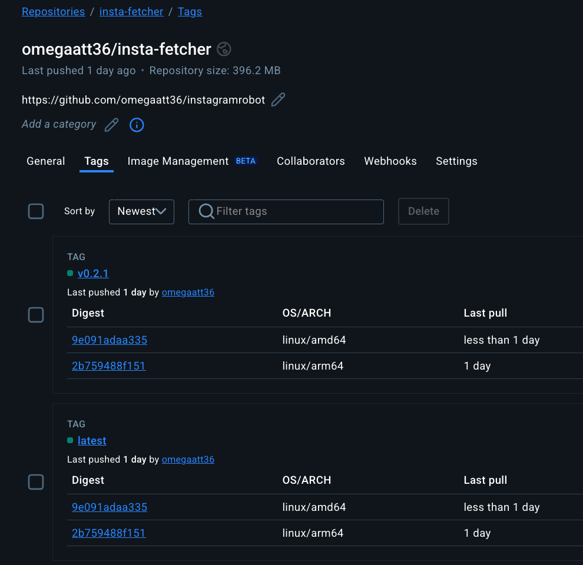
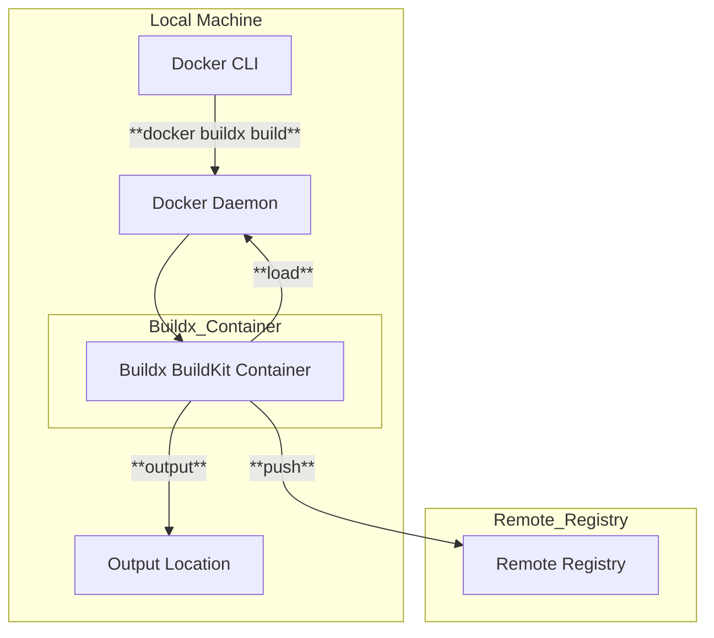
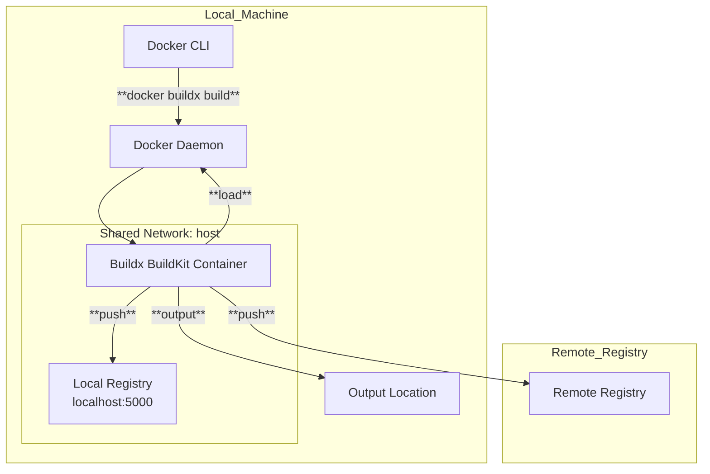

## 前言

最近在搞 side project 時，常常需要在不同的 CPU 架構上跑我的應用程式。例如，開發用的 MacBook 是 ARM 架構 (Apple Silicon)，開發用的 Desktop 是 x86 架構（Ryzen 5900X），而部署的伺服器可能是 x86 (AMD64)，有時候甚至想在 Raspberry Pi (ARM) 上跑些小東西。每次都要為不同平台分別建構 image 實在有點麻煩，而且 Registry 上一堆 `xxxapp-amd64`, `xxxapp-arm64` 的 tag 看了也很礙眼。經過一番研究與嘗試，是時候接觸 Docker Buildx 了。

## 為什麼需要多平台映像檔

在 wintel 的商業策略下，以及大家對高性能伺服器的普遍認知，主要用 x86/amd64，但現在 ARM 架構越來越普及，從 Apple Silicon 的 Mac、AWS Graviton 處理器、各種 IoT 設備到你的 Raspberry Pi，ARM 無所不在。如果你的 container image 只支援 amd64，那它就無法在這些 ARM 設備上原生運行 (需要模擬，效能差)。為了[Build Once, Run Anywhere](https://en.wikipedia.org/wiki/Write_once,_run_anywhere)，多平台映像檔 (Multi-platform images) 就是 meta。

## OCI 多平台映像檔架構簡述

其實不複雜。傳統的單一平台 image，它的 manifest 指向一組設定檔和一堆 layer。而多平台 image 則是透過一個 manifest list (索引) 指向多個特定平台的 manifest。每個特定平台的 manifest 才各自指向該平台的設定檔和 layer。


當你 pull 一個多平台 image 時，Docker daemon 會根據你主機的 CPU 架構，自動從 manifest list 中選擇對應平台的 manifest 來下載。例如你在 ARM 的機器上 pull，它就抓 linux/arm64 的版本；在 x86 的機器上 pull，就抓 linux/amd64 的版本。使用者無感，但底層是這樣運作的。

[](https://hub.docker.com/repository/docker/omegaatt36/insta-fetcher/tags)

## 介紹 Docker Buildx

Docker Buildx 是 Docker 公司推出的下一代建構工具，可以把它想成是 `docker build` 的強化版。它基於 BuildKit 專案，帶來了許多新功能，最重要的就是原生支援建構多平台映像檔。除此之外，還有更佳的快取機制、平行建構階段等優點。

### Buildx Builder、Docker Daemon 與 Registry

理解 Buildx 的運作方式，關鍵在於理解 "builder instance"。

預設情況下，`docker build` 使用的是 Docker daemon 內建的 builder。這個 builder 比較舊，功能也有限，特別是它通常只能建構與 daemon 所在主機相同架構的 image，而且無法直接產生多平台的 manifest list。

Buildx 則可以建立獨立的 builder instance。這些 builder instance 可以是：
1.  使用 Docker daemon 的 BuildKit (如果 daemon 支援)。
2.  啟動一個獨立的 BuildKit container。
3.  連接到遠端的 BuildKit daemon。

當你使用 Buildx 建立一個 builder instance (例如 `docker buildx create --name container-builder --use`)，後續的 `docker buildx build` 命令就會透過這個 builder 來執行。

重點來了：因為這個 builder instance 可能是一個獨立的 container 或遠端服務，它跟你的本機 Docker daemon 不一定是直接共享儲存空間的。這就解釋了為什麼 `docker buildx build` 行為跟 `docker build` 有些不同，特別是在處理建構結果時：

-   `--load`: 這個選項會將建構結果載入到你的 *本機 Docker daemon* 的 image store 中。但它有個限制：它 *只能* 載入與你本機 Docker daemon 架構 *相同* 的那個平台的 image。如果你建構了多平台 (`--platform=linux/amd64,linux/arm64`)，`--load` 只會載入符合你當前系統架構的那一個 (例如在 Apple Silicon Mac 上只會載入 arm64)，並且它載入的是單一平台的 image，不是 manifest list。
-   `--push`: 這個選項會在建構完成後，直接將結果 (包含 manifest list 和所有平台的 image layer) 推送到指定的 container registry。這是建構多平台 image 最常用的方式，因為 registry 原生就能儲存 manifest list。建構完的 image 不會出現在你本機的 `docker images` 列表裡 (除非你事後 pull 下來)。
-   `--output type=local,dest=path`: 這個選項可以將建構結果匯出到本機檔案系統，例如匯出成一個 tarball (`type=docker`) 或是直接匯出檔案系統 (`type=local`)。這比較少用在單純建構 image 的場景，但在 CI/CD 或需要對建構產物做後續處理時可能有用。

如果你要建構 *真正* 的多平台 image (一個 tag 對應多個平台)，最直接的方法就是使用 `docker buildx build ... --push`。如果只是想在本機測試某個特定平台的 image，可以用 `--platform=linux/arm64 --load` (假設你在 ARM 主機上)。



## 範例：使用 `omegaatt36/instagramrobot`

來實際操作一下，以我的 [instagramrobot](https://github.com/omegaatt36/instagramrobot) 專案為例。

### Docker 環境建立

要在本地建構多平台 image，你的環境需要能夠模擬目標平台的 CPU 指令集。

#### macOS (Apple Silicon)

在 Apple Silicon (ARM64) 的 Mac 上建構 x86 (AMD64) image 時，Docker Desktop 會自動使用 QEMU 進行模擬，但效能不是很好。推薦使用 [Colima](https://github.com/abiosoft/colima) 搭配 macOS 內建的 Virtualization Framework (`vz`) 作為虛擬化後端。vz 的效能通常比 QEMU 好得多。

安裝 Colima (假設已安裝 Homebrew):
`brew install colima docker docker-buildx`

啟動 Colima 並指定 vz 作為 VM 類型和啟用 Rosetta 以加速 x86 模擬 (如果可用):
`colima start --vm-type vz --arch x86_64 --vz-rosetta` (建構 x86)
或者
`colima start --vm-type vz --arch aarch64` (建構 ARM，原生速度)

可以建立多個 Colima instance 來模擬不同環境，由於我的開發機是 `Apple M4 (4+6) @ 4.46 GHz` 配合 16GB 記憶體，於是我會特別限制 colima 的 cpu 與 memory

```shell
colima start --kubernetes --vm-type vz --vz-rosetta --arch aarch64 --cpu 6 --memory 8
```

#### Linux

在 Linux 上，通常是 amd64 主機要建構 arm64 image。這需要 QEMU 和 `binfmt_misc` 的支援，讓核心知道如何執行非本地架構的二進位檔。最簡單的方式是執行 Docker 官方提供的工具來安裝 QEMU handlers：

```shell
docker run --privileged --rm tonistiigi/binfmt --install all
```

執行一次即可，它會設定好 `binfmt_misc`。

### 建立/查看 Docker Buildx Builder

檢查目前的 builder：
`docker buildx ls`

通常你會看到一個 `default` builder 和一個 `desktop-linux` (如果使用 Docker Desktop)。

```
❯ docker buildx ls
NAME/NODE                DRIVER/ENDPOINT    STATUS    BUILDKIT   PLATFORMS
colima*                   docker
 \_ colima                \_ colima         running   v0.17.3    linux/amd64 (+2), linux/arm64, linux/386
```

建議建立一個新的 builder instance 來使用 BuildKit 的完整功能：

```shell
docker buildx create --name container-builder --use
# Check again
docker buildx ls
```
你會看到 `container-builder` 現在是當前使用的 builder。

```shell
❯ docker buildx ls
NAME/NODE                DRIVER/ENDPOINT    STATUS    BUILDKIT   PLATFORMS
container-builder*       docker-container
 \_ container-builder0    \_ colima         running   v0.20.2    linux/amd64 (+2), linux/arm64, linux/386
colima                   docker
 \_ colima                \_ colima         running   v0.17.3    linux/amd64 (+2), linux/arm64, linux/386
```

### 建構多平台 Image

進入 `instagramrobot` 專案目錄，執行以下命令：

```shell
# Build for amd64 and arm64, tag it, and push to Docker Hub
# Replace 'yourdockerhubusername' with your actual Docker Hub username
docker buildx build \
  --platform linux/amd64,linux/arm64 \
  --tag yourdockerhubusername/insta-fetcher:latest \
  --tag yourdockerhubusername/insta-fetcher:0.1.0 \
  --push \
  .
```

這個命令會：
1.  使用 `container-builder` (當前 active 的 builder)。
2.  針對 `linux/amd64` 和 `linux/arm64` 兩個平台進行建構。
3.  將結果打上 `latest` 和 `0.1.0` 兩個 tag。
4.  `--push` 表示建構完成後直接推送到 Docker Hub (你需要先 `docker login`)。

建構過程會比較久，因為它需要分別為兩個平台編譯和打包，其中一個平台可能是透過 QEMU 模擬執行的。

### Dockerfile 適應多平台

雖然 Go 的交叉編譯很強大，很多時候不需要特別處理，但如果遇到需要根據目標平台做不同操作的情況 (例如安裝不同的依賴、使用 CGO、或是打包成特定平台的格式)，可以在 Dockerfile 中利用 BuildKit 提供的內建 ARG：`TARGETPLATFORM`, `TARGETOS`, `TARGETARCH`, `TARGETVARIANT`。

以 `instagramrobot` 的 `Dockerfile` 為例，它非常簡單，基本上不需要特別處理：

```dockerfile
# syntax=docker/dockerfile:1
FROM golang:1.24-bookworm as build

WORKDIR /go/src/app

COPY ["go.mod", "go.sum", "./"]

# Download dependencies
RUN ["go", "mod", "download"]

COPY . .

# Disable CGO, simple build
ENV CGO_ENABLED=0
# Go handles cross-compilation automatically here
RUN ["go", "build", "-o", "insta-fetcher", "cmd/bot/main.go"]

FROM gcr.io/distroless/static-debian12 as prod
# Base image gcr.io/distroless/static-debian12 is already multi-platform

WORKDIR /home/app/

# Copy the binary built in the 'build' stage
COPY --from=build /go/src/app/insta-fetcher ./

CMD ["./insta-fetcher"]

```

這個 Dockerfile 使用了 `golang:1.24-bookworm` 和 `gcr.io/distroless/static-debian12` 作為基礎映像檔，這兩個映像檔本身都是多平台的。Go 的編譯器也能自動處理交叉編譯 (因為 `CGO_ENABLED=0`)，所以不需要 `TARGETARCH`。

但如果需要處理更複雜的情況：

#### 1. 普通 Go Build (如果需要指定 Target)

雖然通常不需要，但如果你想明確指定：

```dockerfile
ARG TARGETOS
ARG TARGETARCH
RUN GOOS=${TARGETOS} GOARCH=${TARGETARCH} go build -o myapp .
```

#### 2. CGO 程式

如果你的 Go 程式使用了 CGO，事情就複雜了。

Dockerfile 可能會像這樣：

```dockerfile
ENV CGO_ENABLED=1
ARG GOLANG_VERSION=1.24
ARG TARGETARCH

RUN curl -fsSL https://golang.org/dl/go${GOLANG_VERSION}.linux-${TARGETARCH}.tar.gz | tar -C /usr/local -xzvf -

RUN go build -o myapp .
```

另外，在 Go source code 中，你可以使用 build tags 來條件性地包含 CGO 指令：

```go
package main

// #cgo linux,amd64 CFLAGS: -DX86_SPECIFIC
// #cgo linux,arm64 CFLAGS: -DARM_SPECIFIC
// #include <stdio.h>
// void print_arch() {
// #ifdef X86_SPECIFIC
//    printf("Building for AMD64\n");
// #elif defined(ARM_SPECIFIC)
//    printf("Building for ARM64\n");
// #else
//    printf("Building for unknown arch\n");
// #endif
// }
import "C"

func main() {
    C.print_arch()
}
```
`docker buildx build` 會根據 `--platform` 自動選擇對應的 `// #cgo` 標籤。

#### 3. 打包成 Debian (`.deb`)

如果你需要將應用打包成 `.deb` 檔，`DEBIAN/control` 文件中的 `Architecture` 欄位需要設定為目標平台的架構。你可以在 Dockerfile 中動態產生這個文件：

example control file:
```
Package: insta-fetcher
Architecture: {ARCH}
Description: instagram fetcher
Maintainer: Raiven Kao <omegaatt36@gmail.com>
Version: 0.2.1

```


```dockerfile
ARG TARGETARCH

RUN sed -i 's/{ARCH}/${TARGETARCH}/' ./pkg/DEBIAN/control

# Build the deb package
RUN dpkg-deb --build /pkg /output/insta-fetcher_linux_${TARGETARCH}.deb
```

### 整合到 GitHub Actions

要在 GitHub Actions 中建構多平台 image 非常簡單，利用官方提供的 action 即可。這是 `instagramrobot` 使用的工作流程片段：

```yaml
name: Docker Build and Push

on:
  release:
    types: [published]
  workflow_dispatch:
    inputs:
      branch:
        description: "Branch to release"
        required: true
      tag:
        description: "Tag to release"
        required: true

jobs:
  build-and-push:
    runs-on: ubuntu-latest # Runner is amd64
    steps:
      - name: Checkout code
        uses: actions/checkout@v4
        with:
          ref: ${{ github.event_name == 'release' && github.ref_name || github.event_name == 'workflow_dispatch' && github.event.inputs.branch || github.head_ref }}

      # Setup QEMU for multi-arch builds on amd64 runner
      - name: Set up QEMU
        uses: docker/setup-qemu-action@v3

      # Setup Buildx using a dedicated builder instance
      - name: Set up Docker Buildx
        uses: docker/setup-buildx-action@v3

      - name: Login to Docker Hub
        uses: docker/login-action@v3
        with:
          username: ${{ secrets.DOCKERHUB_USERNAME }}
          password: ${{ secrets.DOCKERHUB_TOKEN }}

      # Build and push multi-platform image
      - name: Build and Push
        uses: docker/build-push-action@v6
        with:
          push: true # Push to registry
          file: Dockerfile
          platforms: linux/amd64,linux/arm64 # Target platforms
          tags: | # Tags to apply
            omegaatt36/insta-fetcher:latest
            omegaatt36/insta-fetcher:${{ github.event_name == 'release' && github.ref_name || github.event_name == 'workflow_dispatch' && github.event.inputs.tag }}
          context: . # Build context path
```

這個 workflow 會：
1.  在 `ubuntu-latest` (amd64) runner 上執行。
2.  使用 `docker/setup-qemu-action` 設定 QEMU 模擬環境。
3.  使用 `docker/setup-buildx-action` 設定 Buildx。
4.  登入 Docker Hub。
5.  使用 `docker/build-push-action` 執行建構與推送，指定 `platforms` 為 `linux/amd64,linux/arm64`。

可以參考 [source code](https://github.com/omegaatt36/instagramrobot/blob/main/.github/workflows/release.yml)

## 性能考量

在本機或 CI runner 上建構非本地架構的 image 時，是透過 QEMU 模擬執行的，這會有顯著的性能損失。建構時間可能會比原生建構慢上好幾倍，甚至十幾倍。特別是 CPU 密集型的任務 (如編譯) 會非常慢。

例如 insta-fetcher v0.2.1 的 [releace action](https://github.com/omegaatt36/instagramrobot/actions/runs/14131506554/job/39592743935) 就跑出了接近九倍的差距

```
#22 [linux/amd64 build 6/6] RUN ["go", "build", "-o", "insta-fetcher", "cmd/bot/main.go"]
#22 DONE 35.5s
#24 [linux/arm64 build 6/6] RUN ["go", "build", "-o", "insta-fetcher", "cmd/bot/main.go"]
#24 DONE 317.8s
```

## 如何更好地解決多平台 Image 建構

雖然 QEMU 模擬很方便，但效能是個問題。更好的方法包括：

1.  原生建構 (Native Builds): 在對應架構的硬體上進行建構。例如，使用 ARM 架構的 CI runner (如 AWS Graviton 或 GitHub Actions 的 ARM runners (如果可用/付費)) 來建構 ARM image，使用 AMD64 runner 來建構 AMD64 image。然後使用 `docker manifest create` 和 `docker manifest push` 命令將這些單一平台的 image 合併成一個多平台的 manifest list。這種方式最快，但設定較複雜。
2.  交叉編譯 (Cross-Compilation): 對於像 Go 或 Rust 這種交叉編譯支援良好的語言，盡量在 Dockerfile 的 build stage 中利用交叉編譯，而不是在模擬環境中執行編譯器。這樣可以大幅減少模擬的開銷。只有那些必須在目標環境執行的步驟 (如 `apt install` 或執行測試) 才需要在模擬環境中進行。
3.  優化 Dockerfile: 減少在模擬環境中執行的指令數量。例如，先在本機架構下載所有依賴，再切換到模擬環境。

## Trouble Shooting: 使用 Local Registry 進行 `--push`

當你使用 `docker buildx build --push` 時，最直接的方式是推送到公開的 registry (例如 Docker Hub, GHCR 等)。但有時候，你可能只是想在本地測試多平台 image 的推送與拉取流程，或者在 CI 環境中建構並暫存 image，而不希望將其公開。這時候，可以在本地或 CI 環境中運行一個私有的 registry container。

然而，這會引發 Docker 對於 "insecure registries" (通常是指使用 HTTP 而非 HTTPS 的 registry) 的安全限制問題。以下是如何處理這種情況。

### 步驟 1：運行本地 Registry Container

首先，啟動一個標準的 Docker Registry container：

```shell
docker run -d -p 5000:5000 --restart=always --name local-registry registry:2
```

這會在你的本地機器的 5000 port 啟動一個 registry。現在你可以嘗試將 image 推送到 `localhost:5000/my-image`。

### 問題：Insecure Registry 錯誤

當你嘗試 `docker buildx build --push --tag localhost:5000/my-image .` 時，很可能會遇到類似 "http: server gave HTTP response to HTTPS client" 的錯誤。這是因為 Docker 預設只信任 HTTPS 的 registry，而我們本地運行的 registry 預設是 HTTP。

### 解決方案：本地開發環境

在你的開發機器上，需要告訴 Docker daemon 和 Buildx builder 兩件事：1) 如何連接到這個 registry container，2) 信任這個 HTTP registry。



1.  配置 Docker Daemon 信任本地 Registry：
    編輯 (或建立) Docker daemon 的配置文件，通常是 `/etc/docker/daemon.json` (Linux) 或透過 Docker Desktop 的設定介面 (macOS/Windows)。加入以下內容：

    ```json
    {
      "insecure-registries": [
        "localhost:5000"
      ]
    }
    ```
    儲存後，需要重啟 Docker daemon：
    ```shell
    sudo systemctl restart docker
    ```

2.  配置 Buildx Builder 連接並信任本地 Registry：
    預設的 Buildx builder (或你建立的標準 builder container) 運行在自己的網路命名空間中，它無法直接訪問到 host 上的 `localhost:5000`。最簡單的方法是建立一個使用 host 網路的 builder：

    ```shell
    docker buildx create --name local-pusher --driver docker-container --driver-opt network=host --use
    ```

    `--driver-opt network=host` 讓 builder container 直接使用主機的網路，因此它可以訪問 `localhost:5000`。同時，因為這個 builder 也是透過 Docker daemon 運作的，它會繼承 `daemon.json` 中關於 insecure-registries 的設定。

    現在，你應該可以使用這個 builder 將多平台 image 推送到本地 registry 了：

    ```shell
    docker buildx build \
      --builder local-pusher \
      --platform linux/amd64,linux/arm64 \
      --tag localhost:5000/insta-fetcher:latest \
      --push \
      .
    ```

    建構完成後，你可以嘗試從本地 registry 拉取 image：`docker pull localhost:5000/insta-fetcher:latest` (Docker 會根據你的平台自動選擇 amd64 或 arm64)。

### 解決方案：GitHub Actions 環境

在 GitHub Actions 中，情況稍微不同。Runner 環境每次都是新的，我們無法直接修改 Docker daemon 的配置。但我們可以利用 workflow 的 service containers 和 Buildx action 的配置選項。

1.  在 Workflow 中啟動 Registry Service：
    在你的 job 定義中加入一個 service container 來運行 registry：

    ```yaml
    jobs:
      build-and-push-local:
        runs-on: ubuntu-latest
        services:
          registry:
            image: registry:2
            ports:
              - 5000:5000
            # 選項：加入健康檢查確保 registry 啟動完成
            options: >-
              --health-cmd "wget --quiet --tries=1 --spider http://localhost:5000/v2/ || exit 1"
              --health-interval 10s
              --health-timeout 5s
              --health-retries 5
        steps:
          # ... (checkout code, etc.)
    ```

    這會在 job 開始時啟動一個名為 `registry` 的服務，並且 runner 和其他 step 可以透過 `localhost:5000` 或 `registry:5000` 訪問它。

2.  配置 Buildx Action：
    關鍵在於 `docker/setup-buildx-action`。我們需要告訴它建立的 builder 要能訪問 service container (透過 host network) 並且信任這個 HTTP registry (透過 inline config)：

    ```yaml
          - name: Set up QEMU
            uses: docker/setup-qemu-action@v3

          - name: Set up Docker Buildx
            id: buildx # Give the step an ID to reference its outputs if needed
            uses: docker/setup-buildx-action@v3
            with:
              # 使用 host network 讓 buildx container 可以訪問 localhost:5000
              driver-opts: |
                network=host
              # 內嵌配置告訴 buildkit builder 信任這個 registry
              config-inline: |
                [registry."localhost:5000"]
                  http = true
                  insecure = true # 也可以用 insecure = true

          - name: Build and push to local registry
            uses: docker/build-push-action@v6
            with:
              push: true
              file: Dockerfile
              platforms: linux/amd64,linux/arm64
              tags: localhost:5000/insta-fetcher:latest
              context: .
              # Builder name might be needed if you didn't set --use globally
              # builder: ${{ steps.buildx.outputs.name }}

          - name: Test pulling the image
            run: docker pull localhost:5000/insta-fetcher:latest
    ```
    這裡做了兩件事：
    -   `driver-opts: network=host`: 讓 Buildx builder container 使用主機網路，這樣它才能解析 `localhost:5000` 並連接到 registry service。
    -   `config-inline`: 直接向 Buildx builder (BuildKit) 注入配置，告訴它 `localhost:5000` 是一個允許使用 HTTP 且不需要驗證 TLS 的 registry (`http = true` 或 `insecure = true`)。這之所以必要，是因為 Buildx builder container 是獨立的，它不讀取 runner 主機的 `/etc/docker/daemon.json`。

## References

- [Docker Docs: Multi-platform images](https://docs.docker.com/build/building/multi-platform/)
- [Open Container Initiative (OCI) Image Format Specification](https://github.com/opencontainers/image-spec)
- [Linux Kernel Documentation: binfmt_misc](https://www.kernel.org/doc/html/latest/admin-guide/binfmt-misc.html)
- [Colima GitHub Repository](https://github.com/abiosoft/colima)
- [Go Official Docs: CGO](https://pkg.go.dev/cmd/cgo)
- [Go Official Docs: Build Constraints (Build Tags)](https://pkg.go.dev/go/build#hdr-Build_Constraints)
- [Debian Policy Manual: Control files and their fields](https://www.debian.org/doc/debian-policy/ch-controlfields.html)
- [Docker Official Action: setup-qemu-action](https://github.com/docker/setup-qemu-action)
- [Docker Official Action: setup-buildx-action](https://github.com/docker/setup-buildx-action)
- [Docker Official Action: build-push-action](https://github.com/docker/build-push-action)
- [Docker Hub: Official Registry Image](https://hub.docker.com/_/registry)
- [Docker Docs: Test insecure registries](https://docs.docker.com/registry/insecure/)
- [Docker Docs: Daemon configuration file (`daemon.json`)](https://docs.docker.com/engine/reference/commandline/dockerd/#daemon-configuration-file)
