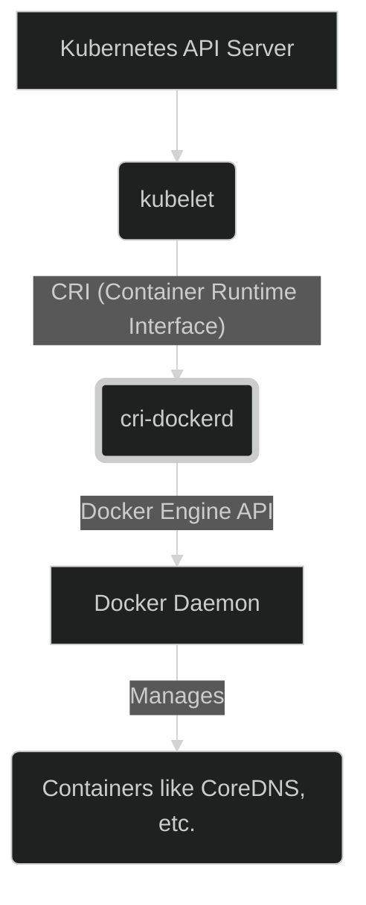
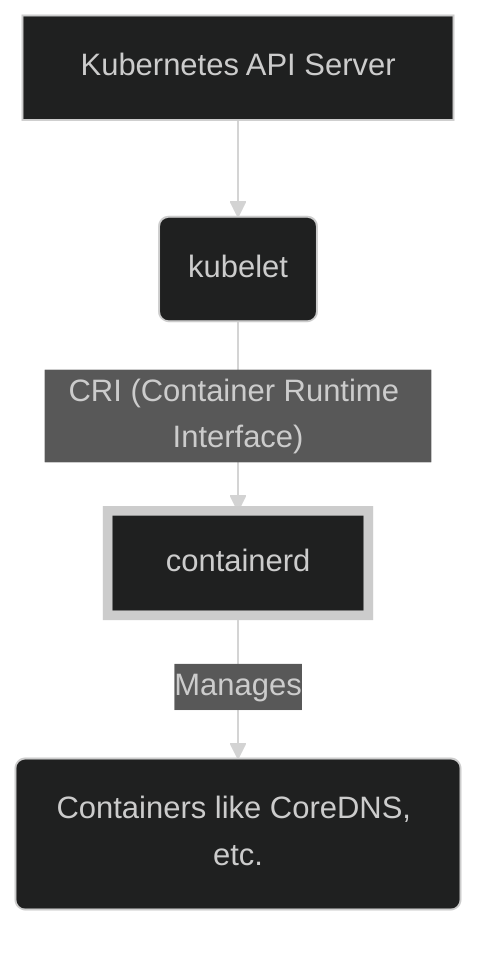

## 前言

身為一個開發者，特別是在 macOS 環境下，Docker Desktop 幾乎是容器化開發的標配。然而，自從 Docker Desktop 開始針對大型企業調整其[授權模式](https://www.ithome.com.tw/news/146537)後，許多開發者開始尋找替代方案。

市面上確實出現了一些選擇，例如閉源但功能強大的 [OrbStack](https://orbstack.dev/)。但對於熱愛開源的我來說，目光自然投向了社群。這時，[colima](https://github.com/abiosoft/colima) 這個開源專案進入了我的視野。它不僅提供了一個在 macOS 上運行 Linux 容器的輕量級方式，還內建了 Kubernetes 支援，引起了我極大的興趣。

這篇文章，想記錄一下我從 Docker Desktop 轉換到 colima，並且在 colima 的 Kubernetes 環境中，從原本依賴 Docker Engine 逐步遷移到使用 containerd 作為容器執行時（Container Runtime）的心路歷程與踩坑經驗。

## lima 與 colima 簡介

在深入 colima 之前，得先提一下 [lima (Linux virtual machines on macOS)](https://github.com/lima-vm/lima)。lima 是一個旨在於 macOS 上輕鬆運行 Linux 虛擬機的開源專案。它底層利用了 macOS 的虛擬化框架（如 QEMU 或更高效的 `vz`），提供了一個相對輕量的 Linux VM 環境。

而 colima 則可以看作是建立在 lima 之上的「使用者友善層」。它簡化了 lima 的配置，並專注於提供容器執行時環境。colima 可以讓你輕鬆地啟動一個配置好 Docker 或 containerd 的 Linux VM，並且可以選擇性地啟用 Kubernetes (K3s) 支援。簡單來說，colima 幫你處理了建立 VM、安裝 Runtime 等繁瑣步驟，讓你專注在容器本身。

## colima 的 Kubernetes 初體驗：Docker 的身影

colima 的一大賣點是內建 Kubernetes (使用輕量級的 [K3s](https://k3s.io/))。只需要在啟動時加上 `--kubernetes` 參數，就能快速擁有一個本地的 k8s 叢集：

```bash
colima start --kubernetes --runtime docker
```

然而，當我第一次這樣啟動後，習慣性地執行 `docker ps` 時，卻發現一些意料之外的容器：

```bash
❯ docker ps
CONTAINER ID   IMAGE                           COMMAND                  CREATED        STATUS        PORTS     NAMES
6b88aecbc46d   2f6c962e7b83                    "/coredns -conf /etc…"   23 hours ago   Up 23 hours             k8s_coredns_coredns-56f6fc8fd7-2s4wp_kube-system_2c3f937e-48d8-4c0e-b45a-adc98a5858ef_2
31bf34aea011   5548a49bb60b                    "/metrics-server --c…"   23 hours ago   Up 23 hours             k8s_metrics-server_metrics-server-5985cbc9d7-vskns_kube-system_637f87cc-b503-4788-948b-c67a2a632d91_2
b8e9b03cbe8c   d3dd7baae2fc                    "local-path-provisio…"   23 hours ago   Up 23 hours             k8s_local-path-provisioner_local-path-provisioner-5cf85fd84d-rtvdj_kube-system_db659795-5fc0-4ccd-989c-5213ae3a5c42_2
98c5c9fd5d25   rancher/mirrored-pause:3.6      "/pause"                 23 hours ago   Up 23 hours             k8s_POD_local-path-provisioner-5cf85fd84d-rtvdj_kube-system_db659795-5fc0-4ccd-989c-5213ae3a5c42_2
3dc2f147eb05   rancher/mirrored-pause:3.6      "/pause"                 23 hours ago   Up 23 hours             k8s_POD_metrics-server-5985cbc9d7-vskns_kube-system_637f87cc-b503-4788-948b-c67a2a632d91_2
f0c9ffde46fb   rancher/mirrored-pause:3.6      "/pause"                 23 hours ago   Up 23 hours             k8s_POD_coredns-56f6fc8fd7-2s4wp_kube-system_2c3f937e-48d8-4c0e-b45a-adc98a5858ef_2
f5650e07ef60   moby/buildkit:buildx-stable-1   "buildkitd --config …"   2 days ago     Up 23 hours             buildx_buildkit_container-builder0
```

怎麼 k8s 的 pod 元件（像是 CoreDNS、Service LoadBalancer 等）會出現在 `docker ps` 的列表裡？這跟我在雲端或其他環境使用 k8s  的經驗不太一樣。

深入追查後發現，當 colima 使用 `--runtime docker` 並啟用 Kubernetes 時，它實際上在 k8s 和 Docker Engine 之間安插了一個名為 `cri-dockerd` 的橋樑（或稱為 shim）。



`cri-dockerd` 實現了 Kubernetes 的容器執行時介面（Container Runtime Interface, CRI），並將 CRI 的請求翻譯成 Docker Engine API 的呼叫。這樣 k8s 就能夠透過 `cri-dockerd` 來命令 Docker Daemon 建立、啟動、停止 pod 中的容器。這也是為什麼我們能在 `docker ps` 中看到 k8s 管理的容器。

## Kubernetes CRI 的變革：Docker Shim 的退場

為什麼需要 `cri-dockerd` 這樣一個額外的元件呢？這就得回溯到 Kubernetes 的發展歷史。早期，Kubernetes 與 Docker Engine 深度綁定，kubelet（k8s 的節點代理）直接呼叫 Docker API。但隨著容器生態系的發展，出現了 containerd、CRI-O 等其他容器執行時，Kubernetes 社群希望定義一個標準介面（CRI），讓 kubelet 可以與任何符合 CRI 標準的 Runtime 溝通。

為了相容舊有的 Docker Engine，Kubernetes 內建了一個名為 `dockershim` 的元件，它扮演了類似 `cri-dockerd` 的角色。然而，維護 `dockershim` 給 Kubernetes 核心團隊帶來了額外的負擔。因此，從 Kubernetes 1.24 版本開始，內建的 `dockershim` [正式被移除](https://kubernetes.io/blog/2022/02/17/dockershim-faq/)。

這意味著，如果你想繼續讓 k8s 使用 Docker Engine 作為 Runtime，就必須額外安裝像 `cri-dockerd` 這樣的獨立 CRI shim。而更推薦的做法，則是直接使用原生支援 CRI 的 Runtime，例如 containerd 或 CRI-O。

這也正是我決定將 colima 中的 k8s 環境從依賴 Docker 遷移到直接使用 containerd 的主要原因：跟上 k8s 主流趨勢，減少中間層，追求更原生、可能也更高效的架構（蘋果的記憶體很貴的，特別是統一記憶體架構）。

## colima 的 Runtime 選擇：Docker vs. containerd

colima 讓我們可以在啟動 VM 時，透過 `--runtime` 參數選擇使用 Docker 還是 containerd：

- `colima start --runtime docker`: colima 會在 VM 內安裝並啟動 Docker Engine。你可以直接使用 `docker` CLI 與其互動。如果同時啟用 `--kubernetes`，則會使用 `cri-dockerd`。
- `colima start --runtime containerd`: colima 會在 VM 內安裝並啟動 containerd。你需要使用與 containerd 相容的 CLI（如 `nerdctl`）與其互動。如果同時啟用 `--kubernetes`，k8s 會直接透過 CRI 與 containerd 溝通。

切換到 containerd Runtime 後，k8s 的架構就變成這樣：



kubelet 直接與 containerd 溝通，不再需要 `cri-dockerd` 這個中間層。

## 從 Docker 到 containerd 的遷移之路

決定了方向，接下來就是實際操作的轉換過程。

### 停止並刪除舊的 Docker Runtime 實例

```bash
colima stop
colima delete
```

### 啟動新的 containerd Runtime 實例 (含 k8s)

```bash
colima start --runtime containerd --kubernetes
```

### 適應新的 CLI：`nerdctl`

從 Docker 轉換到 containerd，最直接的感受就是 CLI 的變化。雖然 Docker CLI 不能直接操作 containerd，但社群開發了 [nerdctl (contaiNERd CTL)](https://github.com/containerd/nerdctl)，它旨在提供與 Docker CLI 盡可能相容的使用體驗。

安裝 `nerdctl` (通常 colima 會提示你安裝，或者你可以手動安裝)：

```bash
colima nerdctl install
```

現在，許多你熟悉的 Docker 指令可以用 `nerdctl` 來執行：

```bash
# 列出容器
nerdctl ps

# 列出映像檔
nerdctl images

# 拉取映像檔
nerdctl pull nginx:latest

# 運行容器
nerdctl run -d -p 8080:80 --name mynginx nginx:latest

# 停止並移除容器
nerdctl stop mynginx
nerdctl rm mynginx
```

雖然 `nerdctl` 努力相容 Docker CLI，但在某些進階功能、網路設定、或是插件生態上可能還是會有些差異或限制，需要在使用中慢慢熟悉。

### `nerdctl build` vs. `docker build`

`nerdctl build` 使用 containerd 內建的 BuildKit 功能來建構映像檔，語法與 `docker build` 非常相似。

```bash
nerdctl build -t myapp:latest .
```

背後都是 BuildKit，大部分情況下行為一致，但快取機制、Builder 的管理方式等細節可能略有不同。

### `nerdctl compose` vs. `docker compose`

`nerdctl` 也提供了 `compose` 子命令，旨在相容 `docker compose` 的 `compose.yaml` 文件。

```bash
nerdctl compose up -d

nerdctl compose down
```

同樣地，雖然目標是相容，但可能在某些 compose 文件的複雜特性或版本支援上落後於最新的 `docker compose`。

## 保留 Docker Buildx：雙 colima 實例並行

雖然 `nerdctl` 在很多方面可以取代 `docker` CLI，但在某些特定場景，我發現還是離不開原生的 Docker 環境，特別是強大的 `docker buildx`。

`docker buildx` 是 Docker 官方的下一代建構工具，對於建構多平台映像檔 (multi-platform images, 例如同時建構 amd64 和 arm64 版本) 提供了非常好的支援。雖然 `nerdctl` 也在逐步增強這方面的能力，但在穩定性和功能完整性上，我個人還是更習慣 `docker buildx`。

詳細可以參考[建構多平台的 container image](./../building_multiple_platform_container_image)

因此，我的最終解決方案是：**同時運行兩個 colima 實例！**

1.  **k8s 實例**: 使用 `containerd` 作為 Runtime，專門跑 Kubernetes。使用 `colima --profile k8s` 操作。
2.  **docker-buildx 實例**: 使用 `docker` 作為 Runtime，主要用於執行 `docker buildx` 或其他需要原生 Docker 環境的任務。使用 `colima --profile docker-buildx` 操作。

我們可以透過以下 shell 指令來完成設定：

```bash
# 獲取系統資源 (CPU 核心數和記憶體 GB)
CORES=$(sysctl -n hw.ncpu)
MEM_GB=$(($(sysctl -n hw.memsize) / 1024 / 1024 / 1024))

# 估算每個實例分配的資源 (例如，各分配 1/3)
# 注意：這只是示例，你可以根據實際需求調整
INSTANCE_CORES=$((CORES / 3))
INSTANCE_MEM=$((MEM_GB / 3))
# 確保至少有 1 個核心和 1 GB 記憶體
[ $INSTANCE_CORES -lt 1 ] && INSTANCE_CORES=1
[ $INSTANCE_MEM -lt 1 ] && INSTANCE_MEM=1


echo "啟動 k8s 實例 (containerd)..."
# 啟動 k8s 實例，使用 containerd Runtime，並啟用 Kubernetes
# 使用 --profile k8s 來區分此實例
colima start --profile k8s \
  --runtime containerd \
  --kubernetes \
  --cpu $INSTANCE_CORES \
  --memory $INSTANCE_MEM

echo "啟動 docker-buildx 實例 (docker)..."
# 啟動 docker-buildx 實例，使用 docker Runtime
# 使用 --profile docker-buildx 來區分此實例
colima start --profile docker-buildx \
  --runtime docker \
  --cpu $INSTANCE_CORES \
  --memory $INSTANCE_MEM

echo "為 k8s 實例安裝 nerdctl..."
# 為 k8s profile 安裝 nerdctl
colima --profile k8s nerdctl install

echo "設定 Docker Context..."
# 建立一個名為 colima-buildx 的 Docker context，指向 docker-buildx 實例的 Docker socket
# 如果 context 已存在，先移除
docker context rm colima-buildx > /dev/null 2>&1
docker context create colima-buildx --docker "host=unix://$HOME/.colima/docker-buildx/docker.sock"

echo "切換 Docker context 到 colima-buildx..."
# 將 Docker CLI 的預設 context 切換到 colima-buildx
docker context use colima-buildx

echo "done"
```

完成以上步驟後，你就擁有了兩個並行的 colima 環境：

- **操作 Kubernetes 或使用 `nerdctl`**:
    - Kubernetes 指令 (`kubectl`) 會自動指向 `colima --profile k8s` 的叢集 (因為它是透過 `--kubernetes` 啟動的)。
    - 使用 `nerdctl` 時，需要指定 profile: `colima --profile k8s nerdctl [command]`。
    - 使用 `kubectl` 時，會使用 colima start 時同時設定好的 kubernetes context
- **操作 Docker 或使用 `docker buildx`**:
    - 由於我們已經執行 `docker context use colima-buildx`，你的 `docker` 指令 (包括 `docker buildx`) 會自動指向 `colima --profile docker-buildx` 的 Docker 實例。
    - 你可以隨時使用 `docker context ls` 查看當前的 context，並使用 `docker context use <context_name>` 來切換。例如，如果需要切換回預設的 Docker Desktop context (如果有的話)，可以執行 `docker context use default`。

這種方式雖然需要手動執行一些設定指令，但同樣能達到管理兩個獨立環境的目的，讓你可以在需要時輕鬆地使用 `nerdctl` 或 `docker buildx`。

## Kubernetes 與 Private Registry (AWS ECR 實戰)

在 Kubernetes 環境中，從私有 Container Registry 拉取映像檔是一個常見的需求。colima 的 k8s 環境也不例外。以 AWS ECR (Elastic Container Registry) 為例，我們需要告訴 k8s 如何驗證身份。

這通常透過建立一個 `docker-registry` 類型的 Secret 來完成：

1.  **獲取 ECR 登入密碼**: AWS 提供了一個 CLI 指令來生成臨時的密碼。

    ```bash
    aws ecr get-login-password --region us-east-1
    ```

2.  **建立 Kubernetes Secret**: 使用 `kubectl create secret docker-registry` 指令，將 ECR 的伺服器地址、用戶名 (`AWS`) 和上一步獲取的密碼存儲為 Secret。

    ```bash
    kubectl create secret docker-registry ecr-creds \
        --docker-server=<your_account_id>.dkr.ecr.us-east-1.amazonaws.com \
        --docker-username=AWS \
        --docker-password=$(aws ecr get-login-password --region us-east-1) \
        --namespace=default # 或者你需要的 namespace
    ```
    *注意替換 `<your_account_id>` 和你的區域 `us-east-1`。*

3.  **在 Deployment/pod 中使用 Secret**: 在你的 Kubernetes Deployment (或 pod, StatefulSet 等) 的 spec 中，加入 `imagePullSecrets` 字段，引用剛剛建立的 Secret。

    ```yaml
    apiVersion: apps/v1
    kind: Deployment
    metadata:
      name: my-app
    spec:
      replicas: 1
      selector:
        matchLabels:
          app: my-app
      template:
        metadata:
          labels:
            app: my-app
        spec:
          containers:
          - name: my-app-container
            image: <your_account_id>.dkr.ecr.us-east-1.amazonaws.com/my-repo:latest
          # 告訴 k8s 使用這個 Secret 來拉取 image
          imagePullSecrets:
            - name: ecr-creds
    ```

    如果你使用 Helm Chart，通常會在 `values.yaml` 中提供配置 `imagePullSecrets` 的地方。

完成這些步驟後，colima 中的 k8s 就能夠成功從你的私有 ECR Repository 拉取映像檔了。

## 寫在最後

從 Docker Desktop 到 colima，再從 colima 內的 Docker Runtime 遷移到 containerd，這趟旅程雖然有些繞路和踩坑，但也讓我對容器技術的底層、Kubernetes 的 CRI 機制有了更深的理解。

colima 作為一個開源替代方案，提供了足夠的靈活性，讓我們可以根據需求選擇 Runtime，並且輕鬆搭建本地 k8s 環境。雖然 `nerdctl` 和 containerd 的生態系可能還不像 Docker 那樣成熟，但跟隨 k8s 的主流方向，擁抱原生 CRI Runtime 絕對是值得的。

而「雙 colima 實例」的方案，雖然看似有些「暴力」，但確實解決了我在特定工具鏈（如 Docker Buildx）上的依賴問題，算是在理想與現實之間找到的一個平衡點。

如果你也在尋找 macOS 上 Docker Desktop 的替代品，不妨試試 colima，或許也能從中找到適合你的工作流程。共勉之。
