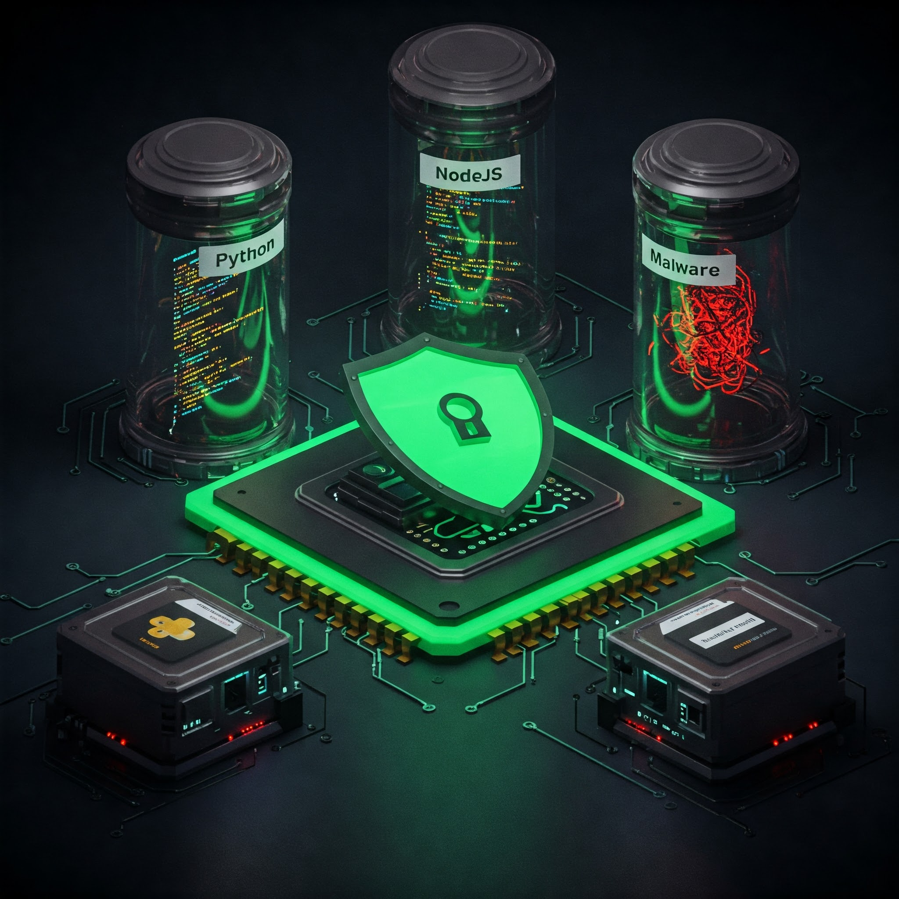

最近換了新工作，到了一間資訊安全公司，讓我更加重視開發環境的安全。

還記得之前分享過[透過 Distrobox 解決 Linux 環境依賴問題](/blogs/develop/2024/two_distrobox_use_case)，用他來解決不同 Linux distribution 的依賴關係，背後即是讓程式跑在 container 內。

既然能夠將應用程式一來透過 container，與 Host OS 本身做出區隔，那麼我們也能透過 container 來對開發的依賴做出隔離。於是，開始擁抱 Dev Container，一個能讓我更安心、更有效率（？）的開發環境。

## 什麼是 Dev Container？

簡單來說，Dev Container 就是把開發環境「容器化」。我們可以把所有需要的工具、函式庫、設定檔都放在一個 Docker Image 裡，然後用這個 Image 啟動一個 Container 作為你的開發環境。

- Consistency (一致性)： 不管是在哪台機器上開發，只要有 Docker，就能保證開發環境完全一致。再也不用擔心「在我這台電腦上可以跑啊！」這種崩潰的狀況發生。
- Isolation (隔離性)： Dev Container 與本機系統完全隔離，可以避免各種依賴衝突，也能保護系統安全。
- Reproducibility (可重現性)： 透過 Dockerfile，你可以完整記錄你的開發環境設定，方便團隊協作和版本控制。

## 為什麼需要 Dev Container？

身為一個**資安從業人員**，Dev Container 解決了以下痛點：

1. 不同版本的 Node 環境，告別 `nvm`！需要 node14, node16, node18 或是 stable 版本，隨時產生開發環境。
2. 需要下載 malware 到本地進行 e2e 測試，透過 container 進行蛤蜊（🦪意象），盡可能避免破壞系統安全性。
3. 在 macOS 上解決一些只支援 linux 的 binary，或是在 arm64 host 上透過 rosetta2 模擬 x86_64 環境，進而執行 amd64 執行檔。
4. 使用 rootless 模式，在危機四伏的 npm 環境中，確保開發環境的安全性。

## 我的 Dev Container 工作流

我將 dev-container 放在 github [omegaatt36/lab/dev-container](https://github.com/omegaatt36/lab/tree/main/dev-container) 中，以下 demo 僅「目前版本」，會依據使用情境進行迭代。

### Base Image

首先，建立一個基礎的 Dockerfile，裡面包含一些通用的工具和設定：

這個 image 中大部分是我的 dotfiles 中 [install.sh](https://github.com/omegaatt36/dotfiles/blob/main/dotfiles/dot_script/executable_install.sh) 的內容。

```dockerfile
# ~/dev/lab/dev-container/debian/Dockerfile.base

# 我習慣使用 debian 並指定版本
FROM debian:bookworm

# 由於我會在不同 host OS 下執行，USERNAME 可能不同，於是使用 ARG 進行注入
ARG USERNAME=raiven_kao

# 安裝最基本的工具與 build tool，並且額外安裝我習慣使用的 fd 與 bat
RUN apt update && apt install -y \
    git vim curl zsh wget unzip gpg make \
    fd-find bat

# 安裝我慣的 eza，一個更好用的 ls
RUN <<EOF
mkdir -p /etc/apt/keyrings
wget -qO- https://raw.githubusercontent.com/eza-community/eza/main/deb.asc | gpg --dearmor -o /etc/apt/keyrings/gierens.gpg
echo "deb [signed-by=/etc/apt/keyrings/gierens.gpg] http://deb.gierens.de stable main" | tee /etc/apt/sources.list.d/gierens.list
chmod 644 /etc/apt/keyrings/gierens.gpg /etc/apt/sources.list.d/gierens.list
apt update
apt install -y eza
EOF

# 建立使用者.
RUN useradd -m -U -s /bin/zsh ${USERNAME}

# 我會使用 wakatime 來統計我開發時間的 "uptime"
# 詳細參考 https://github.com/omegaatt36/lab/blob/main/dev-container/install_wakatime-cli.sh
COPY install_wakatime-cli.sh .
ENV ZSH_WAKATIME_BIN=/usr/local/bin/wakatime-cli
RUN chmod +x install_wakatime-cli.sh && bash -c ./install_wakatime-cli.sh

# 使用 rootless user
USER ${USERNAME}
ENV HOME=/home/${USERNAME}
WORKDIR ${HOME}

# pre-install chezmoi，我在 dotfiles 中有進行一些額外的設定，需要預先建立目錄、檔案
RUN <<EOF
touch ${HOME}/.zshenv
mkdir -p ${HOME}/.cargo/
touch ${HOME}/.cargo/env
touch ${HOME}/.vimrc
EOF

# install chezmoi 以及 zsh 與 ohmyzsh，並套用 dotfiles 中對 zsh 的設定
RUN <<EOF
bash -c "$(curl -fsLS get.chezmoi.io) -- init --apply omegaatt36"
bash -c "$(curl -fsSL https://raw.githubusercontent.com/ohmyzsh/ohmyzsh/master/tools/install.sh)"
git clone --depth=1 https://github.com/romkatv/powerlevel10k.git ${ZSH_CUSTOM:-$HOME/.oh-my-zsh/custom}/themes/powerlevel10k
git clone https://github.com/zsh-users/zsh-autosuggestions ${ZSH_CUSTOM:-$HOME/.oh-my-zsh/custom}/plugins/zsh-autosuggestions
git clone https://github.com/zsh-users/zsh-syntax-highlighting.git ${ZSH_CUSTOM:-$HOME/.oh-my-zsh/custom}/plugins/zsh-syntax-highlighting
git clone https://github.com/sobolevn/wakatime-zsh-plugin.git ${ZSH_CUSTOM:-$HOME/.oh-my-zsh/custom}/plugins/wakatime
git clone --depth 1 https://github.com/unixorn/fzf-zsh-plugin.git ${ZSH_CUSTOM:-$HOME/.oh-my-zsh/custom}/plugins/fzf-zsh-plugin
./bin/chezmoi update --force
sed -i '/fzf-tab/d' ${HOME}/.zshrc
EOF

# install fzf，一個由 golang 寫的模糊搜尋 cli tool
RUN bash -c "git clone --depth 1 https://github.com/junegunn/fzf.git "${HOME}"/.fzf \
    && curl https://raw.githubusercontent.com/junegunn/fzf-git.sh/main/fzf-git.sh -o ${HOME}/.fzf/fzf-git.sh \
    https://raw.githubusercontent.com/junegunn/fzf-git.sh/main/fzf-git.sh \
    && "${HOME}"/.fzf/install"

# post-install chezmoi & wakatime，強制載入 vim 的 wakatime plugin
RUN <<EOF
curl -fLo "${HOME}"/.vim/autoload/plug.vim --create-dirs \
    https://raw.githubusercontent.com/junegunn/vim-plug/master/plug.vim
vim +'PlugInstall --sync' +qa
rm -rf ${HOME}/.vim/autoload
EOF

ENTRYPOINT ["zsh"]
```

### Specialized Images

接著，針對不同的語言建立專屬的 Dockerfile，例如 Node、Python、Java：

*   **Node**

    ```dockerfile
    # ~/dev/lab/dev-container/debian/Dockerfile.node
    ARG BASE_IMAGE=base-dev

    FROM ${BASE_IMAGE}

    ARG USERNAME=raiven_kao

    ENV NODE_VERSION=22

    # 需要先「切換」回 root 才能具有 root permission
    USER root

    RUN <<EOF
    curl -fsSL https://deb.nodesource.com/setup_${NODE_VERSION}.x -o nodesource_setup.sh
    bash nodesource_setup.sh
    apt-get install -y nodejs
    EOF

    USER ${USERNAME}

    RUN mkdir ${HOME}/.npm-global && npm config set prefix ${HOME}/.npm-global
    ```

*   **Python**

    ```dockerfile
    # ~/dev/lab/dev-container/debian/Dockerfile.python
    ARG BASE_IMAGE=base-dev

    FROM ${BASE_IMAGE}

    ARG USERNAME=raiven_kao

    USER root

    # 需要先「切換」回 root 才能具有 root permission
    RUN apt update && apt install -y \
        python3 python3-pip

    RUN curl -LsSf https://astral.sh/uv/install.sh | sh

    USER ${USERNAME}
    ```

*   **Java**

    ```dockerfile
    # ~/dev/lab/dev-container/debian/Dockerfile.java
    ARG BASE_IMAGE=base-dev

    FROM ${BASE_IMAGE}

    ARG USERNAME=raiven_kao

    # 需要先「切換」回 root 才能具有 root permission
    USER root

    RUN apt update && apt install -y maven openjdk-17-jdk

    USER ${USERNAME}
    ```

這些 Dockerfile 會繼承 base image，然後安裝對應語言的環境和工具。

### Build

為了方便管理這些 Dockerfile，使用 Makefile 來批次建構 Image：

```makefile
# ~/dev/lab/dev-container/variables.mk
IMAGE_REPOSITORY ?= omegaatt36
```

```makefile
# ~/dev/lab/dev-container/Makefile
ROOT_DIR := $(abspath ./)
include $(ROOT_DIR)/variables.mk

build-debian:
	docker build -t $(IMAGE_REPOSITORY)/base-dev -f debian/Dockerfile.base --build-arg USERNAME=$(shell whoami) .
	docker build -t $(IMAGE_REPOSITORY)/python-dev --build-arg BASE_IMAGE=$(IMAGE_REPOSITORY)/base-dev --build-arg USERNAME=$(shell whoami) -f debian/Dockerfile.python .
	docker build -t $(IMAGE_REPOSITORY)/node-dev --build-arg BASE_IMAGE=$(IMAGE_REPOSITORY)/base-dev --build-arg USERNAME=$(shell whoami) -f debian/Dockerfile.node .
	docker build -t $(IMAGE_REPOSITORY)/java-dev --build-arg BASE_IMAGE=$(IMAGE_REPOSITORY)/base-dev --build-arg USERNAME=$(shell whoami) -f debian/Dockerfile.java .
```

### 啟動 Container

```shell
docker run --rm -it \
  -w /home/$(whoami)/app \
  --hostname dev-container-node \
  -v $(pwd):/home/$(whoami)/app \
  -v ${HOME}/.zsh_other_env:/home/$(whoami)/.zsh_other_env \
  -v ${HOME}/.npmrc:/home/$(whoami)/.npmrc \
  -v ${HOME}/.wakatime.cfg:/home/$(whoami)/.wakatime.cfg \
  --name dev-node-$(basename $(pwd)) \
  omegaatt36/node-dev:latest
```

若是需要臨時安裝系統，由於我們並沒有給與 continaer 中的使用者 root 權限與 sudo 權限，因此需要使用 root user 來進入 container 中

```shell
docker exec -it --user root dev-node-$(basename $(pwd)) bash
```

## 反思

- 學習曲線與複雜性，需要花費更多時間來學習 container，以及 port forwarding 等等。
- 資源消耗，由於跑在 container 內，無論是 cpu, memory, disk space 都會被限制，因此需要考慮如何優化 container 的資源使用。
- 檔案權限問題，在 Container 內外共享檔案時，可能會遇到權限問題，需要仔細處理。例如，在 Container 內建立的檔案，在本機上可能沒有寫入權限。
- 需要仔細考慮如何持久化 Container 內的資料，例如 e2e 的測試資料是 5GB 的 iso 文件。如果沒有妥善處理，Container 關閉後資料可能會遺失。

## 還可以更好

- 由於 docker 只能執行 rootful container，我們可以使用 podman 來執行 rootless container
- 雖然我已經不再使用 vscode，但可以建立 `.devcontainer/devcontainer.json` 來告訴 vscode 如何啟動 dev container。
- malware 仍不能直接在 working directory 中下載，是由於我們是 mount path，因此要記得下載 malware 到諸如 `/tmp` 或 `/var/tmp` 等臨時目錄中。

## 額外內容

文中提到的 [chezmoi](https://www.chezmoi.io/)，是一款使用 git 進行版本控制的 dotfiles 管理工具，當有多個 Host machine 或是經常「系統搬家」時，十分有幫助（或許可以再寫一篇文章來介紹）。


> 嘗試使用 Google Gemini 呼叫 Imagen 來產生 cover
