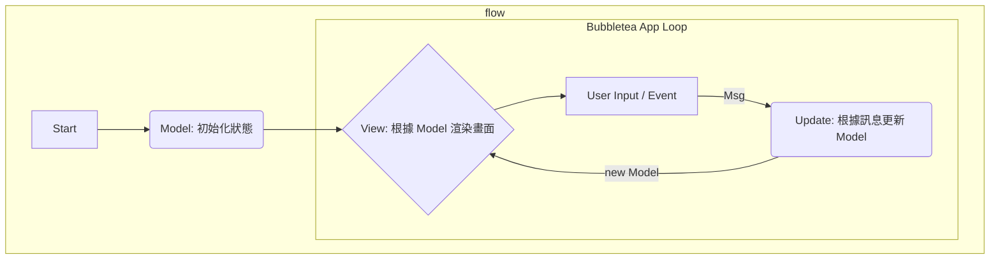

## 前言

身為一個後端工程師，我們大部分時間都在與 API、資料庫和伺服器打交道，使用者介面（UI）似乎是另一個世界的事情。然而，每當我使用像 `lazygit`、`gh` 或 `k9s` 這些出色的終端機應用（TUI, Terminal User Interface）時，心中總會燃起一絲嚮往：「如果我也能用 Golang 打造出這麼酷、這麼高效的互動介面，那該有多好？」

傳統的 CLI 工具通常是單向的命令與回應，但 TUI 帶來了更豐富的互動體驗，讓使用者能在終端機中感受到如桌面應用般的操作流暢感。這份嚮往驅使我踏上了探索 `Bubbletea` 的旅程。

[Bubbletea](https://github.com/charmbracelet/bubbletea) 是一個基於 [The Elm Architecture](https://guide.elm-lang.org/architecture/) 的 Golang 函式庫，它讓開發 TUI 變得異常優雅與簡單。這篇文章將記錄我從零開始學習 Bubbletea，並將一個簡單應用擴展成多頁面（Multi-page）架構的過程，希望能為同樣對 TUI 開發感興趣的你，提供一份清晰的實戰指南。

## Elm 架構簡介：TUI 的心臟

在深入 Bubbletea 之前，我們必須先理解其核心設計哲學——Elm 架構（The Elm Architecture, TEA）。這是一個非常經典的函式狀態管理模式，也被廣泛應用於許多前端框架中。它將應用程式的邏輯清晰地劃分為三個部分：Model、View 和 Update。



1.  Model：應用程式的狀態。在我們的 TUI 中，這可以是用戶輸入的文字、列表的選中項、當前的頁面等等。它是一個應用程式狀態的「唯一真實來源」。
2.  View：一個將 `Model` 轉換為使用者可見畫面的函式。在 Bubbletea 中，`View` 函式回傳一個 `string`，這個字串就是我們在終端機上看到的畫面。它是一個純粹的渲染過程，只負責呈現狀態，不應包含任何業務邏輯。
3.  Update：處理事件並更新 `Model` 的函式。使用者的任何操作（如按鍵）、定時器觸發、或是非同步任務完成，都會產生一個訊息（`tea.Msg`）。`Update` 函式接收目前的 `Model` 和這個 `Msg`，然後回傳一個「新的」`Model`。所有的狀態變更都必須在這裡發生。

這個單向資料流的架構讓應用程式的狀態變化變得可預測且易於除錯，是 Bubbletea 優雅與強大的基礎。

## 從零開始：一個簡單的計數器

理論說再多，不如親手寫一段程式碼。讓我們先從一個最簡單的計-數器範例開始，感受一下 Elm 架構的運作方式。

我們的目標是：
- 畫面顯示一個數字。
- 按下 `+` 或 `j` 增加數字。
- 按下 `-` 或 `k` 減少數字。
- 按下 `q` 或 `esc` 退出程式。

```go
package main

import (
	"fmt"
	"log"

	tea "github.com/charmbracelet/bubbletea"
)

// 1. Model: 定義應用程式的狀態
type model struct {
	count int
}

// Init: 初始化 Model 的地方，在程式啟動時執行一次
func (m model) Init() tea.Cmd {
	return nil // 我們不需要在啟動時執行任何命令
}

// 2. Update: 處理訊息，更新狀態
func (m model) Update(msg tea.Msg) (tea.Model, tea.Cmd) {
	switch msg := msg.(type) {
	// 處理按鍵訊息
	case tea.KeyMsg:
		switch msg.String() {
		case "q", "esc", "ctrl+c":
			return m, tea.Quit // tea.Quit 是一個特殊的 Cmd，會讓程式退出
		case "+", "j":
			m.count++
		case "-", "k":
			m.count--
		}
	}
	// 回傳更新後的 Model
	return m, nil
}

// 3. View: 根據 Model 渲染畫面
func (m model) View() string {
	return fmt.Sprintf(`Count: %d

Press '+' to increment, '-' to decrement, 'q' to quit.
`, m.count)
}

func main() {
	// 建立一個初始化的 Model
	initialModel := model{count: 0}

	// 建立並啟動 Bubbletea 程式
	p := tea.NewProgram(initialModel)
	if _, err := p.Run(); err != nil {
		log.Fatalf("Alas, there's been an error: %v", err)
	}
}
```

- `model` struct 就是我們的狀態。
- `Update` 函式透過 `switch msg.(type)` 來判斷訊息類型。`tea.KeyMsg` 是最常見的訊息，代表使用者的按鍵輸入。我們根據按鍵的字串來更新 `m.count`。
- `View` 函式根據 `m.count` 產生要顯示的字串。
- `tea.NewProgram(initialModel).Run()` 是啟動整個應用程式的入口。

## 建構多頁面應用：狀態管理的藝術

當應用程式變得複雜時，例如像一個網站一樣需要切換不同的「頁面」（Page），如果把所有頁面的狀態和邏輯都塞在單一的 `model` 中，很快就會變得難以維護。

這時，我們可以借鏡 Web 開發中的路由（Routing）概念，設計一個主模型（Main Model）來管理當前的活動頁面。

### 核心思路

1.  定義頁面介面：建立一個所有頁面模型都必須實作的介面。
2.  建立主模型：主模型持有一個 `Page` 介面的實例，代表當前顯示的頁面。
3.  訊息委派：主模型的 `Update` 函式將大部分訊息委派給當前頁面的 `Update` 函式處理。
4.  頁面切換：設計一種特殊的訊息或機制，讓子頁面可以通知主模型進行頁面切換。

### 實戰演練

讓我們來打造一個有「首頁」和「設定頁」的 TUI。

#### 1. 頁面介面與模型

```go
// page.go
package main

import tea "github.com/charmbracelet/bubbletea"

// 所有頁面都必須實作 Page 介面
type Page interface {
	Init() tea.Cmd
	Update(tea.Msg) (Page, tea.Cmd)
	View() string
}

// --- 首頁模型 ---
type homePage struct {
	choices  []string
	cursor   int
}

func (p homePage) Init() tea.Cmd { return nil }
func (p homePage) View() string { /* ... 渲染首頁畫面 ... */ }
// ...

// --- 設定頁模型 ---
type settingsPage struct {
	settings map[string]bool
	cursor   int
}

func (p settingsPage) Init() tea.Cmd { return nil }
func (p settingsPage) View() string { /* ... 渲染設定頁畫面 ... */ }
// ...
```

#### 2. 主模型與訊息委派

```go
// main.go
package main

import tea "github.com/charmbracelet/bubbletea"

// 主模型，負責管理頁面
type mainModel struct {
	activePage Page
}

func (m mainModel) Init() tea.Cmd {
	// 初始化時，也初始化當前頁面
	return m.activePage.Init()
}

func (m mainModel) Update(msg tea.Msg) (tea.Model, tea.Cmd) {
	// 將訊息委派給當前頁面處理
	newPage, cmd := m.activePage.Update(msg)
	m.activePage = newPage // 更新為頁面回傳的新狀態
	return m, cmd
}

func (m main_model) View() string {
	// 直接回傳當前頁面的 View
	return m.activePage.View()
}

func main() {
	// 初始頁面為首頁
	m := mainModel{activePage: newHomePage()}
	p := tea.NewProgram(m)
	// ...
}
```

#### 3. 頁面切換的實現

最關鍵的一步：如何從 `homePage` 切換到 `settingsPage`？我們可以在 `homePage` 的 `Update` 函式中，當使用者按下特定按鍵時，直接回傳一個新的 `settingsPage` 實例。

```go
// homePage.go

func (p homePage) Update(msg tea.Msg) (Page, tea.Cmd) {
	switch msg := msg.(type) {
	case tea.KeyMsg:
		switch msg.String() {
		// ... 其他按鍵處理 ...
		case "enter":
			// 假設選擇了 "Settings"
			if p.choices[p.cursor] == "Settings" {
				// * 核心：回傳一個新的頁面實例 *
				return newSettingsPage(), nil
			}
		}
	}
	return p, nil // 預設回傳自身
}
```

當 `homePage.Update` 回傳 `newSettingsPage()` 時，主模型的 `Update` 函式會接收到這個新的 `Page` 實例，並將 `m.activePage` 更新為它。在下一次 `View` 渲染時，畫面上呈現的自然就是設定頁的內容了。

這個架構讓每個頁面都可以獨立管理自己的狀態和邏輯，而主模型則像一個路由器，清晰地控制著應用的流程。

## 生命週期與注意事項

在享受 Bubbletea 帶來的開發樂趣時，有幾個關鍵點需要特別注意：

- `tea.Cmd` 的角色：`Cmd`（Command）是用來處理「副作用」（Side Effects）的，例如網路請求、檔案讀寫、定時器等。`Update` 函式應該是非阻塞的，這些耗時或非同步的操作都應該封裝在 `Cmd` 中。當 `Cmd` 完成後，它會發送一個 `Msg` 回到 `Update` 迴圈。
- `tea.Msg` 是唯一的溝通管道：所有狀態的改變都源自於 `Update` 函式對 `Msg` 的處理。這是 Elm 架構的核心，確保了資料流的單向與可預測性。
- 效能：每一次 `Update` 執行後，`View` 都會被重新呼叫以渲染整個畫面。對於複雜的 UI，頻繁的重繪可能會有效能問題。這時可以搭配 [Lip Gloss](https://github.com/charmbracelet/lipgloss) 進行高效的樣式渲染，或採用更精細的狀態管理來避免不必要的重繪。
- 除錯：由於 Bubbletea 會接管 `stdout`，直接使用 `fmt.Println` 是無法除錯的。一個常見的技巧是將除錯資訊寫入到一個獨立的檔案中。

## 寫在最後

從一個簡單的計數器，到一個結構清晰的多頁面應用，Bubbletea 展現了其設計的優雅與強大。Elm 架構雖然初看有些繞，但一旦理解其精髓，便會發現它為構建複雜互動介面提供了一個絕佳的框架。

它讓我們從繁瑣的終端機控制碼中解放出來，專注於應用程式的狀態與邏輯。如果你也想為你的下一個 CLI 工具穿上華麗且實用的互動外衣，Bubbletea 絕對是一個值得深入探索的選擇。

## Ref

[Tips for building Bubble Tea programs
](https://leg100.github.io/en/posts/building-bubbletea-programs/)
[Build a Terminal Wizard in Go (Bubble Tea Tutorial)](https://www.youtube.com/watch?v=Gl31diSVP8M)
