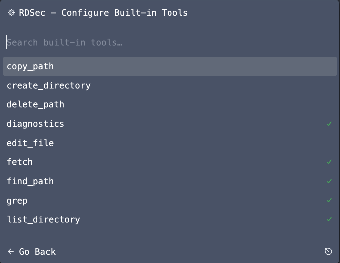
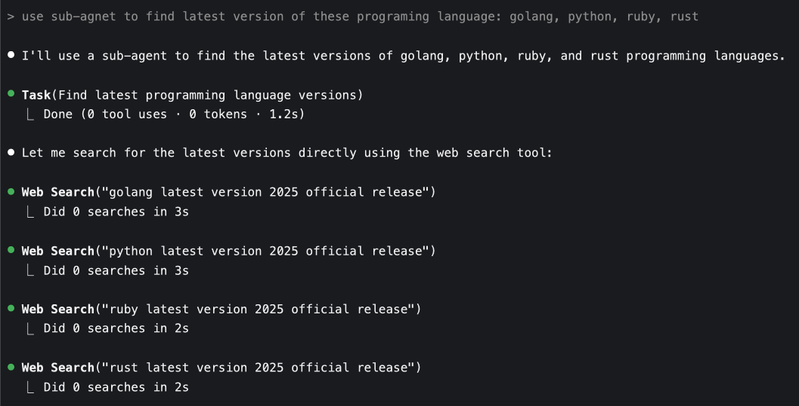

## 那些年我們追逐的開發效率


還記得第一次聽到「十倍工程師」這個詞的時候，心中總是充滿憧憬。想像著有一天也能寫出十倍的程式碼、處理十倍的任務、創造十倍的價值。每當看到某個同事在短時間內完成複雜的功能，總是會想：他們是不是真的擁有某種神秘的超能力？

隨著經驗的累積，漸漸發現這更像是一個美麗的神話。真正的效率並不在於敲擊鍵盤的速度，也不在於記住多少語法細節。那些看似神奇的十倍效率，往往來自於對問題本質的深刻理解，以及選擇正確工具的智慧。

直到 ChatGPT 橫空出世，Agentic AI 開始進入我們的開發流程，我開始思考：AI 能為我們帶來什麼？又有什麼是它永遠無法取代的？

## 從懷疑到接受的心路歷程

### 最初的抗拒與恐懼

坦白說，剛開始接觸這些 AI 工具時，我的內心是抗拒的。作為一個有著多年開發經驗的工程師，看著這些「會寫程式的機器」，心中五味雜陳。那種感覺就像是突然有人告訴你，你引以為傲的專業技能可能會被一個沒有情感的演算法取代。

第一次使用 AI code assistant 時，我提出一個簡單的需求：「幫我寫一個排序函數」。當它瞬間給出了完整且正確的程式碼時，我的第一反應不是驚喜，而是擔憂。這些工具真的實用嗎？會不會最終取代我們這些工程師？依賴 AI 是否會讓我們的技能退化？

這些疑慮很真實，也很合理。畢竟，我們這個行業向來對「銀彈」保持謹慎態度。太多次，我們看到某個新技術被吹捧為「革命性的」，最終卻發現它只是解決了某個特定問題，而創造了十個新問題。

### 重新定義效率的數學陷阱

然而，在實際使用 Zed AI、GitHub Copilot Agent 等工具幾個月後，我發現自己的思維框架需要調整。「十倍工程師」的概念確實存在一個隱藏的數學陷阱，而理解這個陷阱是擁抱 AI 輔助開發的第一步。

我開始仔細觀察 AI 在哪些環節能夠提供幫助。當我需要寫一個複雜的正則表達式時，AI 能在幾秒鐘內給出準確的答案，而我可能需要查資料和測試十幾分鐘。當我需要重構一個大型函數時，AI 能夠快速理解程式碼邏輯並提供多種重構方案。當我需要撰寫技術文件時，AI 能夠幫我整理思路，甚至提供不同角度的表達方式。

但同時，我也清楚地感受到 AI 的局限。當系統編譯時，AI 無法讓 CPU 運算得更快。當測試套件在 CI 環境中執行時，AI 無法讓網路延遲消失。當我需要與產品經理討論需求細節時，AI 無法代替我進行那些微妙的人際溝通。當面對複雜的架構選擇時，AI 可以提供選項，但最終的決策仍需要結合業務上下文和長期策略考量。

有一天，一位同事興奮地告訴我：「用了 AI 工具後，我覺得自己的開發速度提升了十倍！」我問他：「你的專案交付時間真的縮短了十倍嗎？」他想了想，搖搖頭說：「沒有，可能只快了兩三倍。」這就是數學陷阱的本質：AI 能夠大幅加速某些特定環節，但整個開發流程的速度受限於最慢的那個環節。

### 從工具使用者到架構思考者

這種認知的轉變讓我重新審視自己作為開發者的角色定位。AI 的出現並沒有降低我們的價值，反而讓我們從機械性的程式碼編寫中解放出來，有更多時間專注於真正重要的事情：理解業務需求的本質、設計優雅的系統架構、做出明智的技術選型決策。

我開始意識到，真正的「十倍效率」不是來自於打字速度的提升，而是來自於思維方式的轉變。當 AI 幫我們處理了大量重複性工作後，我們有機會成為更好的架構師、更好的問題解決者、更好的技術領導者。

## 機器可讀設計的哲學革命

經過這段時間的實踐，我得出了一個看似簡單但意義深遠的核心理念：「只有機器可讀的設計，才能被 LLM 加速」。

### 重新審視我們的設計習慣

這個理念讓我開始重新審視過去的工作習慣。回想一下我們是如何管理專案的：每次設計評審，我們會花費大量時間製作精美的 PowerPoint，其中包含各種流程圖、架構圖、時序圖。這些圖表在投影幕上看起來很專業，但會議結束後，它們就被儲存為 PNG 或 PDF 格式，靜靜地躺在某個共享資料夾中，再也沒有人會去更新或維護。

設計文件的情況也類似。我們用 Word 或 Confluence 撰寫詳細的技術規格，包含精心設計的格式和圖片。但隨著專案的推進，這些文件很快就變得過時，因為維護它們需要太多手動工作，而且沒有有效的方式來追蹤變更或保持同步。

更糟糕的是，當新團隊成員加入時，他們需要花費大量時間閱讀這些靜態文件，而且經常發現文件內容與實際程式碼已經不符。我們花費了很多精力製作這些「漂亮」的文件，但它們對於知識傳承和團隊協作的實際幫助很有限。

### Everything as Code 的實踐智慧

真正的轉變發生在我開始將所有設計元素都程式碼化的時候。這不僅僅是工具的更換，更是思維方式的根本改變。

以架構圖為例，當我開始使用 [Mermaid](https://mermaid.js.org/) 來描述系統架構時，驚喜地發現了許多意想不到的好處。首先，Mermaid 的原始碼可以像普通程式碼一樣進行版本控制，我可以清楚地看到架構設計在不同時期的變化，理解每次修改的原因和影響。其次，當系統發生變更時，我只需要修改幾行文字，就能自動生成更新後的圖表，而不需要重新在繪圖軟體中調整每個元件的位置。

文件方面，轉向 Markdown 格式帶來的改變更加顯著。Markdown 文件可以與程式碼放在同一個倉庫中，使用相同的分支策略和合併流程。當我修改某個功能的實作時，相關的文件更新可以在同一個 Pull Request 中進行，確保程式碼和文件的同步性。更重要的是，這些結構化的文字可以被搜尋、解析和自動處理。

### AI 理解能力的質變

當所有這些設計資產都變成機器可讀的格式後，AI 工具的表現出現了質的飛躍。以前，當我向 AI 描述一個系統時，需要用大量自然語言來解釋各個組件的關係和職責。現在，我可以直接提供 Mermaid 圖表和 Markdown 文件，AI 能夠準確理解系統的結構和設計意圖。

更神奇的是，AI 還能夠基於這些結構化資訊提供有針對性的建議。比如，當我要添加一個新功能時，AI 會分析現有的架構圖和程式碼結構，建議最適合的實作位置和方式。當我遇到設計問題時，AI 會參考相關的 ADR 記錄，提供與過往決策一致的解決方案。

## AI 輔助開發的完整實踐

基於這樣的理念基礎，我總結出一套完整的 AI 輔助開發流程。這個流程不是理論推導的結果，而是在多個真實專案中反覆實踐和調整後形成的。

### 建立知識庫的關鍵時刻

故事要從一個具體的專案說起。那是一個複雜的微服務重構項目，涉及十幾個服務和大量的歷史程式碼。按照傳統做法，我們需要先花幾週時間人工分析這些程式碼，理解各個服務的職責和相互關係，然後才能開始設計重構方案。

但這次，我決定嘗試不同的方法。我首先使用程式碼分析工具提取了整個系統的結構資訊，包括各個服務的 API 定義、資料庫 schema、以及服務間的調用關係。然後，我將這些資訊轉換成結構化的格式，建立了一個機器可讀的知識庫。

這個過程看似繁瑣，但實際上只花了一個下午的時間。更重要的是，這個知識庫成為了後續所有 AI 協作的基礎。當我需要理解某個服務的功能時，AI 可以基於這些結構化資訊快速給出準確的分析。當我需要評估重構方案的影響時，AI 可以根據服務依賴關係提供風險評估。

這個經驗讓我深刻理解了「建立知識庫」的重要性。AI 的輸出品質完全取決於輸入資訊的品質。投入時間建立高品質的知識庫，就像投資優秀的工具一樣，會在後續的工作中帶來巨大的回報。

### 需求澄清的意外收穫

在同一個專案中，我嘗試讓 AI 扮演「需求分析師」的角色，主動提出可能被忽略的問題。結果出乎意料：AI 提出了許多我們在傳統需求收集過程中經常遺漏的關鍵問題。

比如，當我們討論 API 重新設計時，AI 問道：「現有的用戶端應用程式如何處理版本升級？是否需要向後相容性？」這個問題讓我們意識到，我們之前只關注了新 API 的設計，但沒有充分考慮遷移策略。

另一個例子是關於錯誤處理。AI 詢問：「當下游服務不可用時，系統應該如何降級？是否需要實作熔斷機制？」這促使我們重新審視系統的可靠性設計，添加了原本沒有考慮到的容錯機制。

這種「AI 主動提問」的方式讓我想起了 Rubber Duck Debugging。有時候，最有價值的不是 AI 給出的答案，而是它提出的問題。這些問題幫助我們從不同角度思考問題，發現潛在的盲點和風險。

### 協作設計中的人機分工

在設計階段，我和 AI 之間形成了一種有趣的分工模式。AI 擅長提供多種選項和分析不同方案的優劣，而我負責根據業務上下文和長期策略做出最終決策。

舉個具體例子：在設計快取策略時，我向 AI 描述了系統的讀寫模式和性能要求。AI 迅速提供了四種不同的快取方案，包括 Write-Through、Write-Back、Write-Around 和 Refresh-Ahead，並詳細分析了每種方案在我們特定場景下的優缺點。

這種分析讓我能夠在更高的層面思考問題。我不需要花時間回憶每種快取策略的細節，而是可以專注於評估每種方案在我們特定業務場景下的適用性。最終，我選擇了 Write-Through 策略，因為我們的系統對資料一致性要求很高，而對寫入性能的要求相對較低。

在這個過程中，我發現 AI 和人類形成了完美的互補關係。AI 提供了全面的技術分析和多種選項，而我根據業務上下文、團隊能力和長期策略做出最終決策。這種分工讓決策過程既高效又全面。

### 並行實作的效率革命

當設計階段完成後，進入實作階段時，我真正感受到了 AI 輔助開發的威力。有了清晰的領域模型和介面定義，不同的功能模組可以完全並行開發。

這種並行性不僅體現在團隊成員之間的分工，更體現在人機協作的細節中。當我專注於核心業務邏輯的實作時，AI 會處理大量的樣板程式碼。比如，當我定義了一個資料結構後，AI 能夠自動生成對應的序列化方法、驗證邏輯和單元測試框架。

最讓我印象深刻的是，AI 還能根據我們已經建立的程式碼風格和模式，自動保持新程式碼的一致性。它不僅僅是在模仿語法格式，更是在理解和延續我們的設計理念。

### 審查與提交的品質閉環

每個 AI 輔助開發的週期都以仔細的審查和提交結束。這個階段讓我深刻體會到，雖然 AI 能夠生成高品質的程式碼，但人類的批判性思維仍然不可替代。

我會仔細檢查 AI 生成的程式碼是否符合我們的架構原則，是否正確處理了邊界條件，是否考慮了安全性和性能要求。更重要的是，我會評估這些程式碼是否真正解決了業務問題，而不僅僅是技術上的正確。

每次提交時，我都會更新專案的知識庫，記錄新的設計決策和經驗教訓。這種積累式的改進讓 AI 協作變得越來越有效，形成了一個正向的回饋循環。

## 實戰案例：征服 50 萬行代碼的挑戰

理論和方法論說得再多，都不如一個真實的案例來得有說服力。讓我分享一個最近讓整個團隊都印象深刻的專案經驗。

### 面對巨大的技術債務

故事的背景是一個產品轉移專案。我們需要讓使用特定產品生態系的客戶從舊產品遷移到新產品。這聽起來像是一個常見的產品升級需求，但當我們開始分析現有系統時，才發現問題的複雜程度遠超預期。

首先是程式碼規模的挑戰。當我們對就產品進行程式碼統計時，結果讓所有人都倒吸一口涼氣：

```
C++ Header    2,311,881 lines
C Header       533,704 lines
C++            295,603 lines
C              233,678 lines
```

總共超過 60 萬行的 C/C++ 程式碼，這相當於一個中型作業系統的程式碼量。更糟糕的是，團隊中沒有人熟悉該生態系統，也沒有人有 Windows Services 開發的經驗。按照傳統做法，我們可能需要 4~6 週才能充分理解這個系統，然後才能開始設計相容性方案。

### AI 輔助的程式碼考古學

面對這個挑戰，我決定採用完全不同的方法。我們不再試圖從頭到尾閱讀這些程式碼，而是運用 AI 進行「智慧考古」。

第一步是建立系統的知識地圖。我使用程式碼分析工具提取了整個系統的結構資訊，包括模組依賴關係、API 介面定義和資料流向。然後，我將這些資訊轉換成結構化的格式，讓 AI 能夠理解系統的整體架構。

接下來，我讓 AI 扮演「程式碼解讀員」的角色。我會提供特定的業務場景，比如「XXXX功能的完整流程」，AI 會分析相關的程式碼片段，識別關鍵的函數調用鏈(AST)和資料結構。這個過程就像是有一個永不疲倦的專家，能夠快速理解複雜系統的運作邏輯。

最有趣的發現是，AI 不僅能夠理解程式碼的功能，還能識別出一些隱藏的設計模式和架構決策。比如，它發現就產品使用了一個複雜的狀態機來管理流程，這個設計在文件中並沒有明確記錄，但對於我們的相容性設計非常重要。

### 從理解到實作的神速轉換

有了 AI 輔助的系統理解，我們的設計和實作速度出現了質的飛躍。在第二個 sprint 結束時，我們就實現了一個可運作的原型系統，包含了核心的程和基本的整合功能。

這個成果讓所有人都感到驚訝，包括我自己。如果按照傳統方法，我們可能還在閱讀程式碼和撰寫文件的階段。但通過 AI 輔助，我們跳過了大量的機械性工作，直接進入了創造性的設計和實作階段。

更重要的是，這個原型不是簡單的 demo，而是一個真正可用的系統。我們在內部測試中成功地處理了真實的任務，證明了相容性設計的可行性。

## 進階技巧：最佳化 AI 協作的藝術

經過多個專案的實踐，我逐漸掌握了一些最佳化 AI 協作的進階技巧。這些技巧看似技術性，但實際上反映了對 AI 工作原理的深度理解。

### Context Window 的記憶體管理哲學

在與 AI 協作的過程中，我學會了把 context window 想像成電腦的記憶體。就像我們寫程式時需要管理記憶體使用一樣，與 AI 協作時也需要精心管理 context 的使用。

我發現，很多人在使用 AI 時會犯一個錯誤：一股腦地把所有相關資訊都餵給 AI，希望它能夠神奇地理解一切。但實際上，這樣做往往會導致 AI 的注意力分散，產生品質不佳的輸出。

更有效的方法是建立一個分層的資訊架構。核心業務邏輯和當前任務相關的資訊放在 context 的最前面，歷史背景和參考資料放在後面。就像我們的大腦在處理問題時會自動過濾無關資訊一樣，我們也需要幫助 AI 建立類似的注意力機制。

### 工具生態的擴展思維

Model Context Protocol (MCP) 的出現讓我重新思考 AI 工具的定位。如果說傳統的 AI 助手像是一個聰明的實習生，那麼配備了 MCP 的 AI 更像是一個有經驗的工程師，因為它可以主動使用各種工具來解決問題。

在實際使用中，我為 AI 配置了多種工具：程式碼搜尋工具讓它能夠快速找到相關的程式碼片段，文件查詢工具讓它能夠訪問最新的框架文件，甚至還有專案特定的工具讓它能夠查詢內部的設計決策記錄。

這種工具化的方法讓 AI 的能力邊界大幅擴展。它不再局限於預訓練資料中的知識，而是能夠訪問即時、準確、專案特定的資訊。



### 分散式智慧的Sub-Agents策略

當面對複雜的多領域問題時，我開始嘗試使用 sub-agents 策略。這種方法的靈感來自於分散式系統的設計思想：將複雜問題分解成多個相對簡單的子問題，然後用專門的 agent 來處理每個子問題。

比如，在設計一個新的微服務時，我會讓一個 agent 專門負責資料庫設計，另一個 agent 負責 API 設計，第三個 agent 負責安全性分析。每個 agent 都在自己的專業領域內工作，然後我將它們的輸出整合成最終的設計方案。

這種方法不僅提高了處理複雜問題的效率，還避免了單一 agent 的 context 過載問題。每個 sub-agent 都可以保持專注，產生更高品質的輸出。



### 成本與品質的平衡藝術

在長期使用 AI 工具的過程中，成本控制成為一個不可忽視的問題。高級模型雖然能夠產生更好的輸出，但成本也相對較高。我開始探索 Plan & Act 模式，將工作分為兩個階段：規劃階段和執行階段。

在規劃階段，我使用最先進的模型（如 Claude 4 Opus 或 Gemini 2.5 Pro）來分析問題、制定策略和設計架構。這個階段的輸出品質直接影響整個專案的方向，所以值得投資使用最好的模型。

在執行階段，我使用成本較低的模型（如 Claude 4 Sonnet 或 Gemini 2.5 Flash）來根據規劃階段的輸出生成具體的程式碼。由於有了詳細的規劃，即使是較簡單的模型也能產生令人滿意的結果。

這種方法讓我在保持高品質輸出的同時，將 AI 使用成本降低了約 60%。

[.png)](https://docs.cline.bot/features/plan-and-act)

## 反思：不變的工程師本質

[](https://medium.com/@gerterasmus23/the-greatest-example-ever-of-mvp-and-iterative-incremental-development-41fd718ece06)

經過這段時間的 AI 輔助開發實踐，我開始思考一個深層的問題：在這個快速變化的技術環境中，什麼變了，什麼沒變？

### 架構思維永遠是核心競爭力

儘管 AI 能夠生成優秀的程式碼，但系統架構的設計仍然需要深度的人類判斷。AI 可以告訴你微服務和單體應用的優缺點，但它無法替你決定在當前的業務環境和團隊能力約束下，哪種架構更適合。

這種判斷需要對業務的深度理解、對團隊能力的準確評估、對技術趨勢的前瞻性洞察。這些都是 AI 目前無法具備的能力。

我發現，越是深度使用 AI 工具，越是需要提升自己的架構思維能力。因為 AI 能夠快速實現我們的設計，所以設計本身的品質變得更加重要。一個糟糕的架構設計，即使被完美地實現，仍然是一個糟糕的系統。

### 程式碼品質標準不容妥協

AI 生成的程式碼雖然語法正確，但在可讀性、可維護性和性能最佳化方面仍然需要人類的審查和改進。我建立了一套專門針對 AI 生成程式碼的審查標準，包括檢查命名規範、錯誤處理、邊界條件和安全性考量。

更重要的是，我發現 AI 有時會產生看似聰明但實際上過度工程化的解決方案。人類的直覺和經驗在識別這些問題方面仍然不可替代。

### 團隊協作的人性化本質

技術工具再先進，軟體開發仍然是一項需要密切團隊協作的活動。有效的溝通、相互理解和共同目標的建立，這些都是 AI 無法替代的人類能力。

我發現，在 AI 輔助開發環境中，團隊溝通變得更加重要。因為開發速度的提升，各種設計決策和實作細節的變化更加頻繁，需要更好的協調機制來保持團隊同步。

## 文件復興：從裝飾品到生產力工具

AI 時代給我們帶來的一個意外收穫是文件價值的重新發現。過去，我們把文件視為必要的負擔，現在，它們成為了 AI 協作的關鍵資產。

### 從視覺美學到功能實用

回顧過去的文件製作過程，我們花費了大量時間在視覺效果上：精心選擇字體、調整排版、插入圖片。這些文件看起來很專業，但實際上很少有人會認真閱讀，更新起來也極其困難。

現在，我開始以完全不同的標準來評估文件的價值：不是看它有多漂亮，而是看它對 AI 協作有多大幫助。結構化的 Markdown 文件雖然看起來樸素，但它們可以被搜尋、解析和自動處理。Mermaid 圖表雖然沒有 Visio 圖那麼精美，但它們可以被版本控制，可以自動生成，可以與程式碼保持同步。

### 文件即程式碼的實踐智慧

將文件視為程式碼的一部分，這不僅僅是一個技術決策，更是一種文化轉變。當文件使用與程式碼相同的版本控制系統、相同的審查流程、相同的品質標準時，它們自然而然地保持了與程式碼的同步性。

我開始要求團隊成員在提交程式碼變更時，必須同時更新相關文件。這種做法最初遭到了一些抗議，但很快大家就發現，維護結構化文件的成本遠低於維護傳統文件，而收益卻高得多。

最讓我印象深刻的是，當新成員加入團隊時，他們可以通過閱讀這些結構化文件快速理解系統架構和設計決策。更重要的是，AI 工具可以基於這些文件為新成員提供個性化的學習建議和答疑服務。

## 開始你的 AI 輔助開發之旅

經過這段時間的實踐和思考，我想為那些希望開始嘗試 AI 輔助開發的工程師提供一些實用的建議。

### 循序漸進的工具選擇

對於工具選擇，我的建議是從最接近你現有工作流程的工具開始。如果你習慣使用 VS Code，可以先嘗試 GitHub Copilot 或 Codeium 這樣的擴展。如果你願意嘗試新的編輯器，Cursor 是一個很好的選擇。對於喜歡命令列工具的工程師，Claude Code 提供了很好的 CLI 體驗。

重要的是不要急於追求最新最熱門的工具。選擇適合你的工作習慣和專案需求的工具，然後深入掌握它的使用技巧。我見過很多工程師因為頻繁切換工具而無法真正發揮 AI 輔助開發的威力。

### 建立學習和實驗的心態

AI 輔助開發是一個全新的領域，沒有固定的最佳實踐。每個人都需要通過實驗來找到最適合自己的工作方式。我建議從簡單的任務開始，比如讓 AI 幫你寫註釋、生成單元測試、重構小段程式碼。

隨著經驗的累積，你可以嘗試更複雜的任務，比如讓 AI 協助設計新功能、分析現有程式碼、甚至參與架構討論。關鍵是保持開放的心態，既不盲目依賴 AI，也不固執地拒絕它的幫助。

### 培養批判性思維

最重要的是培養對 AI 輸出的批判性思維。AI 生成的程式碼可能語法正確，但邏輯錯誤；可能運行正常，但性能糟糕；可能功能完整，但安全性有問題。學會識別這些問題，並知道如何改進，這是 AI 時代工程師必須具備的新技能。

我建立了一套 AI 輸出評估的檢查清單，包括功能正確性、性能考量、安全性檢查、可維護性評估等。這個檢查清單幫助我快速識別 AI 生成程式碼的問題，並持續改進我與 AI 的協作方式。

## 結語：擁抱變化，堅持本心

回顧這段從懷疑到接受，再到熟練運用 AI 輔助開發的過程，最大的感悟是：技術在變，但工程師的本質價值沒有變。

AI 確實能夠大幅提升我們的開發效率，解放我們從重複性的機械勞動中脫身。但它無法取代我們的創造性思維、無法替代我們的架構判斷、無法代替我們對業務的深度理解。相反，它為我們創造了更多空間去做真正有價值的工作：思考、設計、創新。

在這個過程中，我學到了一條重要的原則：「If it can't be parsed, it can't be accelerated」。無法被解析的東西，就無法被加速。這不僅僅是一個技術原則，更是一種思維方式的轉變。它提醒我們要用機器能夠理解的方式來組織我們的工作，讓人類的智慧和機器的能力形成最佳的組合。

面對這個 AI 驅動的新時代，我們需要保持開放的心態，勇於嘗試新的工具和方法。同時，我們也要堅持工程師的專業精神和品質標準，不因為工具的便利而降低對自己的要求。

最後，我想起查爾斯·韓第曾經說過的一句話：「假如你的答案更好，書本上的答案一點也不重要。」在這個充滿變化的時代，這句話特別適用。假如我們能夠找到更好的實踐方式，傳統的做法就不再是唯一的標準答案。

Prompt to Product 不只是一個概念，它代表了一種全新的開發範式。在這個範式中，我們不再是孤獨的程式碼編寫者，而是與 AI 協作的系統建構者。讓我們擁抱這個變化，在這條充滿可能性的道路上，走得更穩、更遠。
