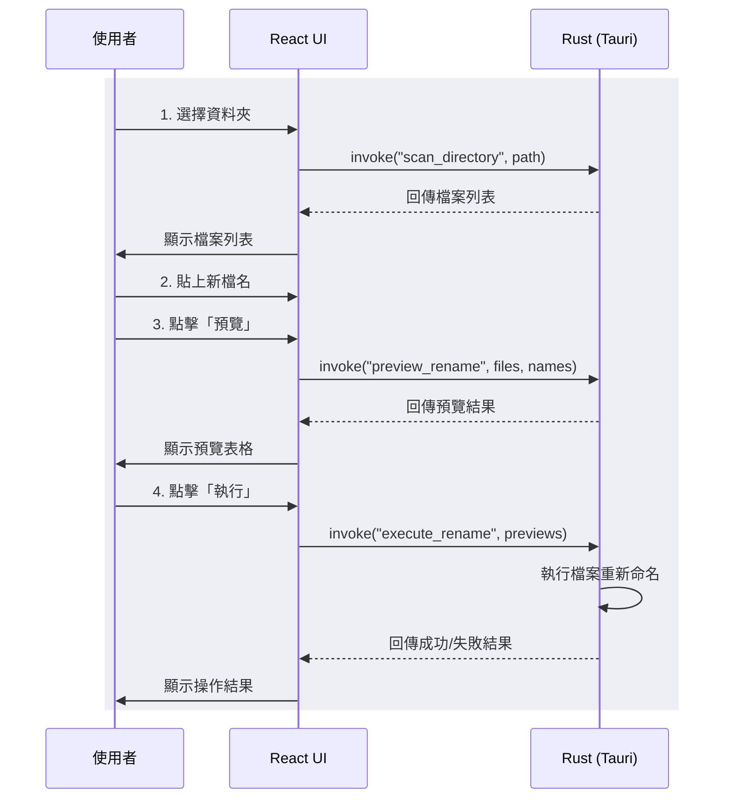
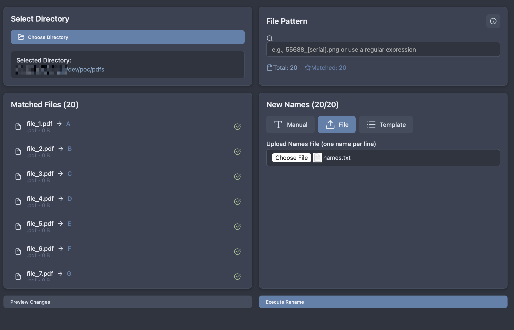

## 緣起：一個真實但繁瑣的需求

最近，一位非工程師背景的朋友向我描述了一個他工作中很頭痛的場景。他需要頻繁地使用 Word 的「合併列印」，或是 Adobe Illustrator 進行「資料合併」，將資料套印成數百份文件，再透過 `stirling-pdf` 這類工具將合併後的單一 PDF 檔分割成數百個獨立的檔案。

問題來了，分割後的檔名通常是 `文件-1.pdf`, `文件-2.pdf` ... `文件-100.pdf` 這樣的流水號。他必須根據一份預先準備好的客戶名單，手動將這些檔案一個個重新命名。這個過程不僅極度耗時、枯燥，而且很容易因為眼花而犯錯。

「有沒有辦法做一個簡單的程式，讓我選個資料夾、貼上新檔名列表，然後一鍵搞定？」他滿懷希望地問我。

這個需求非常具體，雖然用簡單的腳本也能處理，但為非技術背景的朋友提供一個 GUI 介面，無疑是更友善的選擇。這也正好給了我一個絕佳的機會，去嘗試我觀望已久的框架 —— [Tauri](https://tauri.app/)。

## 為什麼是 Tauri？

在選擇技術方案時，我考慮了幾點：

1. 跨平台：我的朋友使用 macOS，而我主要在 macOS 和 Linux 上開發，一個能橫跨所有平台的方案是首選。
2. 開發體驗：我希望能重用我（或許）熟悉的前端 stack (React, TypeScript)，而不是去學習一個全新的 GUI 框架，之前使用 golang fyne 的經驗不算特別好。
3. 效能與輕量：我不希望為了一個小工具，就打包出一個數百 MB 的龐然大物(electron)。

Tauri 完美地符合了這些要求。它允許使用任何前端框架來建構 UI，並透過作業系統原生的 WebView 來渲染，這使得最終的應用程式體積小、記憶體佔用低。後端則使用 Rust，保證了執行效能與記憶體安全。

對於前端開發者來說，Tauri 的學習曲線相對平緩，同時又能享受到 Rust 帶來的強大能力，這是一個非常有吸引力的組合。

## 架構與核心實現

這個 `Renamer` 工具的架構非常直觀：前端 UI 負責與使用者互動，並透過 Tauri 的橋樑呼叫後端 Rust 函數來執行所有檔案系統相關的底層操作。

整個核心流程可以用下面這張圖來表示：





### 後端 (Rust)：穩定可靠的執行者

Rust 的部分負責幾個核心的 `command`，這些是被前端 `invoke` 的函數。Tauri 透過 `#[tauri::command]` 這個屬性宏，就能輕易地將一個 Rust 函數暴露給前端。

例如，執行重新命名的核心邏輯：

```rust
#[tauri::command]
fn execute_rename(previews: Vec<RenamePreview>) -> Result<RenameResult, String> {
    let mut errors = vec![];
    let mut renamed_count = 0;

    for preview in previews {
        // 只處理狀態為 Ready 的項目
        if preview.status == "Ready" {
            if let Err(e) = std::fs::rename(&preview.original_path, &preview.new_path) {
                errors.push(format!("{}: {}", preview.original_name, e.to_string()));
            } else {
                renamed_count += 1;
            }
        }
    }

    Ok(RenameResult {
        success: errors.is_empty(),
        renamed_count,
        errors,
    })
}
```

Rust 強大的錯誤處理和檔案系統 API 讓這些操作變得既安全又可靠。

### 前端 (React)：靈活直觀的互動層

前端介面是使用者直接接觸的部分，我使用 React 和 TypeScript 快速建構出整個操作介面。Tauri 提供的 `@tauri-apps/api` 套件讓前後端通訊變得異常簡單。

呼叫 Rust 後端就像呼叫一個非同步的 JavaScript 函數一樣：

```typescript
import { invoke } from "@tauri-apps/api/core";
import { open } from "@tauri-apps/plugin-dialog";

// ... 省略元件狀態管理 ...

const handleExecuteRename = async () => {
    if (state.previews.length === 0) {
      // 提示使用者需要先預覽
      return;
    }

    updateState({ isLoading: true, error: null });

    try {
      // 直接呼叫後端的 execute_rename command
      const result: RenameResult = await invoke("execute_rename", {
        previews: state.previews,
      });

      if (result.success) {
        alert(`成功重新命名 ${result.renamed_count} 個檔案！`);
        // ... 刷新 UI ...
      } else {
        updateState({
          error: `發生錯誤: ${result.errors.join(', ')}`,
          isLoading: false
        });
      }
    } catch (error) {
      updateState({
        error: `執行失敗: ${error}`,
        isLoading: false
      });
    }
};
```

這種開發模式讓我幾乎可以完全專注在 UI/UX 的設計上，而不用擔心底層的實作細節。

## 踩坑與學習

整個開發過程比我想像中順利，但也有一些值得分享的學習點：

1.  macOS 的應用程式簽署：在打包 macOS 應用時，遇到了「應用程式無法開啟，因為它來自未識別的開發者」的問題。這其實是 macOS 的安全機制 (Gatekeeper) 所致。後來透過 `xattr -rd com.apple.quarantine /Applications/Renamer.app` 指令移除了 quarantine 屬性才解決。這也提醒我，桌面應用開發需要考慮更多平台相關的細節。
2.  自然排序 (Natural Sorting)：一開始我天真地用字串排序，導致 `file-10.pdf` 排在 `file-2.pdf` 前面。後來引入了 `natural_sort` crate 才解決這個問題。這讓我體會到，即便是看似簡單的需求，魔鬼也藏在細節裡。
3.  Tauri API 的易用性：Tauri 的 API 設計得非常出色。無論是檔案對話框、系統通知還是前後端通訊，都非常直觀易用，讓我這個桌面應用的新手也能快速上手。

## 寫在最後

為自己和朋友打造工具的樂趣，最終從每次 1 小時的「重新命名」作業時間，變成一分鐘以內搞定。

這次初次使用 Tauri 的經驗整體來說，還算不錯。對我而言，最大的收穫是：

- Tauri 漂亮地將 Web 技術的開發效率與 Rust 的執行效能結合在一起，提供了兩全其美的解決方案。
- 能夠用自己的技術能力，為非技術背景的朋友解決他們工作中的痛點，這種感覺遠比完成一個純技術專案更讓人滿足。
- 重新思考「工具」的價值，我們常常習慣於使用現成的商業軟體，但很多時候，一個為特定場景量身打造的小工具，能帶來不成比例的效率提升。


