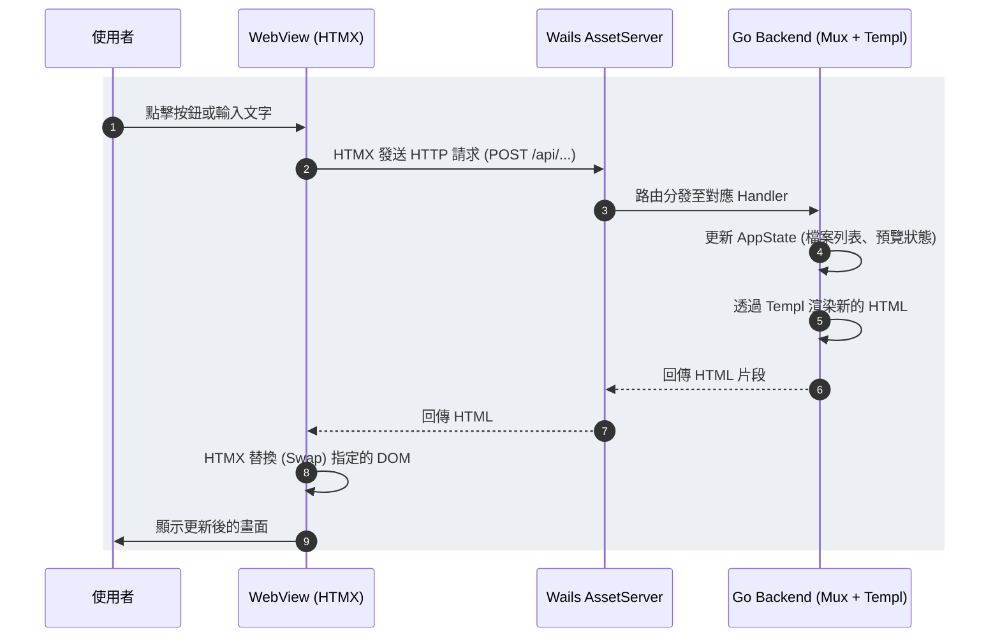

> Web 仔要有 Web 仔的自覺

## 前言

前陣子收到了 Murphy 的需求，嘗試使用 [Tauri 寫了一個桌面 App](/blogs/develop/2025/tauri_first_look)。Tauri 結合 Rust 與 React 的體驗相當不錯，打包出來的體積也十分理想。

但身為一個主要撰寫 Golang 的後端工程師，內心總有一個聲音：「如果能用 Go 來寫桌面應用，那該有多好？」

眾所周知，Golang 在原生的 Desktop GUI 框架上一直沒有特別強勢的殺手級專案（過去使用 Fyne 的經驗不算太好）。在環顧了一眾基於 Chromium 的 Electron 或是基於系統 WebView 的 Tauri 後，決定走一條稍微不一樣的「老路」：使用 [Wails](https://wails.io/) 搭配 [HTMX](https://htmx.org/) 與 [Templ](https://templ.guide/)。

最終的產物就是 [Dub](https://github.com/omegaatt36/dub) 一個跨平台的批次檔案重新命名工具。更甚，在 Linux 上打包出來的可執行檔只有約 3MB，並且完美支援 macOS 與 Linux，且幾乎沒有複雜的前端狀態管理負擔。

## 為什麼是 Wails + HTMX？

在選擇桌面應用程式的技術方案時，我們通常有幾個考量

1. Electron: 開發體驗極佳，生態系最豐富，但代價是動輒上百 MB 的體積與高昂的記憶體佔用。對於一個小工具來說，太過沉重。（這也是我優先選擇 Zed.dev 作為主要編輯器的原因）
2. Tauri: 效能極佳，體積小，但後端需要寫 Rust。雖然 Rust 很香，但有時候只想用最熟悉的 Go 快速把邏輯刻出來。
3. Wails: 與 Tauri 類似，採用前端網頁技術結合系統原生 WebView，但後端語言是 Golang。

既然選了 Wails，前端該用什麼？
現代前端框架（React, Vue, Svelte）通常需要建置複雜的 SPA（Single Page Application），並透過 JSON API 與後端溝通。但對於一個狀態並不複雜的工具軟體，不想在前端再維護一份狀態。

這時 HTMX 進入了視野。HTMX 的哲學是將應用程式的狀態與邏輯全部留在 Server 端，前端只需要透過 HTML 屬性發送請求，Server 直接回傳渲染好的 HTML 進行替換（hx-swap）。搭配 Golang 的強型別 HTML Template 引擎 Templ 以及 Tailwind CSS，開發體驗出奇地好。2024 年 vibe coding 一詞尚未誕生時，為了學習「嘴砲寫程式」，就使用了 HTMX 來打造一個[記帳程式](https://github.com/omegaatt36/bookly)。

## 架構解析：Server-Side Rendering on Desktop?

在 Dub 這個專案中，架構非常直觀。前端幾乎沒有自定義的 JavaScript（除了少數處理拖曳與快捷鍵的橋接代碼），所有的業務邏輯、狀態管理都在 Go 端完成。



這種架構有幾個顯著的好處：
1. 單一真實來源 (Single Source of Truth): 狀態完全存在於 Go 的 `app.AppState` struct 中。不用擔心前端 JS state 跟後端 Go struct 同步的問題。
2. 開發速度極快: 省去了定義 JSON API 規格、寫 TypeScript interface、處理 API 錯誤等繁瑣步驟。
3. 極致輕量: 前端不需要打包龐大的 JS 框架，只需要引入輕量的 `htmx.min.js`，將 Web 應用的輕量化發揮到極致。

## 實戰：Dub 批次檔案重新命名工具




Dub 是用這套 tech stack 完成的工具。它支援：
- 樣板命名 (Template): 支援動態變數，如 `vacation_{index:3}` -> `vacation_001`。
- 正則替換 (Find & Replace): 支援標準的字串替換與正規表達式。
- 手動編輯與清單匯入: 可拖曳 `.txt` 檔直接載入新檔名。
- 即時預覽與衝突檢測: 在執行前就能看到重命名的 Diff，並標示重複檔名的衝突。
- 復原功能 (Undo): 不小心改錯了？一鍵復原上一次的操作。

### 狀態管理的藝術

在 `app/state.go` 中，定義了整個應用程式的狀態。所有的狀態都在伺服器端（Go）被安全的保護著：

```go
type AppState struct {
	SelectedDirectory string
	AllFiles          []domain.FileItem
	MatchedFiles      []domain.FileItem
	Pattern           string
	NewNames          []string
	Previews          []domain.RenamePreview
	NamingMethod      string // "manual" | "file" | "template" | "findreplace"
}
```

所有的使用者操作（選擇資料夾、輸入過濾正則、切換命名方式），都會呼叫對應的 HTTP Handler，修改這個 `AppState`，然後重新渲染整個畫面或局部 component。

### HTMX 與 Templ 的完美配合

來看看前端是如何觸發後端邏輯的。在 `web/template/pattern.templ` 中，過濾檔案的正則輸入框是這樣寫的：

```html
<input
    type="text"
    name="pattern"
    data-debounce="400"
    data-event="pattern-changed"
    value={ pattern }
    hx-post="/api/pattern"
    hx-trigger="pattern-changed delay:200ms"
    hx-target="#main-content"
    hx-swap="innerHTML"
/>
```

當使用者輸入文字時，透過自定義的 debounce 事件觸發 `POST /api/pattern`，Wails 的內建伺服器會將請求導向 Go Handler：

```go
func (a *App) handlePattern(w http.ResponseWriter, r *http.Request) {
	a.mu.Lock()
	defer a.mu.Unlock()

	pattern := r.FormValue("pattern")
	a.state.Pattern = pattern
	a.state.ResetForPattern()
  
    // 業務邏輯：進行正則匹配
	if pattern == "" {
		a.state.MatchedFiles = a.state.AllFiles
	} else {
		matched, _ := a.pattern.MatchFiles(a.state.AllFiles, pattern)
		a.state.MatchedFiles = matched
	}

    // 重新渲染畫面並回傳 HTML
	renderTempl(w, r, template.MainContent(a.buildPageData(nil)))
}
```

HTMX 收到 HTML 後，會自動替換掉 `#main-content` 區塊。整個過程如絲般滑順，使用者體驗與傳統的 SPA 幾乎沒有差別。

### 解決拖曳與原生 API 呼叫的橋接

雖然大部分操作都可以靠 HTMX 搞定，但有些涉及到系統底層的操作（如拖曳檔案進視窗、開啟系統資料夾選擇框），還是需要透過 Wails 提供的原生 API。

在 `web/static/js/bridge.js` 寫了一小段橋接，監聽 Wails 的 `OnFileDrop` 事件，然後將路徑透過 HTMX 的 API 發送給後端：

```javascript
document.addEventListener("DOMContentLoaded", () => {
  const rt = window.runtime;
  if (rt && rt.OnFileDrop) {
    rt.OnFileDrop((x, y, paths) => {
      if (!paths || paths.length === 0) return;
      const path = paths[0];
      
      // 透過 htmx.ajax 觸發後端掃描
      htmx.ajax("POST", "/api/scan", {
        values: { path },
        target: "#main-content",
      });
    }, true);
  }
});
```

這就是這套架構最迷人的地方：保持 95% 的邏輯在 Go 端，剩下 5% 真正需要前端互動的部份，寫一點點 Vanilla JS 橋接。

## 可以更好

若有需要更多與前端的互動，強力推薦使用 typescript 保障型別安全，並用基於 Golang 的 [tsgo](https://github.com/microsoft/typescript-go) 來編譯成 JS。我在 [noccounting](https://github.com/omegaatt36/noccounting/tree/main/web/ts) 這個專案有這樣使用，一樣不需要 node_modules。

## 寫在最後

這次使用 Wails + HTMX + Templ 開發 Desktop App 的體驗非常不錯。避開了龐大的 node_modules，不用處理複雜的 Webpack/Vite 設定，也不用在前後端之間同步狀態。

得益於 Golang 強大的跨平台編譯能力與 Wails 優秀的 packaging 機制，只要簡單設定，就能在 macOS 上產出 DMG，在 Linux 上產出僅 3MB 左右的執行檔（依賴系統自帶的 WebKitGTK）。

如果你跟我一樣，是個偏愛後端的工程師，偶爾需要寫一些實用的桌面小工具給非技術人員使用，強烈推薦你試試這條「老路」。它不僅沒有繁瑣的前端框架負擔，還能讓你發揮出 Golang 原生高效能與強型別的優勢。

> 想要試試 Dub 這個批次重新命名工具？可以在 [GitHub 找到原始碼](https://github.com/omegaatt36/dub)。
