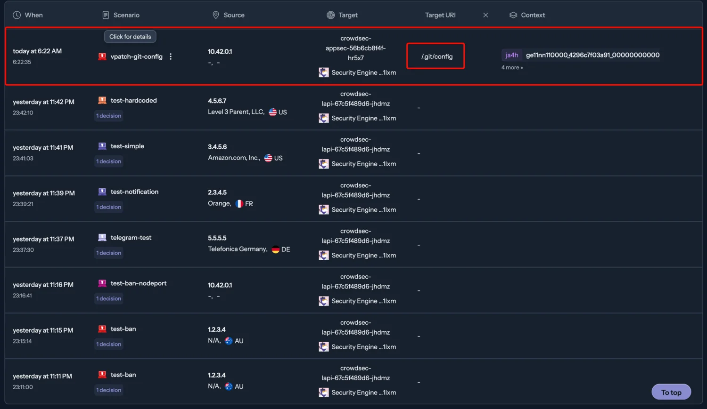
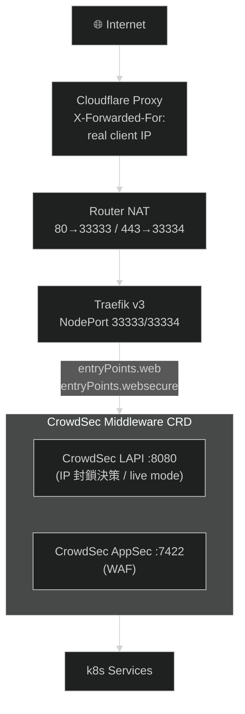
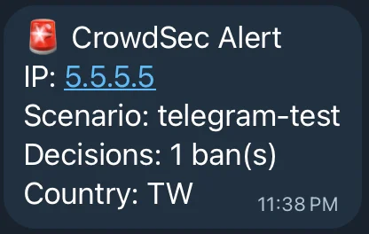

> TL;DR 馬上就看到有小王八蛋想壞壞



## 前言

2025 年 11 月，Kubernetes SIG Network 發布了一篇公告：[ingress-nginx 將正式退役](https://kubernetes.io/blog/2025/11/11/ingress-nginx-retirement/)。

這個消息讓不少人震驚，但嚴格來說有個細節需要釐清。目前市場上有兩個長得很像的 nginx ingress controller：

- [kubernetes/ingress-nginx](https://github.com/kubernetes/ingress-NGINX)：由 Kubernetes SIG Network 維護，這次宣布 EOL 的就是它。
- [nginx/kubernetes-ingress](https://github.com/nginx/kubernetes-ingress)（又稱 NKS）：由 F5 / NGINX Inc. 維護，目前仍持續開發中。

我的 homelab k3s cluster 一直以來用的是 F5 維護的版本，嚴格來說不在這次 EOL 的範圍內。但這個公告還是給了我一個動力，與其繼續追蹤兩個版本之間的差異、擔心哪天又有什麼變化，不如趁這個機會把遷移一次做完。

遷移目標選定 Traefik v3，原因有兩個：

1. k3s 內建 Traefik 作為預設 Ingress Controller，[1.32 版本後升級為 Traefik v3](https://docs.k3s.io/networking/networking-services)，搭配 `HelmChartConfig` 管理，和 cluster 的整合度最高。
2. 順手引入 CrowdSec 主動防護——長期以來我的服務靠著 Cloudflare proxy 當唯一守門人，但我一直想要在 Ingress 層就能即時判斷並封鎖攻擊者 IP，而不只是依賴前端的 CDN 過濾。

## 為什麼不選 Cilium Gateway API

在決定遷移到 Traefik 之前，我也閱讀了 Gene 的[告別 ingress-nginx：Cilium Gateway API 遷移筆記](https://igene.tw/cilium-gateway-api-migration)，評估過 Cilium Gateway API 方案。Cilium 在 CNI 層整合了 Gateway API，理論上能提供更底層、效能更好的流量控制，且完全符合 Kubernetes Gateway API 的標準規範。

但評估之後，我決定放棄這個選項，主要原因是 Cilium 強綁定自家 CNI。

k3s 預設使用 Flannel 作為 CNI，若要換用 Cilium，必須：

1. 安裝時就指定 `--flannel-backend=none` 關掉 Flannel
2. 手動安裝 Cilium 作為替代 CNI
3. 重建整個 cluster，因為 CNI 無法在線上無縫切換

對於一個正在運行十幾個服務的 Production homelab 而言，雖然我有做好備份，這個風險太高了。Cilium 本身也有一定的學習曲線和資源消耗（特別是 eBPF 的 kernel 版本要求），對 homelab 這個 single-node k3s 環境來說，ROI 不划算。

相比之下，Traefik 是 k3s 的內建選項，從 Nginx 遷移到它的路徑清晰很多。

## Traefik in k3s

Traefik 之所以是 k3s 的預設 Ingress Controller，是因為兩者的設計哲學非常契合：

- lightweight：Traefik 的「閒置」資源消耗遠低於 ingress-nginx，對記憶體和 CPU 都更友善，這對 homelab 的 edge 環境非常重要。
- auto service discovery：Traefik 可以透過 Kubernetes Ingress 資源或自定義的 IngressRoute CRD 動態更新路由，不需要重啟服務。
- Plugin：Traefik v3 支援從 plugin registry 動態載入 middleware plugin，CrowdSec 的 bouncer 就是透過這個機制整合的。
- k3s `HelmChartConfig`：k3s 提供了 `HelmChartConfig` CRD，讓我們可以直接透過 yaml 覆蓋 Traefik Helm chart 的 values，而不需要自己管理 Helm release。

在 ingress-nginx 釋出退役消息後，Traefik 官方火速寫了這篇 [Why Traefik](https://traefik.io/blog/migrate-from-ingress-nginx-to-traefik-now)。

## CrowdSec 是什麼

[](https://www.crowdsec.net/blog/kubernetes-crowdsec-integration)

CrowdSec 是一個現代化的開源安全引擎，定位是「協作式的 fail2ban」，傳統的 fail2ban 運作方式是：讀取本機 log → 規則匹配 → 封鎖 IP，且只能保護自己這台機器，規則也需要自己維護。

CrowdSec 的改進在於：

- 所有部署了 CrowdSec 的節點會把偵測到的惡意 IP 回報給 CrowdSec 的 Central API（CAPI），形成一個全球的共享封鎖名單。你不只在保護自己，也在幫助別人。
- CrowdSec 使用「Collection」的概念，每個 Collection 包含針對特定服務的攻擊模式（例如 `crowdsecurity/traefik` 包含 HTTP 掃描、暴力破解等場景）。
- Bouncer 架構：CrowdSec 本身只負責偵測和決策，實際的封鎖動作由 Bouncer 執行。Traefik Plugin 就是一個 Bouncer，它在每個請求進來時查詢 CrowdSec LAPI，確認來源 IP 是否在封鎖名單上。

詳細可以參考官方的[這篇文章](https://www.crowdsec.net/blog/secure-kubernetes-ingress-with-crowdsec-and-traefik-devsecops-at-scale)。

## 整體架構



目前 cluster 的部署狀態：

| 元件 | Chart | Namespace |
|------|-------|-----------|
| Traefik | traefik | kube-system |
| CrowdSec | crowdsecurity/crowdsec | crowdsec |
| cert-manager | cert-manager | cert-manager |

CrowdSec 在 `crowdsec` namespace 下部署了三個 Deployment：

```bash
$ kubectl get pods -n crowdsec
NAME                               READY   STATUS    RESTARTS   AGE
crowdsec-agent-bf694dddd-gn48l     1/1     Running   0          15h
crowdsec-appsec-56b6cb8f4f-hr5x7   1/1     Running   0          14h
crowdsec-lapi-694bb65584-whhtw     1/1     Running   0          14h
```

- LAPI：Local API，負責接收 Agent 的決策、管理封鎖名單、與 CAPI 同步
- Agent：讀取 Traefik Access Log，執行場景匹配
- AppSec：WAF 引擎，負責應用層的攻擊偵測（目前有已知問題，見後述）

## 遷移步驟

> **遷移前注意**：以下步驟允許停機。請確保已完整備份；若有其他使用者，請事先通知並暫停資料修改（如更新密碼管理器），否則從備份恢復後，遷移期間的變更將全數消失。

### ㄧ、停用 ingress-nginx

首先移除原本的 ingress-nginx：

```bash
helm uninstall ingress-nginx -n ingress-nginx
kubectl delete namespace ingress-nginx
```

### 二、設定 Traefik HelmChartConfig

k3s 中 Traefik 是透過 `HelmChartConfig` 管理的，建立或修改 `/var/lib/rancher/k3s/server/manifests/traefik-config.yaml`（或使用 kubectl apply）：

```yaml
apiVersion: helm.cattle.io/v1
kind: HelmChartConfig
metadata:
  name: traefik
  namespace: kube-system
spec:
  valuesContent: |-
    logs:
      general:
        level: INFO
      access:
        enabled: true
    # CrowdSec bouncer plugin（從 Traefik Plugin Registry 動態載入）
    experimental:
      plugins:
        crowdsec-bouncer-traefik-plugin:
          moduleName: "github.com/maxlerebourg/crowdsec-bouncer-traefik-plugin"
          version: "v1.4.2"
    ports:
      web:
        # 若需要固定 NodePort（例如 Router NAT 有指定對應 port），在此設定
        # nodePort: 33333
        # 全域套用 CrowdSec Middleware
        http:
          middlewares:
            - "crowdsec-crowdsec@kubernetescrd"
        forwardedHeaders:
          trustedIPs:
            # Cloudflare IP 範圍（用於正確讀取 X-Forwarded-For）
            # 完整列表：https://www.cloudflare.com/en-us/ips/
            - "103.21.244.0/22"
            - "103.22.200.0/22"
            - "173.245.48.0/20"
            # ...
      websecure:
        # nodePort: 32443
        http:
          middlewares:
            - "crowdsec-crowdsec@kubernetescrd"
        forwardedHeaders:
          trustedIPs:
            - "103.21.244.0/22"
            # ...
```

這裡有個細節值得注意：Middleware 的路徑是 `ports.web.http.middlewares`，不是 `ports.web.middlewares`。這個差異在 Traefik v3 (chart v39) 中是會靜默忽略的，稍後的踩坑記錄會詳細說明。

### 三、部署 CrowdSec

先建立靜態 PV（k3s 環境中偏好使用靜態 PV 而非動態 `local-path`，確保資料持久性）：

```yaml
apiVersion: v1
kind: PersistentVolume
metadata:
  name: crowdsec-db-pv
spec:
  storageClassName: ""
  capacity:
    storage: 1Gi
  accessModes:
    - ReadWriteOnce
  persistentVolumeReclaimPolicy: Retain
  local:
    path: /opt/crowdsec/db  # 節點上的實際路徑
  nodeAffinity:
    required:
      nodeSelectorTerms:
        - matchExpressions:
            - key: kubernetes.io/hostname
              operator: In
              values:
                - <your-node-name>  # kubectl get nodes 查詢
```

在節點上建立對應目錄：

```bash
# ssh 進入 k3s 節點
mkdir -p /opt/crowdsec/db /opt/crowdsec/config
```

再用 Helm 安裝 CrowdSec：

```bash
helm repo add crowdsecurity https://crowdsecurity.github.io/helm-charts
helm repo update

helm upgrade --install crowdsec crowdsecurity/crowdsec \
  -n crowdsec --create-namespace \
  -f k8s/crowdsec/values.yaml \
  --version 0.23.0
```

### 四、建立 Bouncer API Key 並套用 Middleware

CrowdSec LAPI 啟動後，需要手動建立 Traefik Bouncer 的 API Key：

```bash
LAPI_POD=$(kubectl get pod -n crowdsec -l type=lapi \
  -o jsonpath='{.items[0].metadata.name}')

# 刪除既有的再重建
kubectl exec -n crowdsec "$LAPI_POD" -- \
  cscli bouncers delete traefik-bouncer 2>/dev/null || true

BOUNCER_API_KEY=$(kubectl exec -n crowdsec "$LAPI_POD" -- \
  cscli bouncers add traefik-bouncer -o raw)

echo "API Key: $BOUNCER_API_KEY"
```

再把 API Key 存成 Secret，並套用 Middleware CRD：

```bash
kubectl create secret generic crowdsec-bouncer-secret \
  -n crowdsec \
  --from-literal=api-key="$BOUNCER_API_KEY" \
  --dry-run=client -o yaml | kubectl apply -f -
```

Middleware CRD 範本（`middleware.yaml`）：

```yaml
apiVersion: traefik.io/v1alpha1
kind: Middleware
metadata:
  name: crowdsec
  namespace: crowdsec
spec:
  plugin:
    crowdsec-bouncer-traefik-plugin:
      enabled: true
      logLevel: INFO
      crowdsecMode: live
      crowdsecLapiKey: "${BOUNCER_API_KEY}"
      crowdsecLapiHost: "crowdsec-service.crowdsec.svc.cluster.local:8080"
      crowdsecLapiScheme: http
      crowdsecAppsecEnabled: true
      crowdsecAppsecHost: "crowdsec-appsec-service.crowdsec.svc.cluster.local:7422"
      forwardedHeadersCustomName: X-Forwarded-For
```

因為 API Key 不應該 commit 到 git，所以透過 `envsubst` 在 apply 前替換環境變數：

```bash
export BOUNCER_API_KEY="..."
envsubst < middleware.yaml | kubectl apply -f -
```

## 踩坑記錄

這次遷移過程踩了不少坑，以下是最值得記錄的幾個。

### Middleware 路徑寫錯，完全靜默失敗

問題：Middleware CRD 存在，Bouncer 也已在 LAPI 註冊，但 `kubectl logs -n kube-system deployment/traefik` 中完全看不到任何 CrowdSec 相關的 log，`Last API pull` 時間也一直是空的。

原因：Traefik v3 (chart v39) 中，全域 Middleware 的正確路徑是：

```yaml
# 正確
ports:
  web:
    http:
      middlewares:
        - "crowdsec-crowdsec@kubernetescrd"

# 錯誤
ports:
  web:
    middlewares:
      - "crowdsec-crowdsec@kubernetescrd"
```

`ports.web.middlewares` 在 Traefik v3 chart 中已經不是有效路徑，但 Helm 不會報錯，流量也不會被攔截，Traefik 就靜靜地把這個設定吃掉了。

這種靜默失敗最難 debug，因為你沒有任何錯誤訊息可以追查。

### Middleware 格式是 `namespace-name@kubernetescrd`

在 Traefik 中，CRD（`IngressRoute`、`Middleware` 等）的引用格式是：

```
<namespace>-<name>@kubernetescrd
```

所以在 `crowdsec` namespace 下名叫 `crowdsec` 的 Middleware，完整引用名稱是：

```
crowdsec-crowdsec@kubernetescrd
```

一開始沒注意到 namespace prefix，直接寫 `crowdsec@kubernetescrd` 導致 Middleware 找不到。

### AppSec Collection 需要在 AppSec Pod 中獨立安裝

問題：AppSec Pod 啟動崩潰：

```
level=fatal msg="crowdsec init: while loading acquisition config: 
datasource of type appsec: unable to load appsec_config: 
no appsec-config found for crowdsecurity/virtual-patching"
```

原因：CrowdSec Helm chart 0.23.0 中，`agent`、`appsec`、`lapi` 三個 Pod 各自使用獨立的 `emptyDir` volume 存放設定。Agent Pod 下載的 Collections 不會共享給 AppSec Pod。

解法：在 `values.yaml` 的 `appsec` 段落中額外指定 `COLLECTIONS` 環境變數：

```yaml
appsec:
  enabled: true
  env:
    - name: COLLECTIONS
      value: "crowdsecurity/appsec-virtual-patching crowdsecurity/appsec-generic-rules"
  acquisitions:
    - source: appsec
      listen_addr: "0.0.0.0:7422"
      path: /
      appsec_config: crowdsecurity/virtual-patching
      labels:
        type: appsec
```

Chart 會透過 init container 在 AppSec Pod 啟動前把指定的 Collections 下載好。

### `crowdsecurity/vaultwarden` Collection 不存在

問題：Agent init container 失敗並 crash-loop：

```
Error: cscli collections install: 
can't find 'crowdsecurity/vaultwarden' in collections
```

這個 Collection 在 CrowdSec Hub 中根本不存在（至少截至 v1.7.7 為止）。Vaultwarden 的暴力破解防護部分被 `crowdsecurity/traefik` 這個 HTTP 場景 Collection 涵蓋，不需要單獨的 Collection。

移除這個不存在的 Collection 名稱後，Agent 正常啟動。

### notification-telegram 在 v1.7.7 Image 中不存在

我想設定 Telegram 通知，在 `values.yaml` 裡面加上了 `notification-telegram` 的設定，結果 LAPI 直接 fatal crash：

```
level=fatal msg="api server init: plugin broker: loading plugin: 
binary for plugin telegram_default not found"
```

CrowdSec v1.7.7 的官方 Docker image 中沒有 `notification-telegram` 這個 binary。官方的做法是使用 `type: http` 的 notification plugin 來呼叫 Telegram Bot API，設定方式可以參考[官方文件](https://docs.crowdsec.net/docs/local_api/notification_plugins/telegram/)。

值得一提的是：`format` 欄位是 Go template，**不**支援 `${VAR}` 環境變數替換（那只對頂層字串欄位如 `url` 有效），所以 `chat_id` 只能硬寫或透過 Go template 語法帶入，不能用 `${TELEGRAM_CHAT_ID}` 佔位。

### AppSec 未實際作用（未解決）

目前整套架構中，IP 封鎖（LAPI + live mode）運作正常，但 AppSec（WAF）部分尚未實際生效。

具體問題是 AppSec Pod 正常運行，Middleware CRD 中 `crowdsecAppsecEnabled: true` 也已設定，但 Traefik Plugin 的 log 顯示請求進來時沒有觸發 AppSec 查詢。

目前懷疑是 Traefik Plugin 使用 `mapstructure` 來反序列化 CRD 的設定，boolean 型別欄位（`crowdsecAppsecEnabled`）可能沒有被正確解析，字串型別欄位（`crowdsecLapiHost`、`crowdsecMode`）確認運作正常，但 bool 欄位似乎被忽略了。（此為目前推測，尚未透過 Plugin 原始碼或 issue 追蹤確認。）

這個問題目前還沒有找到解決方法，AppSec Pod 先維持運行，等後續版本的 Plugin 或 Chart 修復後再行驗證。

IP 封鎖的部分完全正常運作，可以用下面的指令測試：

```bash
LAPI_POD=$(kubectl get pod -n crowdsec -l type=lapi \
  -o jsonpath='{.items[0].metadata.name}')

# 手動新增封鎖決策
kubectl exec -n crowdsec "$LAPI_POD" -- \
  cscli decisions add --ip "5.5.5.5" --duration 5m --reason "test"

# 確認封鎖名單
kubectl exec -n crowdsec "$LAPI_POD" -- \
  cscli decisions list

# 清除測試封鎖
kubectl exec -n crowdsec "$LAPI_POD" -- \
  cscli decisions delete --ip "5.5.5.5"
```



## 寫在最後

從 ingress-nginx 遷移到 Traefik 的過程比我預期的平順，k3s 的 `HelmChartConfig` 機制讓 Traefik 的設定管理非常直覺。

CrowdSec 的整合稍微複雜一些，主要是 Helm chart 0.23.0 有一些反直覺的設計（各 Pod 的 emptyDir 隔離、非標準 label），但搞清楚之後架構其實很清晰。

目前最大的未解問題是 AppSec 的 bool 欄位反序列化問題，但這不影響核心的 IP 封鎖功能。整合了 CrowdSec 之後，我可以在 LAPI 的 dashboard 看到來自 CAPI 的全球封鎖名單被同步下來，不再只靠 Cloudflare 當唯一的守門人了。

下一步可能會考慮把 CrowdSec 的 decisions 也整合到 Cloudflare 的防火牆規則，讓封鎖在邊緣節點就生效，進一步減少不必要的請求打到 k3s cluster。

## 參考資料

- [Traefik 官方文件](https://doc.traefik.io/traefik/)
- [CrowdSec Helm Chart](https://github.com/crowdsecurity/helm-charts)
- [crowdsec-bouncer-traefik-plugin](https://github.com/maxlerebourg/crowdsec-bouncer-traefik-plugin)
- [CrowdSec Hub](https://hub.crowdsec.net/)
- [k3s HelmChartConfig](https://docs.k3s.io/helm#customizing-packaged-components-with-helmchartconfig)
- [告別 ingress-nginx：Cilium Gateway API 遷移筆記](https://igene.tw/cilium-gateway-api-migration)
- [Ingress NGINX EOL in 120 Days - Migration Options and Strategy](https://www.reddit.com/r/kubernetes/comments/1p12a17/ingress_nginx_eol_in_120_days_migration_options/)
