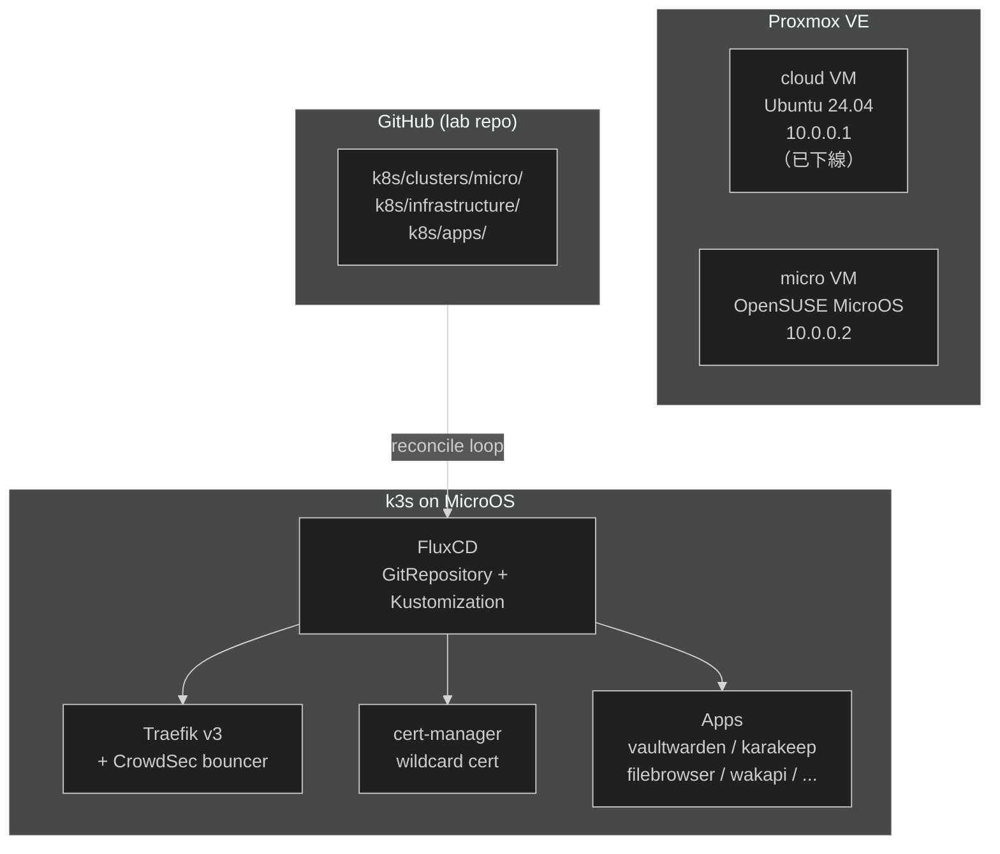

## 前言

我的 Homelab 跑著一台 Proxmox VE，底下有一個 Ubuntu Server 24.04 的 VM 負責跑 k3s cluster，這個 cluster 接管了家裡所有的自架服務：從 [Vaultwarden 密碼管理](/blogs/develop/2023/bitwarden_with_self_hosted_password_backend/)、[Karakeep](https://karakeep.app/) 書籤、[Filebrowser](https://github.com/filebrowser/filebrowser) 文件管理，到 [Wakapi](https://www.wakapi.dev/) 開發時間追蹤，大大小小跑了十幾個服務。

這個架構一直跑得很穩。直到 Linux kernel 7.0 發布，我才開始動搖。

kernel 7.0 的各種新特性讓我心癢，Ubuntu 26.04 LTS 剛好以 kernel 7.0 作為預設核心，理論上從 24.04 升上去就能一步到位。但在一個跑著十幾個服務的生產 VM 上執行 `do-release-upgrade`，那種心臟發抖的感覺，即便有做好備份，還是讓我遲遲下不了手。

就在猶豫要不要升級的當下，我問了自己一個問題：「我要繼續用 Ubuntu 嗎？」

這個問題打開了一扇門。我的 Linux desktop 是 openSUSE Tumbleweed + KDE Plasma，用了三年、換過兩台裝置（筆電和桌電），沒有遇到太多問題。Tumbleweed 的滾動更新讓我一直跑著最新的 kernel，升級這件事從來不是一個需要另外排行程的壓力事件。

既然 desktop 側已經對 openSUSE 生態有信心，server 側為什麼不試試看？

這讓我開始認真考慮：有沒有一種 OS，讓 server 的升級這件事也變成「預設安全」而不是「需要勇氣」？

## 為什麼選 OpenSUSE MicroOS

[OpenSUSE MicroOS](https://microos.opensuse.org/) 是一個 Immutable OS（不可變作業系統），核心特性有幾個：

- 根目錄唯讀：系統分區是唯讀掛載，任何系統級的改動都要透過 `transactional-update` 寫入下一個快照。
- 原子式更新（Atomic Updates）：每次更新都是建立一個新的系統快照（基於 Btrfs subvolume），更新成功後重開機切換，失敗就自動 rollback 到舊快照。升級從一個需要勇氣的操作，變成一個可以安心按下去的日常動作。
- SELinux Enforcing：預設啟用 SELinux。
- openSUSE Tumbleweed 基礎：kernel 跟著 Tumbleweed 走，能追到最新穩定版本，正好解決了我一開始想嘗鮮 kernel 7.0 的需求。

對我來說還有一個很實際的加分項：我的 desktop 用的就是 openSUSE Tumbleweed，對這個生態系和套件管理早就熟悉。MicroOS 和 Tumbleweed 共享相同的上游，從 desktop 帶來的直覺大多數都適用。

### 為什麼不選 Talos

在評估選項時，[Talos Linux](https://www.talos.dev/) 幾乎是最直觀的替代答案：同樣是 Immutable OS、專為 Kubernetes 設計、管理介面更現代。

但我有一個硬傷：我的 k8s 服務裡有大量使用 `local-path` provisioner 建立的 PersistentVolume，這些 PV 都綁定在單一節點的本機路徑上。Talos 真正的強項是多節點 HA cluster，節點壞掉、Pod 自動移轉到其他節點。

我的 homelab 從一開始就是 single-node cluster：整個 k3s 跑在一台 VM 上，所有 PV 都在這個節點。在這個前提下，換到 Talos 增加的設定複雜度，並沒有帶來對應的好處。MicroOS 讓我繼續沿用現有的 local-path PV 策略，也維持熟悉的 `systemd` 管理模式。

## 順便換上 FluxCD

搬 VM 是一次性的硬性成本。既然要搬，就順手把一直想做但一直懶得做的事也做了：把管理方式從「手動 `helm upgrade --install`」換成 GitOps。

原本的方式問題不大，但有幾個不舒服的地方：

- 狀態不在 git：Helm release 的狀態存在 cluster 的 Secret 裡，git 裡看不到現在跑的是什麼版本、加了什麼 values 覆寫。
- 難以重現：要在另一個環境重建相同的 cluster，需要翻 history 和筆記，沒有單一的 source of truth。
- Secrets 的管理是個黑洞：API key、資料庫密碼等等，散落在各處或存在本機的 scripts 裡。

[FluxCD](https://fluxcd.io/) 把 git repo 當作 cluster 的唯一事實來源：你在 git 裡寫下你想要的狀態，Flux 負責讓 cluster 和 git 保持同步。

Secrets 的問題，是後來跟 Claude 討論過程中才摸索出解法的：FluxCD 原生支援 [SOPS](https://getsops.io/) 解密，搭配 age 加密金鑰，可以讓加密後的 k8s Secret 也直接 commit 進 git，整個 cluster 的狀態就真的都在版本控制裡了。代價是要想辦法保管好 age 的私鑰，私鑰進了 cluster 的 Secret 就不再進 git。

整套流程走下來之後，所有服務的 Helm values、版本、設定，全部都在 git 歷史裡，下次要重建環境，`flux bootstrap` 一行命令之後等著就好。

## 整體架構



Repo 結構：

```
k8s/
  clusters/
    micro/
      flux-system/          # flux bootstrap 產生
      kustomization.yaml    # 進入點
      infrastructure.yaml   # traefik, cert-manager, crowdsec
      apps.yaml             # 應用服務
  infrastructure/
    helm-repositories/      # HelmRepository sources
    traefik/                # HelmChartConfig (nodePort 32080/32443)
    cert-manager/           # HelmRelease + Cloudflare secret
    cert-manager-config/    # ClusterIssuer + Certificate（獨立 Kustomization）
    crowdsec/               # HelmRelease + secrets + Middleware
  apps/
    filebrowser/
    karakeep/
    kms/                    # vaultwarden namespace
    wakapi/
    # ...
```

## 遷移流程

整個遷移分四個 Phase，按照「壞掉了影響最小」到「壞掉了最嚴重」的順序排列。

### Phase 1：基礎設施

FluxCD Bootstrap

先在 MicroOS VM 上建好 k3s，然後 bootstrap FluxCD：

```bash
kubectl create namespace flux-system --context micro

# 將 age 私鑰存進 cluster，供 SOPS 解密使用
cat "${HOME}/age.agekey" | kubectl create secret generic sops-age \
  --namespace=flux-system \
  --from-file=age.agekey=/dev/stdin \
  --context micro

GITHUB_TOKEN=$(cat flux-github-pat) flux bootstrap github \
  --context micro \
  --owner=omegaatt36 \
  --repository=<repo> \
  --branch=main \
  --path=k8s/clusters/micro \
  --personal \
  --token-auth
```

Bootstrap 完成後，Flux 會持續監控 git repo，只要有 commit push 上去，cluster 就會自動同步。

SOPS + age 加密

`.sops.yaml` 放在 repo 根目錄，只含 age 公鑰。私鑰只存在 cluster 的 Secret，不進 git：

```yaml
creation_rules:
  - path_regex: k8s/.*secret.*\.yaml
    age: age1xxxxxxxxxxxxxxxxxxxxxxxxxxxxxxxxxxxxxxxxxxxxxxxxxxxxxxxxxxxxxxxx
    encrypted_regex: ^(data|stringData)$
```

之後 commit secret 前只要：

```bash
sops --encrypt --in-place k8s/apps/<service>/secret.yaml
```

Traefik + cert-manager

用 `HelmChartConfig` 管理 Traefik，cert-manager 管理 wildcard TLS 憑證。cert-manager 的設定刻意拆成兩個 Kustomization：一個裝 chart、另一個裝 ClusterIssuer，因為 ClusterIssuer 是 cert-manager 的 CRD，在 chart 還沒裝完之前 apply 會 dry-run 失敗。

Traefik 的詳細設定和 CrowdSec 整合可以參考[上一篇](/blogs/develop/2026/migrate_ingress_controller_from_nginx_to_traefik/)。

### Phase 2：無狀態服務 + CrowdSec

無狀態服務最好處理，沒有資料需要搬，只要把舊的 Helm values 翻譯成 FluxCD 的 `HelmRelease` 格式就好。

| 服務 | 備註 |
|------|------|
| [bentopdf](https://www.bentopdf.com/zh-TW/) | 無狀態 |
| [it-tools](https://github.com/corentinth/it-tools) | 無狀態 |
| [s-pdf](https://github.com/Stirling-Tools/stirling-pdf) | 2.0 後需要處理 auth |

在 MicroOS 上遇到了一個 Traefik 特有的問題：根目錄唯讀導致 CrowdSec plugin 的 `/plugins-storage` 無法建立。解法是在 `HelmChartConfig` 裡額外掛 `emptyDir`：

```yaml
# HelmChartConfig 的 valuesContent
deployment:
  additionalVolumes:
    - name: plugins-storage
      emptyDir: {}
  additionalVolumeMounts:
    - name: plugins-storage
      mountPath: /plugins-storage
```

另一個細節：MicroOS 上的 `externalTrafficPolicy` 需要設為 `Local`，才能讓 Traefik 正確取得真實 client IP（而不是 node IP）。

### Phase 3：有狀態服務

有狀態服務需要把資料從舊 VM rsync 過來，流程都一樣：

```bash
# 1. scale down 舊 VM 上的服務，確保資料一致性
kubectl scale deployment <name> --replicas=0 --context cloud

# 2. rsync 資料到新 VM
rsync -avz --progress \
  user@10.0.0.1:/home/user/<service>/ \
  user@10.0.0.2:/home/user/<service>/

# 3. 在新 VM 建立 PV/PVC（nodeAffinity 指定 micro 節點）
kubectl apply -f k8s/apps/<service>/pv-pvc.yaml --context micro

# 4. push HelmRelease → Flux 自動部署
flux reconcile source git flux-system --context micro
flux reconcile kustomization apps --context micro
```

MicroOS 的根目錄唯讀讓我原本的 NAS 掛載策略整個失效。舊的 Ubuntu VM 用的是 `/etc/fstab` + cifs，在 MicroOS 上兩個都行不通（`/mnt` 無法建立掛載點）。改用 `systemd mount unit` + `hostPath`，掛載點改到 `/home/user/nas`：

```ini
# /etc/systemd/system/home-user-nas.mount
[Unit]
Description=NAS CIFS mount
After=network-online.target

[Mount]
What=//10.0.0.x/nas
Where=/home/user/nas
Type=cifs
Options=credentials=/etc/cifs-credentials,uid=1000

[Install]
WantedBy=multi-user.target
```

| 服務 | 狀態 | 備註 |
|------|------|------|
| filebrowser | ✓ | rsync db，NAS 改用 hostPath |
| karakeep | ✓ | rsync data，meilisearch 在 micro 重建 index |
| wakapi | ✓ | fresh DB，無需 rsync |
| s-pdf | ✓ | PVC for /configs，auth 設定持久化 |
| booklore | ⏸ | SELinux Enforcing 阻擋 JVM JIT，暫緩 |

### Phase 4：vaultwarden（攸關性命）

Vaultwarden 是整個遷移裡心臟跳最快的一步。這個服務存著所有密碼和 2FA，一旦服務掛掉、資料遺失，後果不堪設想。詳細的 Vaultwarden 架構可以參考[這篇](/blogs/develop/2023/bitwarden_with_self_hosted_password_backend/)。

正因為它最重要，反而讓我最後才動它，前面幾個 Phase 都在練習遷移流程，讓我對整個操作有足夠信心之後，才敢碰 vaultwarden。

遷移步驟刻意壓縮服務中斷視窗：

```bash
# 1. scale down 舊的 vaultwarden
kubectl scale deployment vaultwarden --replicas=0 -n default --context cloud

# 2. rsync 資料（vaultwarden sqlite 很小，幾秒鐘搞定）
rsync -avz --progress \
  user@10.0.0.1:/home/user/vaultwarden/ \
  user@10.0.0.2:/home/user/vaultwarden/

# 3. 確認資料完整後，讓 Flux 在 micro 上部署
flux reconcile source git flux-system --context micro
flux reconcile kustomization apps --context micro
```

整個中斷視窗在 5 分鐘以內，主要時間花在確認新環境的服務健康狀態。

admin-token 故意留空（停用 admin panel），能少一個攻擊面就少一個。

## 踩坑記錄

這次遷移踩的坑主要分成兩類：MicroOS 本身的限制，以及 FluxCD 的使用細節。

### MicroOS：根目錄唯讀

MicroOS 的 `/` 是唯讀的，這影響了幾個地方：

- `/mnt` 無法建立掛載點，NAS 改掛在 `/home/user/nas`
- Traefik 的 CrowdSec plugin 預設寫 `/plugins-storage`，需要掛 `emptyDir` 解決

### vaultwarden-backup image tag 沒有 `v` 前綴

Docker Hub 上的 `ttionya/vaultwarden-backup` image tag 是 `1.26.9`，而不是 `v1.26.9`。Flux 的 HelmRelease 如果寫錯 tag，Pod 就一直 `ImagePullBackOff`，而錯誤訊息只說「找不到 image」，完全不會提示你 tag 格式問題。到 Docker Hub 上確認一下最快。

### FluxCD：kustomization.yaml 必須 commit

每個被父層 `kustomization.yaml` 引用的子目錄，都必須有自己的 `kustomization.yaml`，且這個檔案要 commit 進 git。本地有檔案但沒 commit，Flux 會報：

```
error decrypting sources: no kustomization file found
```

錯誤訊息完全沒提到「你忘了 commit」，只說找不到 kustomization file，容易誤導去懷疑路徑設定問題。

### FluxCD：reconcile 要先更新 source

push 完改動之後，想立刻看到效果，需要先讓 Flux 拉新 commit：

```bash
# 這樣不會拉新 commit
flux reconcile kustomization apps --context micro

# 正確做法：先更新 source
flux reconcile source git flux-system --context micro
flux reconcile kustomization apps --context micro
```

### FluxCD：`context deadline exceeded` 不等於失敗

Flux CLI 的 reconcile 有等待 timeout，timeout 後顯示 `context deadline exceeded` 只是 CLI 放棄等待，不代表 reconciliation 失敗，實際 reconciliation 可能還在跑。用以下指令確認真實狀態：

```bash
flux get kustomizations --context micro
flux get helmreleases -n default --context micro
```

### SELinux 阻擋 JVM JIT（暫緩）

booklore 這個服務目前暫時跳過。原因是 SELinux Enforcing 阻擋了 JVM JIT 編譯所需的 `mmap PROT_EXEC`。

解法方向是設定 SELinux boolean：

```bash
sudo setsebool -P container_execmem 1
```

但我目前沒有精力深入 SELinux policy，先把 booklore 暫停，等未來有需要再說。

### CrowdSec Bouncer Key 的 GitOps 流程

CrowdSec bouncer key 要先等 LAPI 跑起來才能產生，這打破了「所有設定都先 commit 好」的 GitOps 理想流程：

```bash
# LAPI 起來後，手動產生 key
kubectl exec -n crowdsec deploy/crowdsec-lapi --context micro -- \
  cscli bouncers add traefik-bouncer -o raw

# 填入 secret，SOPS 加密後 commit
sops --encrypt --in-place k8s/infrastructure/crowdsec/secret-bouncer.yaml
git add k8s/infrastructure/crowdsec/secret-bouncer.yaml && git commit -m "..."
```

key 到位之前，middleware 會 fail-open（stream mode），服務不中斷但 IP 封鎖暫時失效。

## 寫在最後

整個遷移花了大概兩週的零碎時間，最主要的心理成本是 vaultwarden 那步，動之前反覆確認備份，動之後其實五分鐘就搞定了。

MicroOS 的 immutable 特性確實讓人踏實，上次做系統更新的體感是：`transactional-update dup && reboot`，等重開機，完成。不需要祈禱 apt 的 dist-upgrade 不要把什麼 config 蓋掉，也不需要擔心下一次大版本升級要不要再心跳加速一次。

FluxCD 的學習曲線比預期高一點，主要在於它的架構比較 opinionated（GitRepository → Kustomization → HelmRelease 一層套一層），初期需要時間建立心智模型。但一旦設定好了，每次更新服務只要改 git、push，剩下的它自己來。整個 cluster 的狀態現在完全在 git 歷史裡，這個感覺很好。

目前 micro 已完全承接所有服務，cloud VM 已下線，持續觀察中。

## 參考資料

- [Seeking Guidance on Deploying K3s Cluster on OpenSUSE MicroOS ](https://www.reddit.com/r/openSUSE/comments/1je99h1/seeking_guidance_on_deploying_k3s_cluster_on/)
- [K3s – Lightweight Kubernetes](https://news.ycombinator.com/item?id=37847587)
- [OpenSUSE MicroOS](https://microos.opensuse.org/)
- [FluxCD 官方文件](https://fluxcd.io/docs/)
- [SOPS](https://getsops.io/)
- [age encryption](https://age-encryption.org/)
- [bjw-s app-template Helm chart](https://bjw-s-labs.github.io/helm-charts/)
- [k3s Ingress Controller 從 Nginx 遷移到 Traefik 同時整合 CrowdSec](/blogs/develop/2026/migrate_ingress_controller_from_nginx_to_traefik/)
- [使用 Bitwarden 與自架後端 Vaultwarden 來管理密碼與 2FA Authenticator](/blogs/develop/2023/bitwarden_with_self_hosted_password_backend/)
