## 前言

如果你有認真對待自己的資料，應該聽過 **3-2-1 備份原則**：

- **3** 份備份
- **2** 種不同的儲存媒介
- **1** 份異地備援

前兩項在家中的 Homelab 環境相對容易做到，但「異地」這個字往往是大多數人的盲點。硬碟壞掉？用 Proxmox Backup Server (PBS) 還原。系統崩潰？從 PBS 拉一份回來。但若是家裡發生火災、淹水，或是更平凡的情況——你不小心把整台 Proxmox VE 的 NVMe 連資料一起刪掉——這時候同一個屋簷下的所有備份都會跟著陪葬。

我的 Homelab 環境是一台 Proxmox VE 搭配一台 Proxmox Backup Server，跑著包含 k3s、Vaultwarden 等各種服務。在研究了很久的異地備援方案後，我決定在歐洲架設一台 PBS，讓它透過 WireGuard 隧道主動把家裡的備份「拉」過去，讓 321 中的那個「1」真正落地。

這篇文章會記錄完整的架構決策過程，從為什麼選 Hetzner、選哪個方案、到實際的設定步驟，以及中間踩過的坑。

## 為什麼選 Hetzner

[Hetzner](https://www.hetzner.com/) 是一間位於德國的基礎設施供應商，在評估異地備援的雲端供應商時，我的優先考量是：**便宜**、**隱私安全**、**技術友善**。

### GCP / AWS 的問題

第一個念頭當然是最熟悉的 GCP 或 AWS，畢竟都是主流雲端。但把兩者丟進計算機後，答案很快就出來了：

以我「最終」需要的規格：

- 2 vCPU / 4GB RAM VM
- 80GB 高速 Storage 用於 PBS 備份
- 500GB 慢速 Storage 用於 NAS 備份

| 方案 | 預估月費 |
| --- | --- |
| Hetzner<br/>- CX23<br/>- 80GB Volume<br/>- BX11 Storage Box | 約 $15.73 USD |
| AWS 同級配置<br/>- t3.medium<br/>- gp3 80GB<br/>- S3 500GB | 約 $50 USD |
| GCP 同級配置 | 相近 |

光是這個差距就已經結案了。AWS 和 GCP 的小型運算實例本身就已經比 Hetzner 貴好幾倍，Block Storage 的單價更是幾乎翻倍，再加上對外流量費用（下載資料還要另外收），災難復原時光是把 500GB 拉回來就可能要多付幾十美元。

值得一提的是，Hetzner 在 2026 年 4 月 1 日起進行了一波漲價，幅度在 30% 至 37% 之間，官方說明是 IT 產業硬體成本大幅上升所致——DRAM 價格在 2025 年因 AI 基礎設施擴張而暴漲約 171%，直接推高了所有雲端供應商的運營成本。即便如此，和 AWS、GCP 相比 Hetzner 依然便宜很多，只是原本那個「便宜得離譜」的優勢稍微縮小了一點。

### Hetzner 的額外優勢

除了純粹的成本考量，Hetzner 還有兩個讓我決定選它的理由：

**GDPR 保護**。Hetzner 總部位於德國，受嚴格的歐盟 GDPR 規範約束。對比 Google Drive 或其他美國雲端服務，Hetzner 作為 IaaS，不會主動掃描你的資料內容。若搭配 [Restic](https://restic.net/) 或 [BorgBackup](https://www.borgbackup.org/) 的客戶端加密，對 Hetzner 來說儲存的就只是無法解讀的亂碼區塊，而不是你的照片或 Vaultwarden 資料。

相比之下，Google Drive 有眾所周知的 Hash 特徵碼比對機制，曾有人因此遭到誤判封號，而且一旦帳號被停用，Gmail、Google Photos、所有 Google 服務全部連坐，申訴幾乎是緣木求魚。

**Hetzner Storage Box 的生態系**。Hetzner 不只有 VPS，還提供專用的檔案儲存服務 Storage Box。最基本的 BX11 方案提供 1TB 空間，月費 $4.00，且官方原生支援 SFTP/SSH，與 Restic 和 BorgBackup 的相容性極佳。這讓我能把 NAS 的備份也一起整合進來，形成一個完整的異地備援生態系，後面會再提到這塊。

### 為什麼不是 Scaleway

評估過程也有考慮 [Scaleway](https://www.scaleway.com/)，同樣是法國的歐洲雲端服務商，隱私保護上與 Hetzner 並駕齊驅。但放在「自建基礎設施」的使用場景下，數據說話：

- 同規格的運算實例，Scaleway 的 DEV1-M 月費約 €7.60，Hetzner CX23 漲價後也只要 $4.99。
- 80GB Block Storage，Scaleway 約 €6.40，Hetzner 約 $6.14。
- 入門實例的網路頻寬，Scaleway 會鎖定在 200~400 Mbps，Hetzner 給的是 1 Gbps。

Scaleway 的強項是 Managed Kubernetes 和 Serverless 這類 PaaS 服務，對於自建 PBS 的需求來說是大材小用，且價格直接貴了一倍。

但 Hetzner 的 Object Storage 在 reddit 上的評價一直都是不建議使用，Object Storage 領域則相對會推薦 Scaleway。

## 架構決策：CX23 + 100GB Volume，而不是 CX33

Hetzner 提供了非常多型號，最直覺的選擇可能是直接租一台 CX33（4 vCPU / 8GB RAM / 80GB NVMe），但我最終選的是 **CX23（2 vCPU / 4GB RAM / 40GB NVMe，$4.99/月）加掛一個獨立的 80GB SSD Volume（$6.14/月）**。

### 為什麼不直接用 CX33 的本機硬碟（以及為什麼現在更不值得）

第一輪把家裡的備份同步過去之後，數據出來了：光是基準備份就吃掉了 47.51 GB。

CX33 的 80GB 空間扣掉：
- Debian 系統與 PBS 套件：約 5~6 GB
- GC 與系統緩衝（建議預留 20%）：約 15~20 GB

實際能給 PBS Datastore 用的最多只有 55~60 GB，對 47.51 GB 的基準備份幾乎沒有增量空間，也沒有足夠的緩衝讓 Garbage Collection 正常運作。GC 是 PBS 清理孤立資料塊的過程，需要額外的臨時空間，若硬碟寫滿，GC 直接崩潰，備份任務失敗。

所以 CX33 看起來夠用，但實際上...存在較多變數。

### CX23 + 獨立 Volume 的優勢

把儲存與運算分離才是正確的做法：

- **CX23 本機 40GB NVMe（系統碟）**：扣掉 Debian + PBS 套件約 5GB，剩下 ~35GB 高速 NVMe 作為系統使用，還足夠順手跑一些輕量服務（例如我把原本跑在 Oracle 免費主機上的 Gatus 監控服務遷移過來）。
- **80GB SSD Volume（資料碟）**：獨立掛載為 `/mnt/datastore/HC_Volume_xxxxxx`，PBS 的全部讀寫都限制在這個空間，不影響系統碟。47.51 GB 的基準備份加上未來的增量，80GB 扣掉 GC 緩衝後仍有足夠空間，且 `keep-last=1` 的策略讓磁碟用量保持可預測。

至於 CPU 和記憶體，PBS 本身並不吃重，2 vCPU / 4GB 跑 WireGuard + PBS + Gatus 完全綽綽有餘。CX33 多給的 4 vCPU 和 4GB RAM 對這個使用場景純粹是浪費——漲價後 CX33 的月費更高，這個選擇只會更加確定。

### 為什麼不用 Hetzner Storage Box 當 PBS 的 Datastore

Storage Box 的底層是 HDD 網路儲存，IOPS 極低。PBS 在執行 Garbage Collection 時，需要針對幾萬個小 Chunk 進行大量的隨機讀寫，這正是 HDD 的死穴。Storage Box 適合的場景是大檔案的順序讀寫，例如透過 Restic 備份 NAS 的影片和照片，不適合 PBS 這類需要高 IOPS 的備份引擎。

## 整體架構圖

最終確立的架構如下：

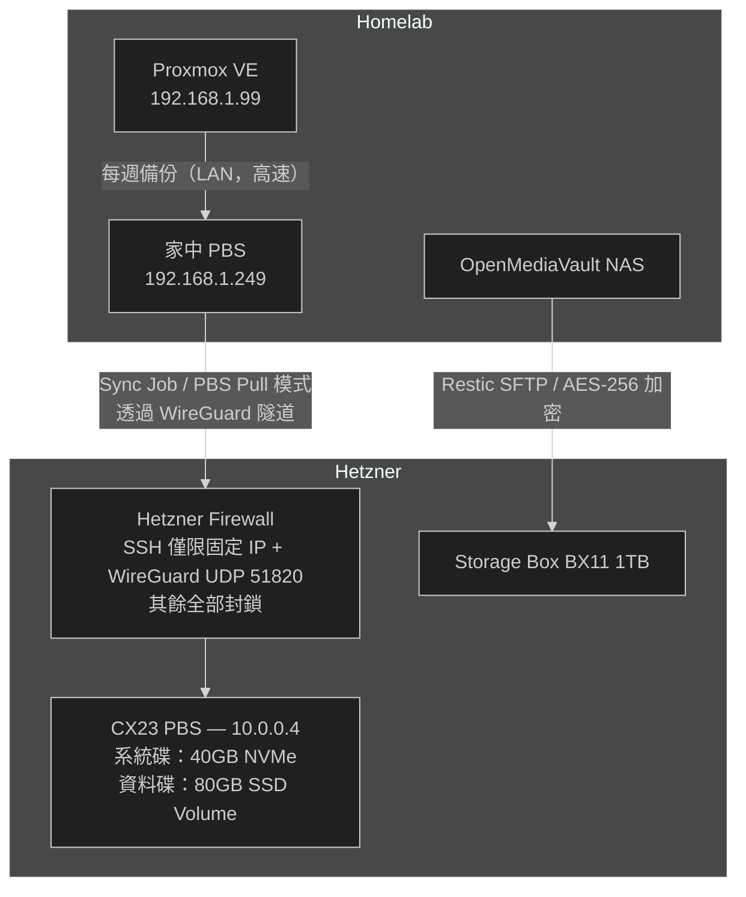
```mermaid
%%{init: {'theme':'dark'}}%%
flowchart TD
    subgraph Homelab ["Homelab"]
        PVE["Proxmox VE<br/>192.168.1.99"]
        PBS_HOME["家中 PBS<br/>192.168.1.249"]
        NAS["OpenMediaVault NAS"]
    end

    subgraph Hetzner ["Hetzner"]
        FW["Hetzner Firewall<br/>SSH 僅限固定 IP + WireGuard UDP 51820<br/>其餘全部封鎖"]
        PBS_HZ["CX23 PBS — 10.0.0.4<br/>系統碟：40GB NVMe<br/>資料碟：80GB SSD Volume"]
        SB["Storage Box BX11 1TB"]
    end

    PVE -->|"每週備份（LAN，高速）"| PBS_HOME
    PBS_HOME -->|"Sync Job / PBS Pull 模式<br/>透過 WireGuard 隧道"| FW
    FW --> PBS_HZ
    NAS -->|"Restic SFTP / AES-256 加密"| SB
```

WireGuard 的路由器是我家裡的 Mikrotik RB5009UG+S+，它作為 WireGuard Server 端，Hetzner 上的 Debian 則作為 Client，建立 Split-tunnel 只把前往 `10.0.0.0/24` 與 `192.168.1.0/24` 的流量導進隧道，其餘流量走 Hetzner 自己的外網。

## 實作步驟

### 一、Hetzner 主機建立

在 Hetzner Cloud Console 建立新的 Server：

- **型號**：CX23（2 vCPU / 4GB RAM / 40GB NVMe）
  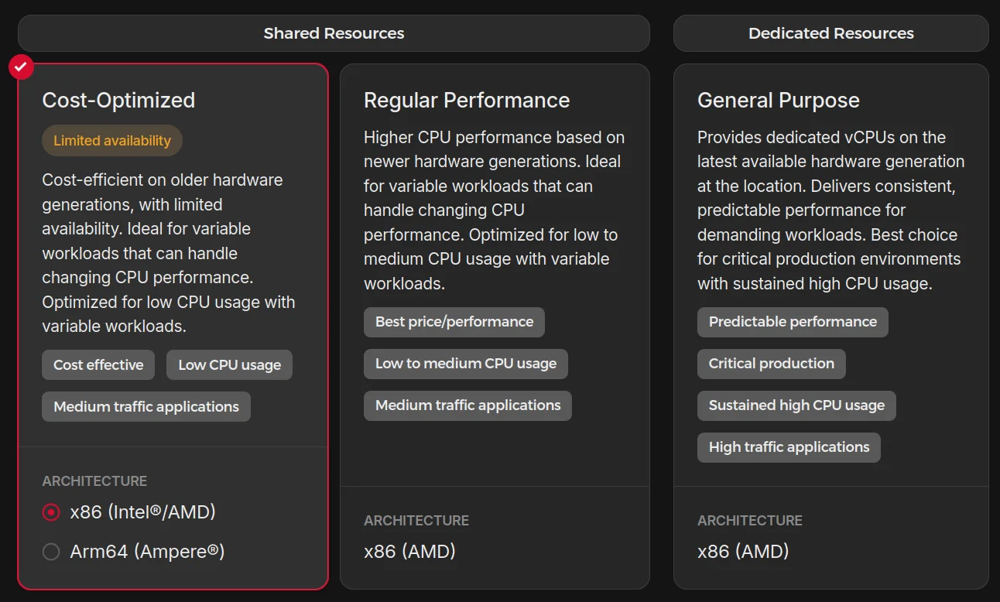
  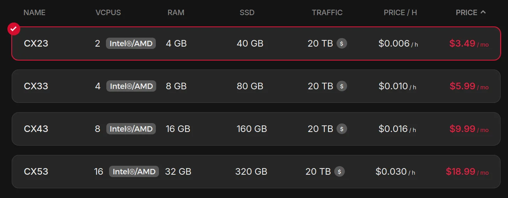
- **OS**：Debian 13 (Trixie)
  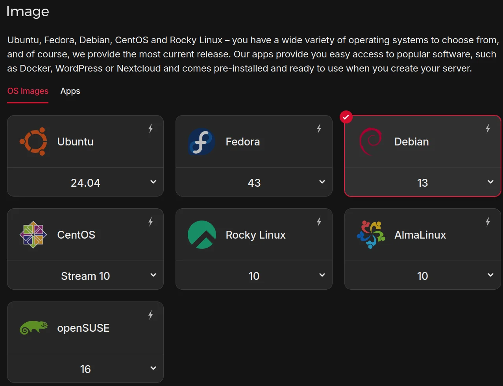
- **Networking**：IPv4 + IPv6（IPv4 月費 €0.50，不要省這個錢）
  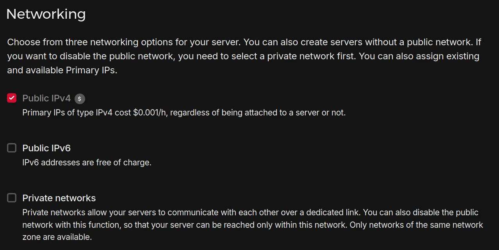
- **地區**：選擇 Falkenstein（德國）或是 Helsinki（芬蘭），從台灣連沒什麼差別，但 Hetzner 的 Storage Box 只服務於這兩個區域，選擇同一個即可。
  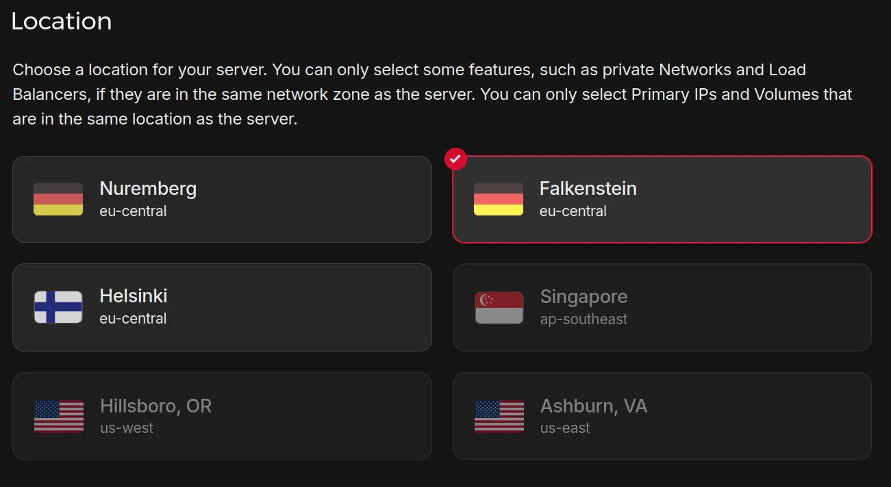
- **SSH Key**：事先產生 ed25519 金鑰並上傳

產生金鑰時建議加上 `-C` 參數附上識別標籤：

```bash
ssh-keygen -t ed25519 -f ~/.ssh/id_ed25519.hetzner -C "raiven-hetzner-pbs"
```

同時建立一個 100GB 的 Volume，在建立 Server 時一併 Attach 上去。

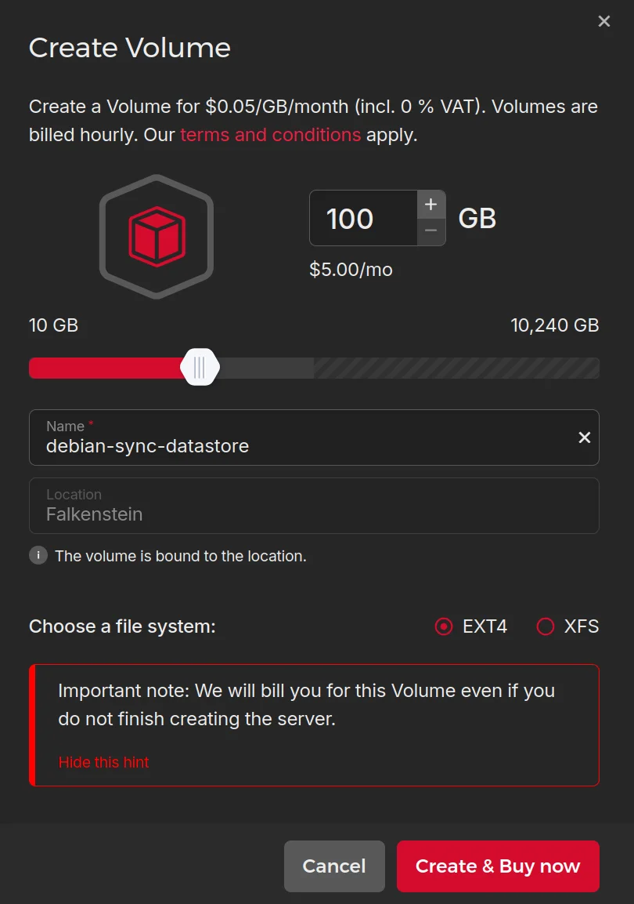

建立完後，在 Hetzner Firewall 設定以下規則：

| 方向 | 協定 | Port | 來源 |
| --- | --- | --- | --- |
| Inbound | TCP | 22 | 家中固定 IP/32 |
| Inbound | UDP | 51820 | 家中固定 IP/32 |
| Inbound | ICMP | - | Any（方便除錯） |
| Outbound | Any | Any | Any |

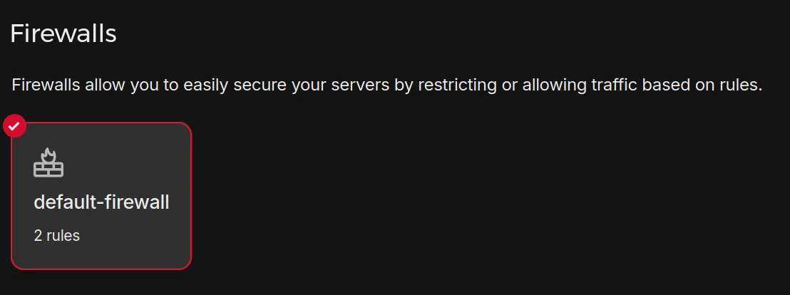
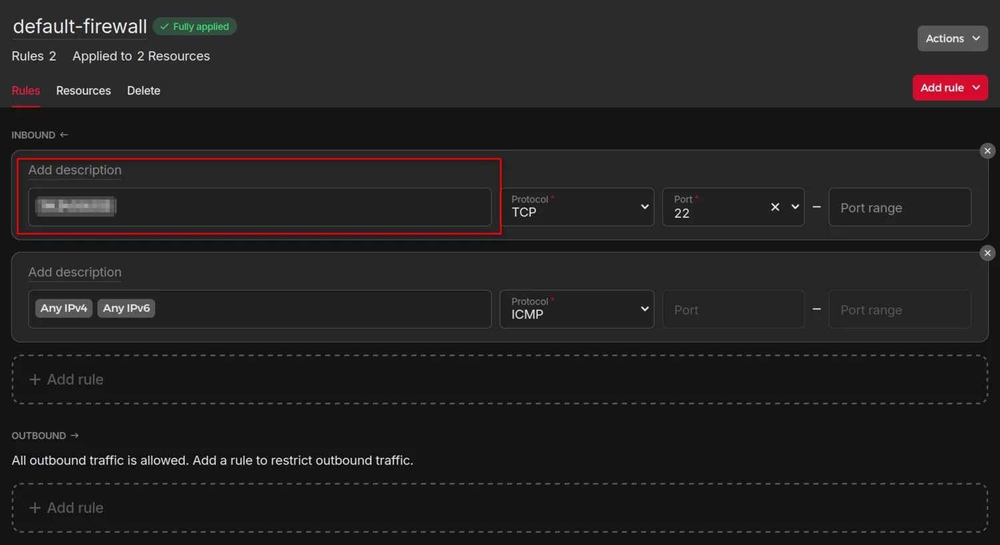

所有未明確允許的 Inbound 流量（包含 PBS 的 8007 Port）都會被阻擋在公網之外，只能透過 WireGuard 內網存取。

完成後等待建立

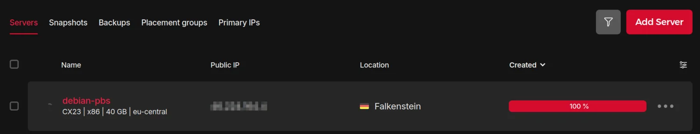

### 二、掛載 Volume

SSH 進入 Hetzner 後，若在建立時就有同時建立 Volume，通常會直接幫你 mount，至少我在 debian 13 的建立過程是這樣。若是建完 server 才掛載的話，可以到 volume 頁面查看 tips。

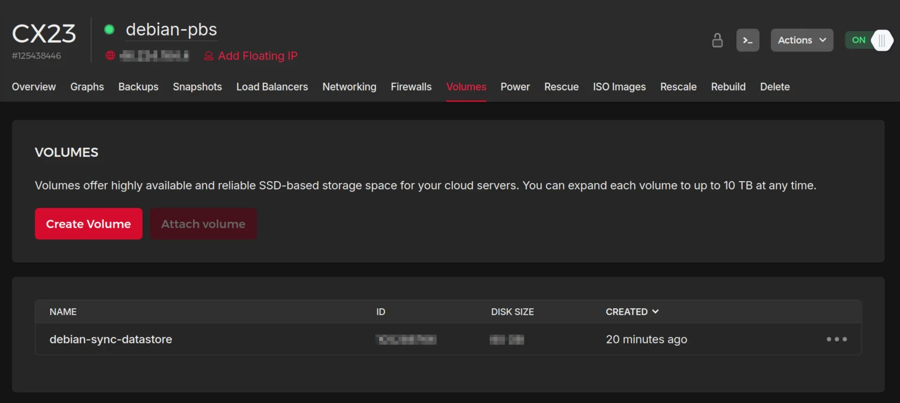
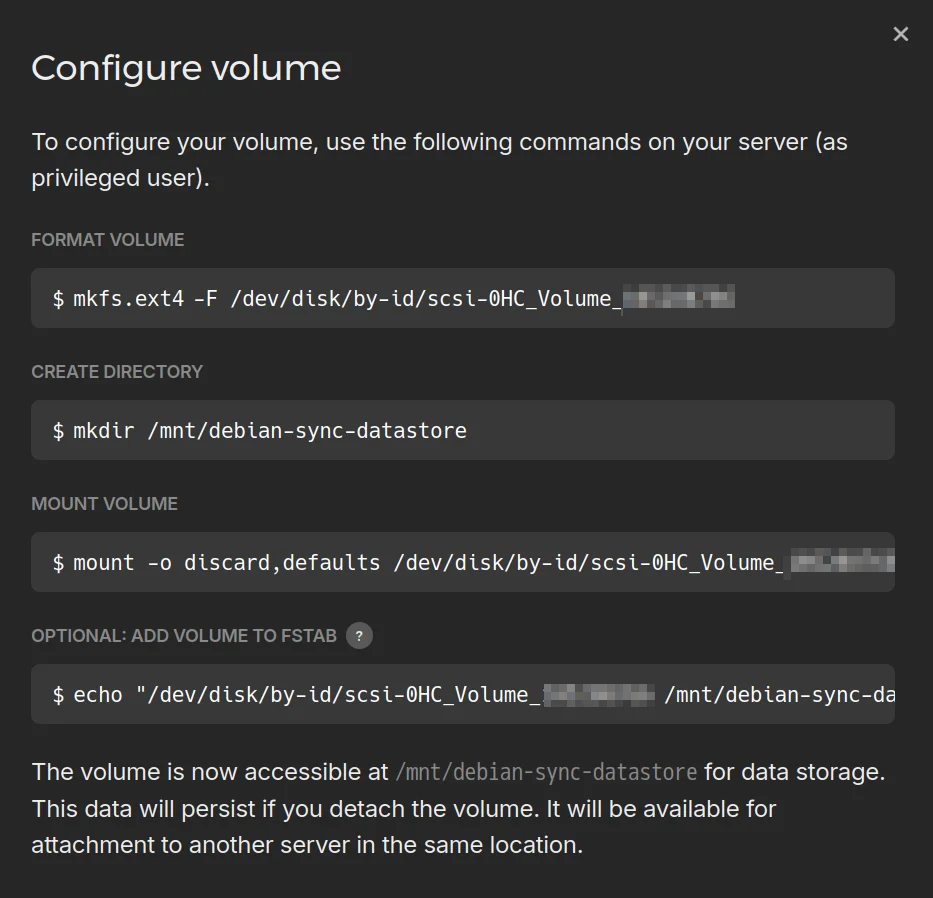

### 三、安裝 Proxmox Backup Server

在 Debian 13 上安裝 PBS，可以參考[官方文件](https://pbs.proxmox.com/docs/installation.html#install-proxmox-backup-server-on-debian)，撰寫這篇文章時 Proxmox Backup Server 版本為 4.1.5，基於 debian 13：

```bash
wget https://enterprise.proxmox.com/debian/proxmox-release-trixie.gpg \
  -O /etc/apt/trusted.gpg.d/proxmox-release-trixie.gpg

echo "deb http://download.proxmox.com/debian/pbs trixie pbs-no-subscription" \
  > /etc/apt/sources.list.d/pbs-no-subscription.list

apt update && apt install proxmox-backup-server -y
```

安裝過程若跳出 `postfix` 設定，選擇 `Local only` 即可。

安裝完成後，PBS 會自動監聽 8007 Port。由於 Hetzner Firewall 已封鎖公網存取，需要先設定好 WireGuard 才能進入 Web GUI。記得設定 root 密碼（PBS Web GUI 需要 PAM 密碼驗證）：

```bash
passwd root
```

### 四、設定 WireGuard

Hetzner 上的 Debian 作為 WireGuard Client，需要連回家裡的 Mikrotik RB5009。

**在 Hetzner 產生金鑰**：

```bash
cd /etc/wireguard
wg genkey | tee private.key | wg pubkey > public.key
echo "--- Private Key ---" && cat private.key
echo "--- Public Key ---" && cat public.key
```

將 Public Key 備用，等一下要填到 RouterOS 裡。

**在 Mikrotik RouterOS 新增 Peer**：

```routeros
/interface wireguard peers add \
  interface=wg \
  name=hetzner-pbs \
  allowed-address=10.0.0.4/32 \
  public-key="<Hetzner 的 Public Key>" \
  comment="Hetzner PBS Sync"
```

**在 Hetzner 建立 WireGuard 設定檔** (`/etc/wireguard/wg0.conf`)：

```ini
[Interface]
PrivateKey = <Hetzner 的 Private Key>
Address = 10.0.0.4/24

[Peer]
# RouterOS 的 Public Key
PublicKey = <RB5009 的 Public Key>
Endpoint = 114.34.106.153:51820
# Split-tunnel：只把家中內網與 WG 網段導進隧道
AllowedIPs = 10.0.0.0/24, 192.168.1.0/24
PersistentKeepalive = 25
```

啟動並設定開機自啟：

```bash
systemctl enable --now wg-quick@wg0
```

驗證隧道：

```bash
ping 192.168.1.249
```

若有回應，代表 WireGuard 隧道打通。這時在家裡的瀏覽器輸入 `https://10.0.0.4:8007` 即可安全登入 Hetzner PBS 的 Web 介面。

### 五、設定 PBS Sync Job

PBS 的同步是 Pull（拉取）模式，由 Hetzner 端主動連回家裡把資料拉走。這個設計有個重要的含義：是 Hetzner 上的 PBS 在設定 Sync Job，而不是家裡的 PBS。

**在家裡的 PBS（192.168.1.249）建立專用帳號**：

進入 `https://192.168.1.249:8007`：

1. `Access Control` -> `User Management` -> `Add`
  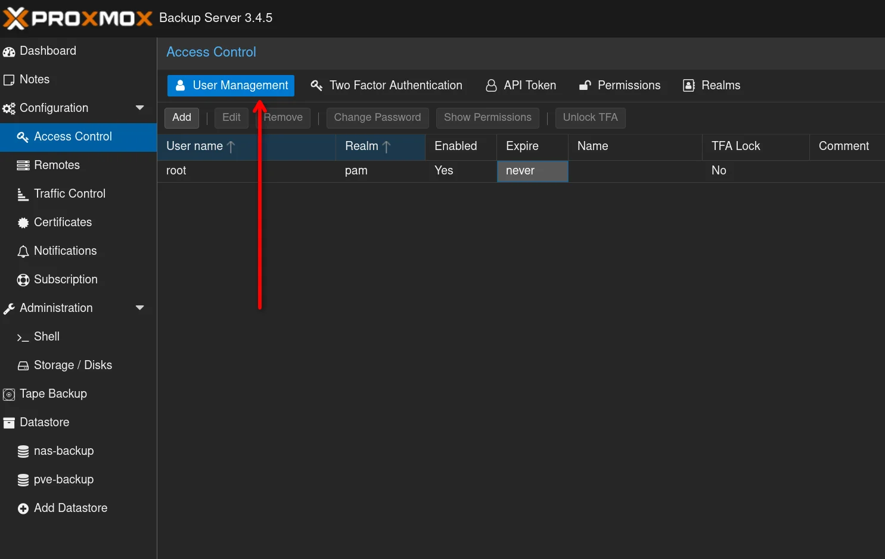
   - User name: `hetzner-sync`（Realm 自動帶入 `@pbs`）、設定密碼
  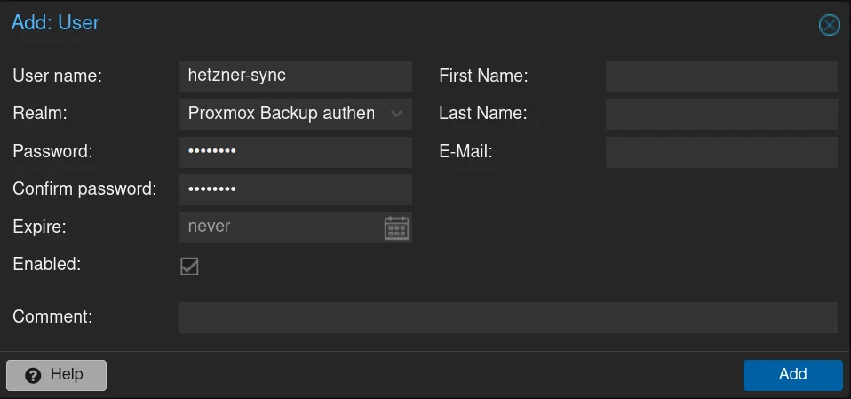
2. `Permissions` -> `Add` -> `User Permission`
  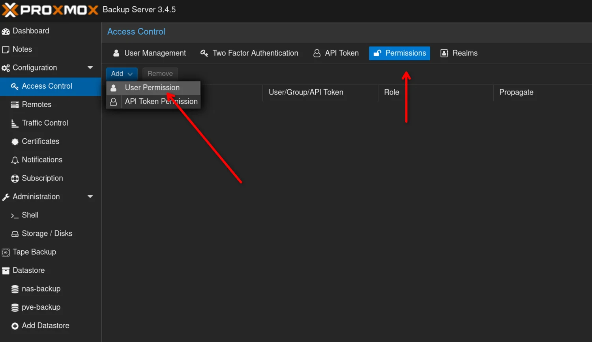
   - Path: `/datastore/<你的 Datastore 名稱>`
   - User: `hetzner-sync@pbs`
   - Role: `DatastoreReader`（只給讀取權限，Hetzner 不需要寫入）
  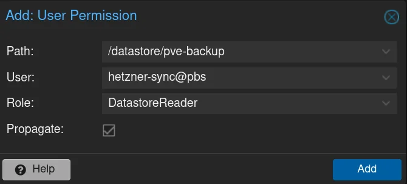
3. 記錄下 `Dashboard` 頁面的 Fingerprint 字串
  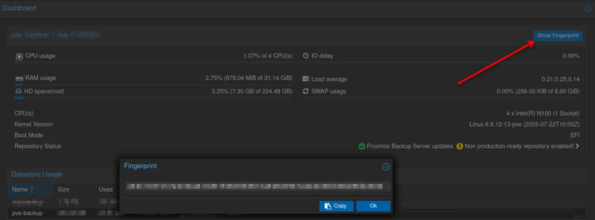

**在 Hetzner PBS（10.0.0.4）建立 Datastore 與 Sync Job**：

進入 `https://10.0.0.4:8007`：

1. `Datastore` -> `Add`
   - Name: `debian-pbs-datastore`
   - Backing Path: `/mnt/datastore/HC_Volume_xxxxxx`
  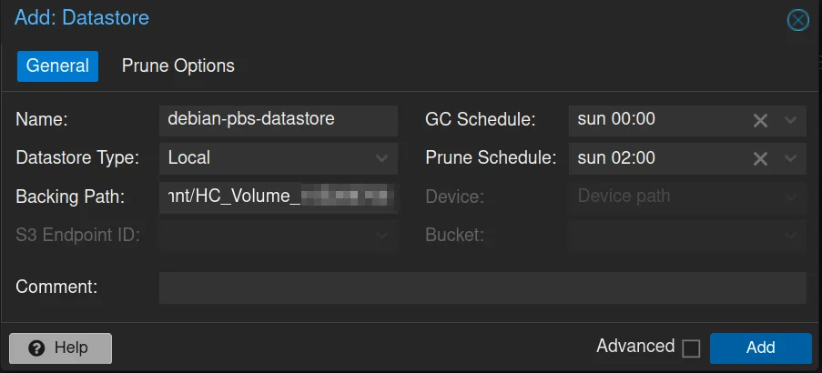
2. `Remotes` -> `Add`
  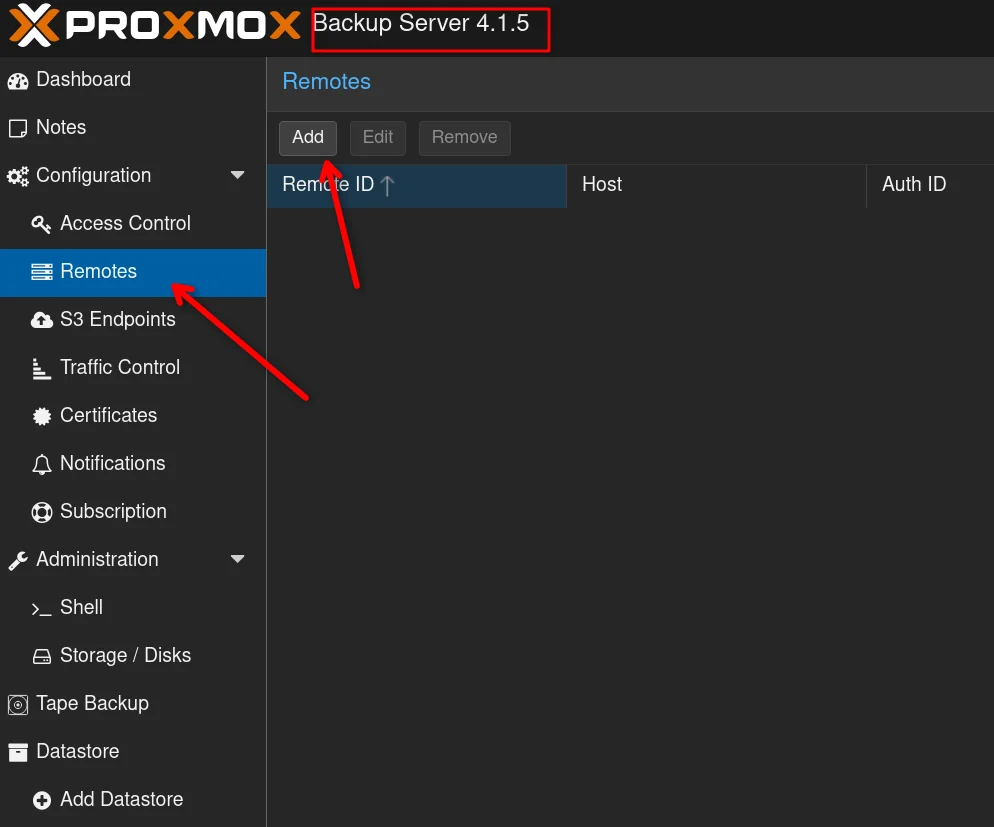
   - Name: `Home-PBS`
   - Host: `192.168.1.249`
   - Auth ID: `hetzner-sync@pbs`
   - Password: 剛才設定的密碼
   - Fingerprint: 從家裡 PBS 複製的指紋字串
  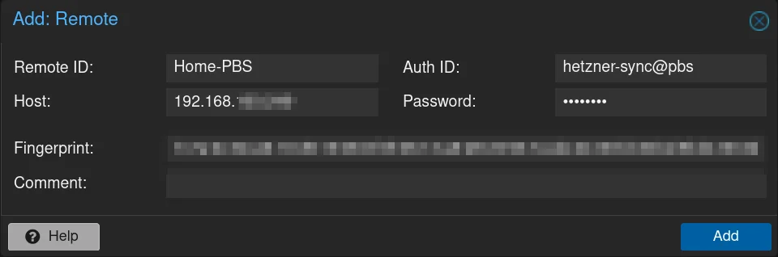
3. 進入 `debian-pbs-datastore` Datastore -> `Sync Jobs` -> `Add`
  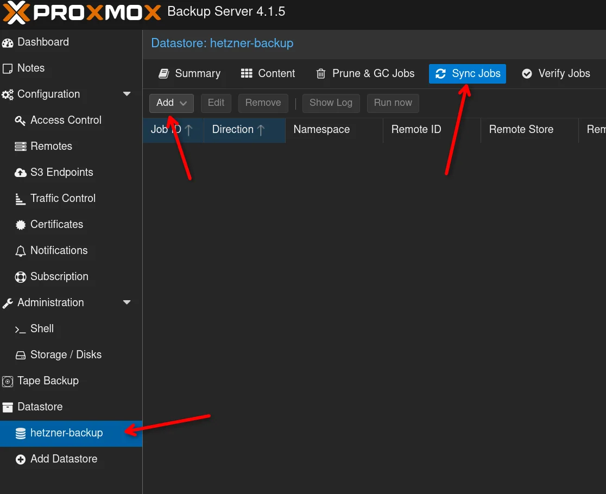
   - Source Remote: `Home-PBS`
   - Source Datastore: 家中 PBS 的 Datastore 名稱
   - Schedule: 依需求設定（例如 `weekly` 或自訂 cron）
   - Rate In: 可設定限速（例如 `10` 代表 10 MB/s），避免佔用家裡上傳頻寬
  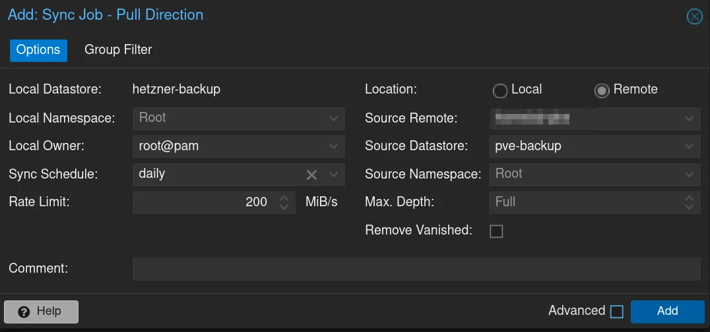

建立完成後，先手動執行一次 `Run now` 確認任務能正常拉資料。第一次同步需要傳輸完整的基準備份，之後每次只傳輸增量差異，速度會快很多。

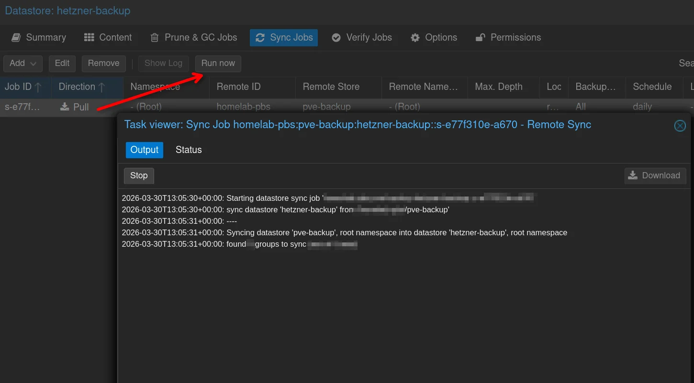

## 備份策略與空間管理

### Sync 與 Prune 是分開的

這是 PBS 一個容易被誤解的設計：Sync 和 Prune 是完全獨立的動作。Hetzner 端可以設定與家裡 PBS 完全不同的保留策略。

我目前的設定是：
- **家裡 PBS**：每週備份，保留 4 週（作為快速本地還原使用）
- **Hetzner PBS**：只保留 `keep-last=1`，也就是每個備份目標只保留最後一份

「只保留一份」聽起來好像很危險，但對異地備援這個使用場景來說，其實是非常合理的決策。我要的不是異地的歷史版本，而是「確定有一份可以在災難發生時重建環境的備份」。只保留一份的好處是空間消耗極為可預測，不會因為保留策略設定錯誤而撐爆 100GB Volume。

運作流程是這樣的：

| 步驟 | 動作 | 說明 |
| --- | --- | --- |
| 1. Sync | 拉取新的快照 | 把家裡最新的備份增量拉過來，只傳輸差異部分 |
| 2. Prune | 刪除舊的索引 | 根據策略移除超過保留數量的快照索引，GUI 上消失 |
| 3. GC | 物理清理孤立 Chunks | 實際回收不再被任何快照引用的資料塊 |

三個步驟分開執行，建議排程順序是：Sync -> Prune -> GC，且都放在半夜流量低峰執行。

## 跨國傳輸速度分析

第一次看到 Sync Job 的傳輸速率圖表時，我以為哪裡設定錯了——家裡是中華電信 500M/500M，但 Hetzner PBS 從家裡拉資料時，實際吞吐量只有 **5 MB/s 左右（約 40 Mbps）**，距離上限差了好幾倍。

這不是 WireGuard 的效能問題，根本原因有三個：

**1. 跨國高延遲的 TCP 壅塞控制**

台灣到 Hetzner 德國/芬蘭機房的 RTT（往返延遲）通常在 230~280ms。WireGuard 底層雖然是 UDP，但 PBS 的同步流量包在隧道裡面是走 HTTP/2（基於 TCP）。傳統的 TCP Cubic 壅塞演算法在高延遲的環境下，會嚴格限制傳輸視窗大小，理論頻寬完全發揮不出來。這是物理現實，不是配置問題。

**2. PBS 的「碎檔」傳輸特性**

PBS 備份的本質不是傳輸一個大檔，而是傳輸幾萬個去重後的小 Chunk，每個通常只有幾十 KB 到 4 MB。在本機傳輸時，來回確認的延遲只有 1ms，速度飛快；但跨國每次確認都要等 250ms，即使 HTTP/2 支援多路復用，這種極度碎片化的 I/O 在長距離傳輸上會產生巨大的等待成本。

**3. 中華電信的國際路由**

中華電信的「500M」保證的是連到中華電信機房的速度，不是國際頻寬。連往歐洲通常需要繞經太平洋海纜到美國，再穿過大西洋到歐洲。尖峰時段跨國海纜壅塞是很正常的，在這種條件下跑到 5 MB/s 其實已經算不錯的表現。

### 開啟 BBR 改善跨國速度

Google 開發的 [**TCP BBR**](https://github.com/google/bbr) 壅塞控制演算法專門針對高延遲與輕微掉包的長距離網路設計，在 Hetzner 伺服器與家裡的 PBS 主機上都啟用 BBR，通常能把跨國吞吐量從 5 MB/s 提升到 10~15 MB/s。

在 Hetzner Debian 上（家裡的 PBS 主機同樣適用）：

```bash
echo "net.core.default_qdisc=fq" >> /etc/sysctl.d/99-bbr.conf
echo "net.ipv4.tcp_congestion_control=bbr" >> /etc/sysctl.d/99-bbr.conf

sysctl --system

sysctl net.ipv4.tcp_congestion_control
```

對於每週只跑一次增量備份的場景，多花個十分鐘還是幾分鐘其實差異不大，重要的是它能穩定跑完。這個設定讓每次增量同步能在背景默默完成，而不需要我去盯著它。

## 延伸：NAS 資料的備份

架設好 PBS 的同時，也順手解決了 NAS 備份的問題。我的 OpenMediaVault NAS 上存著一些照片和文件，總量不超過 500GB，一直想找個方便又安全的方案備份到異地。

### 為什麼選 Restic 而不是 Rclone

Rclone 是同步工具，Restic 是備份工具。兩者的核心差異：

| 比較項目 | Restic | Rclone |
| --- | --- | --- |
| 加密機制 | 強制預設啟動，AES-256，資料離開 NAS 前已加密 | 可選附加功能，設定較繁瑣 |
| 版本控制 | 原生快照支援，可還原到任意時間點 | 無原生支援，預設會覆蓋舊檔 |
| 去重複化 | 區塊層級去重，移動/改名不重新上傳 | 無，改檔名視為新檔全量上傳 |
| 防誤刪 | 舊快照保留，刪錯有後悔藥 | 執行 Sync 會把誤刪同步到遠端 |

NAS 最常見的資料損失不是硬碟壞掉，而是手滑誤刪，或是整理檔案時搬錯位置。Rclone 的同步行為在這種情境下是災難，Restic 的快照機制才是正確的防護。

### Storage Box + Restic 實作

在 Hetzner 購買 BX11 Storage Box（1TB，€4.00/月），會獲得一組 SFTP 帳號。

在 OpenMediaVault 上安裝 Restic：

```bash
apt install restic
```

建議先處理 ssh key 與免密碼 ssh，避免 restic 的 sftp 過程中斷：

```bash
cat <<EOF >> ~/.ssh/config
Host hetzner-sb
    HostName xxxxxxxxx.your-storagebox.de
    User xxxxxxxxx
    Port 23
    IdentityFile ~/.ssh/id_ed25519.hetzner
EOF
chmod 600 ~/.ssh/config

ssh-copy-id hetzner-sb
```

初始化加密備份庫：

```bash
export RESTIC_PASSWORD='xxxxxxxxxxxxxxxxx'
restic -r sftp:hetzner-sb:/home/backup_omv init
```

執行備份：

```bash
export RESTIC_PASSWORD="xxxxxxxxxxxxxxxxx"
export RESTIC_REPOSITORY="sftp:hetzner-sb:/home/backup_omv"
export BACKUP_SOURCE="/srv/dev-disk-by-uuid-xxxxxxxx-xxxx-xxxx-xxxx-xxxxxxxxxxxx/appdata"
restic backup "$BACKUP_SOURCE" --verbose
restic forget --keep-daily 7 --keep-weekly 4 --keep-monthly 6 --prune
```

把這個指令寫進 OMV 的排程，設定每週執行一次，就是一個完全自動、客戶端加密、且具備版本歷史的異地備份。

加密金鑰請務必備份，遺失後所有歷史備份都無法解密。

## 成本總覽

整套架構的每月費用[（2026 年 4 月漲價後）](https://www.tomshardware.com/tech-industry/hetzner-to-raise-prices-by-up-to-37-percent-from-april-1)：

| 項目 | 規格 | 月費 |
| --- | --- | --- |
| Hetzner CX23 | 2 vCPU / 4GB RAM / 40GB NVMe（系統 + PBS + Gatus） | $4.99 |
| 80GB SSD Volume | PBS Datastore 專用（$0.0767/GB） | $6.14 |
| IPv4 | 固定 Public IP | $0.60 |
| BX11 Storage Box | 1TB（NAS Restic 備份） | $4.00 |
| **總計** | | **$15.73（約 NT$ 510）** |

> 帳單上的貨幣單位是否為歐元或美元，取決於你的帳號設定與所在地區。以上數字來自實際帳單，未稅。

相比 AWS 同等配置（t3.medium + gp3 80GB + S3 500GB）約 $50 USD（NT$ 1,600 起），Hetzner 這套方案依然便宜了將近 70%，且在隱私保護上反而更勝一籌。

雖然這次漲價讓總費用從原本的約 $13 漲到 $15.73，幅度確實有感，但對照全球雲端市場的普漲趨勢（OVHcloud 同期也宣佈 5~10% 漲價，AWS/GCP 本來就貴），Hetzner 依然是自架 PBS 異地備援的 CP 值最高選擇。

這每個月 NT$ 510，換來的是：
- 一份在歐洲的 Proxmox VE 完整備份，隨時可以重建環境
- NAS 上 500GB 私密資料的加密異地備份
- 一個輕量監控服務的運算資源
- 嚴格的 GDPR 法規保護下，不會有人掃描你的備份內容

## 寫在最後

整個實作過程最值得分享的思路是：把不同性質的資料分開處理。

PBS 的強項是針對 VM/LXC 的去重複化備份，每次增量可能只有幾百 MB，且支援完整的還原流程。但它對 IOPS 的要求讓它必須跑在 SSD 上，不能隨便把它丟在 HDD 網路儲存。

NAS 的媒體資料正好相反，單檔體積大、壓縮率低、幾乎沒有去重率，但對 IOPS 沒什麼要求，一個便宜的 HDD 儲存服務配上 Restic 的客戶端加密就能搞定。

把這兩種需求混在一起反而會兩個都做不好，分開處理後，不只效能最佳化，成本也最低。

至於跨國傳輸速度慢的問題，開了 BBR 之後有顯著改善，但即使沒有，每週的增量備份就算多花十幾分鐘跑完，對 Homelab 的備份場景來說也完全不是問題。備份最重要的不是跑得多快，而是它確實在跑、確實跑完、而且確實能還原。

## 參考資料

- [Proxmox Backup Server 官方文件](https://pbs.proxmox.com/docs/index.html)
- [Hetzner Cloud 定價](https://www.hetzner.com/cloud/)
- [Hetzner Storage Box](https://www.hetzner.com/storage/storage-box/)
- [Hetzner Cloud 漲價](https://www.tomshardware.com/tech-industry/hetzner-to-raise-prices-by-up-to-37-percent-from-april-1)
- [Restic 官方文件](https://restic.readthedocs.io/)
- [WireGuard 官方文件](https://www.wireguard.com/)
