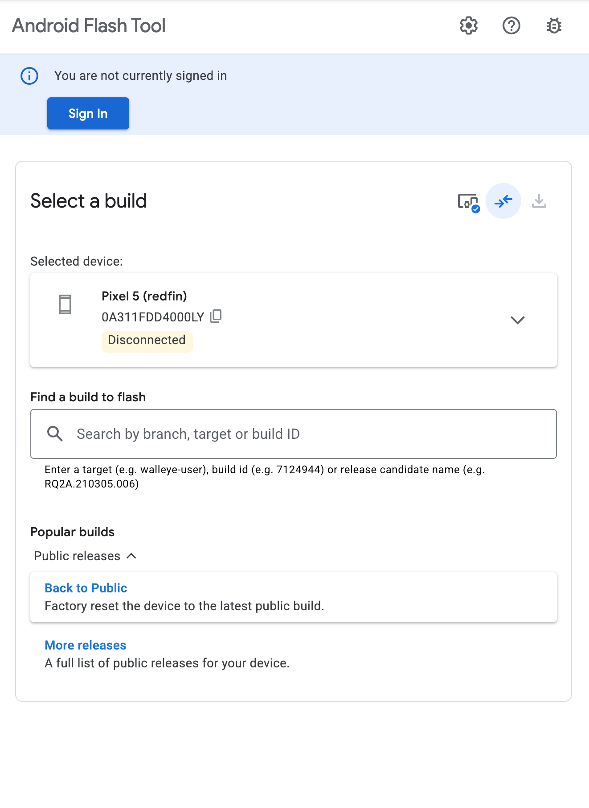
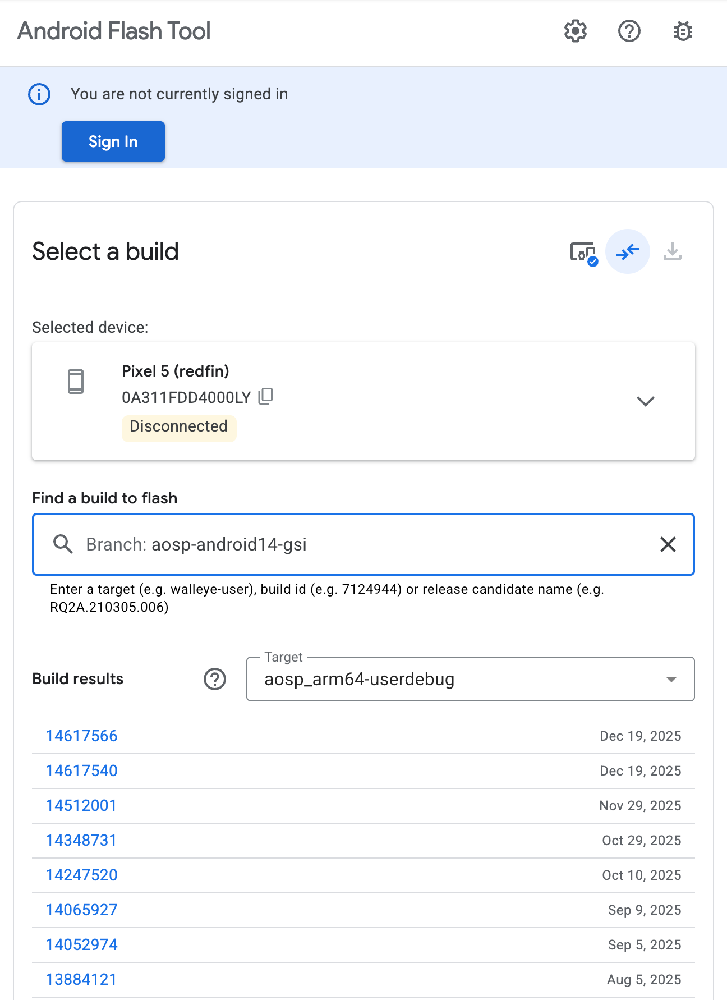
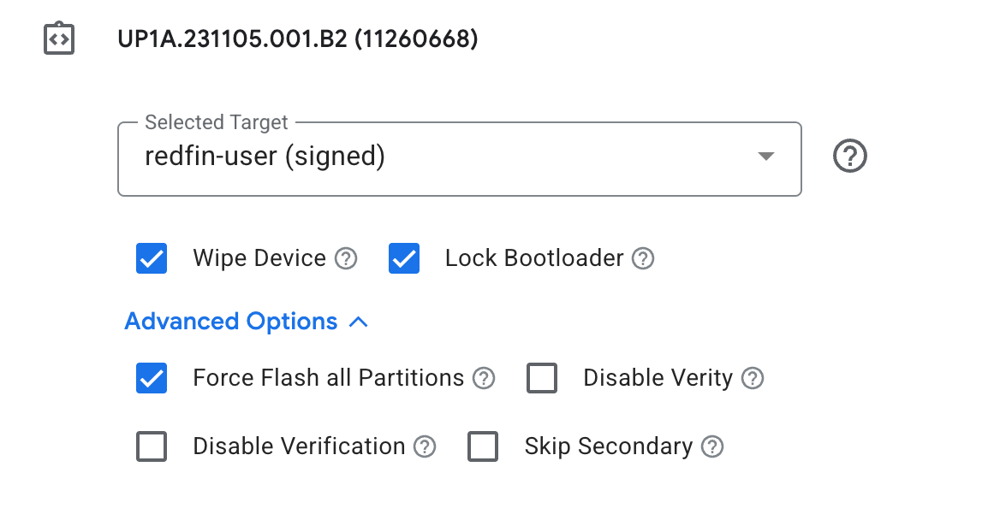
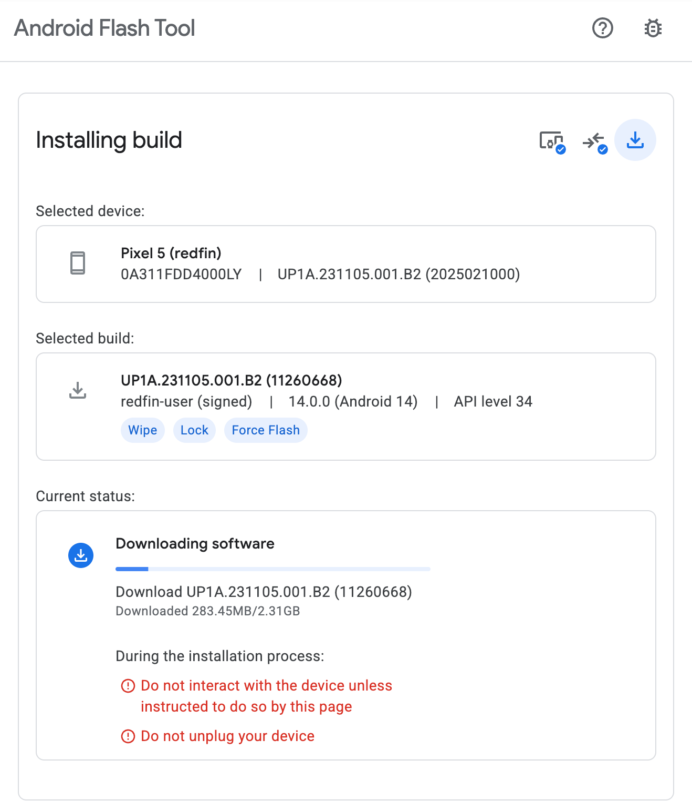
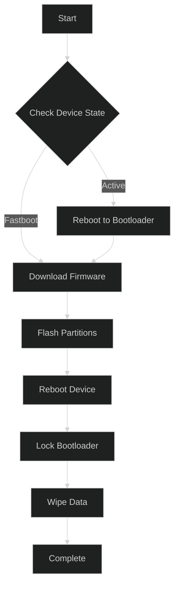
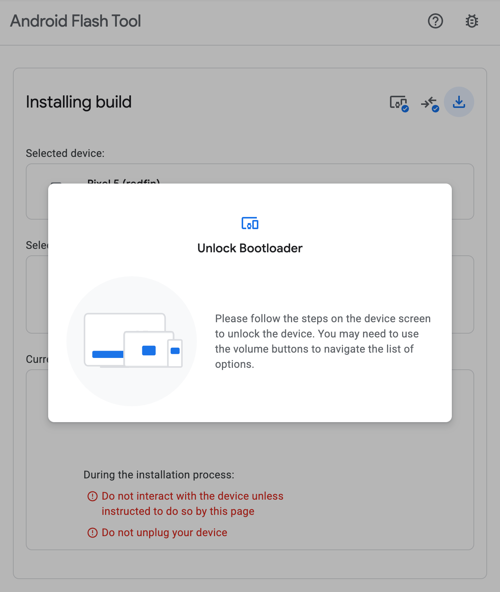
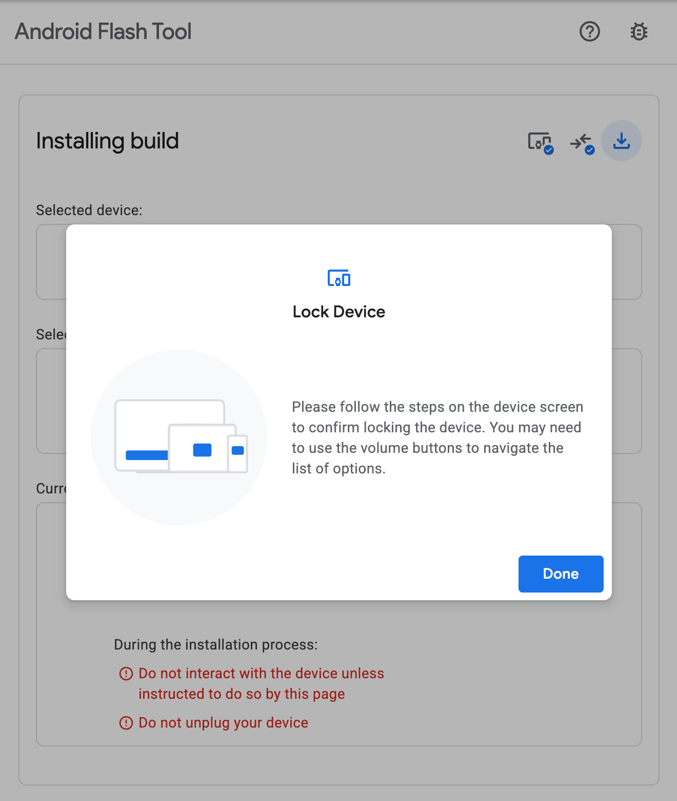
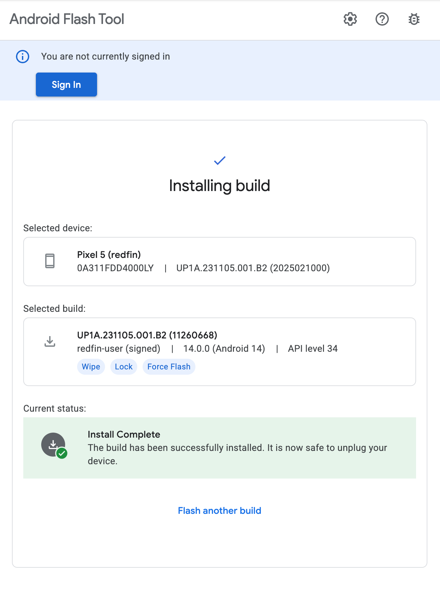

最近整理抽屜時，翻出了這台陪伴我一段時間的 Google Pixel 5。

身為一個喜歡折騰的開發者，早在它退役成為備用機時，我就第一時間把它刷成了 [GrapheneOS](https://grapheneos.org/)。不得不說，GrapheneOS 在隱私保護和安全性上做得真的很好，沒有 Google Play Services 的純淨體驗也別有一番風味（雖然依賴 Sandboxed Google Play 還是能解決大部分 App 的問題）。

但就在前幾天，或許單純是想念 Pixel 原生系統的那些獨家功能（原生相機等等），我決定讓它「回歸原廠」。

原本以為又要經歷一番 `adb` 和 `fastboot` 的指令轟炸，還要自己去 Google 官網下載好幾 GB 的 Factory Image 壓縮檔，解壓後再祈禱 `flash-all.sh` 不要噴錯。

沒想到現在 Google 官方提供了一個方便的網頁工具：[Android Flash Tool](https://flash.android.com/)。

這篇文章簡單紀錄一下如何從 GrapheneOS 這種 Custom ROM，透過官方工具刷回 Stock Firmware 的過程。

## 為什麼選擇 Android Flash Tool？

以前刷機的標準作業流程（SOP）：
1. 搜尋正確的 Factory Image（還要對型號，買到電信商鎖定版就哭哭）。
2. 下載 Android SDK Platform-Tools。
3. 解鎖 Bootloader。
4. 執行 `flash-all` script。
5. 遇到驅動程式問題、傳輸線問題、路徑問題...

現在的 Android Flash Tool 直接把這些步驟簡化了：
- WebUSB: 直接透過瀏覽器與手機溝通，不用煩惱太底層的驅動設定（至少在 macOS/Linux 上是這樣）。
- Auto Detect: 自動偵測裝置型號，自動下載對應的最新版韌體。
- Fool-proof: 圖形化介面引導你開啟 USB Debugging 和 OEM Unlocking。

## 事前準備

雖然工具很強大，但基本的準備還是要有的：

1.  一台 Pixel 手機：本文主角 Pixel 5。
2.  一條「好」的傳輸線：這是刷機失敗最常見的原因，請務必使用原廠線或高品質的數據線。
3.  瀏覽器：需要支援 WebUSB 的瀏覽器，目前 Firefox 仍不支援。
4.  備份資料：刷機一定會 Wipe Data，請確保資料都已經備份。

## 刷機步驟

### 1. 啟用開發者選項與 USB 偵錯

由於我現在跑的是 GrapheneOS，設定選單的路徑跟原生 Android 差不多：

- 進入 `Settings` -> `About phone`。
- 連續點擊 `Build number` 7 次，直到出現 "You are now a developer!"。
- 回到 `Settings` -> `System` -> `Developer options`。
- 開啟 `OEM unlocking`（這一點至關重要，如果你之前在 GrapheneOS 鎖上了 Bootloader，必須先開啟它才能再次刷寫）。
- 開啟 `USB debugging`。

### 2. 連接 Android Flash Tool

將手機接上電腦，打開瀏覽器前往 [https://flash.android.com/](https://flash.android.com/)。

點擊 "Get Started" 後，瀏覽器會跳出權限請求，要求存取 ADB keys，這裡選擇 "Allow ADB access"。

接著點擊 "Add new device"，這時瀏覽器左上角會跳出裝置選擇清單，選擇你的 Pixel 5 (Redfin)。

> 注意：如果這時候手機上跳出 "Allow USB debugging?" 的視窗，記得勾選 "Always allow from this computer" 並點擊 Allow。

### 3. 選擇版本與設定

連接成功後，工具會顯示裝置狀態。點擊裝置後，會進入版本選擇畫面。

Selected a Build 可以直接選擇最新的 Public Release 中的 Back to Public

或是可以選特定的 target

在進階設定中，我有幾個建議：

- [x] Wipe Data: 從 Custom ROM 回原廠，務必清除資料以避免不相容導致 Bootloop。
- [x] Lock Bootloader: 這是重點。如果你是要回歸完全的原廠狀態，並且希望通過 SafetyNet / Play Integrity API（用 Google Pay 等），請務必勾選這個選項。它會在刷機完成後，重新把 Bootloader 鎖上。
- [ ] Force Flash all Partitions: 通常不需要，除非你遇到奇怪的 Partition 損毀問題。

### 4. 開始刷寫

確認設定無誤後，點擊 "Install Build"。

工具會跳出最後的警告，告訴你這個動作會清除所有資料，並且請勿在過程中拔除傳輸線。

點擊 "Confirm" 後，就會開始進行刷機。

過程中，手機會自動重開機好幾次，你會看到熟悉的 Fastboot 介面（那個綠色的機器人），以及螢幕上閃爍的刷寫進度。

如果是從 GrapheneOS 的 Locked Bootloader 狀態回來，中間可能會需要你在手機上透過音量鍵確認 "Unlock the bootloader" 的動作，工具畫面都會有提示，跟著做就行。

### 5. 重新上鎖 (Re-lock Bootloader)

因為我勾選了 "Lock Bootloader"，在韌體刷寫完畢後，手機會再次進入 Fastboot Mode，並顯示紅色的警告字樣，詢問是否要鎖定 Bootloader。

這時候使用音量鍵選擇 "Lock the bootloader"，然後按電源鍵確認。

> 小插曲：如果你沒有鎖回 Bootloader，開機時會看到黃色的驚嘆號警告 "Your device is loading a different operating system"，雖然不影響使用，但這就不是「原廠」的感覺了，而且 Netflix 之類的 App 可能會在 Play Store 搜尋不到。

## 反思

從 GrapheneOS 回到 Stock Android，最大的感觸是「便利」與「隱私」的權衡。

GrapheneOS 給了我極致的掌控感，我知道沒有任何資料會在未經我允許下被傳送出去；但代價就是犧牲了一些便利性，例如少了 Google Photos 的無限雲端運算（像是 Magic Eraser 在舊機型上的支援），或是某些銀行 App 對環境的嚴格檢查。

Google 的 Android Flash Tool 則展現了作為軟體巨頭的硬實力，將原本 geek 的刷機過程，封裝成連一般使用者都能操作的 Web 體驗。這也再次印證了 Pixel 系列作為 Android 開發機 (Dev Board) 的定位：它允許你破壞它，也提供最簡單的方式讓你修復它。

如果你手邊也有閒置的 Pixel，不妨也試試看刷成 GrapheneOS 玩玩，膩了再用 Flash Tool 刷回來，這才是擁有 Pixel 的最大樂趣。

## 相關連結

- [Android Flash Tool](https://flash.android.com/)
- [GrapheneOS Web Installer](https://grapheneos.org/install/web) (GrapheneOS 也有類似的網頁安裝器，體驗一樣好)
- [Factory Images for Nexus and Pixel Devices](https://developers.google.com/android/images) (如果你還是喜歡懷舊的手動刷機)
