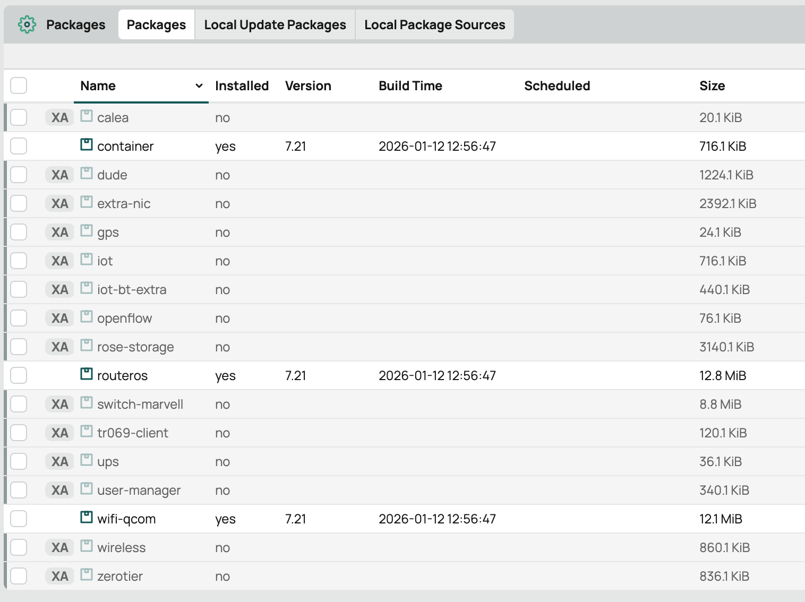
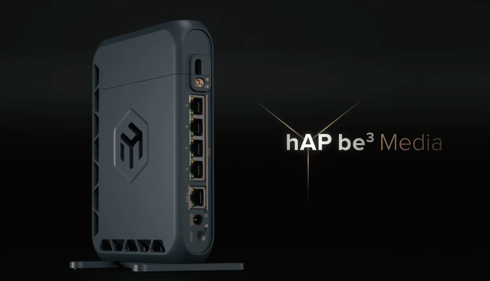

## 前言

自從 RouterOS 在 v7.13 引入 container 功能後，這為我們這些 Homelab 愛好者開啟了一扇新的大門。我們終於可以在路由器上原生執行 container，這意味著一些網路相關的基礎設施服務（Infrastructure Services）可以從原本的伺服器中遷移出來。

以我為例，過去我的 Adguard Home 是 deploy 在我的 Homelab 伺服器群中。然而，作為一個喜歡「折騰」的工程師，Homelab 難免會因為硬體更換、系統升級或是實驗新架構而需要重啟。每當這時候，家裡的網路 DNS 解析就會中斷，隨之而來的就是家人的抱怨。

為了解決這個單點故障（SPOF）的問題，我決定將 Adguard Home 改為 deploy 在 Router (RB5009UG) 上。這樣做不僅減少了物理上的 latency，更重要的是將「網路服務」與「應用服務」解耦，避免因為 Homelab 的維護而導致全家斷網。

這是遷移後的狀態：

```
[user@RB5009UG] > container print
Flags: R - RUNNING
Columns: NAME, ROOT-DIR, INTERFACE, MOUNTLISTS, ENTRYPOINT
#   NAME                                  ROOT-DIR                     INTERFACE    MOUNTLISTS         ENTRYPOINT
0 R b51e0424-8fce-4c3d-b4bb-6493f76aa24b  /usb1/container/adguardhome  adguardhome  adguardhomeConfig  /opt/adguardhome/AdGuardHome
```

## RouterOS v7.21 的新變革：App



而在最近發布的 [RouterOS v7.21](https://forum.mikrotik.com/t/v7-21-stable-is-released/267773) 中，Mikrotik 給我們帶來了更方便的 container 部署方式，他們稱呼為 App。

老實說，不得不吐槽一下這個命名實在有點 naive，聽起來像是某種手機應用程式商店，但實際上它是一個簡化版的 container 部署清單。

以下是 v7.21 release note 中關於 container 的重點更新：

- container: added "/app" menu for simple containerized app installation
- container: added CPU usage and limit options
- container: added kill, run, update commands (CLI only)
- container: allow to configure extra ENV variables directly in container
- container: general container service stability fixes and improvements

在這次更新中，最引人注目的就是我們可以透過 `/app` 選單快速檢視並部署一些預定義好的服務：

```
[user@RB5009UG] > app print
Flags: X - DISABLED
Columns: NAME, CATEGORY, DESCRIPTION
 #   NAME              CATEGORY          DESCRIPTION
 0 X adventurelog      productivity      AdventureLog is a travel blog and photo journal web application
 1 X babybuddy         productivity      A buddy for babies! Helps caregivers track sleep, feedings, diaper changes, and tummy time to learn about and predict baby's needs without (as much) guess w
                                         ork
 2 X backrest          storage           Web-based backup solution with support for local and cloud storage backends
 3 X caddy             networking        Caddy 2 is a powerful, enterprise-ready, open source web server with automatic HTTPS written in Go.
 4 X calibre-web       productivity      a clean interface for browsing, reading and downloading eBooks using an existing Calibre database
 5 X chr               networking        Cloud Hosted Router - RouterOS Virtual Machine
 6 X cinny             communication     Matrix client focusing primarily on simple, elegant and secure interface
 7 X cloudflared       networking        Client for Cloudflare Tunnel, a daemon that exposes private services through the Cloudflare edge.
 8 X code-server       development       Code-server is VS Code running on a remote server, accessible through the browser.
 9 X conduit           communication     Conduit is a simple, fast and reliable chat server powered by [matrix]
 ...
```

看著這個列表，想像空間確實很大。我們甚至可以在 Router 上直接跑 `code-server` 進行開發，或是跑 `gitea` 這種輕量級的 git server，甚至是用 `caddy` 來做 reverse proxy。對於預算有限或是想要極致精簡設備的玩家來說，這台 Router 確實有潛力成為一台 All In One 的 Homelab 主機。

## 反思：Router 還是該回歸 Router

雖然功能強大，但冷靜下來思考，我的考量點仍是在：這台設備的首要任務是什麼？

Router 的核心職責是負責封包轉發、防火牆規則處理以及維持網路連線的穩定。如果在 Router 上部署了過多吃資源的 App（例如 `code-server` 或資料庫相關應用），很容易面臨以下風險：

1.  資源競爭：吃滿記憶體或 CPU，導致 routing 效能下降，甚至觸發 OOM (Out of Memory) 導致系統不穩。
2.  儲存壽命：Router 通常使用的是 NAND Flash，這類儲存介質(在沒有備援的情況)並不適合頻繁的寫入操作（Log、Database IO）。
3.  維護複雜度：RouterOS 的 container 實作畢竟不是標準的 Docker/Kubernetes 環境，除錯和管理上還是有其侷限性。

因此，我的結論是：Router 還是該負責好 Router 的事情就好。其他的 Service 還是部署在專門的 Homelab Server 上比較好維護，避免吃滿記憶體或是寫爆 Disk。

## 怎樣可以更好：硬體層面的保護

雖然決定不在 Router 上跑重型應用，但像 Adguard Home 這種輕量且關鍵的 DNS 服務，我還是堅持留在 Router 上。為了克服上述提到的「儲存壽命」問題，我做了一些硬體上的調整。

我的 RB5009UG 上有一個 USB 3.0 的插槽。我沒有直接使用內建的 NAND Flash 來存放 container data，而是插上了一隻高品質的 MLC USB 隨身碟。

我將 Adguard Home 的 Root Dir 以及 mount point 全部指向這個 USB 儲存裝置：

```bash
/usb1/container/adguardhome
```

這樣做的最大好處是，Adguard Home 產生的大量 query log 和統計數據，只會寫入到這隻 USB 隨身碟上，完全避免了對 RB5009UG 內建 NAND Flash 的高頻率擦寫。如果不幸 USB 隨身碟寫壞了，換一隻就好，Router 本體毫髮無傷。

## 結語

RouterOS v7.21 的 App 功能無疑降低了在路由器上玩 container 的門檻，讓 All In One 的夢想更近了一步。但作為工程師，我們在享受技術便利的同時，也要評估架構的合理性與風險。適度的分離職責，善用外部儲存保護硬體，才能讓我們的 Homelab 之路走得更長久、更穩定。

以及... hAP be3 Media 什麼時候才要出... 等好久...



## 參考資料

- [MikroTik RouterOS v7.21 - Container Apps](https://www.youtube.com/watch?v=0ChcSIShJk0)
  - 封面擷取自影片 [2:03](https://youtu.be/0ChcSIShJk0?si=axcqVHg-gqLpbE_I&t=123)
- [RouterOS v7.21 Release Discussion](https://www.reddit.com/r/mikrotik/comments/1qblerf/comment/nzbj8d2)
