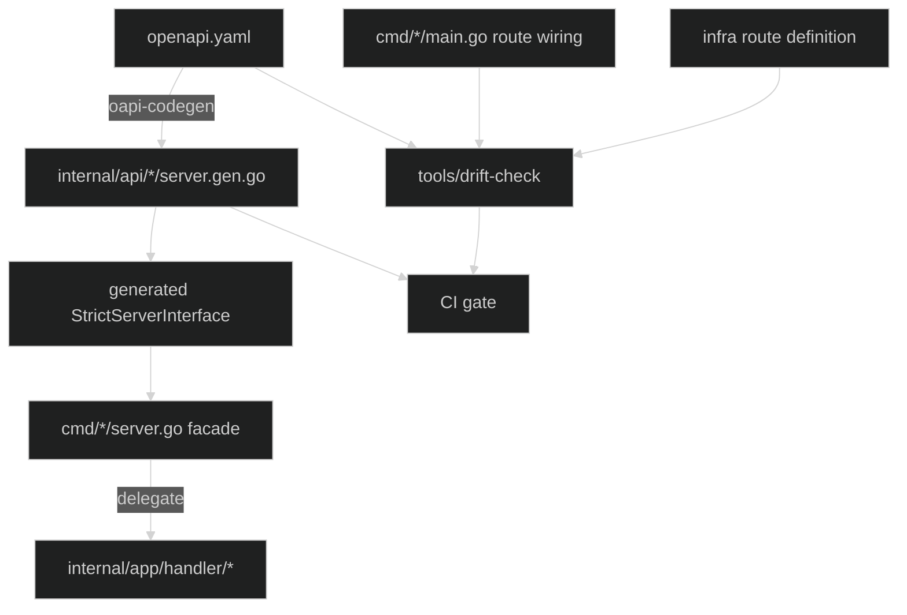

## 前言

事情是這樣開始的。

我請 agent 幫忙加一個 endpoint，它三分鐘寫完，handler 乾淨、error handling 完整、unit test 也跟著補齊，`go test ./...` 全綠。此時我想到的是，agent 真的有做完嗎？route 真的有被註冊嗎？

換成三年前的我，也會漏，那要怎麼樣讓 Agent 不會漏？這個系統從一開始就沒有任何機制能發現有人漏改。以前它靠的是 reviewer 的眼力與同一批人的肌肉記憶撐著；現在把產出速度乘上十倍，這條防線就直接被沖垮了。這不是 agent 的問題，是架構債被提早引爆。

這篇想記錄的，就是後來把這個服務從 code-first 遷移到 spec-first 的過程：用 OpenAPI 當單一真值來源(SSOT)，用 oapi-codegen 產生 typed interface，讓 compiler 與 CI 去做原本靠人記憶的事情。

## 問題不是「有三份檔案」

遷移前，同一條 API 的定義散落在三個地方：

```text
infra route definition     ← path / method / authorizer
cmd/*/main.go              ← mux.HandleFunc 手寫註冊
Go swag comments           ← @Router / @Param / @Success
```

三份檔案本身不是問題，同一個概念散在多個檔案是常態。

真正的問題是，它們彼此不知道對方存在。

改 path，可能只改到 Go route，忘了 infra；改 response shape，可能只改 handler struct，忘了註解；授權設定只活在 infra 層，Go 跟 OpenAPI 都不知道有這回事。而 swaggo 的註解在 repo 裡形同空轉，它是「程式碼的產物」，而我們沒有任何機制拿它回頭驗證程式碼。

最危險的是，系統沒有機制發現你漏改，直到 runtime 或使用者出事。

這種架構在 AI 之前就已經有問題了，只是那時候一天出三個 PR，reviewer 還勉強跟得上。當 agent 開始一天出十個以上的 PR，又該怎麼被發現。

## 為什麼是 spec-first，不是「換一個 swagger 工具」

這件事很容易被誤解成文件美化工程，所以值得先把方向講清楚。

先講一個對 code-first 公平的版本，因為網路上那種「code-first 就是會爛掉」的說法太廉價了，而且我不同意。

code-first 是有辦法補上防線的。swaggo 的註解本身就是結構化文字，`go/ast` 也保留得到 comment group，所以你完全可以寫一個 analyzer，去比對 `@Param` 跟 handler 裡實際 parse 了哪些欄位、比對 `@Success` 跟回傳的 struct 定義。更便宜的做法是把 `swag init` 的產出進版控，然後在 CI 跑 `swag init && git diff --exit-code`，這樣至少能保證那份 swagger.json 是現在這批註解產生出來的。這些都可行，也都有人在做。

所以真正的問題不是「code-first 能不能檢查」，是檢查的成本與檢查的語意。

成本這端，差別在分析器要看懂多少東西。code-first 的 analyzer 要驗證 `@Param` 是否屬實，它得追蹤 handler 裡任意手寫的 `r.URL.Query().Get(...)`、decode 到哪個 struct、那個 struct 的 json tag 是什麼、中間有沒有經過一層轉換函式。這是 data-flow analysis，而且分析對象是可以長成任何樣子的 Go code。這篇後面我確實寫了一個 AST 工具，但它只處理 route 註冊那一行的 string literal，範圍窄到我敢保證它在範圍內百分之百正確。要我對整個 handler 做同等級的保證，那不叫 linter，那叫 compiler，而 Go 已經有一個了。

spec-first 這端的成本則是零，因為型別是從契約產生的，驗證工作由 compiler 免費完成。你不需要說服任何工具相信 response 長什麼樣子，因為 response 的型別就是契約本身。

語意這端的差別更關鍵，也是我最後選邊的理由：當兩邊不一致時，誰贏。

code-first 的檢查即使做到滿分，它問的問題仍然是「文件跟程式碼一致嗎」，而修正方向永遠是更新文件。程式碼永遠是對的。這代表有人把 response 欄位改名時，檢查會通過，因為文件被順手改成了新的樣子。契約被改了，而且是安靜地被改的。

spec-first 問的是另一個問題：「程式碼有實作契約嗎」。同樣把欄位改名，build 會直接失敗，你必須回頭去編輯 `openapi.yaml`，而那個編輯動作會出現在 PR 的 diff 裡，reviewer 會看到「這個 PR 改了契約」。

| 面向 | Code-First | Spec-First |
|---|---|---|
| 真值來源 | Go 程式碼，註解是投影 | `openapi.yaml` |
| 不一致時誰贏 | 程式碼，文件被改寫 | 契約，程式碼編不過 |
| 誰負責檢查 | 自己寫的 analyzer | compiler |
| 分析器要看懂 | 任意手寫的 parse 與 serialize 邏輯 | 不需要 |
| 破壞性變更 | 可能安靜通過 | 必須明確編輯 spec |
| 型別 | 手寫，與契約平行維護 | 由契約產生 |

一致性可以靠工具達成，這點 code-first 做得到。但契約的所有權沒辦法靠工具達成，那是架構決定的。

順帶一提，spec-first 常被講成「先寫文件再寫程式」，這個說法讓很多人反感是合理的，因為它聽起來像瀑布式流程復辟。但實際上不是，spec-first 是「先定義契約」，契約包含 path、method、request、response、security，這些東西你本來就得想清楚，只是以前你把它想在腦子裡，然後直接寫成 Go code。

### 為什麼不選重型 framework

決定 spec-first 之後，選型階段我看過幾個方向。截至撰文時的評估：

繼續用 swaggo，補上前面說的那套 analyzer。技術上做得到，但那筆錢花在維護一個我們自己的半殘分析器上，而且買到的只有一致性，買不到契約所有權。

goa。它的 design DSL 就是契約，方向上跟 spec-first 是一致的，這點要說公道話。我沒選它的原因是契約被綁在 Go 裡，非 Go 的消費端得先 export 一份 OpenAPI 出來，而那份 export 又變成第二份真相；加上它會連 transport 層一起接管，遷移範圍就不只 contract 這一層了。

ogen。產生的程式碼完整度很高，但它自帶 router 與一整套 runtime 約定，接管的範圍比我想要的多。

grpc-gateway。要把真值來源換成 proto，等於連 IDL 生態一起換掉，範圍太大。

最後選 oapi-codegen，理由可以濃縮成一句話：

> 我要的是 scaffold，不是另一個 framework。

拆開來看：

```text
Schema      → openapi.yaml
Scaffold    → oapi-codegen
Framework   → 既有的 net/http + middleware chain
```

這點在遷移專案裡非常關鍵。如果選了會接管 runtime 的方案，這次的工作就從「API contract migration」變成「API contract migration + HTTP runtime migration」，範圍膨脹，風險跟著膨脹，而且一旦中途卡住，你連 rollback 的粒度都沒有。

實際上這次遷移完整保留了既有的 `net/http`、middleware chain、Lambda adapter，以及 handler / service / repository 的分層。只有 API contract 這一層被抽換掉。

另一個加分項是這個工具還活著，而且活得不錯。[v2.8.0](https://github.com/oapi-codegen/oapi-codegen/releases/tag/v2.8.0)（2026 年 7 月）補上了 OpenAPI 3.1 的初步支援，包含 `oneOf` 表達的彈性 enum 與 `type: [T, "null"]` 這種 3.1 慣用寫法，同時也加了 callbacks 與 webhooks。

這件事在選型時的權重比想像中高。把 spec 立成單一真值來源，等於把整個服務的 API 契約押在這個 generator 上，它如果在 3.0 就停止演進，你幾年後就會卡在一個回不去的位置。相對地，一個持續追著 spec 版本走的工具，代表你之後想升 3.1 的時候，是「改 spec」而不是「換工具」。

要注意官方自己說了那是初步支援，所以我們目前的 spec 還停在 3.0.3，等這個服務有真的需要 3.1 語意的 schema（例如 nullable 的表達方式）再評估升版。

## 整體架構



對應到 repo 的結構：

| 檔案 / 目錄 | 角色 |
|---|---|
| `openapi.yaml` | API 單一真值來源 |
| `codegen/*.cfg.yaml` | 每個 binary 各自的 oapi-codegen 設定 |
| `internal/api/*/server.gen.go` | 產生的 strict interface 與 types，不可手改 |
| `cmd/*/server.go` | facade，實作 generated interface 並轉發 |
| `cmd/*/main.go` | route wiring 與 middleware chain |
| `tools/drift-check/` | 檢查 spec、infra route、Go route 是否漂移 |

## 實作

以下用一個中性的裝置管理與用量計費 API 當範例，實際專案裡的 domain 名稱不同，但形狀一樣。

### 一、一份 openapi.yaml，就一份

整條 pipeline 的起點只有一個檔案：

```yaml
# openapi.yaml
openapi: "3.0.3"
info:
  title: Device API
  version: "1.0.0"

paths:
  /devices/{deviceID}/metadata:
    get:
      operationId: GetDeviceMetadata
      tags:
        - console
      parameters:
        - name: deviceID
          in: path
          required: true
          schema:
            type: string
            format: uuid
      responses:
        "200":
          description: OK
          content:
            application/json:
              schema:
                $ref: "#/components/schemas/DeviceMetadataList"
```

`$ref` 一律指向同檔內的 `components/schemas`，不做跨檔引用。這件事後面有人會想改，所以值得先講清楚為什麼。

拆檔的動機通常是「單檔太大沒人想開」，但跨檔 `$ref` 的代價是你得在中間插一層 bundle，把拆開的檔案合併成工具吃得下的完整 spec，於是 repo 裡就出現了兩份 spec：人類編輯的那份，跟工具讀的那份。而這篇整篇在講的事情，就是消滅「同一個東西有兩份」。

在一份 spec 大到讓 lint 跑不動之前，我傾向不引入這層。單檔的好處很實際：`git diff` 直接可讀、drift-check 只有一個輸入、任何 agent 想理解這個服務的 API 只要讀一個檔案，不用先搞懂 bundle 流程。

進 CI 的只有 lint：

```makefile
openapi-lint:
	$(REDOCLY) lint openapi.yaml
```

lint 這步不能省。spec 是唯一真相之後，一個格式錯誤會讓後面每一環都停擺，而錯誤訊息通常會在最不相干的地方冒出來。

### 二、每個 binary 一份 codegen config

這個服務有四個 binary，分別服務前端 console、外部整合、內部服務與公開 API。它們共用同一份 spec，但各自只該看到自己那部分。

```yaml
# codegen/console.cfg.yaml
package: consoleapi
generate:
  models: true
  strict-server: true
  std-http-server: true
output: internal/api/console/server.gen.go
output-options:
  name-normalizer: ToCamelCaseWithInitialisms
  include-tags:
    - console
```

三個 flag 決定了這次遷移的性格：

`models: true` 從 schema 產生 Go type，request/response 的型別不再手寫。

`strict-server: true` 產生 typed request/response object 與 `StrictServerInterface`，這是把契約變成 compile-time constraint 的關鍵。

`std-http-server: true` 綁標準 `net/http`，不引入額外 router。這就是前面說的「scaffold not framework」在設定檔上的具體樣子。

`include-tags` 則是切分的機制，spec 裡每個 operation 標的 tag 決定它會被產進哪個 binary 的 package。這意味著 tag 不再只是文件分類，它變成了編譯邊界。

generate 全部串起來：

```makefile
generate: openapi-lint
	go tool oapi-codegen --config codegen/console.cfg.yaml   openapi.yaml
	go tool oapi-codegen --config codegen/partner.cfg.yaml   openapi.yaml
	go tool oapi-codegen --config codegen/internal.cfg.yaml  openapi.yaml
	go tool oapi-codegen --config codegen/public.cfg.yaml    openapi.yaml
```

用 `go tool` 而不是 `go run` 加版號字串，工具版本鎖在 `go.mod` 的 tool directive 裡，CI 跟本機產出的程式碼才會一致。這件事看起來很小，但它是後面 `git diff --exit-code` 能成立的前提。

### 三、strict server：handler 不再面對 ResponseWriter

產生出來的東西，形狀大概是這樣：

```go
type GetDeviceMetadataRequestObject struct {
    DeviceID openapi_types.UUID `json:"deviceID"`
}

type GetDeviceMetadataResponseObject interface {
    VisitGetDeviceMetadataResponse(w http.ResponseWriter) error
}

type GetDeviceMetadata200JSONResponse struct {
    Data *[]DeviceMetadataItem `json:"data,omitempty"`
}

type StrictServerInterface interface {
    GetDeviceMetadata(
        ctx context.Context,
        request GetDeviceMetadataRequestObject,
    ) (GetDeviceMetadataResponseObject, error)
}
```

對照一下遷移前後的 handler，差異就很清楚了。

以前：

```go
func (h *Handler) GetDeviceMetadata(w http.ResponseWriter, r *http.Request) {
    deviceID := r.URL.Query().Get("device_id")
    if deviceID == "" {
        WriteBadRequest(w, "device_id is required")
        return
    }

    result, err := h.svc.GetByID(r.Context(), deviceID)
    if err != nil {
        WriteError(w, err)
        return
    }

    WriteJSON(w, http.StatusOK, result)
}
```

這段程式碼沒有什麼「錯」，它只是把四件事混在一起：參數解析、驗證、業務呼叫、序列化。前三件事的規則都寫在別的地方（spec、infra、註解），但這裡是重新用手寫了一遍。

現在：

```go
func (h *Handler) GetDeviceMetadata(
    ctx context.Context,
    request consoleapi.GetDeviceMetadataRequestObject,
) (consoleapi.GetDeviceMetadataResponseObject, error) {
    tenantID := middleware.TenantID(ctx)

    infos, err := h.svc.GetByID(ctx, tenantID, request.DeviceID)
    if err != nil {
        return nil, err
    }

    var data []consoleapi.DeviceMetadataItem
    for _, info := range infos {
        for _, m := range info.Metadata {
            data = append(data, toConsoleMetadataItem(m))
        }
    }

    return consoleapi.GetDeviceMetadata200JSONResponse{
        Data: &data,
    }, nil
}
```

`request.DeviceID` 是 generated wrapper 解析並驗證過的 typed field，型別是 `uuid` 因為 spec 這樣寫。回傳型別是 `GetDeviceMetadata200JSONResponse`，如果 spec 改了 response shape，這一行會直接編譯失敗。

handler 退化成了一個接近純函式的東西：吃 typed 輸入，吐 typed 輸出，中間只有業務邏輯。這跟我之前寫的[Pragmatic Clean Architecture in Go](/blogs/develop/2026/pragmatic_clean_architecture_in_go/)裡 handler 的定位是一致的，只是這次 DTO 轉換的那一半，由 generator 接手了。

要注意的是 generated type 只該活在 boundary。`consoleapi.DeviceMetadataItem` 不應該往下滲進 service，該轉成 domain type 就轉，否則你只是把 swaggo 的耦合換成 oapi-codegen 的耦合。

### 四、facade：讓 compiler 逼你實作

每個 binary 有自己的 `StrictServerInterface`，而 domain handler 是按業務切的，兩邊維度不同。中間需要一層 facade：

```go
type partnerFacade struct {
    device    *device.Handler
    usage     *usage.Handler
    token     *token.Handler
    telemetry *telemetry.Handler
}

func (f *partnerFacade) SaveDeviceInfo(
    ctx context.Context,
    request partnerapi.SaveDeviceInfoRequestObject,
) (partnerapi.SaveDeviceInfoResponseObject, error) {
    return f.device.SaveDeviceInfo(ctx, request)
}

func (f *partnerFacade) RecordUsage(
    ctx context.Context,
    request partnerapi.RecordUsageRequestObject,
) (partnerapi.RecordUsageResponseObject, error) {
    return f.usage.RecordUsage(ctx, request)
}
```

這層看起來很蠢，一堆一行的轉發。它就該很蠢。

facade 的價值不在它做了什麼，而在它被迫存在。spec 多一個 operation，`StrictServerInterface` 就多一個 method，facade 沒補上，build 就過不了。這是整條 pipeline 裡最便宜也最有效的一道防線：契約的存在性由 compiler 保證，不需要任何工具、任何 CI、任何人。

判斷 facade 有沒有走鐘的標準也很簡單：如果它開始出現 if / switch，那段邏輯放錯層了，應該在 handler 或 service。

### 五、route wiring 與 error handler

最後把 generated wrapper 接回 `net/http`：

```go
func main() {
    deviceHandler := device.NewHandler(deviceSvc)
    usageHandler := usage.NewHandler(usageSvc)

    facade := &partnerFacade{
        device: deviceHandler,
        usage:  usageHandler,
    }

    strictHandler := partnerapi.NewStrictHandlerWithOptions(
        facade,
        nil,
        partnerapi.StrictHTTPServerOptions{
            RequestErrorHandlerFunc: func(w http.ResponseWriter, r *http.Request, err error) {
                slog.WarnContext(r.Context(), "request validation failed", "error", err)
                http.Error(w, `{"error":"bad request"}`, http.StatusBadRequest)
            },
            ResponseErrorHandlerFunc: func(w http.ResponseWriter, r *http.Request, err error) {
                slog.ErrorContext(r.Context(), "response failed", "error", err)
                http.Error(w, `{"error":"internal server error"}`, http.StatusInternalServerError)
            },
        },
    )

    wrapper := &partnerapi.ServerInterfaceWrapper{
        Handler: strictHandler,
        ErrorHandlerFunc: func(w http.ResponseWriter, r *http.Request, err error) {
            slog.WarnContext(r.Context(), "parameter binding failed", "error", err)
            http.Error(w, `{"error":"bad request"}`, http.StatusBadRequest)
        },
    }

    mux := http.NewServeMux()
    mux.HandleFunc("POST /devices", wrapper.SaveDeviceInfo)
    mux.HandleFunc("POST /usage", wrapper.RecordUsage)

    http.ListenAndServe(":8080", withMiddleware(mux))
}
```

那三個 error handler 一定要自己填。預設行為會把 binding 錯誤直接寫成純文字回去，對一個宣稱 response 都是 JSON 的 API 來說，這是最尷尬的破口：你的 spec 說 400 會回 `{"error": "..."}`，實際上回的是 `parameter deviceID: invalid UUID`。契約在這裡會裂開，而且 typed handler 完全防不到，因為錯誤發生在進到 handler 之前。

## 這條 pipeline 真正在防的是什麼

到這裡為止，spec 到 handler 這一段已經被 compiler 鎖死了。但還有一個洞沒補：`mux.HandleFunc("POST /devices", ...)` 這行字串，跟 spec 裡的 `/devices` 一點關係都沒有。

少打一個 s，一切照常編譯、照常跑，只是那條 API 永遠 404。

這就是 `tools/drift-check` 存在的理由。它不是為了抓錯字，它是為了消滅剩下的那幾份真相。

### 三類檢查

```text
Forward check:
  已部署 / infra 定義的 route 必須存在於 spec

Reverse check:
  spec 定義的 route 必須存在於 infra route

Go route check:
  cmd/*/main.go 手寫註冊的 route 必須與 spec 一致
```

Forward 與 Reverse 是不對稱的，兩邊都要做。只做 forward 抓不到「spec 寫了但沒部署」，只做 reverse 抓不到「部署了但 spec 沒寫」，而後者通常是安全問題，不是文件問題。

### 為什麼不是 regex

第一版原型我確實用 regex 寫過，五分鐘就有東西可以跑。然後我看了一眼實際的 route 註冊長什麼樣子：

```go
mux.HandleFunc("GET /settings", handler)

mux.Handle(
    "POST /devices",
    requireAuth(http.HandlerFunc(handler)),
)

mux.Handle(
    "/console/v1/",
    http.StripPrefix("/console/v1", consoleMux),
)
```

換行、wrapper、sub-mux 掛載。regex 會很快變成「看起來能用，但漏抓一堆」。

而漏抓的檢查比沒有檢查更糟，因為它會發放假的安全感。一個綠燈的 drift-check 如果只掃到六成的 route，它的實際效果是讓 reviewer 放鬆警惕，這比沒有工具還危險。

所以改用 `go/ast`。核心大概長這樣：

```go
// collectRoutes extracts statically resolvable mux routes from a single file.
func collectRoutes(fset *token.FileSet, file *ast.File) []Route {
    prefixes := collectStripPrefixes(file) // sub-mux ident -> mount prefix
    var routes []Route

    ast.Inspect(file, func(n ast.Node) bool {
        call, ok := n.(*ast.CallExpr)
        if !ok {
            return true
        }

        sel, ok := call.Fun.(*ast.SelectorExpr)
        if !ok || (sel.Sel.Name != "Handle" && sel.Sel.Name != "HandleFunc") {
            return true
        }

        recv, ok := sel.X.(*ast.Ident)
        if !ok || len(call.Args) == 0 {
            return true
        }

        pattern, ok := stringLiteral(call.Args[0])
        if !ok {
            // Do not silently skip. An unresolvable pattern is a finding.
            routes = append(routes, Route{
                Unresolved: true,
                Pos:        fset.Position(call.Pos()).String(),
            })
            return true
        }

        method, path := splitPattern(pattern)
        routes = append(routes, Route{
            Method: method,
            Path:   prefixes[recv.Name] + path,
            Pos:    fset.Position(call.Pos()).String(),
        })

        return true
    })

    return routes
}

func stringLiteral(expr ast.Expr) (string, bool) {
    lit, ok := expr.(*ast.BasicLit)
    if !ok || lit.Kind != token.STRING {
        return "", false
    }

    s, err := strconv.Unquote(lit.Value)
    if err != nil {
        return "", false
    }

    return s, true
}
```

`Unresolved` 那個分支是整段最重要的設計。工具遇到看不懂的東西時，預設行為必須是「舉手」，不是「跳過」。一個 route 如果 pattern 是動態組出來的，drift-check 沒辦法驗證它，那就明確報出來讓人決定，而不是假裝它不存在。

沉默的跳過，是所有靜態分析工具最常見的死法。

（AST 這套工具鏈我之前在[如何利用 Golang AST 助攻 LLM 省 token 又高效](/blogs/develop/2025/golang_ast_llm_coding/)裡玩過一輪，當時是為了壓縮餵給 LLM 的 context，這次是為了驗證 LLM 的產出，倒是有點對稱。）

跑出來的輸出大概是這樣：

```text
drift-check: ERROR
  spec route: POST /devices
  go route:   POST /device
  file:       cmd/partner/main.go:42
  reason:     route registered in Go does not match OpenAPI spec

drift-check: FAILED - 1 drift detected
```

### 明確劃出 MVP 邊界

這個工具刻意不做的事情，我寫在它的 README 第一段：

只處理 static string literal，動態組裝的 pattern 一律標成 unresolved。

sub-mux 與 `StripPrefix` 必須在同一個檔案內，跨檔案的掛載關係不追。

不做完整 data-flow analysis。

不掃 oapi-codegen 產生的 route table，因為那部分由 `make generate && git diff --exit-code` 保證。

會這樣切，是因為工具一旦開始追求完備性，它就會慢慢長成一個半殘的 compiler，然後沒有人維護得動。與其做一個號稱什麼都能抓、實際上一堆邊界情況錯誤的工具，不如做一個範圍明確、在範圍內百分之百可信的工具，範圍外誠實舉手。

## CI gate

工具寫好了，但只有掛上 CI 才算數：

```yaml
- name: OpenAPI lint
  run: make openapi-lint

- name: Drift-check self tests
  run: make drift-check-test

- name: Drift-check
  run: make drift-check

- name: Generated code freshness
  run: |
    make generate
    git diff --exit-code
```

最後那條特別值得說。`make generate && git diff --exit-code` 是整條 pipeline 的閉環：只要有人手改 `server.gen.go`，或改了 spec 卻忘了重跑 generate，這條就會紅。

它便宜到有點好笑，卻補上了 generated code 這種東西最大的信任問題：你怎麼知道 repo 裡那份產生出來的檔案，真的是現在這份 spec 產生出來的？

generated code 從來不是風險，無法驗證的手寫 glue code 才是。

## 附帶收穫：測試變成純函式測試

以前測一個 handler，要架 `httptest`：

```go
req := httptest.NewRequest(http.MethodPost, "/devices", body)
rec := httptest.NewRecorder()
handler.ServeHTTP(rec, req)
```

然後你會發現，這個測試同時在測 routing、JSON decoding、business logic 與 serialization。任何一個環節壞掉，它都紅，但你要看 log 才知道是哪一環。

strict handler 之後，測試可以直接餵 request object：

```go
func TestSaveDeviceInfo(t *testing.T) {
    svc := &StubDeviceService{ID: "device-123"}
    h := device.NewHandler(svc)

    resp, err := h.SaveDeviceInfo(t.Context(), partnerapi.SaveDeviceInfoRequestObject{
        Body: &partnerapi.SaveDeviceInfoJSONRequestBody{
            Name: "demo",
        },
    })
    if err != nil {
        t.Fatalf("SaveDeviceInfo returned error: %v", err)
    }

    created, ok := resp.(partnerapi.SaveDeviceInfo201JSONResponse)
    if !ok {
        t.Fatalf("response type = %T, want SaveDeviceInfo201JSONResponse", resp)
    }

    if created.Id != "device-123" {
        t.Fatalf("id = %q, want %q", created.Id, "device-123")
    }
}

type StubDeviceService struct {
    ID string
}

func (s *StubDeviceService) Save(ctx context.Context, name string) (string, error) {
    return s.ID, nil
}
```

`resp.(partnerapi.SaveDeviceInfo201JSONResponse)` 這個 type assertion 就是在斷言 status code，不需要再去比對 `rec.Code`。狀態碼從一個 runtime 的整數，變成了型別系統裡的一個東西。

順帶一提，這裡叫 `StubDeviceService` 而不是 `MockDeviceService`，因為它只回固定值，不驗證互動。這個區分我在[Interface 不是有開就好](/blogs/develop/2025/interface-is-not-just-about-creating-one/)裡碎念過，就不重複了。

## 回到 LLM：prompt 是建議，compiler 是規則

繞了一大圈，回到開頭那個問題：我怎麼知道 agent 真的做完了。

我一開始想的解法是很直覺的那種：在 `AGENTS.md` 裡加一段「修改 API 時，請同時更新 openapi 註解與 infra route 定義」，然後 review 的時候多看兩眼。

這個做法會有效，大概八成的時候。而八成，在前面說的那個交付頻率下等於沒有，因為你事後沒有辦法分辨這次是不是那兩成。唯一能確認的方式，是自己把三個檔案打開比對一遍。而如果每個 PR 都得這樣做，agent 幫你省下的時間，就原封不動地還回去了。

問題出在 prompt 的性質。prompt 是建議，它跟 context window 裡其他幾萬個 token 競爭注意力，它會被壓縮、被遺忘、被更急迫的指令蓋過去。你沒辦法對一段自然語言做 code review，也沒辦法對它下 `--exit-code`。

而 compiler 是規則。它不會累、不會被說服、不會因為這次改動很趕就通融。

我後來的體會是，agent 在寫 code 這件事上最大的弱點，不是寫不出正確的函式，而是它看不見跨檔案的隱性約束。對 agent 來說，`openapi.yaml`、`main.go`、infra 的 route 定義就是三個獨立的檔案，除非有東西強迫它們產生關聯，否則它沒有任何理由知道這三個必須同步。人類靠的是「在這個 codebase 待久了會知道」，agent 沒有這種東西，它每次都是新來的。

spec-first 加 codegen 做的事情，本質上是把這個隱性約束變成顯性的、機器可檢查的東西：

改了 spec 沒實作，build 失敗。

改了 handler 想偷改 response shape，build 失敗。

改了 spec 沒重跑 generate，CI 失敗。

route 打錯字，drift-check 失敗。

而這裡有一個很有意思的副作用：這些失敗全都是 agent 自己跑得起來的。

以前的 review 迴圈是「agent 寫完 → 人看 → 人留言 → agent 改」，中間卡著一個人類的頻寬瓶頸。現在是「agent 寫完 → agent 跑 `make generate && make drift-check && go build ./...` → 紅了自己修 → 綠了才交出來」。整個一致性檢查的迴圈被關進了 agent 內部，人類 reviewer 可以去看比較值得看的東西，例如這個 API 設計得對不對。

開頭那個問題也就不必再靠直覺回答了。「agent 真的有做完嗎」從一種需要用眼力去確認的感覺，變成一條跑得出結果的指令。

還有一個沒預期到的好處：`openapi.yaml` 本身就是給 agent 看的一級 context。以前 agent 要理解「這個服務有哪些 API」，得翻遍所有 handler 檔案跟散落的註解，貴又不準；現在一份 spec 涵蓋全部，還保證是最新的，因為 CI 會擋。

這件事最近有了名字，叫 loop engineering。詞大概是 2026 年 6 月開始紅的，講的是把重心從「怎麼把這一輪的 prompt 寫好」移到「怎麼設計那個會自己觸發、自己驗證、自己決定要不要再跑一輪的系統」，常見的拆法是 trigger、verifier、state 與 stop rule 四塊。

buzz word 我一向保留，但這個詞至少指出了一件對的事：人類的工作從寫指令變成定規則。

不過我想補一句多數討論沒講清楚的。這四塊裡面，決定 loop 上限的是 verifier，其他三塊只是讓 verifier 跑更多次而已。

一個 loop 跑一千輪，如果它的 verifier 只有 `go build ./...`，那它唯一保證得了的事情就是「會編譯」。它會非常有效率地產出一千個編得過、契約卻是錯的版本。loop 收斂到的永遠是 verifier 定義的那個綠燈，不是你心裡想的那個正確，而這兩者的差距有多大，跟 loop 本身做得多漂亮一點關係都沒有。

所以這整篇在做的事情，換成 loop engineering 的詞彙講就是一句話：把 verifier 加厚。`openapi.yaml` 是人類定下的規則，compiler、drift-check、`git diff --exit-code` 是把規則翻譯成綠燈的機器，agent 則在這個圍欄裡自己撞牆、自己修，撞到綠了為止。

圍欄的形狀決定了裡面能跑出什麼東西。而圍欄是人畫的。

我在[Prompt to Product](/blogs/develop/2025/prompt_to_product/)裡寫過一句「If it can't be parsed, it can't be accelerated」。當時講的是輸入端：文件要機器可讀，AI 才幫得上忙。做完這次遷移之後我想補上另外半句：

輸出端也一樣。無法被驗證的產出，就無法被信任；而無法被信任的產出，加速再多也沒有意義。

## 踩坑記錄

這次遷移踩的坑主要分兩類：oapi-codegen 本身的行為，以及流程慣性。

### operationId 決定 Go method 名稱

`operationId` 不只是文件裡的一個識別字，它會直接變成 Go 的 method 名稱，再配上 `name-normalizer: ToCamelCaseWithInitialisms` 做轉換。

一開始沒意識到這件事，spec 裡的 `operationId` 命名風格不統一，產出來的 interface method 就一片混亂，`GetDeviceMetadata` 跟 `get_usage_records` 混在一起。更麻煩的是含縮寫的 operation，normalizer 對 initialism 的處理結果不見得跟你想的一樣。

解法是先把 `operationId` 的命名規範定下來（我們統一用 PascalCase 動詞開頭），然後跑一次 generate 看產出的 method 名稱，確認沒問題再往下寫 handler。這件事越早做越好，因為改 `operationId` 等於改 Go API，動到的是所有實作端。

### include-tags 漏標，operation 會安靜地消失

spec 裡的 operation 如果忘記標 tag，或標了一個沒有任何 codegen config 收的 tag，結果不是報錯，是那個 operation 完全不會被產生出來。

沒有 interface method，facade 就不會被強迫實作，build 綠燈，測試綠燈，然後這條 API 根本不存在。

這是整個 spec-first 流程裡我覺得最危險的一個失效模式，因為它違反了「編譯期會擋住我」的心理預期。後來的處理是在 drift-check 裡加一條：spec 裡的每一條 path 都必須在某個 binary 的 generated code 中出現，沒被任何 config 收走的 operation 直接報錯。

### agent 會忍不住先寫 handler

流程慣性這一類的坑只有一個，但它反覆出現：agent（還有人類）在收到「加一個 API」的需求時，第一反應是打開 handler 檔案開始寫。

這完全可以理解，因為過去三年的訓練資料裡，Go 的 HTTP API 就長那個樣子。它會很自然地寫一個 `func (h *Handler) XxxHandler(w http.ResponseWriter, r *http.Request)`，然後補一段 swag 註解，非常標準，也非常錯。

我試過在 `AGENTS.md` 寫規則，效果如前面所述，大概八成。真正有效的是把入口收窄：專案文件裡不再出現任何「新增 handler」的說明，只有一條「新增 endpoint 的流程」，從編輯 `openapi.yaml` 開始，第二步就是 `make generate`。當 generate 之後 compiler 直接列出缺少的 method 時，就沒有先寫 handler 的空間了，因為 handler 的簽名還沒被定義出來。

換句話說，與其叫 agent 不要走某條路，不如把那條路拆掉。

## 寫在最後

這次遷移的產出，如果只用一句話總結，我不會說「我們有了漂亮的 OpenAPI 文件」。

漂亮的文件我們一直都有，問題是沒有人相信它。

真正的產出是 API 契約從一份「大家講好要維護的東西」，變成了一個可驗證的工程資產。`openapi.yaml` 定義契約，oapi-codegen 產生 compile-time interface，handler 實作 typed request 與 response，drift-check 確認 runtime route 沒有漂移，CI 保證 generated code 沒有過期。

每一環都是機器在檢查，沒有一環靠記憶力。

回頭看，這件事在 LLM 進入開發流程之前就該做了，只是那時候肉眼 review 還撐得住，痛感不夠。AI 沒有製造這個問題，它只是把原本每季爆一次的問題，變成每週爆一次，逼著你去補那條一直都不存在的防線。

從這個角度看，agent 其實是個很誠實的壓力測試。你的架構裡哪些一致性是靠「大家都知道」撐著的，讓 agent 跑幾天就全部現形了。

下一步大概會往 contract test 走，用同一份 spec 產生 client 給下游服務，讓上下游共用一份契約。以及 spec 本身的 review 品質，目前還是靠人看，這一塊我還沒想到好的自動化方式，可能得等更多實作經驗再說。

至於前面提過的 spec 拆檔與 bundle，等到單檔真的大到 review 不動再說。那是一個規模問題，不是這篇要解的一致性問題，而且它會反過來在 repo 裡多塞一份 spec，跟這篇的主題有點打架。真的走到那一步時，值得單獨寫一篇來記錄取捨。

## 參考資料

- [oapi-codegen](https://github.com/oapi-codegen/oapi-codegen)
- [OpenAPI Specification 3.0.3](https://spec.openapis.org/oas/v3.0.3)
- [Redocly CLI](https://redocly.com/docs/cli/)
- [go/ast](https://pkg.go.dev/go/ast)
- [ServeMux 的 pattern 語法（Go 1.22+）](https://pkg.go.dev/net/http#ServeMux)
- [What Is Loop Engineering?](https://www.ibm.com/think/topics/loop-engineering)
- [Loop Engineering Emerges as Developers Put AI Coding Agents on Repeat](https://adtmag.com/articles/2026/07/01/loop-engineering-emerges-as-developers-put-ai-coding-agents-on-repeat.aspx)
- [Prompt to Product：AI 時代開發者的範式轉移](/blogs/develop/2025/prompt_to_product/)
- [如何利用 Golang AST 助攻 LLM 省 token 又高效](/blogs/develop/2025/golang_ast_llm_coding/)
- [Pragmatic Clean Architecture in Go](/blogs/develop/2026/pragmatic_clean_architecture_in_go/)
- [Interface 不是有開就好](/blogs/develop/2025/interface-is-not-just-about-creating-one/)
